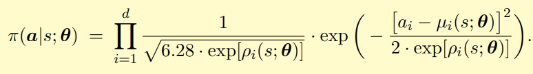
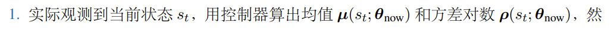
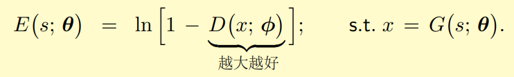

# RL/IL Note

## 资源

- 深度强化学习 王树森 书籍 + 视频
  - https://github.com/wangshusen/DRL/tree/master/Notes_CN
  - https://www.bilibili.com/video/BV12o4y197US/?spm_id_from=333.337.search-card.all.click&vd_source=e4455003e32fdc49fb1b368513cd60bd

- 动手学强化学习
  - https://hrl.boyuai.com/

## 强化学习介绍

强化学习是一种通过互动来学习的机器学习算法,它通过获取环境的反馈,不断调整自己的行为策略,最终达到最优的目标。

不同于有监督学习和无监督学习，强化学习仅提供奖励，而非正确做法

- 例
  - 我们要训练一个考试机器人，有监督学习就是告诉机器人n张卷子（训练集）的正确答案，然后让机器人学到怎么做卷子，然后在一张新的卷子（测试集）上做。无监督学习就是给机器人n张卷子，然后让他自己学，强化学习则是让机器人做n张卷子，每做一张卷子告诉机器人这张卷子得了多少分（奖励），让机器人去学会做卷子。

- 适用领域
  - 什么情况下用强化学习？恰好场景复杂不能给出正确答案，同时场景中又刚好给了奖励。比如围棋，场景复杂不能用有监督学习直接告诉智能体每一步的最优解，游戏结束又刚好有一个输赢作为奖励

- 强化学习分类

  - 基于**值函数**的强化学习
    - 学习一个 $Q(s, a)$, 对每个状态, 每个action, 学习预测未来可能获得的价值，然后在每个状态，选取 $Q$ 值最大的动作, 这个方法不能解决连续动作空间的决策问题

  - 基于**策略梯度**的强化学习
    - 直接优化 $\pi(s)$ 的参数, 采用梯度反向传播方式实现最优决策
  - 值函数 + 策略梯度方法
    - Actor-Critic

### 目前的机器人大模型运动规划控制方法

- 强化学习->模仿学习
  - 仿真->强化学习 low level, basic movement
  - 模仿学习 高层任务策划
  - Paper
    - "HumanPlus: Humanoid Shadowing and Imitation from Humans"
    - Isaac gym
    - PPO
- 模仿学习->强化学习
  - 离线数据集->模仿学习
  - 真实环境->强化学习
  - Paper
    - "Adaptive Mobile Manipulation for Articulated Objects in the Open World"
- 端到端
  - 单任务或多任务
  - 直接在仿真环境中通过强化学习 High Level Policy
  - Paper
    - "Real-world humanoid locomotion with reinforcement learning end to end RL"
      - isaac gym
    - "DrEureka: Language Model Guided Sim-to-Real Transfer"
      - isaac gym
    - "Habitat 3.0: A Co-Habitat for humans, avatars and robots"
      - habitat 3.0
- 选择性强化学习
  - 动态选择 强化学习 机器学习 或 OMPL
  - Paper
    - "RoboGen: Towards Unleashing Infinite Data for Automated Robot learning via Generative Simulation"
- 全程模仿学习
  - google RT-1, RT-2
  - OpenVLA
  - Mobile Aloha

## 机器学习基础

### 概念介绍

#### 机器学习的任务

- 描述任务
  - 输入和输出之间的关系
  - 数据之间的关系
  - 数据的异常
  - 数据的趋势
- 预测任务
  - 根据输入数据预测输出
  - 正确分配新数据

#### 学习方法

- 有监督学习 supervised learning: 有输入有输出, 找输入输出之间的关系, 假设等
  - 回归 regression
    - 线性回归 linear regression
    - 多项式回归 polynomial regression
    - 岭回归 ridge regression
    - Partial Least Squares
    - Lasso
  - 分类 klassification
    - 最近邻 KNN
    - 决策树 Decision Tree
    - 支持向量机 Support Vector Machine
    - NN 神经网络
- 无监督学习 unsupervised learning
  - 聚类 cluster
    - k-means
    - k-medoids
    - DBSCAN
  - 降维
    - 奇异值分解 Singular Value Decomposition
    - 主成分分析 PCA Princopal Component Analysis
    - Kernel PCA
- 强化学习 reinforcement learning
  - 通过互动来学习, 从环境获得反馈
  - 当系统必须做出通常与直接反馈不直接相关的决策时，强化学习尤其适用。使用试错原则，根据当前和未来的估计条件确定行动，然后评估结果

#### 欠拟合与过拟合

- 欠拟合 underfitting
  - **训练数据不足**：如果训练数据量太小,无法充分表达问题的复杂性,模型就无法学习到足够的特征,从而产生欠拟合。
    - 增加训练数据的数量和质量
  - **模型过于简单**：如果模型的复杂度太低,无法捕捉数据的复杂特征,也会导致欠拟合。例如使用线性模型去拟合非线性问题。
    - 选择更复杂的模型结构
  - **特征工程不足**：如果模型输入的特征没有经过充分的特征工程处理,无法生成有价值的特征,也会导致欠拟合。
    - 进行更细致的特征工程
  - **减小正则化强度**：如果使用了正则化，可以降低正则化的强度，使模型更灵活。
    - 合理调整正则化参数
  - **超参数设置不当**：一些关键的超参数,如学习率、迭代轮数等,如果设置不当,也会影响模型的表现,导致欠拟合。
    - 优化超参数设置
- 过拟合
  - 训练集中表现过于良好, 在验证集与测试集表现不佳
  - **训练集多样性不足**: 模型可能会过度学习训练数据中的噪音和细节,无法很好地概括出潜在的规律,从而产生过拟合。
    - 增加训练数据量,提高数据多样性。
  - **模型过于复杂**: 使用过于复杂的模型结构,如过深或过宽的神经网络,可能会导致模型过度拟合训练数据中的细节。
    - 选择合适复杂度的模型结构,不要过于复杂。
  - **特征工程不当**: 如果特征工程做得不好,引入了太多无关或冗余的特征,模型就可能会过度适应这些特征,从而产生过拟合。
    - 进行更有效的特征工程,减少无关特征。
  - **正则化不足**: 正则化是解决过拟合的重要手段,但如果正则化力度不足,无法有效防止模型复杂度过高,也会导致过拟合。
    - 合理使用正则化方法,如L1/L2正则化、Dropout、Early Stopping等。
  - **训练时间过长**: 如果训练时间过长,模型可能会过度学习训练数据中的噪音,从而产生过拟合。
    - 适当控制训练轮数,避免过度训练。
  - 使用交叉验证等方法评估模型泛化能力。
  - **早停止**：在训练过程中监控验证集的性能，当性能开始下降时停止训练，以防止过拟合。

#### 验证集的设置技巧

- Leave-One-Out
- K-Fold **Cross Validation**
  - 用于获取超参数如正则化参数

#### 正则化应对过拟合

正则化(Regularization)是一种应对过拟合问题的方法。过拟合是机器学习模型在训练数据上性能很好,但在新的测试数据上性能较差的一种情况。这是因为模型过于复杂,完全适应了训练数据的噪声和随机性,从而无法很好地推广到新数据。

**正则化的基本原理是在模型的损失函数中加入一个惩罚项,用于限制模型的复杂度,从而避免过拟合。**

- 收缩系数:它会鼓励模型寻找较小的系数值。当自变量之间存在多重共线性时,OLS会产生非常大且不稳定的系数估计。正则化可以将这些系数稳定下来,降低过拟合的风险。
- 降低模型复杂度:由于正则化会缩小系数值,从而降低了模型的复杂度。过于复杂的模型容易过拟合,而正则化可以让模型保持适当的复杂度,提高泛化性能。

**常见正则化的方法**

- L1正则化(Lasso Re]gularization):
  - 原理:在损失函数中加入模型参数的绝对值之和作为惩罚项。
  - 优点:能够自动执行特征选择,将一些参数缩减到0,从而实现稀疏解。
  - 缺点:对于高度相关的特征,L1正则化会随机选择一个特征并将其缩减到0。

- L2正则化(Ridge Regularization):
  - 原理:在损失函数中加入模型参数平方之和作为惩罚项。
  - 优点:能够减小模型参数的值,使模型更加稳定。对于高度相关的特征,L2正则化会均匀地缩减所有相关特征。
  - 缺点:不会进行特征选择,所有参数都会被缩减,不会产生稀疏解。

- Elastic Net Regularization:
  - 原理:结合了L1和L2正则化,在损失函数中加入L1和L2正则化项的加权和。
  - 优点:集合了L1和L2正则化的优点,能够进行特征选择并产生稀疏解,同时也能减小模型参数的值。
  - 缺点:需要调整两个正则化参数,增加了超参数调优的复杂度。

- Early Stopping:
  - 原理:在验证集性能开始下降时,停止模型的训练过程。
  - 优点:简单有效,不需要修改模型结构或损失函数。
  - 缺点:需要一个独立的验证集来监控性能,可能会导致模型性能的下降。

- Dropout:
  - 原理:在训练过程中随机地"丢弃"一部分神经元,提高网络的泛化能力。
  - 优点:能有效防止过拟合,提高模型在新数据上的性能。
  - 缺点:需要调整dropout率这一超参数,对于某些应用可能会显著降低模型性能。

#### 分类问题的损失函数(评价标准)

- 混淆矩阵 Confusion Matrix

  - TP True Positive 正确的正判断
  - FP False Positive 错误的正判断
  - TN True Negative 正确的负判断
  - FN False Negative 错误的负判断

- True Positive Rate TPR, recall

  - 正确的正判断占所有正样本的比例

  $$
  \text{TPR} = \frac{\text{TP}}{\text{TP} + \text{FN}}
  $$

- False Negative Rate FNR

  - 错误负判断占所有的真正正判断的比例

  $$
  \text{FNR} = \frac{\text{FN}}{\text{TP} + \text{FN}} = 1- \text{TPR}
  $$

- True Negative Rate TNR

  - 正确负判断占所有负样本的比例
    $$
    \text{TNR} = \frac{\text{TN}}{\text{TN} + \text{FP}}
    $$

- False Positive Rate FPR

  - 错误负判断占所有负样本的比例
    $$
    \text{FPR} = \frac{\text{FP}}{\text{TN} + \text{FP}} = 1- \text{TNR}
    $$

- 总正确率
  $$
  \text{ACC} = \frac{\text{TP} + \text{TN}}{\text{TP}+ \text{TN}+ \text{FP}+ \text{FN}}
  = \frac{\text{TP} + \text{TN}}{n}
  $$

- 总错误率
  $$
  \text{ACC} = \frac{\text{FP} + \text{FN}}{\text{TP}+ \text{TN}+ \text{FP}+ \text{FN}}
  = \frac{\text{FP} + \text{FN}}{n} = 1 - \text{ACC}
  $$

#### 激活函数

- 参考
  - https://zhuanlan.zhihu.com/p/364620596

##### 概念

神经网络模拟了人类神经元的工作机理，激活函数（Activation Function）是一种添加到人工神经网络中的函数，旨在帮助网络学习数据中的复杂模式。在神经元中，输入的input经过一系列加权求和后作用于另一个函数，这个函数就是这里的激活函数。

因为神经网络中每一层的输入输出都是一个线性求和的过程，下一层的输出只是承接了上一层输入函数的线性变换，所以如果没有激活函数，那么无论你构造的神经网络多么复杂，有多少层，最后的输出都是输入的线性组合，纯粹的线性组合并不能够解决更为复杂的问题。而引入激活函数之后，我们会发现常见的激活函数都是非线性的，因此也会给神经元引入非线性元素，使得神经网络可以逼近其他的任何非线性函数，这样可以使得神经网络应用到更多非线性模型中。

为了增强网络的表示能力和学习能力，神经网络的激活函数都是非线性的，通常具有以下几点性质：

- 连续并可导（允许少数点上不可导），可导的激活函数可以直接利用数值优化的方法来学习网络参数；
- 激活函数及其导数要尽可能简单一些，太复杂不利于提高网络计算率；
- 激活函数的导函数值域要在一个合适的区间内，不能太大也不能太小，否则会影响训练的效率和稳定性。

##### 常见激活函数

- sigmoid/logistic
  $$
  f(x) = \frac{1}{1+e^{-x}}
  $$

  - 取值范围为(0,1), 将一个实数映射到(0,1)的区间，可以用来做二分类。
  - 特征相差比较复杂或是相差不是特别大时效果比较好

  

  - 缺点
    - 梯度消失：注意：Sigmoid 函数趋近 0 和 1 的时候变化率会变得平坦，也就是说，Sigmoid 的梯度趋近于 0。神经网络使用 Sigmoid 激活函数进行反向传播时，输出接近 0 或 1 的神经元其梯度趋近于 0。这些神经元叫作饱和神经元。因此，这些神经元的权重不会更新。此外，与此类神经元相连的神经元的权重也更新得很慢。该问题叫作梯度消失。因此，想象一下，如果一个大型神经网络包含 Sigmoid 神经元，而其中很多个都处于饱和状态，那么该网络无法执行反向传播。
    - 不以零为中心：Sigmoid 输出不以零为中心的,，输出恒大于0，非零中心化的输出会使得其后一层的神经元的输入发生偏置偏移（Bias Shift），并进一步使得梯度下降的收敛速度变慢。
    - 计算成本高昂：exp() 函数与其他非线性激活函数相比，计算成本高昂，计算机运行起来速度较慢。

- tanh 双曲正切激活函数
  $$
  f(x) = tanh(x) = \frac{e^x - e^{-x}}{e^x + e^{-x}} = \frac{2}{1+e^{-2x}} - 1
  $$

  - Tanh 函数可以看作放大并平移的sigmoid 函数，其值域是(−1, 1), 可以将 Tanh 函数想象成两个 Sigmoid 函数放在一起
    $$
    tanh(x) = 2\text{sigmoid}(2x) - 1
    $$
    

  - 在实践中，Tanh 函数的使用优先性高于 Sigmoid 函数。

  - 负数输入被当作负值，零输入值的映射接近零，正数输入被当作正值

  - 当输入较大或较小时，输出几乎是平滑的并且梯度较小，这不利于权重更新。二者的区别在于输出间隔，tanh 的输出间隔为 1，并且整个函数以 0 为中心，比 sigmoid 函数更好

  - 在一般的二元分类问题中，tanh 函数用于隐藏层，而 sigmoid 函数用于输出层，但这并不是固定的，需要根据特定问题进行调整

  - 缺点

    - 与sigmoid类似，Tanh 函数也会有**梯度消失**的问题，因此在饱和时（x很大或很小时）也会「杀死」梯度。

- ReLU (Rectified Linear Unit)

  - 分段线性函数，其弥补了sigmoid函数以及tanh函数的梯度消失问题，在目前的深度神经网络中被广泛使用。ReLU函数本质上是一个斜坡（ramp）函数
    $$
    \text{ReLU}(x) &=
    \left\{
    
    \begin{align}
    x&,x>=0\\
    0&,x<0\\
    \end{align}
    \right.
    
    \\
    &=\max(0,x)
    $$
    

  - 优点：

    - 当输入为正时，导数为1，一定程度上改善了梯度消失问题，加速梯度下降的收敛速度；
    - 计算速度快得多。ReLU 函数中只存在线性关系，因此它的计算速度比 sigmoid 和 tanh 更快。
    - 被认为具有生物学合理性（Biological Plausibility）,比如单侧抑制、宽兴奋边界（即兴奋程度可以非常高）

  - 缺点

    - Dead ReLU 问题。当输入为负时，ReLU 完全失效，在正向传播过程中，这不是问题。有些区域很敏感，有些则不敏感。但是在反向传播过程中，如果输入负数，则梯度将完全为零；
    - 不以零为中心：和 Sigmoid 激活函数类似，ReLU 函数的输出不以零为中心，ReLU 函数的输出为 0 或正数,给后一层的神经网络引入偏置偏移，会影响梯度下降的效率。

- Leaky ReLU

  - 为了解决 ReLU 激活函数中的梯度消失问题，当 x < 0 时，我们使用 Leaky ReLU——该函数试图修复 dead ReLU 问题。
    $$
    \text{LeakyReLU}(x) &=
    \left\{
    
    \begin{align}
    x&,x>0\\
    \gamma x&,x<=0\\
    \end{align}
    \right.
    
    \\
    &=\max(0,x) + \gamma \text{min}(0, x)
    
    \\ \\
    
    \gamma &= 0.01, 0.1 ... \text{是一个很小的值}
    $$
    

  - Leaky ReLU 通过把 x 的非常小的线性分量给予负输入（0.01x）来调整负值的零梯度（zero gradients）问题，当 x < 0 时，它得到 0.1 的正梯度。该函数一定程度上缓解了 dead ReLU 问题，

  - leak 有助于扩大 ReLU 函数的范围，通常 a 的值为 0.01 左右；

  - Leaky ReLU 的函数范围是（负无穷到正无穷）

  - 尽管Leaky ReLU具备 ReLU 激活函数的所有特征（如计算高效、快速收敛、在正区域内不会饱和），但并不能完全证明在实际操作中Leaky ReLU 总是比 ReLU 更好。

- Softmax

  - Softmax 是用于多类分类问题的激活函数，在多类分类问题中，超过两个类标签则需要类成员关系。对于长度为 K 的任意实向量，Softmax 可以将其压缩为长度为 K，值在（0，1）范围内，并且向量中元素的总和为 1 的实向量。
    $$
    S_i = \frac{e^i}{\sum_j e^j}
    $$
    

  - Softmax 与正常的 max 函数不同：max 函数仅输出最大值，但 Softmax 确保较小的值具有较小的概率，并且不会直接丢弃。我们可以认为它是 argmax 函数的概率版本或「soft」版本。

  - Softmax 函数的分母结合了原始输出值的所有因子，这意味着 Softmax 函数获得的各种概率彼此相关。

  - 缺点

    - 在零点不可微；
    - 负输入的梯度为零，这意味着对于该区域的激活，权重不会在反向传播期间更新，因此会产生永不激活的死亡神经元。

#### 损失函数

##### MSE

##### 交叉熵

- 参考

  - https://zhuanlan.zhihu.com/p/638725320
  - https://zhuanlan.zhihu.com/p/38241764

- 信息量的概念

  - ① 非常可能发生的事件信息量比较少，在极端情况下，确保能够发生的事件应该没有信息量；
  - ② 不太可能发生的事件有更高的信息量。
  - **事件包含的信息量应与其发生的概率负相关**。

- 熵

  - **熵(Entropy)**:
    - 熵是一个度量随机变量不确定性的指标。
    - 它表示一个随机变量的平均信息含量或者平均不确定度。
    - 熵越大,意味着随机变量的不确定性越大。
    - 熵的公式为: $H(X) = -\sum_{i=1}^{n} p(x_i) \log p(x_i)$,其中 $p(x_i)$ 是随机变量 $X$ 取值 $x_i$ 的概率。
  - 

- **交叉熵(Cross Entropy)**:

  - 交叉熵用来描述两个分布之间的差距，交叉熵越小，假设分布离真实分布越近，模型越好。

  $$
  L = - 
  \left( 
  y\log{\hat{y}} + (1-y)\log{(1-\hat{y})}
  \right)
  $$

  

  - 交叉熵是用来度量两个概率分布之间的差异。
  - 交叉熵越小,意味着两个概率分布越相似。
  - 交叉熵的公式为: $H(p, q) = -\sum_{i=1}^{n} p(x_i) \log q(x_i)$,其中 $p(x_i)$ 是真实的概率分布, $q(x_i)$ 是预测的概率分布。
  - 在机器学习中,我们通常希望最小化预测分布 $q(x)$ 与真实分布 $p(x)$ 之间的交叉熵,从而使得预测结果尽可能接近真实情况。

- 相对熵 (Kullback-Leibler 散度)

  - 相对熵,又称 Kullback-Leibler 散度,是一种度量两个概率分布之间差异的非对称性度量。它描述了一个概率分布 P 相对于另一个参考分布 Q 的信息损失。相对熵越小,说明两个概率分布越相似。相对熵不是一个真正的距离度量,因为它是非对称的,即 KL(P||Q) ≠ KL(Q||P)。

### 线性模型

#### 线性回归 linear regression 求关系式, 目标值连续

- 参考
  - https://blog.csdn.net/simplification/article/details/95238464

- 目标y是连续值

- 假设
  $$
  y\approx\beta_0+\beta_1x_1+\beta_2x_2+\ldots+\beta_px_p 
  
  \\ \\
  
  \hat{y} =  \hat{f}(x_1, \cdots, x_n) = \hat{\beta}_0 + \hat{\beta}_1x_1 + \cdots + \hat{\beta}_px_p
  
  \\ \\ 
  
  \hat{y} =  \hat{f}(\boldsymbol{x}) = \hat{\beta}_0 + \hat{ \boldsymbol{\beta}}^{\text{T}}\boldsymbol{x}, \text{with} \ \hat{\boldsymbol{\beta}} = \left(  \hat{\beta}_1, \cdots, \hat{\beta}_2 \right)
  $$

- 通过最小二乘法 least squares 优化求解以下误差函数
  $$
  \begin{align}
  e_{\text{RSS}} &= n e_{\text{MSE}} = \sum_{i=1}^n \left( y_i - \hat{y_i} \right)^2
  \\
  &= \sum_{i=1}^n 
  \left(y_i - 
  \left(
  \hat{\beta}_0 + \hat{\boldsymbol{\beta}}^{\text{T}}\boldsymbol{x}
  \right) 
  \right)^2
  
  \end{align}
  $$

  - 矩阵求逆法
  - 数值优化法

- 正则化缓解过拟合

  - **正则化的基本原理是在模型的损失函数中加入一个惩罚项,用于限制模型的复杂度,从而避免过拟合。**

    - 收缩系数:它会鼓励模型寻找较小的系数值。当自变量之间存在多重共线性时,OLS会产生非常大且不稳定的系数估计。正则化可以将这些系数稳定下来,降低过拟合的风险。
    - 降低模型复杂度:由于正则化会缩小系数值,从而降低了模型的复杂度。过于复杂的模型容易过拟合,而正则化可以让模型保持适当的复杂度,提高泛化性能。

  - 常见正则化的方法

    - L1正则化(Lasso Re]gularization): LASSO

      - $$
        L(\boldsymbol{w}) = ||\boldsymbol{w}||_1
        $$

      - 原理:在损失函数中加入模型参数的绝对值之和作为惩罚项。

      - 优点:能够自动执行特征选择,将一些参数缩减到0,从而实现稀疏解。

      - 缺点:对于高度相关的特征,L1正则化会随机选择一个特征并将其缩减到0。

    - L2正则化(Ridge Regularization):

      - $$
        L(\boldsymbol{w}) = ||\boldsymbol{w}||^2_2
        $$

      - 原理:在损失函数中加入模型参数平方之和作为惩罚项。

      - 优点:能够减小模型参数的值,使模型更加稳定。对于高度相关的特征,L2正则化会均匀地缩减所有相关特征。

      - 缺点:不会进行特征选择,所有参数都会被缩减,不会产生稀疏解。

    - Elastic Net Regularization:

      - 原理:结合了L1和L2正则化,在损失函数中加入L1和L2正则化项的加权和。
      - 优点:集合了L1和L2正则化的优点,能够进行特征选择并产生稀疏解,同时也能减小模型参数的值。
      - 缺点:需要调整两个正则化参数,增加了超参数调优的复杂度。

    - Early Stopping:

      - 原理:在验证集性能开始下降时,停止模型的训练过程。
      - 优点:简单有效,不需要修改模型结构或损失函数。
      - 缺点:需要一个独立的验证集来监控性能,可能会导致模型性能的下降。

    - Dropout:

      - 原理:在训练过程中随机地"丢弃"一部分神经元,提高网络的泛化能力。
      - 优点:能有效防止过拟合,提高模型在新数据上的性能。
      - 缺点:需要调整dropout率这一超参数,对于某些应用可能会显著降低模型性能。

  

#### 逻辑斯蒂回归 logistic regression 二元分类问题 目标值离散

- 参考
  - https://zhuanlan.zhihu.com/p/139122386

- 激活函数 sigmoid

- 损失函数 交叉熵 cross entropy

  - 常被用作分类问题的损失函数

  - 相似度越高, 交叉熵越小

  - $$
    [LL=\sum_{i=1}^n[y_i\cdot log(p_i)+(1-y_i)\cdot log(1-p_i)]]
    $$

    

#### Softmax 分类器

- one-hot 编码

  - 把每个标签映射到 k=10 维的向量上

  

- softmax 激活函数

  - 让最大的元素相对变得更大，让小的元素接近 0
  - 总和的概率等于1
  - 哪一项的概率最大, 则判定为是该类别

  $$
  \mathrm{softmax}\left(\boldsymbol{z}\right)\triangleq\frac{1}{\sum_{l=1}^{k}\exp\left(z_{l}\right)}\left[\exp\left(z_{1}\right), \exp\left(z_{2}\right), \cdots, \exp\left(z_{k}\right)\right]^{T}
  
  \\
  \\
  
  S_i = \frac{e^i}{\sum_j e^j}
  $$

  

- 线性 softmax 分类器结构

  

- 把训练描述成优化问题

  - 正向部分

  

  - 损失函数 平均交叉熵 负对数似然函数

    

  - 定义以下优化问题, 并加入正则项

    

  - 梯度下降等优化方法

### 神经网络

#### 多层感知器 MLP

- 输入层
- 隐藏层
- 输出层
  - 宽度根据任务决定
    - 分类问题, 宽度等于类别数量
  - 二元分类
    - sigmoid
  - 多元分类
    - softmax
  - 回归问题
    - 可以不用激活函数

- 激活函数
  - relu

#### 卷积神经网络

#### 反向传播

- 参考
  - https://www.zhihu.com/question/264189719/answer/2694337482
  - https://www.zhihu.com/search?type=content&q=GD%20SGD

- 梯度

- 梯度下降 GD
  - 学习率 $\alpha$
  - 
- 随机梯度下降 SGD
  - 实际训练神经网络的时候，总是用 SGD（及其变体）
  - 从当前批次的随机第j个样本中进行梯度下降
  - SGD 和小批量（mini-batch） SGD 可以跳出鞍点，趋近局部最优。
  - 在实际应用中，**随机梯度下降 SGD 法必须和动态学习率**方法结合起来使用，否则使用固定学习率 + SGD的组合会使得模型收敛过程变得更复杂。
  - 从中抽取部分数据，就是Mini-batch gradient descent算法
  - 

- Adam
- AdaDelta
- Ada

#### BN Batch Normalization

batch normalization 的目的是:

1. 解决内部协变量偏移(Internal Covariate Shift)的问题。内部协变量偏移是指神经网络中间层的输入分布在训练过程中不断变化的问题,这会降低模型收敛速度和性能。
2. 提高模型训练的稳定性和性能。batch normalization 通过归一化每个batch的输入分布,使得网络各层的输入分布保持相对稳定,从而加快模型收敛并提高最终性能。

batch normalization 的原理如下:

1. 对每个batch的输入数据,先计算该batch的均值和方差。
2. 将每个样本按照该batch的均值和方差进行归一化,得到标准化后的输入。
3. 引入两个可学习的参数 gamma 和 beta,对标准化后的输入进行仿射变换,得到最终的归一化输出。
4. BN效果好是因为BN的存在会引入mini-batch内其他样本的信息，就会导致预测一个独立样本时，其他样本信息相当于正则项，使得loss曲面变得更加平滑，更容易找到最优解。相当于一次独立样本预测可以看多个样本，学到的特征泛化性更强，更加general。

batch normalization 的优点包括:

1. 加快模型收敛速度。
2. 提高模型泛化性能。
3. 减轻过拟合问题。
4. 降低对初始化参数的依赖性。
5. 增强模型对噪声数据的鲁棒性。

batch normalization 的缺点包括:

1. 需要计算每个batch的均值和方差,增加了计算开销。
2. 在小batch size下效果可能会下降。
3. 在一些特殊任务中可能会影响模型性能,需要谨慎使用。

### 概率

#### 概率 概率密度函数 概率质量函数

1. 概率(Probability):
   - 概率是一个度量事件发生可能性的数值,取值范围为 [0, 1]。
   - 概率为 0 表示事件绝对不会发生,概率为 1 表示事件一定会发生。
   - 概率用于描述随机事件发生的可能性。
2. 概率质量函数(Probability Mass Function, PMF):
   - 概率质量函数是离散随机变量的概率分布函数。
   - 它给出了离散随机变量取某个具体值的概率。
   - 对于离散随机变量 X，其概率质量函数 P(X=x) 表示 X 取值 x 的概率。
   - PMF 的性质是所有概率之和为 1。
3. 概率密度函数(Probability Density Function, PDF):
   - 概率密度函数是连续随机变量的概率分布函数。
   - 它描述了连续随机变量在某个取值附近的概率密集程度。
   - 对于连续随机变量 X，其概率密度函数 f(x) 表示 X 在 x 附近取值的概率密度。
   - PDF 的性质是积分在整个定义域上等于 1。
   - 连续随机变量的概率是由 PDF 积分得到的。

- 概率质量函数 PMF

  - 离散随机变量的概率分布函数

    

    

  - 离散随机变量X的概率之和为1

    

- 概率密度函数 PDF

  - 连续随机变量的概率分布函数

    

    

    

  - 连续随机变量X的定义域上的积分为1

#### 期望

- 离散随机变量的期望

  

- 连续随机变量的期望

  

### 蒙特卡洛

- 通过随机样本估算真实值

  

  - 一个点落在圆里的概率

    

  - 随机抽样了 n 个点，设圆内的点的数量为随机变量 M。显然，M 的期望等于

    

    - 判断点是否在圆内 $x^2 + y^2 <= 1$

    - 计算 $\pi$: $\pi \approx \frac{4m}{n}$

    

- 近似期望

  

- 随机梯度

  

## 强化学习基础概念

### 强化学习关键元素

- **智能体**：强化学习的主体被称为智能体 (agent)。通俗地说，由谁做动作或决策，谁就是智能体。

  - 超级玛丽游戏中，玛丽奥就是智能体。

- **环境**(Environment)：强化学习的智能体所处的环境,提供反馈信号。规则或机理

  - 超级玛丽中，游戏程序就是环境

- **状态**(State)：智能体所处的当前状态。

  - 在超级玛丽的例子中，可以把屏幕当前的画面（或者最近几帧画面）看做状态
  - 状态空间（state space）是指所有可能存在状态的集合，记作花体字母 S。
  - 状态空间 可以是离散的，也可以是连续的。
  - 状态空间可以是有限集合，也可以是无限可数集合。

- **动作**(Action)：智能体可以采取的行动。

  - 在超级玛丽的例子中，假设玛 丽奥只能向左走、向右走、向上跳。那么动作就是左、右、上三者中的一种。
  - 动作空间（action space）是指所有可能动作的集合，记作花体字母 A

- **奖励**(Reward)：每个动作所获得的即时反馈。

  - 通常假设奖励是当前状态 s、当前动作 a、下一时刻状态 s ′ 的函数，把奖励函数记作$ r(s, a, s' )$

- **状态转移**（state transition）是指智能体从当前 t 时刻的状态 s 转移到下一个时刻状 态为 s ′ 的过程。

  - 在超级玛丽的例子中，基于当前状态（屏幕上的画面），玛丽奥向上跳 了一步，那么环境（即游戏程序）就会计算出新的状态（即下一帧画面）

    - 状态转移概率函数　表示这个事件的概率：在当前状态 s，智能体执行动作 a，环境的状态变成 s ′。

      

    - 状态转移可以是确定性的

      

- **策略**(Policy)：智能体选择动作的规则。是根据观测到的状态，如何做出决策，即如何从动作空间中选 取一个动作。

  - 强化学习的目标就是得到一个策略函数，在每个时刻根据观测到的状态做出决策。 策略可以是确定性的，也可以是随机性的，两种都非常有用。

  - **随机策略**

    

  - **确定策略**

    

- **智能体与环境交互**（agent environment interaction） 是指智能体观测到环境的状态 s，做出动作 a，动作会改变环境的状态，环境反馈给智能体奖励 r 以及新的状态 s ′。

  

- 值函数(Value Function)：预测未来累积奖励的函数。

### MDP (Markov decision process)

- 马尔科夫决策流程

  - 是一种特殊的随机过程,它满足马尔科夫性质,即未来的状态只依赖于当前状态,而与过去的状态无关。

### 强化学习中随机性的来源

- 用 $S_t$ 和 $s_t$ 分 别表示 t 时刻的状态及其观测值，用 $A_t$ 和 $a_t$ 分别表示 t 时刻的动作及其观测值

- **动作的随机性**来自于随机决策。给定当前状态 s，策略函数 $π(a|s)$ 会算出动作 空间 A 中每个动作 a 的概率值。智能体执行的动作是随机抽样的结果，所以带有随机性

  

- **状态的随机性**来自于状态转移函数。 当状态 s 和动作 a 都被确定下来，下一个 状态仍然有随机性。

  

- **奖励的随机性**

  - t 时刻的奖励是 (st , at) 的函 数，记作： $r_t = r(s_t, a_t)$

  - 给定当前状态 st 和动作 at， 那么奖励 rt 就是唯一确定的

  - 如果 At 还 没被观测到，或者 (St , At) 都没被观测到， 那么 t 时刻的奖励就有不确定性。

    

- **马尔科夫性质**

  - 下一时刻的状态 $S_{t+1}$ 只与当前状态 $S_t$ 和 当前动作 $A_t$ 有关

- 轨迹

  - 是指一回合（episode）游戏中，智能体观测到的所有的状态、动 作、奖励：

    s1, a1, r1, s2, a2, r2, s3, a3, r3, · · ·

    

### 回报与折扣回报

- **回报 return**

  - 

- **折扣回报 discounted return**

  

- **回报的随机性**

  

- MDP 的时间步可以是有限期（finite-horizon）或无限期（infinite-horizon）

### 价值函数

这些价值函数就是需要通过模型去训练的对象，通过训练获取更好的价值函数，可以帮助智能体获得更好的决策和结果。

- **动作价值函数**

  - 在 t 时刻，我们不知道 $U_t$ 的值， 而我们又想预判 $U_t$ 的值从而知道局势的好坏。该怎么办呢？解决方案就是对 $U_t$ 求期望， 消除掉其中的随机性。

  - 那么 $U_t$ 中的随机性来自 于 t + 1 时刻起的所有的状态和动作： $S_{t+1}, A_{t+1}, S_{t+2}, A_{t+2}, · · · , S_n, A_n$

  - 对 $U_t$ 关于变量 $S_{t+1}, A_{t+1}, S_{t+2}, A_{t+2}, · · · , S_n, A_n$ 求条件期望，得到

    

  - 条件期望的结果 $Q_π(s_t , a_t)$ 被称作动作价值函数（action-value function）。

  - 

- **最优动作价值函数**

  - 消除掉策略 $\pi$ 的影响
  - 

- **状态价值函数**

  

### 同策略&异策略

- 行为策略与目标策略

  - **行为策略->收集经验**
    - 控制智能体与环境交互的策略被称作行为策略。行为策略的作用是收集经验（experience），即观测的状态、动作、奖励。

  - **目标策略->控制智能体**
    - 强化学习的目的是得到一个策略函数，用这个策略函数来控制智能体。这个策略函数就叫做目标策略。
- 同策略与异策略
  - （在线学习）同策略是指用相同的行为策略和目标策略，SARSA算法
  - （离线学习）异策略是指用不同的行为策略和目标策略，Q学习DQN算法
    - 由于 DQN 是异策略，行为策略可以不同于目标策略，可以用任意的行为策略收集经验，比如 $\epsilon-greedy$ 策略	
    - 让行为策略带有随机性的好处在于能探索更多没见过的状态。
    - 在实验中，初始的时候让 ϵ 比较大（比如 ϵ = 0.5）；在训练的过程中，让 ϵ 逐渐衰减，在几十万步之后衰减到较小 的值（比如 ϵ = 0.01），此后固定住 ϵ = 0.01。
    - 异策略的好处是可以用行为策略收集经验，把 (st , at , rt , st+1) 这样的四元组记录到 一个数组里(经验回放数组)，在事后反复利用这些经验去更新目标策略。
    - **经验回放**只适用于异策略，不适用于同策略，其原因是收集经验时用的行为策略不同于想要训练出 的目标策略。

## 价值学习

### Q学习算法 TD更新DQN 异策略 与$\pi$无关

#### 奖励-折扣奖励-动作价值函数-最优动作价值函数-DQN

- 奖励: 一局游戏中从开始到结束

  

- 折扣奖励

  

  

- 动作价值函数

  

- 最优动作价值函数, 最大化消除掉策略$\pi$, 不管采取什么策略, 都不可能超越 $Q_*$ 

  

  

- DQN 代替 $Q_*$

  

- DQN 的梯度

  

#### 时间差分算法 TD 更新DQN

- 用部分事实+部分预测结果获得比纯粹的预测结果更准确的估计值

- 最初估计值

  

- 执行部分动作后+剩余估计值

  

- 损失函数

  

- TD 误差

  - TD误差相当于已经执行的动作结果与初始时对这部分动作的预测的差值

  

- 损失函数的梯度

  

- 最优贝尔曼方程

  

- 对最优贝尔曼方程进行蒙特卡洛近似

  - 有四元组

    

  - 蒙特卡尔近似最优贝尔曼, 类似TD, 左边是原始预测, 右边是加入了部分事实的预测

    

- 用 DQN 替换 $Q_*$

  

- TD目标 $\hat{y}_t$ 比预测 $\hat{q}_t$ 更可信, 需要让预测 $\hat{q}_t$ 更加靠近TD目标 $\hat{y}_t$

- 损失函数

  

- 损失函数关于参数 $\boldsymbol{w}$ 的梯度

  

- 更新 $\boldsymbol{w}$ , 使预测 $\hat{q}_t$ 更加靠近TD目标 $\hat{y}_t$

  

#### 训练流程

- 行为策略与目标策略无关, 为异策略

- 收集阶段

  - 行为策略与训练无关,可以用任意的策略

  - 常用的是 $\epsilon$-greedy 策略

    

  - 经验回放数组

    

    

- 更新DQN参数

  

### SARSA 算法 TD更新价值网络 同策略  与$\pi$有关

#### SARSA 的介绍

- SARSA: State Action Reward State Action
  - 五元组 $(s_t, a_t, r_t, s_{t+1}, \tilde{a}_{t+1})$
  -  $\tilde{a}_{t+1}$ 是根据策略 $\pi(\cdot|s_{t+1})$ 抽样得到的

- Q-learning vs SARSA
  - Q-learning 目的是学习最优动作价值函数 $Q_*$ 已经将策略 $\pi$ 排除在外
  - SARSA 算法, 目的是学习动作价值函数 $Q_\pi$ , 包括了策略
    - 因为将策略带入了学习过程, 所以不能使用经验回放数组
  - 

#### SARSA 表格形式, 目的是更新表格 $q$

- 表格 $q$

  

- 贝尔曼方程

  

- 贝尔曼方程左侧通过表格 $q$ 近似得到预测目标 $q(s_t, a_t)$

- 贝尔曼方程右侧近似得到 TD目标 $\hat{y}_t$

  - 这里的 $\tilde{a}_{t+1}$ 是根据策略 $\pi(\cdot|s_{t+1})$ 抽样得到的

  

- 更新表格 $(s_t, a_t)$ 位置的元素

  

- SARSA 学习到的表格 $q$ 依赖于策略 $\pi$ , 因为五元组 $(s_t, a_t, r_t, s_{t+1}, \tilde{a}_{t+1})$ 中的 $\tilde{a}_{t+1}$ 是根据策略 $\pi(\cdot|s_{t+1})$ 抽样得到的

- 训练流程 

  

#### SARSA 神经网络形式

- 价值网络 value network $q(s, a; \boldsymbol{w})$ 近似 $q_\pi(s, a)$ 

  

  

- 推导

  

  

- 训练流程

  

### 多步TD (介于自举(有偏差)+蒙特卡洛(方差大)之间) 偏差小 方差小

#### 从单独TD 到 多步TD

- 单步TD: 只用到一个奖励 $r_t$

  

- 多步TD

  - 回报

    

  - 初始预测 

    

  - 多步TD目标: 基于贝尔曼方程的蒙特卡洛近似

    

  - 损失函数

    

  - 更新价值网络参数

    

#### 多步TD训练流程

#### 单步TD(自举)  -> 多步TD(自举+蒙特卡洛) -> 回报(蒙特卡洛)

- 蒙特卡洛法
  - 需要观测所有奖励, 计算回报
  - 优点: 无偏性, $u_t$ 无偏, 得到的价值网络也是无偏的
  - 缺点: 方差大, 收敛很慢

- 自举法
  - 单步TD, 价值网络自己做出的估计去更新自己

  - 好处: 方差小

  - 坏处: 有偏差

- 多步TD 介于蒙特卡洛与自举之间
  - 有很大的蒙特卡洛成分, 利用了很多步观测
  - 也有自举成分, 有价值网络自己估计的成分
  - 优于单步TD目标, 也优于回报 $u_t$ 

### 价值学习的高级技巧

#### 优先经验回放

- 经验回放

  - 经验回放数组 $(s_t, a_t, s_{t+1}, a_{t+1})$

  - 经验回放的优点

    - 经验回放时, 每次从数组里随机抽取, 消除了序列相关性

    - 重复利用了经验, 更少的样本数量达到同样的表现

      

  - 经验回放的局限性

    - 经验回放适用于异策略, 行为策略不同于目标策略
    - 经验回放不适用于同策略

- 优先经验回放

  - 优先经验回放给每个四元组一个权重，然后根据权重做非均匀 随机抽样。

  - 特殊的经验回放方法，它比普通的经验回放效果更好：既能让收敛更快，也能让收敛时的平均回报更高。

  - TD 误差的绝对值 |δj | 大，说明 DQN 对 (sj , aj ) 的真实价值的评估不准确，那么应 该给 (sj , aj , rj , sj+1) 设置较高的权重

    - 两种方法根据 $\delta_j$ 设置权重

      

      

  - 需要通过调整学习率来适应不同的抽样概率

    

#### 双Q学习算法 目标网络 高估问题与解决方法 

- 用 Q 学习训练出的 DQN 会高估真实的价值，而且高估通常是非均匀的。这个缺陷导致 DQN 的表现很差。

  - 原因1: 自举导致偏差的传播；

    

    

  - 原因2: 最大化导致 TD 目标高估真实价值。

    

    

- 避免 DQN 高估 的方法
  - 方法1: 切断自举
    - 通过使用另一个神经网络(目标神经网络)计算TD目标, 来切断自举
  - 方法2: 避免最大化造成高估

##### 目标神经网络计算TD目标, 切断自举动, 降低DQN高估的危害

- 无法完全避免高估, 因为目标网络的参数仍然与DQN有关
- 选择和求值都使用了目标网路

##### 双Q学习算法 缓解最大化造成的高估

- 选择阶段使用DQN, 求值阶段使用目标网络

  

- 双Q学习算法流程

  

  

##### 原始Q学习 vs Q学习+目标网络 vs 双Q学习

#### 对决网络 dueling network DQN 分为 $V_*$ 和 $D_*$

- 对决网络 (dueling network)
  - **对 DQN 的神经网络结构的改进。它的基本想法是将最优动作价值 $Q_⋆$** 分解成**最优状态价值** $V_⋆$ 加**最优优势** $D_⋆$。
  - 对决网络的训练 与 DQN 完全相同，可以用 Q 学习算法或者双 Q 学习算法。
  - 实践中，对决网络具有更好的效果。

- $最优动作价值 Q_* =  最优状态价值 V_* + 最优优势函数 D_*$ 

  - 动作价值函数

    

  - 最优动作价值函数

    

  - 状态价值函数

    

  - 最优状态价值函数

    

  - 最优优势函数

    

  - $最优动作价值 Q_* =  最优状态价值 V_* + 最优优势函数 D_*$ 

    

- 对决网络

  

  - 

  - 对决网络的不唯一性 (使用第二种形式)

    

  - 用mean 代替 max

    

#### 噪声网络 noisy net

- 这是一种非常简单的方法，可以显著提高 DQN 的 表现。噪声网络的应用不局限于 DQN，它可以用于几乎所有的深度强化学习方法。

- 对神经网络中的参数 $\boldsymbol{w}$ 替换成 $\boldsymbol{\mu} + \boldsymbol{\sigma}\circ\boldsymbol{\xi}$ 

  

- 噪声对DQN训练的影响

  

#### DQN 优先经验回放+双Q学习+对决网络+噪声DQN

## 策略学习

### 策略梯度法

#### 策略学习介绍

- 策略学习的意思是通过求解一个优化问题，学出最优策略函数 $\pi$ 或它的近似函数（比如策略网络）

- 离散动作空间

  

- 策略函数 $\pi$

  - 策略函数 π 的输入是状态 s 和动作 a，输出是一个 0 到 1 之间的概率值

  

  

  - 使用策略函数控制智能体
    - 每当观测到一个状态 s，就 用策略函数计算出每个动作的概率值，然后做随机抽样，得到一个动作 a，让智能体执 行 a。

  

- 神经网络 $\pi(a|s; \boldsymbol{\theta})$ 近似策略函数 $\pi(a|s)$

  - 神经网络输入: 状态 $s$

  - 神经网络输出: 动作概率

    

  

#### 策略学习 状态价值函数->策略梯度->随机梯度->最大化状态价值函数关于状态的期望

- 回报 $U_t$

  

- 动作价值函数

  

- 状态价值函数

  - 状态价值既依赖于当前状态 $s_t$，也依赖于策略网络 $\pi$ 的参数 $\theta$

  

  

- **目标函数为状态价值函数关于状态的期望**

  - 排除了状态 $S$ 的因素, 只依赖于策略网络 π 的参数 θ

  

- **策略学习可以描述为 最大化 状态价值函数关于状态的期望**

  

- 对策略网络参数 $\boldsymbol{\theta}$ 的更新，使得目标函数 $J(\boldsymbol{\theta})$ 越来越大

  

- 策略梯度

  

- 策略学习的优化问题

  

- 策略梯度的定理

  - 无法解析求解, 并不知道状态 $S$ 概率密度函数

  

- 蒙特卡洛近似策略梯度, 得到**随机梯度** $\boldsymbol{g}(s, a;\boldsymbol{\theta})$

  

- 通过随机梯度  $\boldsymbol{g}(s, a;\boldsymbol{\theta})$ 上升, 增大目标函数 $J(\boldsymbol{\theta})$

  

- 动作价值函数 $Q_\pi(s, a)$ 未知, 无法求解 随机梯度  $\boldsymbol{g}(s, a;\boldsymbol{\theta})$
  - 方法1: REINFORCE, 用实际观测的回报 $u$ 近似 $Q_π(s, a)$；
  - 方法2: actor-critic, 神经网络 $q(s, a; \boldsymbol{w})$ 近似 $Q_\pi(s, a)$

#### REINFORCE 法增大策略目标函数 同策略 实际观测的回报 $u$ 近似 $Q_π(s, a)$

- REINFORCE 进一步对 $Q_π$ 做蒙特卡洛近似，把它替换成回报 $u$。

- t 时刻的折扣回报

  

- 动作价值函数

  

- 蒙特卡洛近似动作价值函数

  

  

- 近似随机梯度 $\tilde{\boldsymbol{g}}(s_t, a_t;\boldsymbol{\theta})$

  

  

- 随机梯度上升更新策略网络参数 $\boldsymbol{\theta}$

  

- 训练流程

  

  

  - 

#### Actor-Critic 法增大策略目标函数 同策略 价值网络 $q(s, a; \boldsymbol{w})$ 近似 $Q_\pi(s, a)$

##### actor-critic 结构

- 策略网络参数 $\boldsymbol(\theta)$

- 策略梯度 $\nabla_\boldsymbol{\theta}J(\boldsymbol{\theta})$

- 随机梯度, 策略梯度的无偏估计

  

- Actor-Critic 通过神经网络(价值网络)近似 $Q_\pi$

  

- 价值网络 vs DQN

  

- Actor-Critic 策略网络(演员)与价值网络(评委)关系

  - **这里奖励 $R$ 需要通过价值网络到达策略网络, 是因为价值网络通过奖励 $R$ 估计出一个回报 $U$** 
  - 训练策略网络（演员）需要的是回报 $U$，而不 是奖励 $R$。

  

##### 策略网络的更新

- 依赖价值网络

- 策略网络梯度的无偏估计

  

- 通过价值网络 $q(s, a; \boldsymbol{w})$ 替换动作价值函数 $Q_\pi(s, a)$

  

- 梯度上升更新策略网络的参数

  

- 训练策略网络（演员）的方法不是真正让演员表现更好，只是让演员更迎合评委的喜好而已, 评委的水平 也很重要
  - 需要更新价值网络

##### 价值网络的更新 SARSA算法

- 用观测到的奖励 $r_t$ 来 “校准”评委的打分 $q(s_t , a_t ; \boldsymbol{w})$

- t 时刻，价值网络输出估计

  

- TD目标

  

- 损失函数(TD误差)

  

- 损失函数的梯度

  

- 梯度下降

  

##### 训练流程

##### 目标网络(双Q)改进策略学习

-  Q 学习中的自举及其危害, SARSA 算法中也存在自举

  - 价值网络自己的估值 $\tilde{q}_{t+1}$ 去更新价值网络自己, 会造成偏差

  - 用目标网络（target network）缓解自举造成的偏差

    

- 训练过程

  - 一共三个网络
    - 策略网络做决策
      - 获取当前状态和当前动作
      - 获取未来状态和未来动作
    - 价值网络给当前状态和动作打分
    - 目标网路给未来状态和动作打分
      - 这一步切断了自举, 减少了偏差
    - 梯度更新价值网络
    - 梯度更新策略网络
    - 加权平均更新目标网络

  

### 基线策略梯度法

#### 基线的介绍 减少动作价值的方差

- 策略学习的目的: 最大化策略目标函数

  

- 策略网络

  

- 策略梯度 $\nabla_\boldsymbol{\theta} J(\boldsymbol{\theta})$ 更新参数 $\boldsymbol{\theta}$

  

- 需要对 策略梯度 $\nabla_\boldsymbol{\theta} J(\boldsymbol{\theta})$ 做近似

  

  - REINFORCE法

    - 蒙特卡洛近似动作价值函数 $Q_\pi$

      

  - actor-critic 法

    - 通过神经网络(价值网络)近似 $Q_\pi$

      

  

- **基线优化近似策略梯度**

  - 直接近似策略梯度的 REINFORCE 和 actor-critic 方法效果不好

  - 做一个微小的改动，就能大幅提升表现

  - 用 $Q_π(S, A) − b$ 替换掉 $Q_π$

    

  - 策略梯度近似为 $\boldsymbol{g}_b (s, a;\boldsymbol{\theta})$ 

    

  - **$b$ 的取值不影响策略梯度的正确性**

    

  - **$b$ 对随机梯度 $\boldsymbol{g}_b (s, a; \boldsymbol{θ})$ 是有影响的**, 方差更小，收敛速度更快

    

    - 如果 $b$ 很接近 $Q_π(s, a)$ 关于 $a$ 的均值，那么**方差会比较小**

  - 基线的直观理解

    

    - 在乎的是动作价值 $Q_π(s_t , 左)$、$Q_π(s_t , 右)$、$Q_π(s_t , 上)$ 三者的相 对大小，而非绝对大小。如果给三者都减去 b = 60，那么三者的相对大小是不变的；
    - **优点是随机梯度的方差会变小, 收敛变快**

#### 带基线 REINFORCE算法 回报 $u$ 代替 动作价值 价值网络作为基线

- 使用状态价值函数 $V_\pi(s)$ 作为基线, 策略梯度的无偏估计为:

  

- 回报 $u$ 代替 动作价值函数 $Q_\pi(s, a)$

- 价值网络 $v(s; \boldsymbol{w})$ $v(s;\boldsymbol{w})$ 近似 状态价值函数 $V_\pi(s)$

  

  

  - 通过回归训练价值网络, 状态价值是回报的期望

    

  - 训练价值网络的目的是让 $v(s_t ; \boldsymbol{w})$ 拟合 $V_π(s_t)$，即拟合 $u_t$ 的期望。

  - 损失函数

    

  - 价值网络进行预测 $\hat{v}_t$ = $v(s_t ; \boldsymbol{w})$ ，损失函数的梯度

    

  - 更新价值网络

    

- 策略网络 $\pi(a|s;\boldsymbol{\theta})$

  

  - 奖励

    

  - 回报

    

  - 价值网络预测，作为基线

    

  - 带基线的近似策略梯度

    

  - 梯度上升更新 策略网络 $\pi(a|s;\boldsymbol{\theta})$

    

- 总体训练流程

  

  

#### 基线 actor-critic A2C (advantage actor-critic)

- A2C 的结构

  - 智能体由策略网络 $π$ 控制，与环境交互，并收集状态、动作、奖励
  - 策略网络（演员）基于状态 $s_t$ 做出动作 $a_t$
  - 价值网络（评委）基于 $s_t$、$s_{t+1}$、$r_t$ 算出 TD 误差 $δ_t$
  - 策略网络（演员）依靠 TD 误差 $δ_t$ 来判断自己动作的好坏，从而改进自己的演技（即参数 $θ$）
  - $δ_t$ 中虽然不包含动作 $a_t$，但是 $δ_t$ 可以间接反映出动作 $a_t$ 的好坏，可以帮助 策略网络（演员）改进演技

- 优势函数 advantage function $Q_\pi - V_\pi$

- 策略网络 $\pi(a|s;\boldsymbol{\theta})$ 作为 演员 actor

- 价值网络 $v(s;\boldsymbol{w})$ 作为评委 critic

- 带基线的方法训练方式不同

- 训练价值网络

  - 贝尔曼方程

    

  - 左侧近似为价值网络在 t 时刻 对 $V_\pi(s_t)$  的估计 $v(s_t; \boldsymbol{w})$ 

  - 右侧对期望进行蒙特卡洛近似

    

  - $V_\pi(s_{t+1})$ 近似成 $v(s_{t+1}; \boldsymbol{w})$ , 作为 TD 目标

    

  - $\hat{y}_t$ 比 $v(s_t; \boldsymbol{w})$ 更可靠，更新 $\boldsymbol{w}$, 使 $v(s_t; \boldsymbol{w})$ 更接近 $\hat{y}_t$

  - 损失函数

    

    

  - 损失函数的梯度

    

  - 梯度下降更新 $\boldsymbol{w}$

    

- 训练策略网络 $\pi(a|s;\boldsymbol{\theta})$

  - 带基线的策略梯度的蒙特卡洛近似

    

  - 通过价值函数和下一时刻状态 $s_{t+1}$ 对 $Q_\pi{s, a}$ 近似

    

  - 用价值网络代替价值函数，获得 TD 目标

    

  - TD误差

    

  - 策略梯度 $\nabla_{\boldsymbol{\theta}}J(\boldsymbol{\theta})$ 的近似 $\tilde{\boldsymbol{g}}$ 

    

  - 策略网络梯度上升更新参数 $\boldsymbol{\theta}$

    

- 整体训练流程

  

- 目标网络改进价值网络的自举问题

  

### 策略学习高级技巧 

#### 置信域策略优化 TRPO (Trust Region Policy Optimization)

##### 置信域方法

- 优化问题 $\text{max}_\boldsymbol{θ}J(\boldsymbol{θ})$。$J(\boldsymbol{θ})$ 是目标函数，$\boldsymbol{θ}$ 是优化变量

  

- 置信域

  - 给定变量当前的值 $θ_{\text{now}}$，用 $\mathcal{N} (\boldsymbol{θ}_{\text{now}})$ 表示 $\boldsymbol{θ}\text{now}$ 的一个邻域

    

    

  - 置信域内的近似函数

    - 近似函数 $L(\boldsymbol{\theta | \theta_{\text{now}}})$ 较为简单， 方便优化

    

  - 通过优化置信域内的近似函数 $L(\boldsymbol{\theta | \theta_{\text{now}}})$ 来更新 $\boldsymbol{\theta}$

    

  - 步骤

    - 第一步：获得近似函数 $L(\boldsymbol{\theta | \theta_{\text{now}}})$

      - 蒙特卡洛近似
      - 二阶泰勒展开
      - ...

    - 第二部：最大化

      - 解一个带约束的最大化问题

      

      - 梯度投影算法、拉格朗日法...

##### 策略学习置信域法 TRPO 求解带约束优化问题

- 策略网络 $\pi(a|s;\boldsymbol{\theta})$

- 动作价值函数 $Q_\pi(s, a)$ 是回报的期望

- 状态价值函数 $V_\pi(s)$

  

- 策略学习的目标函数 $J(\theta)$ 的

  

- 原始的策略梯度方法通过以下方式近似策略梯度，使目标函数增大

  - REINFORCE
  - actor-critic

- 状态价值函数 $V_\pi(s)$ 的等价形式

  - 连加中的第一项可以消掉第二项的分母
  - 把策略网络 $π(A|s; θ_\text{now})$ 看做动作 A 的概率质量函数，所以可以把连加写成期望

  

- 策略目标函数$J(\theta)$ 的等价形式

  

- TRPO 的推导

  - 步骤1：对 $J(\theta)$ 做蒙特卡洛近似，获得 $\tilde{L}(\boldsymbol{\theta}|\boldsymbol{\theta}_\text{now})$ 

    - 策略网络 $π(A | S; θ_{\text{now}})$ 控制智能体跟环境交互从头到尾玩完一局游戏， 观测到一条轨迹：

      

    - 状态 ${s_t}^n_{t=1}$ 从环境中观测到
    - 动作 ${a_t}^n_{t=1}$ 根据策略网络 $π(· | s_t ; \boldsymbol{θ}_\text{now})$ 抽取的样本

    - $L(\boldsymbol{\theta}|\boldsymbol{\theta}_\text{now})$ 策略目标函数$J(\theta)$ 的等价形式的无偏估计，即蒙特卡洛近似

      

    - 用 $u_t$ 近似 $Q_\pi(s_t, a_t)$

      - 这里需要假设 $\boldsymbol{\theta}$ 接近 $\boldsymbol{\theta}_{\text{now}}$

      

      

      

  - 步骤2：最大化 

    - 求解带约束的最大化问题

      

    - 置信域方法1：球形置信域

      - 置信域是简单的形状，求解最大化问题比较容易
      - 效果不如KL散度

      

    - 置信域方法2： KL 散度

      - 衡量两个概率质量函数 $π(·|s_i ; \boldsymbol{θ}_\text{now})$ 和 $π(·|s_i ; \boldsymbol{θ})$ 的距离。

      

- 训练流程

  

#### 熵正则 (Entropy Regularization) 使动作的概率分布更平均

- 策略网络的输出

  

  - 过于确定的决策，导致智能体安于现状，不去尝试没做过的动作，不去探索更多的状 态，无法找到更好的策略。
  - 策略网络的输出的概率不要集中在一个动作上，至少要给其他的动作一些 非零的概率，让这些动作能被探索到。可以用熵 (Entropy) 来衡量概率分布的不确定性

- 对于离散概率分布 $\boldsymbol{p} = [p_1, p_2, p_3]$ 的熵

  

- 策略学习中的熵正则

  - 策略网络 $\pi(\cdot | s; \boldsymbol{\theta})$ 输出的是动作空间的离散概率分布

  - 熵 $H(s; \boldsymbol{θ})$ 只依赖于状态 s 与策略网络参数 $\boldsymbol{θ}$

    

  - 用熵正则的策略学习的目标函数

    - 最大化状态价值函数 $V_\pi(s)$ 的期望，即 $J(\boldsymbol{\theta})$ 
    - 最大化熵 $\mathbb{E}_S[H(S; \boldsymbol{\theta})]$

    

    

  - 目标函数关于 $\boldsymbol{\theta}$ 的梯度 $ \boldsymbol{g}(\boldsymbol{\theta}) $

    

  - 梯度 $ \boldsymbol{g}(\boldsymbol{\theta}) $ 的无偏估计 $ \tilde{\boldsymbol{g}}(\boldsymbol{\theta}) $ 

    

  - 更新策略网络的参数

    

### 连续控制

- 连续控制：动作空间是一个连续集合

  - 连续空间的离散化
  - 直接连续控制方法

- 连续空间离散化

  

  - 缺点：如果动作空间太大，DQN 和策略网络的训练都变得很困难
  - 离散化方法只适用于自由度 d 很小的情况

#### 连续控制方法：确定策略梯度 （DPG, deterministic policy gradient）

- DPG 是一种 actor-critic 方法，用确定策略网络解决连续控制问题
  - 确定策略网络（actor）：控制智能体做运动，它基于状态 s 做出动作 a
    - 之前的策略网络 $\pi(a|s;\boldsymbol{\theta})$ 输出的是动作的概率值，执行的动作通过抽样获取
    - 本次的确定策略网络输出**d维的向量**，直接作为动作 a
  - 价值网络 （critic）：价值网络不控制智能体，只是基于状态 s 给动作 a 打分，从而指导策略网络做出改进

​	

##### DPG的推导

- **确定策略网络** $\boldsymbol{\mu}(s;\boldsymbol{\theta})$

  

  -  $\boldsymbol{\mu} (s; \boldsymbol{θ})$ 的输出是 d 维向量
  - 第 i 个元素：$\hat{\mu}_i = [\boldsymbol{\mu}(s;\boldsymbol{\theta})]_i$

  - 随机策略的分布

    

    - 这个随机策略是均值为 $\boldsymbol{\mu}(s; \boldsymbol{θ})$、协方差矩阵为 $\text{diag}(σ_1, \cdots, σ_d)$ 的**多元正态分布**
    - 确定策略可以看做是上述随机策略在 $\boldsymbol{σ} = [σ_1, \cdots , σ_d]$ 为全零向量时的特例

- **价值网络** $q(s, \boldsymbol{a};\boldsymbol{w})$

  - 对动作价值函数 $Q_π(s, \boldsymbol{a})$ 的近似
  - 价值网络的输入是状态 s 和动作 $\boldsymbol{a}$
  - 输出的价值 $\hat{q} = q(s, \boldsymbol{a}; \boldsymbol{w})$ 是个实数， 可以反映动作的好坏
  - 动作 $\boldsymbol{a}$ 越好，则价值 $\hat{q} $ 就越大
  - 训练的过程中，价值网络帮助训练策略网络
  - 在训练结束之后，价值网络就被丢弃，由策略网络控制智能体

  

- **确定策略网络** 属于**异策略**（off-policy）方法

  - 即行为策略（behavior policy）可以不同于目标策略（target policy）可以使用**经验回放**

  - 行为策略控制智能体与环境交互，把智能体的轨迹（trajectory）整理成 $(s_t , a_t , r_t , s_{t+1})$ 这样的四元组，存入经验回放数组

  - 训练时随机从数组中抽取一个四元组， 记作 $(s_j , a_j , r_j , s_{j+1})$

  - 训练策略网络 $\mu(s; \boldsymbol{θ})$ 时只用到状态 $s_j$

  - 训练价值网络 $q(s, \boldsymbol{a};\boldsymbol{w})$ 用到四元组中全部四个元素：$s_j , a_j , r_j , s_{j+1}$

    

##### DPG的训练

- 训练策略网络

  

  - 给定状态 $s$， 策略网络输出一个动作 $\boldsymbol{a} = \boldsymbol{\mu}(s; \boldsymbol{θ})$，然后价值网络会给 $\boldsymbol{a}$ 打一个分数：$\hat{q} = q(s, \boldsymbol{a}; \boldsymbol{w})$，参数 $\boldsymbol{\theta}$ 影响 $\boldsymbol{a}$，从而影响 $\hat{q}$。分数 $\hat{q}$ 可以反映出 $\boldsymbol{\theta}$ 的好坏程度。训练策略网络的目标就是改进参数  $\boldsymbol{\theta}$，使 $\hat{q}$ 变得更大。

  - 价值网络的打分评价

    

  - 目标函数为为价值网络的打分期望

    

  - 策略网络的学习为以下最大化问题

    

    - 只训练策略网络，所以最大化问题中的优化变量是策略网络的参数 θ，而 价值网络的参数 w 被固定住。

  - 确定策略梯度 DPG（deterministic policy gradient）

    

  - 用链式法则求出梯度 $\boldsymbol{g}_j$ ，函数关系 $\boldsymbol{θ} → \boldsymbol{a} → \boldsymbol{q}$，  $\boldsymbol{q}$ 关于 $\boldsymbol{θ}$ 的导数

    

    

    

  - 从经验回放数{组里随机抽取一个状态，记作 $s_j$, 计算 $\hat{a}_j = \boldsymbol{\mu}(s_j ; \boldsymbol{θ})$ 

  - 更新 $\boldsymbol{\theta}$， 使目标函数 $J(\boldsymbol{\theta})$ 增大

    

- 训练价值网络

  - 训练价值网络的目的

    - 让价值网络 $q(s, \boldsymbol{a}; \boldsymbol{w})$ 的预测越来越接近真实价值函数 $Q_π(s, \boldsymbol{a})$ 

  - 通过TD算法训练价值网络

  - 从经验回放数组中取出一个四元组 $(s_j , \boldsymbol{a}_j , r_j , s_{j+1})$

  - 价值网络做预测

    

    

  - 计算 TD 目标

    

  - 损失函数

    

  - 计算梯度

    

  - 梯度下降更新参数 $\boldsymbol{w}$

    

- 整体训练流程

  

  

##### 策略学习的角度看待 DPG

- 价值网络 $\boldsymbol{q}(s, \boldsymbol{a}; \boldsymbol{w})$ 是对动作价值函数 $Q_π(s, \boldsymbol{a})$ 的近似

  - 更新价值网络用到了 TD 目标，当前策略会影响价值网络 $q$

  - 最终的目标是让 $q(s, \boldsymbol{a}; \boldsymbol{w})$ 趋近于最优动作价值函数 $Q_⋆(s, \boldsymbol{a})$

  - 近似的策略 $\pi$ 是目标策略 $\boldsymbol{\mu}(s, \boldsymbol{a})$ 

    - 在理想情况下， 行为策略对价值网络没有影响

      

##### 价值学习的角度看待DPG

- 离散动作空间下的DQN

  - 给定当前状态 $s_t$，选择最大化 Q 值的动作

    

  - DQN 记作 $Q(s, a; \boldsymbol{w})$，它是 $Q_⋆(s, a; \boldsymbol{w})$ 的函数近似

  - 训练好 DQN 之后，可以这样做决策

    

- 连续动作空间下的DPG

  - 希望学到策略网络 $\boldsymbol{\mu}(s; \boldsymbol{θ})$ 和价值网络 $\boldsymbol{q}(s, a; \boldsymbol{w})$，使得

    

  - 把 µ 和 q 看做是 Q⋆ 的近似分解，而这种分解的目的在于方便做决策

    

##### DPG的高估问题

- DQN的高估问题

  - TD 目标会造成高估

    

  - 是自举会导致高估的传播

- DPG 高估的原因与 DQN 类似

  - TD 目标是对真实动作价值 的高估

    

  - 自举导致高估的传播

    - TD 目标是用价值网络算出来的，而它又被用于更新价值网络 $q$ 本身

#### 双延时确定策略梯度 TD3

- 由于存在高估等问题，DPG 实际运行的效果并不好

- 解决方法 TD3 Twin Delayed Deep Deterministic Policy Gradient

  - 只是改进训练用的算法，并不改变神经网络的结构。

- 高估问题解决方法-目标网络

  

  - 通过目标网络计算TD，防止自举

    - 目标价值网络 $q(s, \boldsymbol{a}; \boldsymbol{w}^−)$
    - 目标策略网络 $\boldsymbol{\mu}(s; \boldsymbol{θ}^−)$

    

    

  - 把 $\hat{y}j$ 作为目标，更新 $\boldsymbol{w}$，鼓励 $q(s_j , a_j ; \boldsymbol{w})$ 接近 $\hat{y}_j^−$
    - 一定程度上缓解高估，但是实验表明高估仍然很严重

- 截断双Q学习算法

  

  - 价值网络1 $q(s, \boldsymbol{a}; \boldsymbol{w}_1)$
    - 目标价值网络1 $q(s, \boldsymbol{a}; \boldsymbol{w}_1^-)$
  - 价值网络2 $q(s, \boldsymbol{a}; \boldsymbol{w}_2)$
    - 目标价值网络2 $q(s, \boldsymbol{a}; \boldsymbol{w}_2^-)$
  - 策略网络 $\boldsymbol{\mu}(s;\boldsymbol{\theta})$ 
    - 目标策略网络  $\boldsymbol{\mu}(s;\boldsymbol{\theta}^-)$ 

  - 流程

    - 目标策略网络计算动作

      

    - 目标价值网络计算TD （取两个目标价值网络的最小值）

      

      

- 其他改进方法

  - 方法1：往动作中加噪声，该噪声从截断正态分布中抽取

    - 使用截断正态分布，而非正态分布，是为了防止噪声 ξ 过大
    - 使用截断，保证噪声大小不会超过 −c 和 c

    

    

  - 方法2：减小更新策略网络和目标网络的频率
    - Actor-critic 用价值网络来指导策略网络的更新。如果价值网络 q 本身不可靠，那么用价值网络 q 给动作打的分数是不准确的，无助于改进策略网络 µ。在价值网络 q 还很差的时候就急于更新 µ，非但不能改进 µ，反而会由于 µ 的变化导致 q 的训练不稳定。
    - 应当让策略网络 µ 以及三个目标网络的更新慢于价值网络 q。传统的 actor-critic 的每一轮训练都对策略网络、价值网络、以及目标网络做一次更新。更好的方法是每一轮更新一次价值网络，但是每隔 k 轮更新一次策略网络和三个目标网络。k 是 超参数，需要调。

- 双延时确定策略梯度TD3 

  - TD3（twin delayed deep deterministic policy gradient）

  - 结合以下三种改进DPG的技巧

    - 用截断双 Q 学习，缓解价值网络的高估
    - 往目标策略网络中加噪声，起到平滑作用
    - 降低策略网络和三个目标网络的更新频率

  - TD3 与 DPG 都属于异策略（off-policy）

  - 收集经验数组

    - 用 $a_t = \boldsymbol{\mu}(s_t ; \boldsymbol{θ}) + \boldsymbol{\epsilon}$ 与环境交互，把观测到的四元组 $(s_t , \boldsymbol{a}_t , r_t , s_{t+1})$ 存入经验回放数组

  - 初始化：策略网络和价值网络的参数都是随机的，同样值初始化目标网络

    

    - 下标 now 表示神经网络当前的参数
    - 下标 new 表示更新后的参数

  - 更新步骤

    

    

#### 随机高斯策略

- TD3 通过确定策略网络解决连续控制问题

- 另一种方法：随机策略网络，使策略网络符合随机正态分布（高斯分布）

  - 自由度 $d = 1$ 的情况

  

  - 通过以下方式做控制

    

  - 通过神经网络近似均值函数 $\mu(s)$ 和标准差函数 $\sigma(s)$

  - 实践中通过近似方差对数 $\text{ln}(\sigma^2)$ 来代替 $\sigma$ 

  - 预测均值神经网络 $\mu(s;\boldsymbol{\theta})$

  - 预测方差对数神经网络 $\rho(s;\boldsymbol{\theta})$ 

    

  - 神经网络近似后的随机高斯策略函数

    

  - 自由度大于1的情况，动作 a 是 d 维向量，多元正态分布的概率密度函数作为策略网络

    

  - 训练时需要辅助网络  $f(s, \boldsymbol{a}; \boldsymbol{θ})$ 

    

    

  - 辅助网络与策略网络的关系

    

- 随机高斯策略网络的策略梯度

  - t 时刻的折扣回报记作随机变量

    

  - 策略梯度的蒙特卡洛近似

    

  - 加入辅助网络 $f(s, \boldsymbol{a}; \boldsymbol{\theta})$

    

    

  - 训练流程

    

    - 通过以下方式近似动作价值 $Q_\pi{(s, \boldsymbol{a})}$ 

      - REINFORCE 用实际观测的折扣回报 $u_t$ 代替 $Q_π(s, \boldsymbol{a})$ (同时可以使用带基线的REINFORECE算法)

        

      - actor-critic 用价值网络近似 $Q_π$

        

        - 搭建好均值网络 $\boldsymbol{µ}$、方差对数网络 $\boldsymbol{ρ}$、辅助网络 $\boldsymbol{f}$、价值网络 $\boldsymbol{q}$
        - 用 SARSA 算法更新价值网络参数 $\boldsymbol{w}$
        - 用近似策略梯度更新控制器参数 $\boldsymbol{θ}$
        - 设当前参数为 $w_{\text{now}}$ 和 $θ_{\text{now}}$。重复以下步骤更新价值网络参数、控制器参数，直到收敛

        - 更新过程

          

          

          

### 对状态的不完全观测 引入RNN

#### 不完全观测问题

-  t 时刻的状态记作 $s_t$，把观测记作 $o_t$

  - 之前的算法的前提是能完全观测到状态 $s$
  - 观测 $o_t$ 可以是当前游戏屏幕上的画面，也 可以是最近 100 帧画面。

  - 用 $o_t$ 代替 $s_t$。虽然这种简单的方法可行，但是效果恐怕不好

  - 通过记忆过去的观测，使得观测越来越完整

    

  - 初始到 t 时刻为止的所有观测

    

  - 基于观测的策略网络

    

    - 输入的观测 $\boldsymbol{o}_{1:t}$ 大小是变化的
      - d × t 的矩阵或 dt × 1 的向量，它的大小随 t 增长

    - 可以将卷积层、全连接层与循环层结合，处理不固定长度的输入

#### 循环神经网络 RNN

- 网络结构

  

- RNN 的好处在于不论输入序列的长度 t 是多少，从序列中提取出的特征向量 ht 的大小 是固定的
- $\boldsymbol{h}_t$ 并非只依赖于 $\boldsymbol{x}_t$ 这一个向量，而是依赖于 $[\boldsymbol{x}_1, \cdots , \boldsymbol{x}_t ]$；理 想情况下，$\boldsymbol{h}_t$ 记住了 $[\boldsymbol{x}_1, \cdots , \boldsymbol{x}_t ]$ 中的主要信息

- 简单循环层

  

  

- 其他循环网络

  - LSTM
  - GRU

#### RNN 作为策略网络

- 不完全观测的设定下，我们希望策略网络能利用所有已经收集的观测

  - 收集的观测 $\boldsymbol{o}_{1:t} = [o_1, \cdots, o_t]$
  - 决策网络 $\boldsymbol{f}_t = \pi(a_t|\boldsymbol{o}_{1:t};\boldsymbol{\theta})$

- RNN决策网络结构

  

- 不完全观测DQN

  

- 不完全观测价值网络

  

## 模仿学习

- 模仿学习（imitation learning）
  - 不是强化学习，而是强化学习的一种替代品
  - 与强化学习有相同的目的：两者的目的都是学习策略网络，从而控制智能体
  - 模仿学习向人类专家学习，目标是让策略网络做出的决策 与人类专家相同；而强化学习利用环境反馈的奖励改进策略，目标是让累计奖励（即回 报）最大化。
- 三种常见的模仿学习方法
  - 行为克隆（behavior cloning）
    - 行为克隆不 需要让智能体与环境交互，因此学习的“成本”很低
  - 逆向强化学习（inverse reinforcement learning）
    - 需要让智能体与环境交互
  - 生成判别模仿学习（GAIL）
    - 需要让智能体与环境交互

### 行为克隆 

- 行为克隆

  - 目的是模仿人的动作，学出一个随机策略网络 $π(a|s; \boldsymbol{\theta})$ 或者确定策略网络 $\boldsymbol{\mu}(s; \boldsymbol{θ})$ 

  - 本质是监督学习（分类或者回归）,而不是强化学习

  - 数据集

    - 状态 $s_j$
    - 人类专家基于状态 $s_j$ 做出动作 $a_j$ (标签)

    

  

- 行为克隆 vs 强化学习

  - 行为克隆训练出的策略网络通常效果不佳。人类不会探索奇怪的状态和动作，因此 数据集上的状态和动作缺乏多样性
  - 见到陌生的状态，做出的决策可能会很糟糕
  - 行为克隆存在“错误累加” 的缺陷。
  - 强化学习的一个缺点在于需要与环境交互，需要探索，而且会 改变环境。
  - 行为克隆的优势在于离线训练，可以避免与真实环境的交互，不会对环境产生影响。
  - 行为克隆的成本低。可以先用行为克隆初始化策略网络（而不是随机初始 化），然后再做强化学习，这样可以减小对物理世界的有害影响。

  

  

- 连续控制的行为克隆

  - 动作空间 A 是连续集合 比如 A = [0, 360] × [0, 180]

  - 确定策略网络 $\boldsymbol{\mu}(s;\boldsymbol{\theta})$ 

    - 输入是状态 s，
    - 输出是动作向量 $\boldsymbol{a}$，它的维度 d 是控制问题的自由度。

    

  - 损失函数 MSE

    - 行为克隆鼓励策略网络的决策 $\boldsymbol{\mu}(s;\boldsymbol{\theta})$  接近人做出的动作 $\boldsymbol{a}$

    

  - 梯度更新 $\boldsymbol{\theta}$

    

  - 训练流程

    

- 离散控制的行为克隆

  - 动作空间 A 是离散集合，例如 A = {左, 右, 上}

    - 对类别标签 a 做 one-hot 编码

      

  - 策略网络

    - 输入是状态 s，
    - 输出记作向量 f。f 的维度是 |A|，每个元素对应一个动作，表示选择该动作的概率值。
    - 策略网络 $\pi(a|s; \boldsymbol{θ})$ 看做一个多类别分类器

    

  

  - 损失函数 交叉熵（cross entropy）

    - 向量 $\boldsymbol{\bar{a}}$ 与 $\boldsymbol{f}$ 都可以看做是离散的概率分布，可以用交叉熵（cross entropy）衡量两个分布的区别

      - 向量 $\boldsymbol{\bar{a}}$ 与 $\boldsymbol{f}$ 越接近，它们的交叉熵越小

      

      

    - 梯度更新参数 $\boldsymbol{\theta}$

      

  - 训练流程

    

### 逆向强化学习 (IRL)

- 逆向强化学习 IRL inverse reinforcement learning

  - IRL 假设智能体可以与环境交互，环境会根据智能体的动作更新状态，但是不会给出奖励

    - 智能体与环境交互的轨迹，**轨迹中没有奖励**

      

    - 把奖励看做 $(s_t , a_t)$ 的函数，记作 $R_⋆ (s_t , a_t)$

  - IRL 假设我们可以把人类专家的策略 $\pi_⋆ (a|s)$ 作为一个黑箱调用

    - 不知道策略的解析表达式，但是可以使用黑箱策略控制智能体与环境交互，生成轨迹

    - IRL 假设人类学习策略 $π_⋆$ 的方式与强化学习相同，都是最大化回报（即累计奖励） 的期望

      

    - $π_⋆$ 与奖励函数 $R_⋆ (s, a)$ 密切相关，所以可以从 $π_⋆$ 反推出 $R_⋆ (s, a)$

- 逆向强化学习的基本思想

  

  - 最优策略对应的奖励函数是不唯一的

  

- 用奖励函数训练策略网络

  

  

### 生成判别模仿学习 （GAIL）

- 生成判别模仿学习（generative adversarial imitation learning，缩写 GAIL）
  - 智能体与环境交互，但是无法从环境获得奖励
  - GAIL 还需要收集人类专家的决策记录（即很多条轨迹）
  - GAIL 的目标是学习一个策略网络，使得判别器无法区分一条轨迹是策略 网络的决策还是人类专家的决策

#### 生成判别网络 (GAN)

- 生成判别网络（generative adversarial network，缩写 GAN）

- 生成器（generator）

  - 负责生成假的样本

    

  - 训练生成器

    

  - 目标函数 交叉熵

    

  - 梯度下降更新生成器参数

    

- 判别器（discriminator）

  - 负责判定一个样本是真是假

    

  - 训练判别器

    

  - 损失函数

    

  - 梯度下降更新判别器参数

    

- 整体训练流程

  

#### GAIL的生成器与判别器

- 训练数据

  - 被模仿的对象（比如人类专家）操作智能体得到的轨迹

    

  - k 条轨迹

    

- 策略生成器 $\pi(a|s; \boldsymbol{\theta})$ 

  

  - 输入是状态 s

  - 输出是一个向量 $\boldsymbol{f} = \pi(\cdot | s;\boldsymbol{\theta})$

    - 维度是动作空间的大小 A
    - 每个元素对应一个动作，表示执行该动作 的概率

  - 给定初始状态 s1，并让智能体与环境交互，可以得到一条轨迹

    

  - 其中动作是根据策略网络抽样得到的

    

  - 下一时刻的状态是环境根据状态转移函数计算出来的

    

  - 训练生成器

    - 用策略网络 $\pi(a|s; \boldsymbol{\theta}_\text{now})$  控制智能体与环境交互，得到一条轨迹

      

    - 通过判别器判断 $(s_t, a_t)$ 的真实度，$D(s_t , a_t ; \boldsymbol{\phi})$ 越大，在判别器眼中越真实

    - 根据判别器获得回报

      

      

    - 通过TRPO更新策略网络 （置信域策略优化）

      - 目标函数

        

      - 求解带约束的最大化问题，更新参数

        

      

- 策略判别器 $D(s, a; \boldsymbol{\phi})$

  

  - 输入 是状态 s

  - 输出是一个向量 $\hat{p} = D(s, \cdot|\boldsymbol{\phi})$

    - 输出向量 $\hat{p}$ 的维度是动作空间的大小 A

    - 每个元素对应一个动作 a

      

    - $\hat{p}_a$ 接近 1 表示 (s, a) 为“真”，即动作 a 是人类专家做的。
    - $\hat{p}_a$ 接近 0 表示 (s, a) 为“假”，即 策略网络生成的。

  - 训练判别器

    - 训练数据中均匀抽样一条轨迹

      

    - 策略网络控制智能体与环境交互，得到一条轨迹

      

    - 鼓励判别器做出准确的判断

      - $D(s_t^{\text{real}}, a_t^{\text{real}};\boldsymbol{\phi})$  尽量大

      - $D(s_t^{\text{fake}}, a_t^{\text{fake}};\boldsymbol{\phi})$  尽量小

      - 损失函数

        

      - 梯度下降更新参数 $\boldsymbol{\theta}$

        

  - 判别器训练流程

    

    
