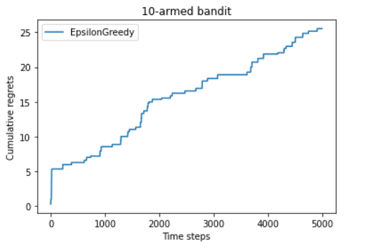
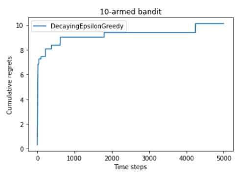
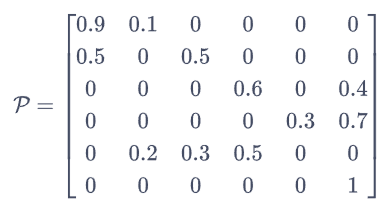
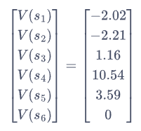
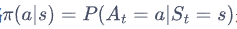
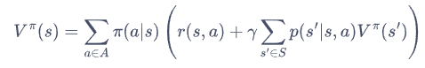
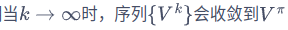
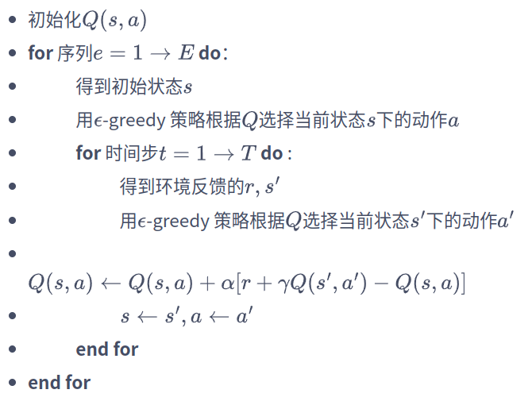

## 02 多臂老虎机

- 累积懊悔

- 估计期望奖励

- $\epsilon-greedy$ epsilon-贪心算法

  - 累积懊悔线性增长

    

- 衰减 epsilon-贪心算法 DecayingEpsilonGreedy

  - 随时间做反比例衰减的 epsilon-贪婪算法 能够使累积懊悔与时间步的关系变成**次线性**（sublinear）的，这明显优于固定 epsilon 值的 epsilon-贪婪算法

    

- UCB 上置信界

  - 计算相应动作的不确定性度量

  - 即这个动作没有被充分测试过，不清楚它的潜在期望概率

  - UCB 算法在每次选择拉杆前，先估计每根拉杆的期望奖励的上界，使得拉动每根拉杆的期望奖励只有一个较小的概率超过这个上界，接着选出期望奖励上界最大的拉杆，从而选择最有可能获得最大期望奖励的拉杆。

  - 某个拉杆的执行次数越多，该拉杆的不确定性度量就越小

    该上置信界同时还考虑了每个动作的期望奖励估值

    所以最终选择动作时，即考虑到这个动作的不确定性的大小，越大越容易被选中

    也考虑每个动作的期望奖励估值，期望奖励越大，越容易被选中

    一开始不确定性度量起到的作用更大

    等所有的动作的不确定性度量都小了之后，则每个动作本身的期望奖励估值起到的作用更大

    

  

- 汤普森采样算法

  - 使用了Beta分布

  - 汤普森采样算法使用采样的方式，即根据当前每个动作 a 的奖励概率分布进行一轮采样，
    得到一组各根拉杆的奖励样本，再选择样本中奖励最大的动作。
    可以看出，汤普森采样是一种计算所有拉杆的最高奖励概率的蒙特卡洛采样方法。

    

## 03 马尔科夫决策过程

### 马尔科夫过程 MP 

- 随机过程

  - 随机过程的研究对象是随时间演变的随机现象

- 马尔科夫性质

  - 当且仅当某时刻的状态只取决于上一时刻的状态时，一个随机过程被称为具有**马尔可夫性质**
  - **马尔可夫过程**（Markov process）指具有马尔可夫性质的随机过程，也被称为**马尔可夫链**（Markov chain）
  - 

- 状态转移矩阵

  

  

- 状态序列与采样

### 马尔可夫奖励过程 MRP

- MRP **马尔可夫奖励过程**（Markov reward process）

  

- 衰减回报

  

  

- 状态价值函数

  - **贝尔曼方程**

    

  - 贝尔曼方程矩阵形式

    

  - 贝尔曼解析解

    

  - 通过贝尔曼方程获得每个状态的期望价值

    

  - 通过马尔科夫过程验证

    

### 马尔科夫决策过程 MDP

- MDP 马尔科夫决策过程

  

  - 不同于马尔可夫奖励过程，在马尔可夫决策过程中，通常存在一个智能体来执行动作

  - 智能体根据当前状态从动作的集合中选择一个动作的函数，被称为策略。

    

- 策略

  

  - 确定性策略：每个状态时只输出一个确定性的动作
  - 随机性策略：每个状态时输出的是关于动作的概率分布，然后根据该分布进行采样就可以得到一个动作

- 基于策略的状态价值函数

  - 从状态 $s$ 出发遵循策略 $\pi$ 能获得的期望回报

  

  - 动作价值函数

    - 我们用 $Q^{\pi}(s, a)$ 表示在 MDP 遵循策略 $\pi$ 时，对当前状态 $s$ 执行动作 $a$ 得到的期望回报：

      

  - **状态价值函数**和**动作价值函数**之间的关系

    

    

- MDP 马尔科夫决策过程的例子

  - 状态 s1 - s5
  - 每个状态可能采取的动作以及对应的奖励
  - 采取不同动作，根据概率转移到下一个状态

  

- 从MDP到MRP

  - 给定一个 MDP 和一个策略 $\pi$ ，将其转化为一个 MRP

  - 根据策略所有动作的概率进行加权，得到的奖励和就可以认为是一个 MRP 在该状态下的奖励

    

  - 计算采取动作的概率与使 $s$ 转移到 $s'$ 的概率的乘积，再将这些乘积相加，其和就是一个 MRP 的状态从 $s$ 转移至 $s'$ 的概率

    

### 蒙特卡洛方法

- 估计一个策略在一个马尔可夫决策过程中的状态价值函数

- 一个状态的价值是它的期望回报

- 用策略在 MDP 上采样很多条序列，计算从这个状态出发的回报再求其期望

  

- 一条序列中，可能没有出现过这个状态，可能只出现过一次这个状态，也可能出现过很多次这个状态。蒙特卡洛价值估计方法会在该状态每一次出现时计算它的回报。

- 另一种选择是一条序列只计算一次回报

  - 这条序列第一次出现该状态时计算后面的累积奖励，而后面再次出现该状态时，该状态就被忽略了

- 用策略 $\pi$ 从状态 $s$ 开始采样序列，为每一个状态维护一个计数器和总回报

  

### 占用度量

- 不同策略的价值函数是不一样的

- 对于同一个 MDP，不同策略会访问到的状态的概率分布是不同的

  - 有些策略会导致某些动作被执行的概率更小，这样会使得后续的一些潜在动作无法被执行，即无法获取其对应的动作价值和状态价值

- 策略的状态访问分布

  - 状态访问概率表示一个策略和 MDP 交互会访问到的状态的分布

  

- 策略的占用度量 occupancy measure

  

  - 它表示动作状态对 $(s, a)$ 被访问到的概率

    

    

    

  - 不同策略对于同一个状态动作对的占用度量是不一样的

### 最优策略

- 在有限状态和动作集合的 MDP 中，至少存在一个策略比其他所有策略都好或者至少存在一个策略不差于其他所有策略，这个策略就是**最优策略**　$\pi^{*}(s)$

- 最优状态价值函数

  

  - 选择此时使最优动作价值最大的那一个动作时的状态价值

    

- 最优动作价值函数

  

- 最优状态价值函数和最优动作价值函数之间的关系

  

- 贝尔曼最优方程

  

## 04 动态规划算法求解最优策略

- 动态规划
  - 基本思想是将待求解问题分解成若干个子问题，先求解子问题，然后从这些子问题的解得到目标问题的解
  - 保存已解决的子问题的答案，在求解目标问题的过程中，需要这些子问题答案时就可以直接利用，避免重复计算

- 基于动态规划的强化学习算法

  - 两种方法
    - **策略迭代**（policy iteration）
      - **策略评估**（policy evaluation）: 使用贝尔曼期望方程来得到一个策略的状态价值函数
      - **策略提升**（policy improvement）: 使用贝尔曼最优方程来进行动态规划，得到最终的最优状态价值
    - **价值迭代**（value iteration）

  - 特点
    - 基于动态规划的这两种强化学习算法要求事先知道环境的状态转移函数和奖励函数, 即整个马尔科夫决策过程
    - 现实中的白盒环境很少
    - 策略迭代和价值迭代通常只适用于有限马尔可夫决策过程，即状态空间和动作空间是离散且有限的

### 策略迭代

- 策略迭代

  - 策略评估
  - 策略提升

- 策略评估

  - 一个策略的状态价值函数

    

  - 当知道**奖励函数**和**状态转移函数**时，我们可以根据下一个状态的价值来计算当前状态的价值

  - 把计算下一个可能状态的价值当成一个子问题，把计算当前状态的价值看作当前问题

  - 用上一轮的状态价值函数来计算当前这一轮的状态价值函数

    

    

  - 实际的实现过程中

    

    可以提前结束策略评估

- 策略提升
  - 使用策略评估计算得到当前策略的状态价值函数之后，我们可以据此来改进该策略
  
  - 假如此时对于策略 $\pi$，已知其价值 $V^{\pi}$，即在策略  $\pi$ 下从每个状态 $s$ 出发，最终得到的期望回报，通过改进策略来获得在状态 $s$ 下更高的期望回报
  
    - 在状态 $s$ 下采取动作 $a$，之后的动作依旧遵循策略 $\pi$，得到的期望回报是 $Q^{\pi}(s, a)$，假如  $Q^{\pi}(s, a) > V^{\pi}(s)$ ，就能说明在状态 $s$ 下采取动作 $a$，比原来的策略 $\pi(a|s)$ 得到更高的期望回报。
    - 该假设只针对一个状态
  
  - 针对多个状态，假设存在一个确定性的策略 $\pi'$，在任意一个状态 $s$ 下，都满足
  
    
  
    
  
  - 在每个状态选择动作价值最大的动作（贪心法）
  
    
  
    - 当策略提升之后得到的策略 $\pi'$ 和之前的策略 $\pi$ 一样时，说明策略迭代达到了收敛，此时 $\pi'$ 就是最优策略
  
  - 策略提升的过程
  
    
  
    - 推导过程中的每一个时间步都用到局部动作价值优势
  
      

- 策略迭代算法

  - 对当前的策略进行策略评估，得到其状态价值函数

  - 然后根据该状态价值函数进行策略提升以得到一个更好的新策略

  - 接着继续评估新策略、提升策略

  - 直至最后收敛到最优策略

    

  - 算法详情

    

### 价值迭代

- **策略迭代**中的**策略评估**需要进行很多轮才能收敛得到某一策略的状态函数

  - 需要很大的计算量，尤其是在状态和动作空间比较大的情况下。

  - **不需要**完全等到**策略评估完成**后再进行策略提升
  - 虽然状态价值函数还没有收敛，但是不论接下来怎么更新状态价值，策略提升得到的都是同一个策略

- 价值迭代算法

  - 只在策略评估中进行一轮价值更新，然后直接根据更新后的价值进行策略提升

  - 价值迭代算法可以看做一种策略评估只进行了一轮更新的策略迭代算法

  - 价值迭代中不存在显式的策略，只维护一个状态价值函数

  - 可以看成动态规划过程，将贝尔曼最优方程写成迭代更新的方式

    

    

  - 流程

    

## 05 时序差分算法

### 无模型的强化学习算法

- 动态规划算法要求马尔可夫决策过程是已知的，
  - 即要求与智能体交互的环境是完全已知的（例如迷宫或者给定规则的网格世界）
  - 智能体其实并不需要和环境真正交互来采样数据，直接用动态规划算法就可以解出最优价值或策略
  - 对于大部分强化学习现实场景（例如电子游戏或者一些复杂物理环境），其马尔可夫决策过程的状态转移概率是无法写出来的，也就无法直接进行动态规划
  - 智能体只能和环境进行交互，通过采样到的数据来学习
    - **无模型的强化学习**（model-free reinforcement learning）

- 无模型的强化学习算法
  - 不需要事先知道环境的奖励函数和状态转移函数
  - 直接使用和环境交互的过程中采样到的数据来学习
  - 两大无模型强化学习算法 (均基于TD (Temporal difference))
    - **SARSA （同策略，在线策略学习）**
    - **Q-Learning （异策略，离线策略学习）**
  - 在线策略学习和离线策略学习
    - 在线策略学习
      - 在线策略学习要求使用在当前策略下采样得到的样本进行学习，
      - 一旦策略被更新，当前的样本就被放弃了
      - 类比用水龙头洗手
    - 离线策略学习
      - 离线策略学习使用经验回放池将之前采样得到的样本收集起来再次利用
      - 类比用水盆洗手
      - 离线策略学习往往能够更好地利用历史数据，并具有更小的样本复杂度

### 时序差分方法

- 时序差分

  - 估计一个策略的价值函数的方法

  - 结合了蒙特卡洛和动态规划算法的思想

    - 和蒙特卡洛的相似之处在于可以从样本数据中学习，不需要事先知道环境

      - 蒙特卡洛增量更新价值函数

        

    - 和动态规划的相似之处在于根据贝尔曼方程的思想，利用后续状态的价值估计来更新当前状态的价值估计

  - 蒙特卡洛方法必须要等整个序列结束之后才能计算得到这一次的回报

    - 时序差分方法只需要当前步结束即可进行计算

    - 时序差分算法用当前获得的奖励加上下一个状态的价值估计来作为在当前状态会获得的回报

      

    - 时序差分部分，这里用到了真实的奖励，比价值期望更准确

      

    - 从蒙特卡洛（第一行）到时序差分（最后一行）

      

### SARSA 算法

- 策略评估

  - 通过时序差分算法实现
  - 不需要大量样本，用小部分样本评估策略，就可以更新策略（价值迭代）

- 策略提升

  - 用时序差分算法来估计动作价值函数 $Q$

    

  - 用贪婪算法选取某个状态下动作价值最大的那个动作
    $$
    \text{arg}\ \text{max}_aQ(s,a)
    $$

    - 可能导致有些动作永远无法被选择

      - 通过使用 $\epsilon-\text{greedy}$ 贪婪策略

      

- SARSA 算法流程

  

### 多步SARSA 算法

- 时序差分TD算法的缺点

  - 时序差分算法
    - 具有非常**小的方差**，只利用一步奖励和下一个状态的价值估计
    - 它是**有偏**的，因为用到了下一个状态的价值估计而不是其真实的价值
  - 蒙特卡洛方法
    - 是**无偏**（unbiased）的，但是具有比较**大的方差**
    - 每一步的状态转移都有不确定性，而每一步状态采取的动作所得到的不一样的奖励最终都会加起来，这会极大影响最终的价值估计

- 多步时序差分

  - 使用 n 步的奖励，然后使用之后状态的价值估计

    

    

### Q-Learning 算法

- Q-Learning 与 SARSA 的区别主要在于时序差分算法的更新方式

  - 行为策略
    - 探索时通过 e-greedy 执行动作
  - 目标策略
    - 更新状态动作价值表时，通过 max 选出最大价值，而不是 e-greedy
  - 探索与训练时用的不是同样的策略，称为异策略，离线策略

  

  - 用价值迭代的思想来理解 Q-learning，即 Q-learning 是直接在估计 $Q^*$，动作价值函数的贝尔曼最优方程

    

  - 训练流程

    

### SARSA vs Q-Learning

- SARSA 算法是在线策略（同策略）
  - 行为策略与目标策略相同，均为 e-greedy 策略
  - 更新公式使用当前策略采样得到的五元组 $(s, a,r,s',a')$ 
    - 该五元组中的 $a'$ 表示当前策略采样得到的下一个状态对应的动作
- Q学习算法是离线策略（异策略）
  - 行为策略与目标策略不同
    - 行为策略 e-greedy
    - 目标策略 max
  - 更新公式使用四元组 $(s,a,r,s')$ 
    - 该四元组并不需要一定是当前策略采样得到的数据
  - 尽管离线策略学习可以让智能体基于经验回放池中的样本来学习，但需要保证智能体在学习的过程中可以不断和环境进行交互，将采样得到的最新的经验样本加入经验回放池中，从而使经验回放池中有一定数量的样本和当前智能体策略对应的数据分布保持很近的距离。
  - 如果不允许智能体在学习过程中和环境进行持续交互，而是完全基于一个给定的样本集来直接训练一个策略，这样的学习范式被称为**离线强化学习**（offline reinforcement learning）

- 针对悬崖漫步
  - Q-Learning 更偏向走在悬崖边上，效率上更优，但有一定概率掉下悬崖

## 06 Dyna-Q 算法

- 模型通常指与智能体交互的环境模型
  - **基于模型的强化学习**
    - 对环境的状态转移概率和奖励函数进行建模
    - 环境模型是事先已知的
      - **策略迭代**
      - **价值迭代**
    - 环境模型是通过采样数据估计得到
      - **Dyna-Q**
  - **无模型的强化学习**
    - 根据智能体与环境交互采样到的数据直接进行策略提升或者价值估计
    -  Sarsa 和 Q-learning

- **强化学习评价指标**
  - 算法收敛后的策略在初始状态下的期望回报
  - 样本复杂度，算法达到收敛结果需要在真实环境中采样的样本数量
    - 基于模型的强化学习算法，比无模型的强化学习算法具有更低的样本复杂度
    - 环境模型可能不准确，不能完全代替真实环境，策略的期望回报可能不如无模型的强化学习算法

- Dyna-Q 算法

  - 基于模型的强化学习

  - 使用 Q-planning 基于模型生成模拟数据，用模拟数据与真实数据一起改进策略

    - Q-planning 每次选取一个曾经访问过的状态 $s$

    - 采用一个曾经在该状态下执行的动作 $a$

    - 通过模型得到转移状态 $s'$ 以及奖励 $r$ 

    - 根据模拟数据 $(s, a, r, s')$ Q-learning 的方式更新状态动作价值函数

      

- Dyna-Q 具体流程

  

  - 每次与环境交互执行一次 Q-learning 之后，Dyna-Q 会做 n 次 Q-planning，更新模型，通过模型采样状态动作对，通过采样数据更新状态动作价值函数

    