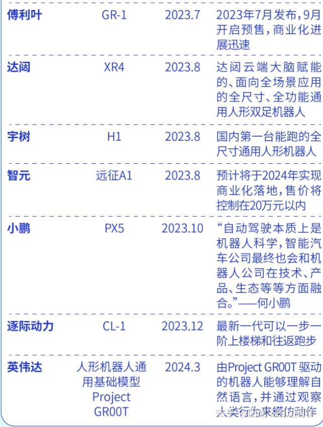

# 仿真笔记 

- 仿真

  - 模型描述

    - URDF
    - SDF

  - 动力学引擎

    - ODE
      - 3D电影和游戏
      - 数值求解器上用的是一阶的半隐式欧拉方法
      - 主要追求的是速度、稳定性而非精度
    - Bullet
    - MuJoCo
      - 速度、精度和建模能力的独特组合，主要应用于强化学习和最优化控制领域

  - 渲染引擎

    - OpenGL
      - 渲染2D、3D矢量图形的跨语言、跨平台的应用程序编程接口

  - 仿真评价指标

    - | 计算速度 | 仿真计算效率                                         |
      | -------- | ---------------------------------------------------- |
      | 计算精度 | 仿真结果与理论值的接近程度                           |
      | 接触模型 | 接触模型准确，确保动力学仿真结果与实际相近           |
      | 编程环境 | 支持的编程语言                                       |
      | 兼容性   | 支持的操作系统                                       |
      | 可扩展性 | 支持的第三方工具，包括矩阵计算、数值优化、数据分析等 |
      | 开源     | 源代码开源程度，API接口开放程度                      |
      | 成本     | 包括资金花费和时间花费                               |

  - 物理引擎

    - RaiSim

      - 机器人技术和AI的跨平台多体物理引擎
      - 模拟机器人系统提供准确性和速度
      - 通用的刚体模拟器
      - 独特的接触求解方法、高效的多体动力学算法
      - 最容易学习/使用的C++仿真库，极少的依赖项

    - Bullet Physics (Bullet)

      - 最初是为游戏开发而设计的，但现在已经广泛用于机器人学
      - 开源霸主，具有离散和连续碰撞检测的刚体和柔体仿真；
      - 碰撞形状包括：球体、长方体、圆柱体、圆锥体、使用GJK的凸包、非凸网格和三角形网格；
      - 支持柔体仿真：布料、绳索和可变形物体；
      - 提供丰富的刚体和柔体约束；具有速度级MLCP和简化坐标Featherstone ABA算法

    - Open Dynamics Engine (ODE)

      - 模拟关节连接的刚体动力学的库
      - 支持具有任意质量分布的刚体；关节类型：球副、转动副、移动副、固定副、旋转电机、直线电机、万向节；碰撞基本体：球体、长方体、圆柱体、胶囊体、平面和三角形网格、凸面体；碰撞空间：四叉树、哈希空间和简单空间；模拟方法：根据Trinkle/Stuwart和Anitescu/Potra的拉格朗日乘子速度模型推导出运动方程；使用一阶积分器，速度很快但还不够准确，稍后将推出更高阶的积分器；时间步长方法的选择：可以使用标准的“大矩阵”方法或较新的迭代QuickStep方法；接触和摩擦模型：基于Baraff的Dantzig LCP求解器，尽管ODE实现了对Coloumb摩擦模型的更快近似；开放原生的C接口

    - Multi-Joint dynamics with Contact (MuJoCo)

      - MuJoCo[4]是由Emo Todorov为Roboti LLC而开发的一种物理引擎
      - 从头开始设计的全功能模拟器，目的是基于模型的优化，尤其是通过接触进行的优化
      - 广义坐标系中进行仿真，避免出现关节冲突；即使存在接触也可以很好地定义逆动力学；通过凸优化对约束进行统一的连续时间表述；约束包括软接触，极限，干摩擦，等式约束；能模拟粒子系统，布料，绳索和软物体；包括马达，圆柱体，肌肉，腱，滑块曲柄的执行器；可选择牛顿，共轭梯度或投影高斯-赛德尔求解器；可选择金字塔形或椭圆形的摩擦锥，密集或稀疏的雅可比方程式；可选择Euler或Runge-Kutta数值积分器；多线程采样和有限差分近似；直观的XML模型格式（称为MJCF）和内置的模型编译器；跨平台GUI在OpenGL中具有交互式3D可视化；用ANSI C编写并针对性能进行手工调整的运行时模块。

    -  Dynamic Animation and Robotics Toolkit (DART)

    - | ** RaiSim**            | **Bullet**          | **ODE**             | **MuJoCo**             | **DART**                  |                     |
      | ---------------------- | ------------------- | ------------------- | ---------------------- | ------------------------- | :-----------------: |
      | **Initial****release** | Unreleased          | 2006                | 2001                   | 2015                      |        2012         |
      | **Author**             | J. HwangboD. Kang   | E. Coumans          | R. Smith               | E. Todorov                |    J. Lee et al     |
      | **License**            | Proprietary         | Zlib(open-source)   | GPL / BSD(open-source) | Apache(open-source)       |         BSD         |
      | **Main****purpose**    | Robotics            | Game, Graphics      | Game, Graphics         | Robotics                  |      Robotics       |
      | **Language**           | C++                 | C / C++             | C++                    | C                         |         C++         |
      | **API**                | C++                 | C++ / Python        | C                      | C                         |         C++         |
      | **Contacts**           | Hard                | Hard/Soft           | Hard/Soft              | Soft                      |        Hard         |
      | **Solver**             | Bisection           | MLCP                | LCP                    | Newton / PGS / CG         |         LCP         |
      | **Integrator**         | Semi-implicit Euler | Semi-implicit Euler | Semi-implicit Euler    | Semi-implicit Euler / RK4 | Semi-implicit Euler |

  - 仿真软件
    - Webots
    - V-rep
    - Gazebo
    - ISAAC
    - Drake
    - MATLAB
    - PyBullet
    - Mujoco

- 仿真器
  - 动力学仿真
  - 传感器仿真
    - 图像
    - GPS
    - IMU
  - 在仿真中验证机器人的程序逻辑
  - 目的
    - 仿真机器人本身的动力学物理定律
    - 解算机器人和环境交互时产生的碰撞

- **Model-Based 方法**

  优点

  1. 高效的学习：由于Model-based方法使用了环境模型（可以是从数据中学到的或先验给定的），它们可以通过模拟来预测和评估未来的状态和奖励，从而在较少的实际环境交互中学习决策。
  2. 规划能力：拥有模型使得agent能进行前瞻性思考，通过规划算法如动态规划或[蒙特卡洛树搜索](https://www.zhihu.com/search?q=蒙特卡洛树搜索&search_source=Entity&hybrid_search_source=Entity&hybrid_search_extra={"sourceType"%3A"answer"%2C"sourceId"%3A"3469220757"})进行未来的规划，优化长期收益。
  3. 适用于动态系统：在动态系统控制问题中，例如机器人或自动驾驶，模型可以用来模拟物理动作的后果，这对于安全性和效率至关重要。

  缺点

  1. 模型的准确性：这类方法的性能极大地依赖于模型的准确性。如果模型与实际环境有较大偏差，可能导致非最优或错误的决策。
  2. 杂和计算成本高：建立和维护一个准确的环境模型可能非常复杂且计算成本高，特别是在环境本身非常复杂或者不易建模的情况下。
  3. 过度拟合：过于依赖模型可能导致过度拟合特定的环境设置，缺乏[泛化能力](https://www.zhihu.com/search?q=泛化能力&search_source=Entity&hybrid_search_source=Entity&hybrid_search_extra={"sourceType"%3A"answer"%2C"sourceId"%3A"3469220757"})。

  

- Model-Free 方法

  优点

  1. 通用性：Model-free方法不依赖于外部环境的模型，因此通常更具有通用性，能够适用于各种不同的环境。
  2. 实现简单：相较于需要建模的Model-based方法，Model-free方法实现起来较为简单直接，特别是方法如Q-learning和SARSA。
  3. 强健性：由于不依赖具体模型，Model-free方法对环境的变化具有较好的适应性和[鲁棒性](https://www.zhihu.com/search?q=鲁棒性&search_source=Entity&hybrid_search_source=Entity&hybrid_search_extra={"sourceType"%3A"answer"%2C"sourceId"%3A"3469220757"})。

  缺点

  1. 学习速度：不使用模型意味着需要更多的与环境交互来学习最优策略，这可能导致学习过程缓慢。
  2. 数据需求量大：[Model-free方法](https://www.zhihu.com/search?q=Model-free方法&search_source=Entity&hybrid_search_source=Entity&hybrid_search_extra={"sourceType"%3A"answer"%2C"sourceId"%3A"3469220757"})通常需要大量的数据来达到较好的性能，这在实际应用中可能是一个限制。
  3. 效率低：在没有模型的情况下，每次决策都需要依据实时或历史数据进行，可能导致运行效率低下。

- sim2real
  - 问题
    - 仿真环境与真实环境之间存在差异
      - 仿真器所使用的物理引擎目前还不能够完全精确模拟真实世界的物理情况，尤其是不同材料之间的（静）摩擦力、物体的受力（弹性&塑形）形变以及极短时间的高速碰撞等——极端且复杂的物理交互情形，
      - 仿真器构建的是关节驱动器（电机&齿轮箱&驱动电路）、传感器与信号通信的绝对理想情况，目前不支持模拟实际硬件缺陷或者corner case等情形
    - 缺乏大规模真实环境数据
    - 仿真模型与实际系统之间的差异
    - 训练算法的局限性, 泛用性
  - 思路
    - 更加准确的物理仿真器, 模型, 参数辨识等
      - 面对同一条指令时，仿真与真实机器人系统能够以同样的方式完成同样的事情，那么我们就初步达到了目标，建立了digital twin
    - domain randomization 域随机化 增强模型在不确定环境下的鲁棒性。
      - 随机了仿真世界的静摩擦力，动摩擦力等，随机了机器人的刚度和阻尼等，也随机了重力分布。通过这种方式训练出来的策略适应性较强
    - 少量真实数据和大量仿真数据的混合训练方法,提高模型在实际环境中的泛化能力。
    - 更高效的模型思路等..

- real2sim

  - 目的
    - 如何更准确地在虚拟环境中表现真实世界
    - 解决现实世界数据获取困难的问题。在许多应用场景中,获取大量高质量的真实数据是非常困难和昂贵的,而构建仿真环境可以大大降低数据获取的成本和复杂度。
    - 提高模型训练的效率和灵活性。在仿真环境中,可以更方便地生成大量多样的训练数据,并能够灵活控制各种环境条件,以加速模型的训练和迭代优化。
    - 保护隐私和减少真实世界中的风险。某些涉及隐私或安全的应用,在真实环境中进行测试和训练存在一定风险,而在仿真环境中则可以更好地保护隐私和减少风险。

  - 困难
    - 建立准确的仿真模型。如何建立能够准确复制现实环境动态特性的仿真模型是关键难点,这需要深入理解应用领域的物理规律和数学模型。
    - 获取足够的训练数据。即使在仿真环境中,也需要大量的真实世界数据来训练模型,这对某些应用场景仍然是一个挑战。
    - 仿真环境与现实差异的弥补。即使建立了高度精确的仿真模型,在模型从仿真迁移到现实时,也需要解决仿真环境与实际环境之间的差异。
    - 可解释性和可信赖性。仿真环境构建涉及许多假设和简化,如何保证在现实应用中模型的可解释性和可信度是一个问题。
  - 难点
    - 数据集匹配和域差异问题:
      - real 世界和 sim 世界通常存在很大的数据域差异,如照明、材质、纹理、几何结构等。如何构建高度相似的仿真数据集是关键。
      - 真实世界数据的获取和标注也是一个挑战,需要大量的人力和时间投入。
    - 建模和渲染的难度:
      - 要建立高保真的物理仿真模型,需要考虑复杂的光照、材质、流体等物理效果,建模和渲染都非常困难。
      - 需要不断优化算法和硬件性能,才能在合理的时间内生成高质量的仿真结果。
    - 域适应和泛化性能:
      - 即使构建了相似的仿真数据集,模型在实际应用中也会遇到泛化性能问题。如何通过域适应技术,让模型能够更好地迁移到真实环境是个挑战。
    - 应用场景的多样性:
      - real2sim 技术可应用于机器人、自动驾驶、AR/VR等多个领域,每个场景都有自己的特点和需求,如何设计一个通用的 real2sim 框架是个问题。

  - 机械臂参数辨识
    - 基于最小二乘法的参数辨识:
      - 利用机械臂的运动学或动力学方程,通过最小化预测值与实际测量值之间的误差来估计参数。
      - 该方法计算简单,但对噪声干扰比较敏感,需要进行数据滤波等预处理。
    - 基于卡尔曼滤波的参数辨识:
      - 将参数辨识问题建模为状态空间模型,利用卡尔曼滤波算法对参数进行递归估计。
      - 该方法对噪声具有一定鲁棒性,可以在线实时进行参数辨识。但对模型精度要求较高。
    - 基于人工智能的参数辨识:
      - 利用神经网络、强化学习等AI技术,从大量实验数据中自动学习参数辨识模型。
      - 该方法对建模要求相对较低,可以更好地处理复杂非线性关系。但需要大量的训练数据支持。
    - 基于优化算法的参数辨识:
      - 将参数辨识问题转化为优化问题,利用遗传算法、粒子群优化等全局优化算法进行参数估计。
      - 该方法可以处理复杂的动力学模型,但计算量较大,收敛性也较为敏感。

- 人形机器人
  - 

- 液压 vs 电驱
  - 液压
    - 优点
      - 力气超大
      - 液压执行器可以做到很轻，可以减轻肢体末端惯量，无需机械传动，直驱就可以负载，
    - 缺点：液压系统的能量效率不高，系统零件数量多，液压系统的维护维修麻烦，响应速度不快，液压的伺服控制器需要独立的电机伺服泵，以及独立的力传感器，生产技术要求极高，对于极高集成度的液压执行器来说，通常的加工方法和设备是无法满足的，必须使用金属3D打印，开发和生产的成本极高，由于液压系统的复杂性，Atlas也不时出现爆缸漏油的情况，液压机器人需要专门的液压维护团队进行维护，制造成本高昂，难以商业化和产品化。
  - 电驱
    - 优点
      - 便宜高效可控可量产
      - 成熟可靠 寿命长 鲁棒性好
      - 天然具备力矩环的反馈，不需要增加额外专门的传感器
      - 响应速度高，高伺服驱动可以达到数十kHz的响应
    - 缺点
      - 电机本体扭矩密度相比液压执行机构要低一个数量级，当电机扭矩不够时，通常需要搭配减速器

- 特斯拉
  - **实时FSD**

- 机器人仿真平台开发
  - 

- Aloha act
- isaac gim
- moveit 源码
- accurate net