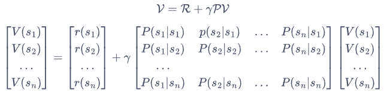
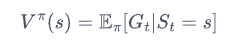
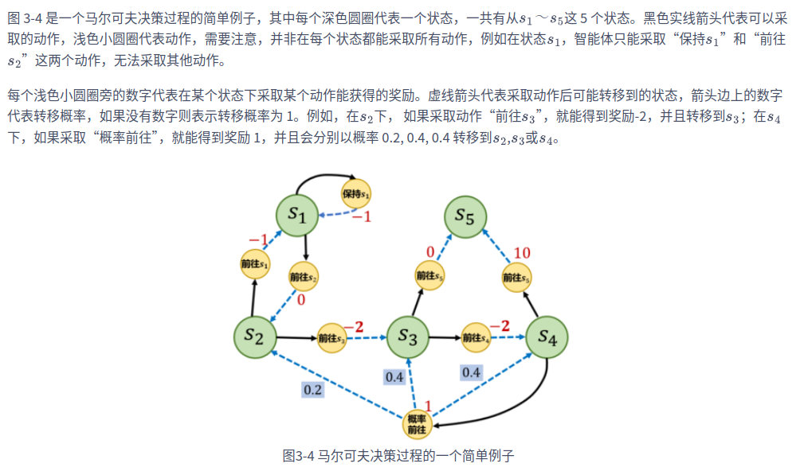
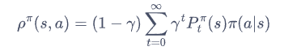

## 02 多臂老虎机

- 累积懊悔

- 估计期望奖励

- $\epsilon-greedy$ epsilon-贪心算法

  - 累积懊悔线性增长

    

- 衰减 epsilon-贪心算法 DecayingEpsilonGreedy

  - 随时间做反比例衰减的 epsilon-贪婪算法 能够使累积懊悔与时间步的关系变成**次线性**（sublinear）的，这明显优于固定 epsilon 值的 epsilon-贪婪算法

    

- UCB 上置信界

  - 计算相应动作的不确定性度量

  - 即这个动作没有被充分测试过，不清楚它的潜在期望概率

  - UCB 算法在每次选择拉杆前，先估计每根拉杆的期望奖励的上界，使得拉动每根拉杆的期望奖励只有一个较小的概率超过这个上界，接着选出期望奖励上界最大的拉杆，从而选择最有可能获得最大期望奖励的拉杆。

  - 某个拉杆的执行次数越多，该拉杆的不确定性度量就越小

    该上置信界同时还考虑了每个动作的期望奖励估值

    所以最终选择动作时，即考虑到这个动作的不确定性的大小，越大越容易被选中

    也考虑每个动作的期望奖励估值，期望奖励越大，越容易被选中

    一开始不确定性度量起到的作用更大

    等所有的动作的不确定性度量都小了之后，则每个动作本身的期望奖励估值起到的作用更大

    

  

- 汤普森采样算法

  - 使用了Beta分布

  - 汤普森采样算法使用采样的方式，即根据当前每个动作 a 的奖励概率分布进行一轮采样，
    得到一组各根拉杆的奖励样本，再选择样本中奖励最大的动作。
    可以看出，汤普森采样是一种计算所有拉杆的最高奖励概率的蒙特卡洛采样方法。

    

## 03 马尔科夫决策过程

### 马尔科夫过程 MP 

- 随机过程

  - 随机过程的研究对象是随时间演变的随机现象

- 马尔科夫性质

  - 当且仅当某时刻的状态只取决于上一时刻的状态时，一个随机过程被称为具有**马尔可夫性质**
  - **马尔可夫过程**（Markov process）指具有马尔可夫性质的随机过程，也被称为**马尔可夫链**（Markov chain）
  - 

- 状态转移矩阵

  

  

- 状态序列与采样

### 马尔可夫奖励过程 MRP

- MRP **马尔可夫奖励过程**（Markov reward process）

  

- 衰减回报

  

  

- 状态价值函数

  - **贝尔曼方程**

    

  - 贝尔曼方程矩阵形式

    

  - 贝尔曼解析解

    

  - 通过贝尔曼方程获得每个状态的期望价值

    

  - 通过马尔科夫过程验证

    

### 马尔科夫决策过程 MDP

- MDP 马尔科夫决策过程

  

  - 不同于马尔可夫奖励过程，在马尔可夫决策过程中，通常存在一个智能体来执行动作

  - 智能体根据当前状态从动作的集合中选择一个动作的函数，被称为策略。

    

- 策略

  

  - 确定性策略：每个状态时只输出一个确定性的动作
  - 随机性策略：每个状态时输出的是关于动作的概率分布，然后根据该分布进行采样就可以得到一个动作

- 基于策略的状态价值函数

  - 从状态 $s$ 出发遵循策略 $\pi$ 能获得的期望回报

  

  - 动作价值函数

    - 我们用 $Q^{\pi}(s, a)$ 表示在 MDP 遵循策略 $\pi$ 时，对当前状态 $s$ 执行动作 $a$ 得到的期望回报：

      

  - **状态价值函数**和**动作价值函数**之间的关系

    

    

- MDP 马尔科夫决策过程的例子

  - 状态 s1 - s5
  - 每个状态可能采取的动作以及对应的奖励
  - 采取不同动作，根据概率转移到下一个状态

  

- 从MDP到MRP

  - 给定一个 MDP 和一个策略 $\pi$ ，将其转化为一个 MRP

  - 根据策略所有动作的概率进行加权，得到的奖励和就可以认为是一个 MRP 在该状态下的奖励

    

  - 计算采取动作的概率与使 $s$ 转移到 $s'$ 的概率的乘积，再将这些乘积相加，其和就是一个 MRP 的状态从 $s$ 转移至 $s'$ 的概率

    

### 蒙特卡洛方法

- 估计一个策略在一个马尔可夫决策过程中的状态价值函数

- 一个状态的价值是它的期望回报

- 用策略在 MDP 上采样很多条序列，计算从这个状态出发的回报再求其期望

  

- 一条序列中，可能没有出现过这个状态，可能只出现过一次这个状态，也可能出现过很多次这个状态。蒙特卡洛价值估计方法会在该状态每一次出现时计算它的回报。

- 另一种选择是一条序列只计算一次回报

  - 这条序列第一次出现该状态时计算后面的累积奖励，而后面再次出现该状态时，该状态就被忽略了

- 用策略 $\pi$ 从状态 $s$ 开始采样序列，为每一个状态维护一个计数器和总回报

  

### 占用度量

- 不同策略的价值函数是不一样的

- 对于同一个 MDP，不同策略会访问到的状态的概率分布是不同的

  - 有些策略会导致某些动作被执行的概率更小，这样会使得后续的一些潜在动作无法被执行，即无法获取其对应的动作价值和状态价值

- 策略的状态访问分布

  - 状态访问概率表示一个策略和 MDP 交互会访问到的状态的分布

  

- 策略的占用度量 occupancy measure

  

  - 它表示动作状态对 $(s, a)$ 被访问到的概率

    

    

    

  - 不同策略对于同一个状态动作对的占用度量是不一样的

### 最优策略

- 在有限状态和动作集合的 MDP 中，至少存在一个策略比其他所有策略都好或者至少存在一个策略不差于其他所有策略，这个策略就是**最优策略**　$\pi^{*}(s)$

- 最优状态价值函数

  

  - 选择此时使最优动作价值最大的那一个动作时的状态价值

    

- 最优动作价值函数

  

- 最优状态价值函数和最优动作价值函数之间的关系

  

- 贝尔曼最优方程

  

## 04 动态规划算法求解最优策略

- 动态规划
  - 基本思想是将待求解问题分解成若干个子问题，先求解子问题，然后从这些子问题的解得到目标问题的解
  - 保存已解决的子问题的答案，在求解目标问题的过程中，需要这些子问题答案时就可以直接利用，避免重复计算

- 基于动态规划的强化学习算法

  - 两种方法
    - **策略迭代**（policy iteration）
      - **策略评估**（policy evaluation）: 使用贝尔曼期望方程来得到一个策略的状态价值函数
      - **策略提升**（policy improvement）: 使用贝尔曼最优方程来进行动态规划，得到最终的最优状态价值
    - **价值迭代**（value iteration）

  - 特点
    - 基于动态规划的这两种强化学习算法要求事先知道环境的状态转移函数和奖励函数, 即整个马尔科夫决策过程
    - 现实中的白盒环境很少
    - 策略迭代和价值迭代通常只适用于有限马尔可夫决策过程，即状态空间和动作空间是离散且有限的

### 策略迭代

- 策略迭代

  - 策略评估
  - 策略提升

- 策略评估

  - 一个策略的状态价值函数

    

  - 当知道**奖励函数**和**状态转移函数**时，我们可以根据下一个状态的价值来计算当前状态的价值

  - 把计算下一个可能状态的价值当成一个子问题，把计算当前状态的价值看作当前问题

  - 用上一轮的状态价值函数来计算当前这一轮的状态价值函数

    

    

- 策略提升
  - 