# Isaac Gym Note

- 资源
  - isaac_gym: https://developer.nvidia.com/isaac-gym/download
    - 官方教程：./isaacgym/docs/index.html
  
  - IsaacGymEnvs: https://github.com/isaac-sim/IsaacGymEnvs
    - Reinforcement Learning Examples
  


## Isaac Gym

### Install

- Install isaac-gym preview 4 release

  - download: https://developer.nvidia.com/isaac-gym/download

  - create a new conda env

    ```shell
    conda create -n isaac_gym python=3.6
    conda activate isaac_gym
    
    cd isaacgym/python
    pip install -e .
    ```

  - check install

    ```shell
    python joint_monkey.py
    ```


### Trouble shooting

- 跑example时 ImportError: libpython3.7m .so.1.0: cannot open shared object file: No such file or directory

  -  在 .zshrc 中加入

    ```
    export LD_LIBRARY_PATH=$LD_LIBRARY_PATH:/home/shan/App/miniconda3/envs/isaac_gym/lib
    ```

- Python OSError: symbol cublasLtHSHMatmulAlgoInit, version libcublasLt.so.11 not defined的解决

  - https://blog.csdn.net/WinterShiver/article/details/131923227

  -  在 .zshrc 中加入

    ```shell
    # 注意这里需要将$LD_LIBRARY_PATH 放在最后
    export LD_LIBRARY_PATH=/home/shan/App/miniconda3/envs/isaac_gym/lib/python3.7/site-packages/nvidia/cublas/lib/:$LD_LIBRARY_PATH
    ```


### About Isaac Gym

- NVIDIA’s prototype physics simulation environment for reinforcement learning research.
- end-to-end GPU accelerated RL for physically based systems
- simulation can run on the GPU
- thousand of environments to be simultaneously simulated on a single GPU,
- basic **PPO** implementation
- straightforward RL task system
- Support for importing URDF and MJCF files


### Programming Example

#### Collision filtering (1080_balls_of_solitude.py)

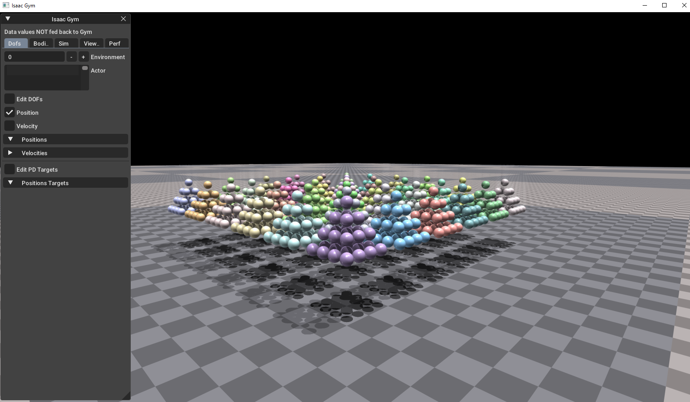

```shell
# 介绍了 collision_groups 和 collision_filters的使用方法
# 生成数个由圆球构成的金字塔
# 默认设置下球只会在自己的金字塔中发生碰撞
# --all_collisions 可以使来自不同环境的所有球发生碰撞
# --no_collisions 使所有球的碰撞失效
- Press 'R' to reset the  simulation

# 默认只在同一个env中发生碰撞
python 1080_balls_of_solitude.py

# 使所有env中的球发生碰撞
python 1080_balls_of_solitude.py --all_collisions

# 禁用碰撞
python 1080_balls_of_solitude.py --no_collisions
```


#### Asset and Environment Info (asset_info.py)

```shell
# 演示加载资产，URDF/MJCF，
# 查询 bodies, joints and DOF
python assert_info.py
```


#### Body physics properties example (body_physics_props.py)

```shell
# 此示例演示如何加载刚体、更新其属性以及应用各种操作
# 首先，加载具有不同属性的刚体资源。 
# 其次，修改刚体的形状和视觉属性。 
# 第三，使用刚体手柄来控制它并执行施加体力和线速度等各种动作
python body_physics_props.py
```

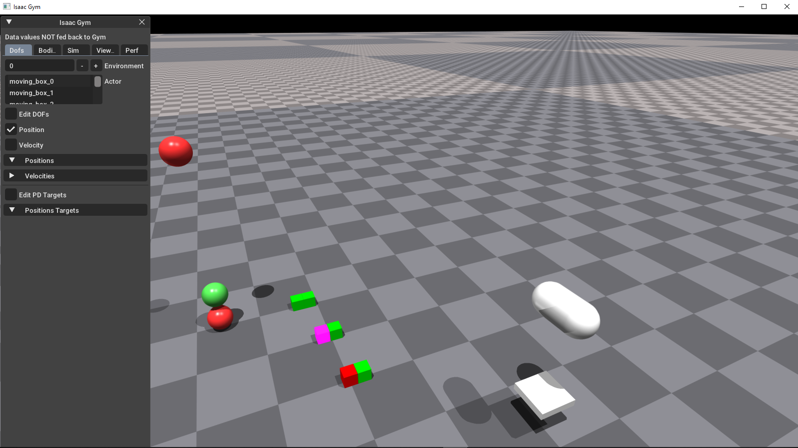


#### Domain Randomization (domain_randomization.py)

```shell
# 此示例演示了域随机化。 
# 首先，它随机化环境中加载的资源的颜色和纹理。 
# 其次，它随机化环境中存在的灯光的参数。 
# 第三，它随机化相机的位置并捕获多个视点。
python domain_randomization.py
```

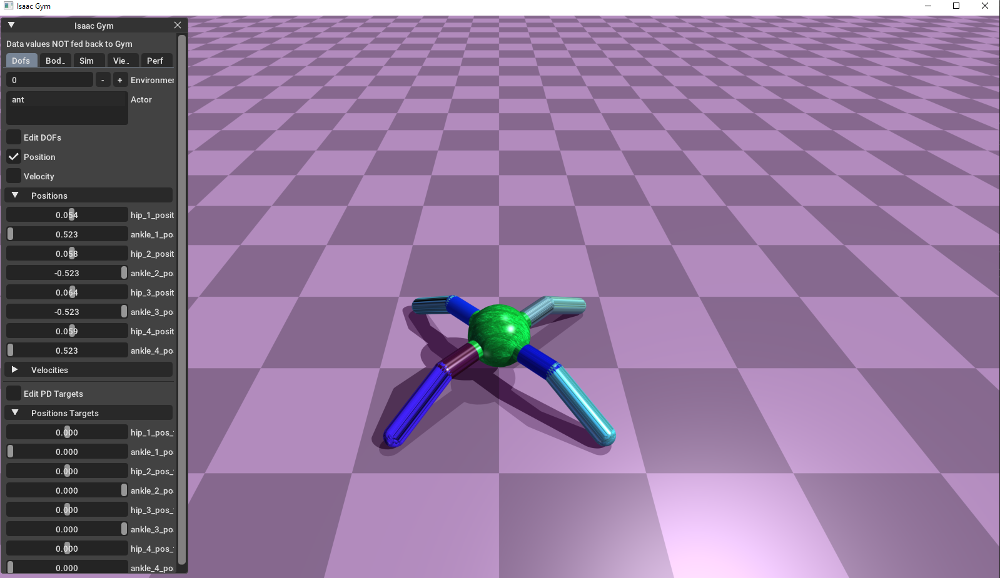


#### Franka Attractor (franka_attractor.py)

- attractor 的介绍

  - 强化学习中的吸引子，或者说目标

    - 空间吸引子
    - 物体吸引子
    - 配置吸引子

  - In the context of Isaac Gym, an "attractor" refers to a feature or object that the reinforcement learning agent (the learning model) is trying to reach or get close to within the simulated environment.

    In a reinforcement learning setup, the agent is trained to maximize a reward signal. The attractor is usually defined as a specific location, object, or configuration within the environment that the agent should try to reach or interact with in order to receive the maximum reward.

    For example, in a robotic manipulation task, the attractor could be the target object that the agent needs to grasp and move to a designated location. The agent's goal is then to learn a policy (a mapping from states to actions) that allows it to successfully navigate to the attractor and interact with it in order to maximize the reward signal.

    Attractors can take various forms, such as:

    Spatial attractors: A specific coordinate or region in the simulated environment that the agent should reach.

    Object attractors: A particular object or target that the agent should interact with.

    Configuration attractors: A desired state or arrangement of the agent's own body parts or the environment.

    The design of the attractor, along with the reward function, is crucial in shaping the learning behavior of the reinforcement learning agent within the Isaac Gym simulation. By carefully defining the attractor, the agent can be guided towards the desired behaviors and outcomes.

```bash
# This example demonstrates using attractors to navigate Franka arms to reach a target location and pose.
python franka_attractor.py

```

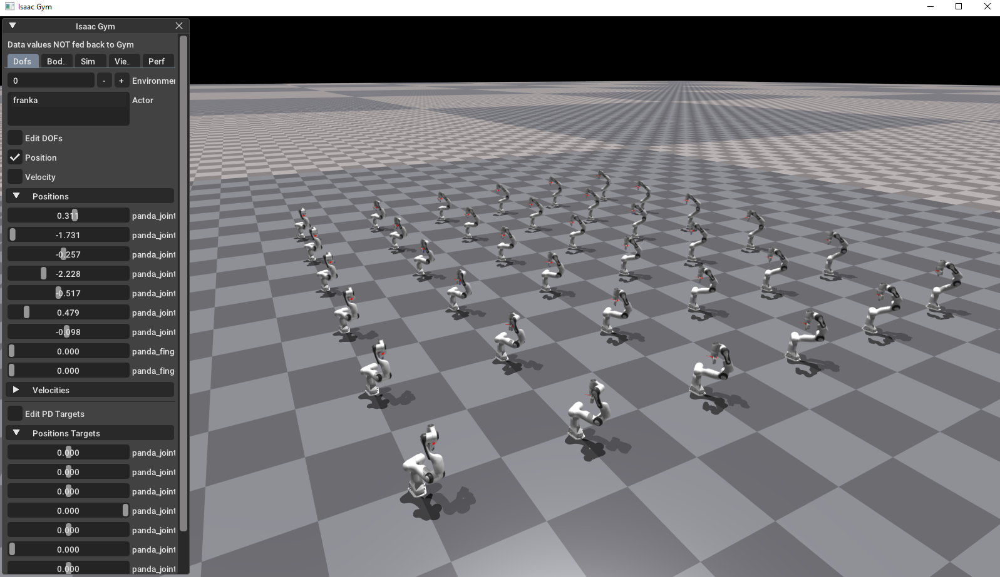


#### Isaac Gym Graphics Example (graphics.py)

- 演示了Isaac Gym的几种图形操作的使用
  - Load Textures / Create Textures from Buffer
  - Apply Textures to rigid bodies
  - Create Camera Sensors: At a static location, Attached to a rigid body
  - Retrieve different types of camera images

```bash
python graphics.py
```


#### DOF Controls (dof_controls.py)

- 控制DOF的各种方法

  - 从 URDF 加载一个 cartpole 资产。
  - 该资产被实例化到多个环境中，每个环境使用不同的控制模式。
  - 演示 DOF 属性和驱动模式的使用，包括位置、速度和力度控制。

  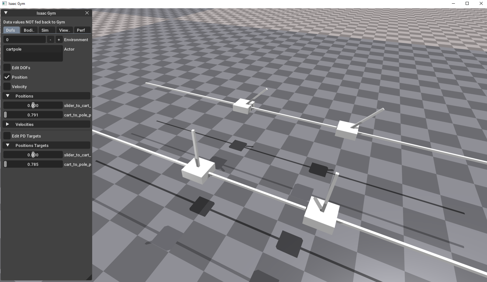


#### Joint Monkey (joint_monkey.py)

- 本例动画演示了给定资产的自由度范围。它演示了 DOF 属性和状态的用法。它还演示了可视化 DOF 框架（原点和轴）的线条绘制工具
  - `--asset_id n` selects an asset (valid range is 0 to 7)
  - `--speed_scale s` multiplier for animation speed, defaults to 1.0
  - `--show_axis` enables visualization of the currently animated DOF frame

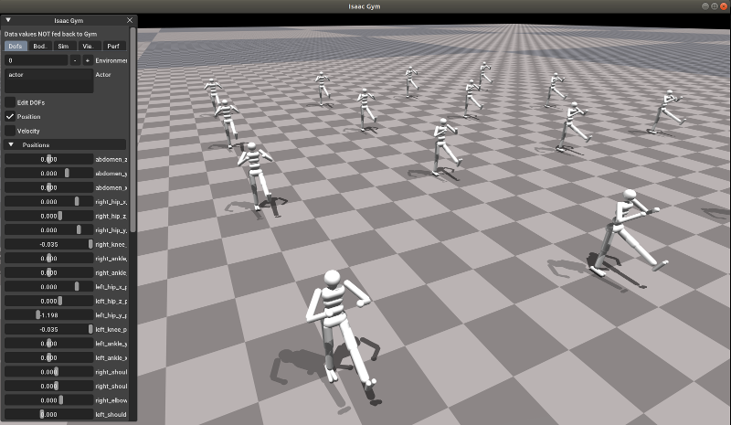


#### Gym Math API (maths.py)

Examples of math operations available in the Gym API and conversion to numpy data types


#### Soft Body (soft_body.py)

This example shows soft-body simulation with Flex backend. URDF soft body model is loaded into simulation, and stress levels are visualized. Note: only `--flex` is supported for this example. PhysX support for soft bodies will be added in upcoming releases.

```
python soft_body.py --flex
```

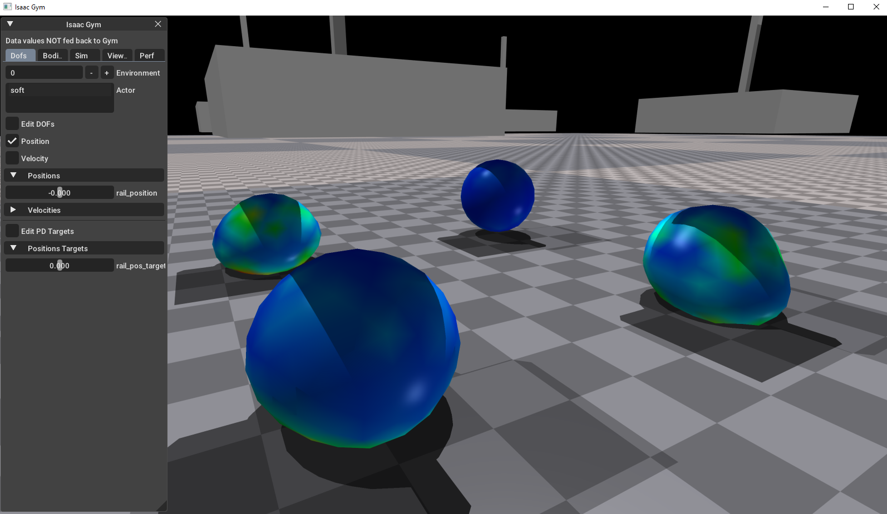


#### Visualize Transforms (transforms.py)

- This example demonstrates how to draw transforms on specific locations on an actor. Transforms for the handles on a cabinet are visualized using wireframe geometry helpers, these helpers are dynamically updates as the doors and drawers of the cabinet move.

- 通过修改actor的目标，可以观察到对应的transform随着关节改变

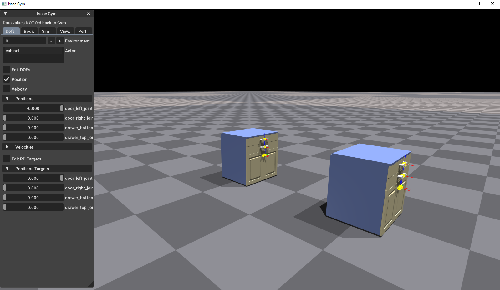


#### Projectiles (projectiles.py)

- 该示例展示了如何生成和移动资产、如何进行碰撞过滤以及如何使用查看器与物理模拟进行交互。
  - `space` key can be used to shoot projectiles
  - `R` key can be used to reset simulation

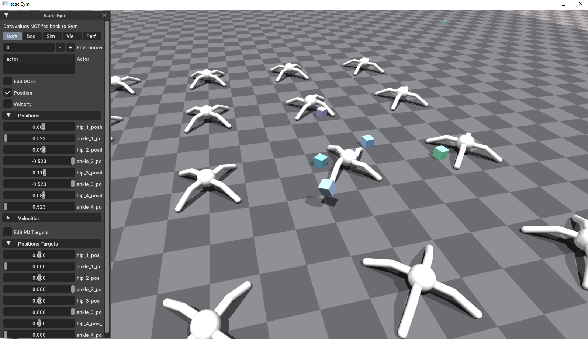


#### Large mass ratio test (large_mass_ratio.py)

- 一个测试稳定性和性能的例子，模拟堆叠质量比很大的箱子。
  - Stack of boxes when every next box has density and mass 10 times larger than the previous one. The default example.
  - `--inverted_pyramid_test` boxes have the same density, but the every next is 2 larger, and 8 times heavier than the previous one.
  - `--num_envs` sets number of environments to simulate
  - `--num_threads` sets number of threads PhysX uses for simulation


#### Kuka bin example (kuka_bin.py)

An example showing Kuka robot with Allegro Hand and a bin with multiple objects in it. 只是用于测试仿真的性能，没有RL或IML

- `--num_envs` sets number of environments to simulate
- `--num_threads` sets number of threads PhysX uses for simulation
- `--num_objects` sets number of objects in the bin
- `--object_type` sets type of objects in the bin, 0 - box, 1 - meat can, 2 - banana, 3 - mug, 4 - brick, 5 - random


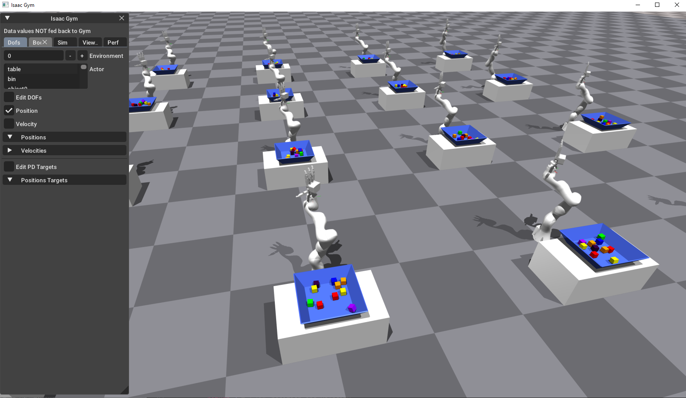


#### PyTorch Interop (interop_torch.py)

An example of sharing Isaac Gym tensors with PyTorch. Illustrates how to directly access GPU camera sensors and physics state tensors using PyTorch.

- Press `P` to print the rigid body states.
- Press `C` to write the camera sensor images to disk.


#### Franka IK Picking (franka_cube_ik_osc.py)

An example of using the Jacobian tensors for inverse kinematics and picking. Use Jacobian matrix and inverse kinematics control of Franka robot to pick up a box.

这个演示用了两种方法来实现IK

- 第一种通过雅克比矩阵
- 第二种OSC（Operational Space Control）方法
  - 加入了零空间运动的控制，可以保持机械臂末端的方向不变

```bash
# IK
# 末端方向在运动时会变化
python franka_cube_ik_osc.py --pipeline=gpu

# OSC
# 末端方向在运动时尽量保持不变
python franka_cube_ik_osc.py --pipeline=gpu --controller=osc
```


#### Franka Operational Space Control (franka_osc.py)

An example of using the Jacobian and mass matrix tensors for Operational Space Control. The end effector position and orientation can be controlled independently. By default, only the position will be animated, producing a circular motion of the end effector.

This example is only supported in the PhysX backend at the moment.

Command line arguments:

- `--pos_control <boolvalue>` whether to animate the position (on by default).
- `--orn_control <boolvalue>` whether to animate the orientation (off by default).
- `--pipeline=cpu` This example only works with the CPU pipeline, because mass matrices are not supported on GPU yet.

```bash
# 没有移动
python franka_osc.py --pos_control 0 --orn_control 0 --num_envs 4 --pipeline=cpu

# 平移，不旋转
python franka_osc.py --pos_control 1 --orn_control 0 --num_envs 4 --pipeline=cpu

# 旋转，不平移
python franka_osc.py --pos_control 0 --orn_control 1 --num_envs 4 --pipeline=cpu

#  旋转+平移
python franka_osc.py --pos_control 1 --orn_control 1 --num_envs 4 --pipeline=cpu
```


#### Apply Forces (apply_forces.py)

This example shows how to apply forces and torques to **rigid bodies** using the tensor API.

Note that the GPU tensor pipeline is currently only available with PhysX.


#### Apply Forces at Positions (apply_forces_at_pos.py)

This example shows how to apply forces to rigid bodies **at given positions** using the tensor API.

Note that the GPU tensor pipeline is currently only available with PhysX.


#### Multiple Cameras (multiple_camera_envs.py)

An example of using multiple cameras per environment for multiple environments. Two camera sensors are created for each environment. View matrix for each camera is printed out to std out.

```bash
python multiple_camera_envs.py --save_images
```


#### Graphics Up-Axis (test_graphics_up.py)

This example demonstrates the ability to change the up axis used in Isaac Gym. The default option is to set Y as up axis. Using `gymapi.UpAxis.UP_AXIS_Z`, we can change orientation such that Z is up for both the Viewer and camera sensors.

- 默认的环境坐标系，Y朝上

  ```bash
  python test_graphics_up.py
  ```

  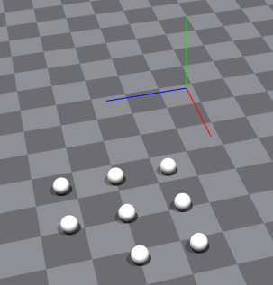

- 通过设置 gymapi.UpAxis.UP_AXIS_Z 后，Z朝上

  ```bash
  python test_graphics_up.py --up_axis_z
  ```

  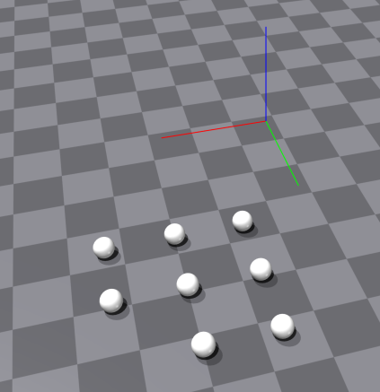

  

#### Graphics Materials Example (graphics_materials.py)

This example demonstrates the usage of different mesh loading asset options. The two columns demonstrate the asset option use_mesh_materials. This option is used to override the materials specified in the asset file with materials retrieved from the meshes. The Spam container also demonstrates the asset option to override normals loaded from the mesh with vertex normals computed by Gym.

- Loads a handful of MJCF and URDF assets using assimp to load their meshes

- Demonstrates the usage of `use_mesh_materials` to override materials specified in asset files with mesh textures/materials

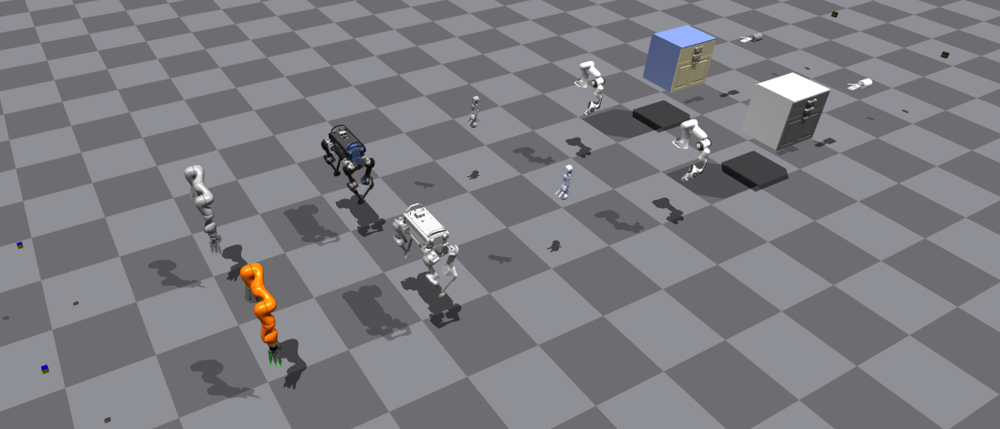

#### Actor Scaling (actor_scaling.py)

This example demonstrates the runtime scaling API for actors. Several assets are loaded and `num_columns` actors are created per asset, each with a increasing scale factor applied to them between `min_scale` and `max_scale`.

- `--num_columns` sets the number of columns of actors (i.e. the number of actors created per asset).
- `--min_scale` sets the scale applied to the left-most actor in each row.
- `--max_scale` sets the scale applied to the right-most actor in each row.

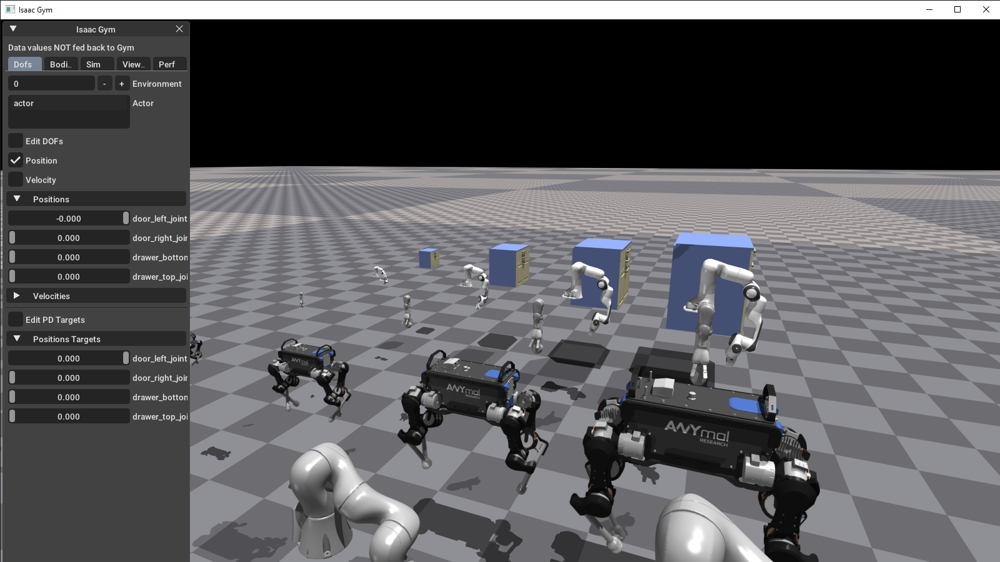


#### Terrain Creation (terrain_creation.py)

This example demonstrates the terrain creation API and tools to create different types of terrain. Different heightfield terrain types are generated using: `random_uniform_terrain()`, `sloped_terrain()`, `pyramid_sloped_terrain()`, `discrete_obstacles_terrain()`, `wave_terrain()`, `stairs_terrain()`, `pyramid_stairs_terrain()`, and `stepping_stones_terrain()`. They are then converted to a triangle mesh using `convert_heightfield_to_trimesh()` and added to the simulation with `gym.add_triangle_mesh()`.

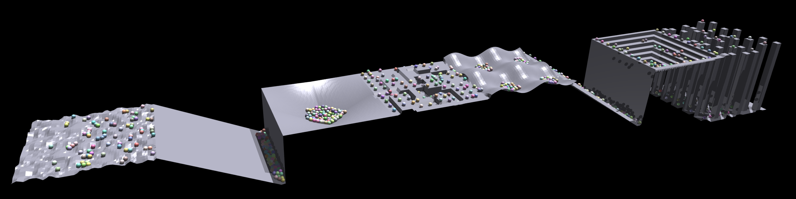


#### Spherical Joint (spherical_joint.py)

This example demonstrates the support of spherical joints in URDF file and how to control an articulated cuboid with 6 DOF, 3 prismatic + 1 spherical to reach a changing goal orientation (indicated by the axis geometry).

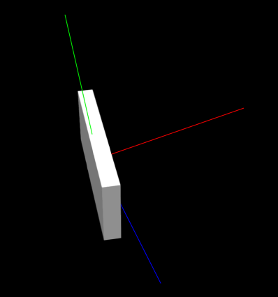


## IsaacGymEnvs

- example RL environments for the NVIDIA Isaac Gym

- clone github: https://github.com/isaac-sim/IsaacGymEnvs

  ```shell
  
  # Once Isaac Gym is installed and samples work within your current python environment, install this repo:
  conda activate isaac_gym
  cd IsaacGymEnvs
  pip install -e .
  ```

- example

  ```shell
  # train cartpole
  python train.py task=Cartpole
  
  # train ant locomotion
  # use the `v` key to disable view
  python train.py task=Ant
  
  # train without viewer
  python train.py task=Ant headless=True
  
  # load trained models and continue training
  python train.py task=Ant checkpoint=runs/Ant/nn/Ant.pth
  
  # load trained models and without training
  # less envs to avoid rendering overhead
  python train.py task=Ant checkpoint=runs/Ant/nn/Ant.pth test=True num_envs=64
  
  ```
  
  

- docs