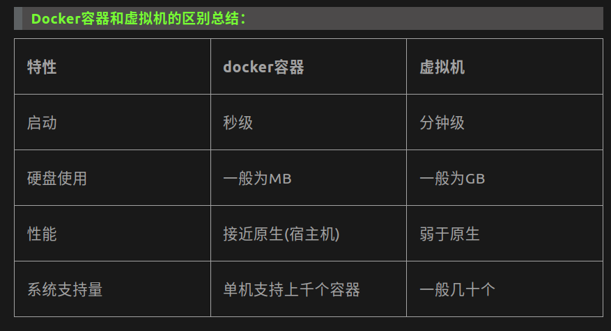

##### Docker 安装

- Install

  ```shell
  sudo apt-get install docker-ce docker-ce-cli containerd.io
  ```

- run hello-world

  ```shell
  docker run hello-world
  ```

- 无法自动获取hello-world

  ```shell
  # 添加阿里云源
  sudo gedit /etc/docker/daemon.json
  
  { 
  "registry-mirrors": ["https://alzgoonw.mirror.aliyuncs.com"] 
  }
  ```

  

##### Docker 概念

- Image 镜像
  - 操作系统分为内核和用户空间。对于Linux而言，内核启动后，会挂载root文件系统为其提供用户空间支持。而Docker镜像（Image），就相当于是一个root文件系统。Docker镜像是一个特殊的文件系统，除了提供容器运行时所需的程序、库、资源、配置等文件外，还包含了一些为运行时准备的一些配置参数（如匿名卷、环境变量、用户等）。镜像不包含任何动态数据，其内容在构建之后也不会被改变。
- Container 容器
  - 容器就像是一台台运行起来的虚拟机，里面运行了你的应用程序，每个容器是独立运行的他们相互之间不影响。通过一个镜像，我们可以创建许多个不同的Container容器。
  - 镜像（Image）和容器（Container）的关系，就像是面向对象程序设计中的类和类的实例一样，镜像是静态的定义，容器是镜像运行时的实体。容器可以被创建、启动、停止、删除、暂停等 。容器的实质是进程，但与直接在宿主执行的进程不同，容器进程运行于属于自己的独立的命名空间。前面讲过镜像使用的是分层存储，容器也是如此。容器存储层的生存周期和容器一样，容器消亡时，容器存储层也随之消亡。因此，任何保存于容器存储层的信息都会随容器删除而丢失。
- Repository 仓库
  - 镜像构建完成后，可以很容易的在当前宿主上运行，但是， 如果需要在其它服务器上使用这个镜像，我们就需要一个集中的存储、分发镜像的服务（就像Git仓库一样），Docker Registry就是这样的服务。
  - 一个Docker Registry中可以包含多个仓库（Repository），每个仓库可以包含多个标签（Tag），每个标签对应一个镜像。所以说：镜像仓库是Docker用来集中存放镜像文件的地方类似于我们之前常用的代码仓库。通常，一个仓库会包含同一个软件不同版本的镜像，而标签就常用于对应该软件的各个版本 。我们可以通过<仓库名>:<标签>的格式来指定具体是这个软件哪个版本的镜像。如果不给出标签，将以latest作为默认标签。


