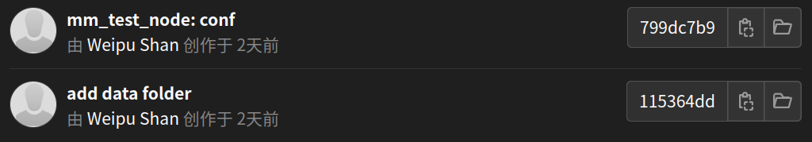
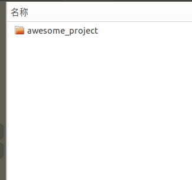

# Git Tricks

## Git 介绍

### Git 是什么

-   Git 是目前世界上最先进的分布式代码版本控制系统

-   Git 由 Linux 之父 Linus Torvalds 于2005年为了帮助Linux内核代码管理而创造，第一个可用版本仅花了10天时间

    -   起因是另一个商用的代码版本控制软件BitKeeper由于被Linux社区的大佬尝试破解而终止了与Linux的合作
    
-   Git 这个单词的意思是蠢货

    -   Linus 对此的解释: 
        -   I'm an egotistical bastard, and I name all my projects after myself. First 'Linux', now 'Git'.
        -   我是个任性的杂种，我把所有我做的项目以我自己命名。先是'Linux'，这次是'Git'.
    -   类似乔布斯的 "Stay hungry. Stay foolish."
    
-   Github是一个著名的基于Git的代码托管网站，可以理解为代码专用云盘，几乎所有的著名开源项目都在Github上进行代码托管、版本管理、问题提交、Bug修复等，比如：

    -   Linux -  著名的开源操作系统，Ubuntu、Debian、麒麟、安卓都可以看成是Linux的分支
    -   PyTorch - 著名的深度学习库
    -   OpenCV - 著名的图像处理库
    -   PCL - 著名的点云处理库
    -   ROS - 著名的机器人操作系统
    -   eCAL - 我们公司目前使用的消息中间件 
    -   ...

-   Git (分布式)  VS  SVN (集中式)

    | Git (分布式)                 | SVN (集中式)             |
    | ---------------------------- | ------------------------ |
    | 分布式，支持离线操作         | 集中式，需要联网操作     |
    | Git 命令与概念复杂，上手困难 | SVN 上手相对容易         |
    | Git 对分支的支持更完善       | SVN 对分支的支持比较简陋 |

    

-   Git 学习相关资源
    -   [Git官网](https://git-scm.com/)
    -   [廖雪峰Git教程](https://www.liaoxuefeng.com/wiki/896043488029600)
    -   [看完这篇还不会用Git，那我就哭了！](https://zhuanlan.zhihu.com/p/94008510)
    -   [通过游戏理解Git](https://zhuanlan.zhihu.com/p/585785943)
    


-   Git VSCode 插件

    -   Git Graph: 一个可视化Git分支的工具 

        


### Git 能做什么

-   分布式代码托管
    -   本地库
        -   工作笔记本 Ubuntu 系统
        -   第二台工作笔记本 Windows 系统
        -   TX2 测试平台 Ubuntu Arm版
        -   Xavier 测试平台 Ubuntu Arm版 
        -   ...
    -   远程库
        -   Gitlab
        -   Github
        -   Gitee
        -   ...
    -   防止代码遗失、电脑损坏
    
-   代码历史记录
    -   增量式代码修改记录
        -   每一行的代码修改对于Git来说就是一次旧代码的删除操作与新代码的增加操作
        -   删除操作与增加操作都会保存在 Git 仓库中
        -   
    -   每一次提交分配一个 Commit ID
        -   
    -   查阅历史提交记录
    -   回滚历史记录
    
-   代码分支管理
    -   创建分支
        -   master: 项目主分支
        
        -   hotfixes: 项目重大紧急Bug修复分支
        
        -   release: 小版本更新分支
        
        -   develop: 开发分支
        
        -   feature: 功能开发分支 
        
        -   ...
        
            
        
    -   管理分支
        -   新建分支
            -   在分支中开发功能，避免产生冲突
        
        -   合并分支
            -   将开发好的分支合并入项目主分支，合并新功能
        -   删除分支
        -   例子：ROS 在 Github 页面中的分支，针对不同Ubuntu版本
        
        
    
-   多人协作
    -   代码权限管理，小组中不同的开发者有不同的权限
        
        
    -   代码审核
    
        -   开发者提交代码后，项目负责人审核代码质量，并将功能分支合并到主分支中
    -   不同功能同时开发
    
        -   针对同一份代码中不同的功能模块，可以通过分支进行分别的开发，并最终合并到主分支
    -   冲突解决（应该尽量避免这种情况）
    
        -   不同开发者对同一分支下同一文件进行了修改后，提供冲突解决方案


-   Git 使用前后对比

    -   用 Git 之前

        -   混乱的不同版本文件夹

        -   多个开发者需要对同一份代码进行修改

        -   修改代码后想要回到之前版本非常困难

        -   没有时间序列上的版本控制
    
        
    
    -   用 Git 之后
    
        -   干净的文件夹
        -   每个开发者可以在自己的分支上进行开发，之后统一合并功能
        -   通过提交记录轻松找到每次提交的代码记录
    
        
        
        


-   一个典型的Git项目可能包含的内容
    -   src
        -   源代码
    -   docs
        -   与项目相关的文档
    -   3rdparty
        -   本项目所需第三方依赖的库文件，安装方式，Git子模块等
    -   config
        -   项目相关的配置文件
    -   README.md
        -   Markdown格式的项目说明文档，会显示在 Github/Gitlab 项目页面
    -   .gitignore
        -   git 项目过滤配置文件
-   Git 仓库中不应该加入的内容（通过 .gitignore 过滤）
    -   代码编译生成的内容 （不同环境平台编译出的内容不一样）
        -   可执行程序
        -   build 文件夹
        -   devel 文件夹
        -   bin 文件夹
    -   开发者个人编辑器生成的配置文件 （每个开发者有自己的开发工具与配置环境）
        -   .vscode/
        -   .idea/
        -   .user
    -   数据集（体积过大，而且有专门的数据集版本管理软件）
    -   深度学习模型 （体积过大，而且有专门的深度学习模型管理软件）
    -   原则上，能自动生成的，体积太大的，与代码关系不大的，以及不是项目中大家都可能需要的内容，就应该过滤，加入到 .gitignore 文件中


## Git 安装

-   Linux

    -   通过终端命令行输入

        ```bash
        sudo apt-get install git
        ```

-   Mac

    -   通过终端命令行输入
    
        ```bash
        brew install git
        ```
    
-   Windows

    -   [Git 官方 Windows  下载页面](https://git-scm.com/download/win)
    
    -   Windows版的Git安装包附带一个 git bash 工具，类似 Linux 下的终端命令行工具
    
    -   在想要进行Git管理的文件夹下右键：
    
        
    
    -   Git Bash 的界面非常类似 Linux 的终端，也支持 ls cd mv cp rm 等常用 Linux 命令
    
        


## Git 仓库说明


-   远程库 remote repository 
    -   同一个软件项目一般只有一个远程库，比如在gitlab/github上保存的库

-   本地库 local repository 
    -   同一个软件项目可以有多个本地库
        -   场景1：笔记本上进行开发，之后在TX2上测试与修改
        -   场景2：同一个软件项目不同的开发人员在各自的电脑里进行开发，然后统一提交到一个远程库
    
-   本地库包括
    -   工作区 workspace
        -   当前对代码进行的修改会出现在工作区
        -   此时通过 git status 查看，会**显示**修改的文件名

    -   暂存区 Index/Stage
        -   将当前的修改通过 git add 可以**添加**到本地的暂存区
        -   此时通过 git status 查看，会显示添加到暂存区的文件名

    -   本地库 local repository

        -   通过 git commit 可以将当前在暂存区的修改正式**提交**到本地库
        
        -   此时通过 git status 查看，不会再显示修改的文件名，因为修改的文件已经提交到本地库
        
            ```bash
            ➜  TransportRobot_common git:(master) git status          
            位于分支 master
            您的分支领先 'origin/master' 共 1 个提交。
              （使用 "git push" 来发布您的本地提交）
            
            无文件要提交，干净的工作区
            ```
        
        -   通过 git push 可以将本地库的提交**推送**到远程库，此时通过 git status 查看，可以发现当前分支与远程库的分支一致
        
            ```bash
            ➜  TransportRobot_common git:(master) git status
            位于分支 master
            您的分支与上游分支 'origin/master' 一致。
            
            无文件要提交，干净的工作区
            ```
        
        -   通过 git pull 可以将远程库的更新**拉取**到本地库
        
        -   git pull = git fetch + git merge
        
            -   git fetch 表示将远程库同步到本地的远程库镜像
                -   git fetch 不会影响此时本地库的工作区
            -   git merge 表示将本地的远程库镜像与本地库合并
                -   有冲突时需要手动解决冲突
        
            


## Git 基础操作流程

### 1 项目文件夹中添加 .gitignore 文件

-   .gitignore 可以帮助 git 过滤不需要加入到 git 仓库的内容

-   原则上git仓库中只允许储存代码以及相关说明文件或第三方库文件，体积大于1MB的文件请谨慎添加到git仓库，不建议上传到git仓库的内容比如：

    -   编译产生的文件与可执行程序
        -   build 文件夹
        -   bin 文件夹
        -   ROS 的 devel 文件夹
    -   个人IDE的配置文件夹
        -   .vscode/
        -   .idea/
    -   深度学习模型
    -   数据集
    -   代码运行时自动生成的数据
    
-   一个可以自动生成 .gitignore 的网站，可以参考

    -   https://www.toptal.com/developers/gitignore

-   例子：采摘机器人ROS工程中的 .gitignore 内容

    ```bash
    # model related
    *.engine
    *.pth
    *.trt
    *.onnx
    
    # ros related
    devel/
    logs/
    build/
    bin/
    msg_gen/
    srv_gen/
    build_isolated/
    devel_isolated/
    
    # backup file
    *.bak
    
    # Generated by dynamic reconfigure
    *.cfgc
    /cfg/cpp/
    /cfg/*.py
    
    # Ignore generated docs
    *.dox
    *.wikidoc
    
    # vscode stuff
    .vscode
    
    # eclipse stuff
    .project
    .cproject
    
    ### QT related
    *.user
    *.user.*
    ```
    


### 2 上传代码到gitlab/github/gitee

-   新建空白仓库

    

    

-   **注意取消勾选自述文件初始化仓库 (不然Gitlab 不会提示你接下去干什么)**

    

    

-   gitlab 页面会提示你接下来的操作。 

    -   **注意**：在多人共用的测试平台比如TX2等，建议将全局设置 --global 改为局部设置 --local，这样可以将设置保留在该仓库内部，不影响同一台电脑其他人的repo设置
    
    
    


### 3 克隆远程库到本地

```bash
# 方法1：通过http链接克隆
# 缺点：每次提交或拉取需要输入账号密码
git clone [http_link]

# 方法2：通过ssh链接克隆
# 需要事先将电脑的 ssh key 设置到gitlab账号中
# ssh-keygen -t rsa -C [email@adress]
# 优点：无需输入账号密码，方便提交，但注意不要在公共平台中使用，否则任何人都有可能修改你的代码并提交到你的gitlab仓库中
git clone [ssh_link]
```


### 4 本地库更新并提交到远程库

```bash
# 将工作区所有修改添加到暂存区
git add .

# 将暂存区的内容提交到本地库
# 提交时需要简短地说明本次提交的意义
# 不要每次都是"update" 或者"fix bug"，最少也要说明这次update了什么文件，修复了什么bug
# 建议commit_msg的格式：
# 	feat: 增加了什么新功能
# 	fix: 修复了什么bug
# 	docs: 改动了什么文档
# 	style: 修改了代码的格式，如注释，缩进，空格，空白行等
# 	build: 构建工具相关的改动
# 	refactor: 重构了哪些部分的代码
# 	test: 测试了什么内容，造成了此次代码修改
# 	perf: 提高性能方面的改动
# 	other: 其他内容的改动
git commit -m "commit_msg"

# 将本地库推送到远程库
git push
```

适用场景：

-   笔记本开发完代码上传到gitlab
-   测试平台比如TX2测试后有代码修改，将修改的内容上传到gitlab


### 5 远程库的修改拉取到本地库

```bash
# 方法1（常用）：通过 git pull 将远程库的更新内容直接同步到本地库
# 建议养成良好习惯，每次要在本地库修改代码前，先确认是否与远程库同步
# 如果远程库有未同步的代码，那么本地库修改了同一个代码文件后，想要上传就会引发冲突，需要手动解决
git pull


# 方法2（不常用）：通过 git fetch + git merge 的方式
# git fetch 将远程库同步到本地的一个远程库镜像中，不会影响本地库
git fetch
# git merge 会将远程库的内容与本地库合并，如果有冲突文件，则需要手动修改冲突后提交上传
git merge

```


### 6 修改冲突的流程

-   如果远程库和本地库对同一份文件有修改，就会产生冲突，导致无法将本地库的修改推送到远程库，比如笔记本上修改了代码，并推送到了gitlab，然后去TX2上调试时忘记将远程库的更新拉取到本地，这时候TX2上调试后修改的代码更新就无法推送到远程库

    

-   此时通过 git pull 先拉取远程库的更新到本地库，这时冲突的文件会保留冲突的部分等待用户解决

    

-   通过查看提示我们可以发现 test.txt 出现冲突，打开该文件

    

-   手动编辑该文件，随后重新 git commit +  git push 即可解决冲突并同步到远程库


### 7 放弃本地的代码修改

-   有时候测试平台测试后，我们并不希望保存此时的代码修改，而是希望保持本地库原来的状态，可以使用 git stash + git stash clear 的方式放弃此次修改

    ```bash
    # 将当前的代码修改放入隔离区
    git stash
    
    # 清空隔离区
    git stash clear
    ```


### 8 分支管理

-   查看所有分支

    ```bash
    # 该命令会显示本地与远程库的所有分支
    # 远程库的分支带有origin的前缀
    # 当前分支前面会有*号
    git branch -a
    ```

    

-   新建分支

    ```bash
    git branch [branch_name]
    ```

-   切换到分支

    ```bash
    # 注意：切换分支前务必将当前分支工作区的内容提交到本地库
    
    # 方法1：通过 checkout 切换分支，checkout还可以切换历史提交记录
    git checkout [branch_name]
    
    # 方法2：通过 switch 切换分支
    git switch [branch_name]
    ```

-   新建并直接切换到分支

    ```bash
    git checkout -b [branch_name]
    ```

-   上传分支到远程库

    ```bash
    # 先确保切换到想要上传的分支
    git checkout [branch_name]
    
    # 修改代码，将代码提交到当前的分支
    git add .
    git commit -m "commit_msg"
    
    # 情况1：远程库还没有当前分支：push时需要设置远程分支，建议分支名称与本地一致
    git push --set-upstream origin [branch_name]
    
    # 情况2：远程库已有当前分支：直接push
    git push
    ```

-   合并分支 （建议通过gitlab中的merge request按钮，不建议直接合并）

    ```bash
    # 比如要把dev分支的内容合并到主分支
    # 首先切换到主分支
    git checkout main
    
    # 合并dev分支所有提交记录到main分支
    git merge dev
    
    # 将main分支合并后的结果push到远程库
    git push
    ```
    
-   合并分支的部分文件

    ```bash
    # 合并其他分支中的部分文件到当前分支
    git checkout [branch_name] [file_name]
    ```

-   删除分支

    ```bash
    # 删除本地已经完全合并的分支
    git branch -d [branch_name]
    
    # 强制删除本地分支，即使没有合并
    git branch -D [branch_name]
    
    # 删除远程分支
    git push origin -d [branch_name]
    
    # 当远程库中的分支被删除后，通过 git branch -a 仍然能在本地发现远程库的被删除分支
    # 此时可以通过以下命令清除在本地的远程库镜像中的被删除分支
    git remote prune origin
    ```


### 9 功能分支的变基操作

-   Git rebase 操作方法

    ```bash
    # git rebase 一般用于功能分支开发完成后，拉取主分支的变化，适应主分支
    # 假设目前处于功能分支 feat_a 中，需要合并主分支 main 或者 master
    git rebase [main/master]
    ```

-   git merge vs git rebase

    -   git merge 
        -   merge 表示合并，合并两个分支的不同之处
        -   merge 用来将功能分支合并到主分支
        -   merge 会保留分支的提交记录的时间节点
    -   git rebase 
        -   reabse 表示变基，改变当前分支的基础
        -   rebase 用来帮助功能分支获取主分支的变化
        -   rebase 会将分支的提交记录移到主分支的最新更新之后，既改变分支提交记录的时间节点

-   建议使用方法：

    1.  开启一个功能分支
    2.  开发功能分支
    3.  功能分支开发完毕，通过 git rebase 将功能分支的所有commit移到最新的主分支之后
    4.  修复功能分支rebase之后的问题
        -   git rebase master 之后，如果有冲突，会暂停rebase，提示修改有冲突的文件
        -   解决冲突文件后，通过git add [file_name] 添加修改内容
        -   无需commit， 直接 git rebase --continue 继续 rebase 的过程
    5.  功能分支提交 merge request
    6.  主分支审核 功能分支提交的 merge request，完成合并，理论上这样的合并不会再出现冲突。
    
    


## Git 最简工作流程

### 单人项目

-   克隆远程库到本地电脑
    
    ```bash
    git clone [http-link / ssh-link]
    ```
    
-   本地库获取gitlab最新的代码
    
    ```bash
    # 拉取远程库的更新
    git pull
    ```
    
-   本地库上传到远程库
    
    ```bash
    # 添加修改的文件到暂存区
    git add .
    
    # 将暂存区的内容提交到本地库
    # 注意提交消息尽量简短但有辨识度
    git commit -m "commit msg"
    
    # 将本地库推送到远程库
    git push
    ```
    
-   放弃本地库此次代码修改
    
    ```bash
    # 添加修改到暂存区
    git add .
    
    # 将暂存区中的内容移到隔离区
    git stash
    
    # 清空隔离区
    git stash clear
    ```


### 多人协作项目

1.  开启一个功能分支

    ```bash
    # 分支建议命名规则：
    # 	feat_XXX：功能分支
    # 	bugfix_xxx：Bug修复分支
    # 	docs_xxx: 文档更新分支
    # 	test_xxx: 测试相关分支
    git checkout -b [branch_name]
    ```

2.  开发功能分支，在功能分支提交

    ```bash
    # 首先确认是否在功能分支下
    git add .
    git commit -m "commit msg" # 注意提交消息尽量简短但有辨识度
    git push
    ```

3.  功能分支开发完毕，通过 git rebase 将功能分支的所有commit移到最新的主分支之后

    ```bash
    # 转到主分支main，拉取主分支最新更新
    git checkout main
    git pull
    
    # 转到功能分支下
    git checkout [branch_name]
    # 确认已提交所有功能分支的修改
    # 将功能分支变基到主分支的最新状态
    git rebase main
    ```

4.  修复功能分支rebase之后的问题与冲突，确保功能完善

5.  功能分支在 gitlab 页面提交 merge request

6.  主分支审核 功能分支提交的 merge request，完成合并

    -   理论上这样可以做到无冲突合并


## Git 操作笔记 （查询使用）

### Git 使用原则

-   初始化仓库请使用 .gitignore 过滤不必要的文件
    -   代码自动生成的内容如 build bin cfg 等文件夹
    -   数据库，深度学习推理模型等大尺寸的文件
    -   个人IDE自动生成的配置文件等
-   提交时请使用简短但有辨识度的 commit_msg，建议commit_msg的格式：
    -   feat: 增加了什么新功能
    -   fix: 修复了什么bug
    -   docs: 改动了什么文档
    -   style: 修改了代码的格式，如注释，缩进，空格，空白行等
    -   build: 构建工具相关的改动
    -   refactor: 重构了哪些部分的代码
    -   test: 测试了什么内容，造成了此次代码修改
    -   perf: 提高性能方面的改动
    -   other: 其他内容的改动
-   碰到不熟悉的git命令，尽量先单独测试，避免无法挽回的后果
-   多人合作时：
    -   主分支仅用来合并功能分支，不建议直接在主分支进行任何修改
    -   开发功能，修复bug都在各自的功能分支中完成，随后提交合并请求
        -   功能分支开发完成后需要通过 git rebase 去适应主分支的最新变化，随后提交合并请求（merge request），如此可以做到无冲突合并
    -   主分支合并功能分支，原则上应该无冲突合并（conflict-free merge）


### Git 帮助

```bash
# git 一般命令的帮助
git -h

# git 具体命令的帮助
git clone -h
git init -h
git add -h
git commit -h
git branch -h
git merge -h
git fetch -h
...
```


### Git 设置相关操作

-   生成 ssh key, 通过ssh克隆项目到本地，之后每次提交或拉取都不需要输入账号密码，**建议只在自己的电脑这样操作**

    ```bash
    # 生成ssh key
    cd ~
    rm -r .ssh/
    ssh-keygen -t rsa -C shanweipu@aiforcetech.com 
    
    # 显示ssh key, 复制到gitlab或github的设置页面中
    cd .ssh
    cat id_rsa.pub
    ```

-   设置全局的user.name，user.email

    ```bash
    git config --global user.name "Weipu Shan"
    git config --global user.email "shanweipu@aiforcetech.com"
    ```
    
-   设置每个仓库单独的user.name, user.email 

    ```bash
    # cd to a git repo
    # set git repo local config
    git config --local user.name "Weipu Shan"
    git config --local user.email "shanweipu@aiforcetech.com
    ```

-   修改git默认编辑器（git 原生配置的 nana 编辑器特别难用），常用来合并与解决冲突

    ```bash
    # open ~/.gitconfig
    gedit ～/.gitconfig
    
    # put following line in file
    [core]
    editor = gedit	
    ```

- 设置 VPN 端口

  ```shell
  # 命令中的主机号（127.0.0.1）是使用的代理的主机号(自己电脑有vpn那么本机可看做访问github的代理主机)，即填入127.0.0.1即可，否则填入代理主机 ip(就是网上找的那个ip)
  # 命令中的端口号（7890）为代理软件(代理软件不显示端口的话，就去Windows中的代理服务器设置中查看)或代理主机的监听IP，可以从代理服务器配置中获得，否则填入网上找的那个端口port
  
  # socket5
  git config --global http.proxy socks5 127.0.0.1:7890
  git config --global https.proxy socks5 127.0.0.1:7890
  
  # http
  git config --global http.proxy 127.0.0.1:7890
  git config --global https.proxy 127.0.0.1:7890
  
  
  ```

  


### Git 查看状态与历史记录相关操作

-   查看工作区，暂存区状态, 按 q 退出

    ```bash
    git status
    ```

-   查看git 历史记录 可以获取每一次commit的版本号，按 q 退出

    ```bash
    git log
    ```

-   查看某一次commit的具体内容

    ```bash
    git show [commit-ID]
    ```

-   查看某次文件在工作区中的修改

    ```bash
    git diff [file path]
    ```

    

### Git 提交与拉取相关操作

-   将修改添加到暂存区

    ```bash
    # 添加一个文件到暂存区
    git add [file_name]
    
    # 添加全部修改的文件到暂存区
    git add .
    ```

-   删除暂存区的文件

    ```bash
    # 删除暂存区文件，但保留文件在工作区
    git rm --cached [file_name]
    
    # 删除暂存区以及工作区的该文件
    git rm [file_name]
    ```

-   提交暂存区的文件到本地库

    ```bash
    # 提交时需要简短地说明本次提交的意义
    # 不要每次都是"update" 或者"fix bug"，最少也要说明这次update了什么文件，修复了什么bug
    # 建议commit_msg的格式：
    # 	feat: 增加了什么新功能
    # 	fix: 修复了什么bug
    # 	docs: 改动了什么文档
    # 	style: 修改了代码的格式，如注释，缩进，空格，空白行等
    # 	build: 构建工具相关的改动
    # 	refactor: 重构了哪些部分的代码
    # 	test: 测试了什么内容，造成了此次代码修改
    # 	perf: 提高性能方面的改动
    # 	other: 其他内容的改动
    git commit -m "commit_msg"
    ```

-   推送本地库到云端库

    ```bash
    git push
    ```

-   拉取远程库到本地

    ```bash
    # 方法1：直接更新本地库的当前分支
    git pull
    
    # 方法2：分开操作拉取与合并当前分支
    # 拉取远程库到本地的镜像
    git fetch
    # 更新本地库当前分支
    git merge
    ```


### Git stash - 隔离区相关操作

-   将当前修改的操作放入隔离区

    ```bash
    git stash
    ```

-   清空隔离区
    
    ```bash
    git stash clear
    ```
    
-   弹出最近一次储存到隔离区的改动
    
    ```bash
    git stash pop
    ```


### Git branch - 分支相关操作

-   查看所有分支

    ```bash
    # 该命令会显示本地与远程库的所有分支
    # 远程库的分支带有origin的前缀
    # 当前分支前面会有*号
    git branch -a
    ```

    

-   新建分支

    ```bash
    git branch [branch_name]
    ```

-   切换到分支

    ```bash
    # 注意：切换分支前务必将当前分支工作区的内容提交到本地库
    
    # 方法1：通过 checkout 切换分支，checkout还可以切换历史提交记录
    git checkout [branch_name]
    
    # 方法2：通过 switch 切换分支
    git switch [branch_name]
    ```

-   新建并直接切换到分支

    ```bash
    git checkout -b [branch_name]
    ```

-   上传分支到远程库

    ```bash
    # 先确保切换到想要上传的分支
    git checkout [branch_name]
    
    # 修改代码，将代码提交到当前的分支
    git add .
    git commit -m "commit_msg"
    
    # 情况1：远程库还没有当前分支：push时需要设置远程分支，建议分支名称与本地一致
    git push --set-upstream origin [branch_name]
    
    # 情况2：远程库已有当前分支：直接push
    git push
    ```

-   合并分支

    -   不建议使用，需要合并功能分支建议通过gitlab页面填写合并请求
    -   **主分支合并功能分支原则上需要无冲突合并**
    -   **功能分支提交合并请求前，需要 git rebase 适应主分支的最新状态，以此达到无冲突合并的效果**

    ```bash
    # 比如要把dev分支的内容合并到主分支
    # 首先切换到主分支
    git checkout main
    
    # 合并dev分支所有提交记录到main分支
    git merge dev
    
    # 将main分支合并后的结果push到远程库
    git push
    ```

-   合并分支的部分文件

    -   不建议使用，需要合并功能分支建议通过gitlab页面填写合并请求

    -   **主分支合并功能分支原则上需要无冲突合并**

    -   **功能分支提交合并请求前，需要 git rebase 适应主分支的最新状态，以此达到无冲突合并的效果**

    ```bash
    # 合并其他分支中的部分文件到当前分支
    git checkout [branch_name] [file_name]
    ```

-   删除分支

    ```bash
    # 删除本地已经完全合并的分支
    git branch -d [branch_name]
    
    # 强制删除本地分支，即使没有合并
    git branch -D [branch_name]
    
    # 删除远程分支
    git push origin -d [branch_name]
    
    # 当远程库中的分支被删除后，通过 git branch -a 仍然能在本地发现远程库的被删除分支
    # 此时可以通过以下命令清楚在本地的远程库镜像中的被删除分支
    git remote prune origin
    ```


### Git rebase - 变基相关操作

-   Git rebase 操作方法

    ```bash
    # git rebase 一般用于功能分支开发完成后，拉取主分支的变化，适应主分支
    # 假设目前处于功能分支 feat_a 中，需要合并主分支 main 或者 master
    git rebase [main/master]
    ```

-   git merge vs git rebase

    -   git merge 
        -   merge 表示合并，合并两个分支的不同之处
        -   merge 用来将功能分支合并到主分支
        -   merge 会保留分支的提交记录的时间节点
    -   git rebase 
        -   reabse 表示变基，改变当前分支的基础
        -   rebase 主要用来帮助功能分支获取主分支的变化
        -   rebase 会将分支的提交记录移到主分支的最新更新之后，既改变分支提交记录的时间节点

-   建议使用方法：

    1.  开启一个功能分支
    2.  开发功能分支
    3.  功能分支开发完毕，通过 git rebase 将功能分支的所有commit移到最新的主分支之后
    4.  修复功能分支rebase之后的问题
        -   git rebase master 之后，如果有冲突，会暂停rebase，提示修改有冲突的文件
        -   解决冲突文件后，通过git add [file_name] 添加修改内容
        -   无需commit， 直接 git rebase --continue 继续 rebase 的过程
    5.  功能分支提交 merge request
    6.  主分支审核 功能分支提交的 merge request，完成合并，理论上这样的合并不会再出现冲突。
    
    


### Git 回退版本相关操作

-   未commit, 单纯想要取消当前代码修改
    
    ```bash
    # 先添加修改到暂存区
    git add .
    
    # 隔离当前暂存区
    git stash
    
    # 清空隔离区
    git stash clear
    ```
    
-   已commit，未push到远程库
    
    ```bash
    # 撤销commit，但保留add
    git reset --soft [commit_ID]
    
    # 撤销commit以及add
    git reset --mixed [commit_ID]
    ```
    
-   已commit，已push到远程库
    
    ```bash
    # 方法1：回退版本但保留提交记录
    # 相当于将上一次的提交记录重新放到当前提交记录前
    # commit_ID 为需要撤回的提交
    git revert [commit_ID]
    
    # 方法2：回退版本并舍弃提交记录 （不建议这种方法）
    # 需要 git push -f 强制提交删除commit后的记录
    # commit_ID 为需要恢复到的提交版本
    git reset --hard [commit_ID]
    git push -f
    ```


### Git submodule - 子模块相关操作

- 下载子模块

  ```bash
  # 克隆了之后下载子模块
  git submodule update --init --recursive
  
  # 克隆时直接更新子模块
  git clone --recurse-submodules [http/ssh link]
  ```

-   为自己的仓库加入子模块

    ```bash
    # 进入子模块需要保存的位置，比如 3rdparty 文件夹
    # 添加子模块，建议通过 httplink 添加，sshlink 在主模块通过 httplink clone 时无法更新 
    git submodule add [httplink]
    
    # 子模块一般不会在当前主模块内被修改，只起到使用的作用
    # 子模块由本身的仓库负责维护
    # 子模块更新后，在当前主模块的子模块文件夹内可以拉取更新
    git submodule update
    
    # 子模块更新后，需要在主模块中更新子模块的注册信息，更新该子模块加入到主模块时的 commit ID
    ```
    
    

### Git tag 标签相关操作

-   Git 标签的意义
    -   tag就像是一个里程碑一个标志一个点，branch是一个新的征程一条线
    -   tag是静态的，branch要向前走；
    -   稳定版本备份用tag，新功能多人开发用branch

-   操作方法

    -   创建标签

        ```bash
        # 在当前分支的当前提交记录上打标签
        git tag [tag_name]
        
        # 针对特定提交ID打标签
        git tag [tag_name] [commit_ID]
        
        # 创建标签时添加注释说明
        git tag -a [tag_name] -m "tag_msg" [commit_ID]
        ```

    -   提交标签

        ```bash
        git push origin --tags
        ```

    -   查看标签

        ```bash
        # 查看所有标签
        git tag
        
        # 查看某个标签的注释说明
        git show [tag_name]
        ```

    -   删除标签

        ```bash
        # 删除本地库的标签
        git tag -d [tag_name]
        
        # 删除远程库的标签
        git push origin :refs/tags/[tag_name]
        ```


### Git 获取当前 Commit ID

```bash
# 获取完整 commit ID
git rev-parse HEAD

# 获取简短 commit ID
git rev-parse --short HEAD
```


### Git cherry-pick 合并分支中的某次提交

`cherry-pick` 是一个非常常用的Git命令，它的功能是将某个分支的某次提交应用到当前分支。这对于将特定的代码改动从一个分支移动到另一个分支非常有用。例如，你可能在开发分支上修复了一个bug，然后想要将这个修复应用到主分支，而不带入其他开发分支的改动，这时候就可以使用`cherry-pick`命令。

-   语法

    ```bash
    # 该命令会将指定的提交应用到当前分支上，并创建一个新的提交
    git cherry-pick <commit>
    ```

-   使用场景

    -   合并单个提交：当我们只想应用某个分支上的一个提交到当前分支时，可以使用cherry-pick命令，而不需要合并整个分支。
    -   修复bug：当我们在一个分支上修复了一个bug，并希望将这个修复应用到其他分支上时，可以使用cherry-pick命令。
    -   提取特定功能：当我们在一个分支上开发了一个新功能，并希望将该功能应用到其他分支上时，可以使用cherry-pick命令。

-   注意
    -   类似 merge, cherry-pick 也可能会造成冲突，当产生冲突时，需要手动解决冲突。


## 小彩蛋

### 通过 Gource 可视化Git仓库的提交记录

-   [Gource](https://github.com/acaudwell/Gource)

    
