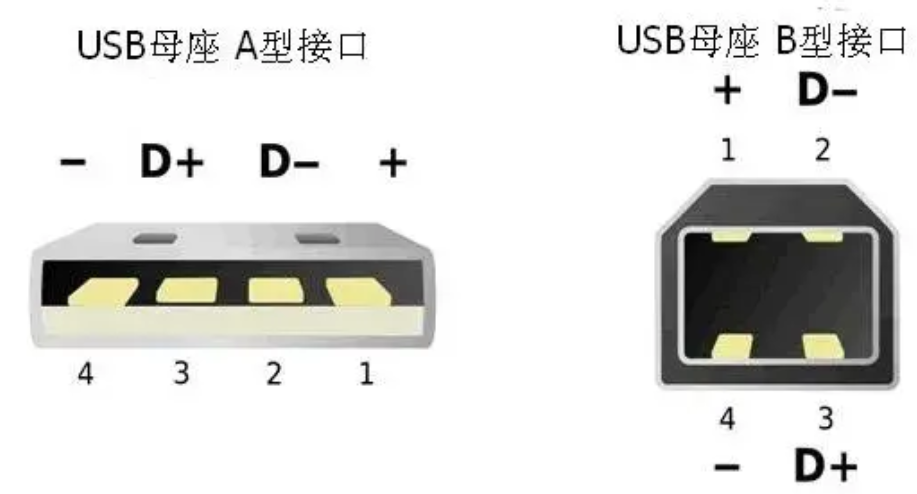
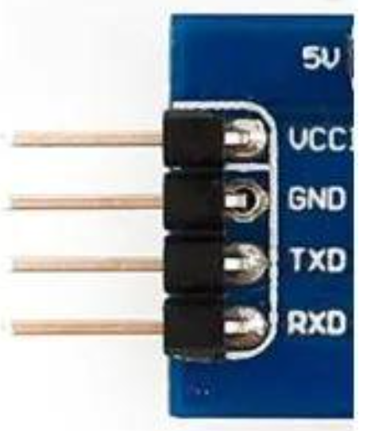
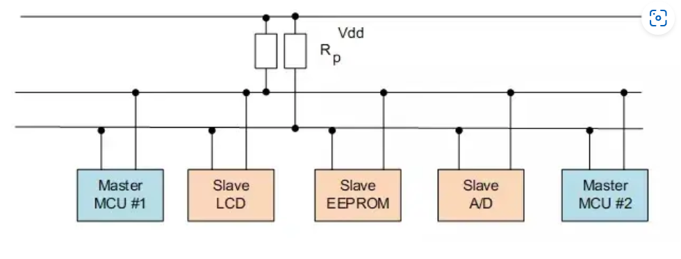
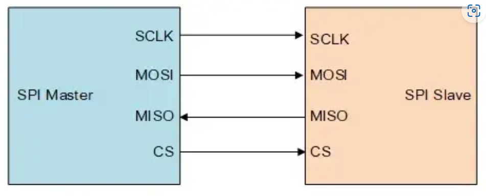
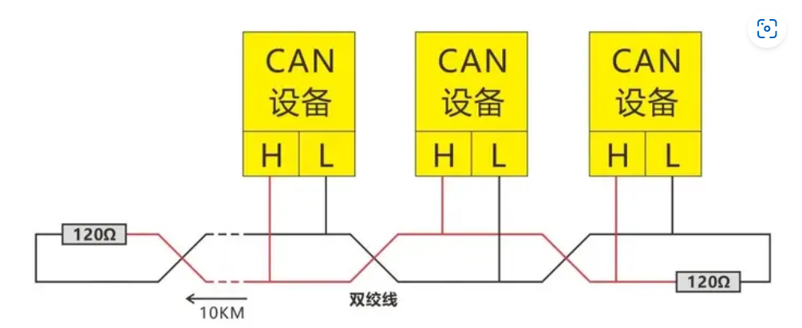
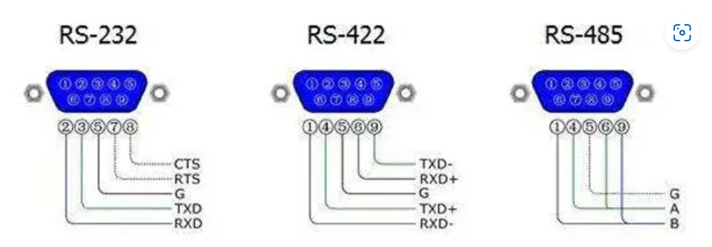
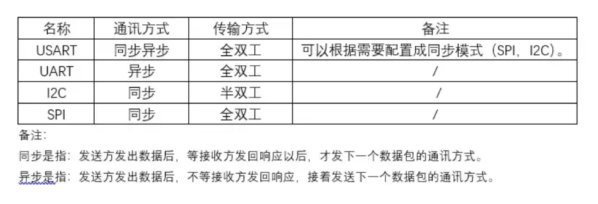

# 通信接口笔记

## 通信硬件接口

### 串口

-   串行通讯接口，俗称串口
-   串口是一个泛称，UAR、TTL、RS232、RS485都遵循类似的通信时序协议，因此都被通称为串口。
-   TTL，RS232，RS485都是一种逻辑电平的表示方式

### COM

-   计算机的串行通讯端口（cluster communication port ），俗称COM口、串口
-   特指台式计算机或一些电子设备上的D-SUB外形(一种连接器结构，VGA接口的连接器也是D-SUB)的串行通信口，应用了串口通信时序和RS232的逻辑电平。
-   常见的 DB9 9针接口
    -   这种接口的协议只有两种：RS-232和RS-485，不会是TTL电平的
    -   

### USB

-   通用串行总线，和串口完全是两个概念。虽然也是串行方式通信，但由于USB的通信时序和信号电平都和串口完全不同，因此和串口没有任何关系。USB是高速的通信接口，用于PC连接各种外设，U盘、键鼠、移动硬盘、当然也包括“USB转串口”的模块。（USB转串口模块，就是USB接口的UART模块）
-   USB接口最少有四根线，其中有两根是数据线，而所有的USB数据传输都是通过这两根线完成。它的通信远比串口复杂的多。    
-   两根数据线采用差分传输，即需要两根数据线配合才能传输一个bit，因此是半双工通信，同一时间只能发送或者接收。    USB 规定，如果电压电平不变，代表逻辑1；如果电压电平变化，则代表逻辑0。
    -   

## 通信总线

-   总线分类
    -   内部总线
        -   内部总线是微机内部各外围芯片与处理器之间的总线，用于芯片一级的互连
    -   系统总线
        -   系统总线是微机中各插件板与系统板之间的总线，用于插件板一级的互连
    -   外部总线
        -   外部总线则是微机和外部设备之间的总线，微机作为一种设备，通过该总线和其他设备进行信息与数据交换，它用于设备一级的互连。

### UART/USART 通用异步收发器

-   通用异步收发器（Universal Asynchronous Receiver/Transmitter)
-   异步串口，因此一般比同步串口的结构要复杂很多
-   规定了协议层通信标准
-   同时规定了物理接口形式
-   常应用于两个设备之间的通信
-   UART是串口收发的逻辑电路，这部分可以独立成芯片，也可以作为模块嵌入到其他芯片里，单片机、SOC、PC里都会有UART模块。
-   

### I2C 集成电路总线

-   由PHILIPS公司开发的两线式串行总线，用于连接微控制器及其外围设备。
-   （Inter-Integrated Circuit），中文应该叫集成电路总线

-   I2C总线是一种同步、半双工双向的两线式串口总线。
-   常用于短距离通信，如板上通信，芯片和芯片之间或者其他元器件如传感器和芯片之间的通信，有时也用于板间通信
-   它由两条总线组成：串行时钟线SCL和串行数据线SDA。    
    -   SCL线——负责产生同步时钟脉冲。    
    -   SDA线——负责在设备间传输串行数据。    
-   该总线可以将多个I2C设备连接到该系统上。连接到I2C总线上的设备既可以用作主设备，也可以用作从设备。
-   主设备负责控制通信，通过对数据传输进行初始化，来发送数据并产生所需的同步时钟脉冲。从设备则是等待来自主设备的命令，并响应命令接收。
-   主设备和从设备都可以作为发送设备或接收设备。无论主设备是作为发送设备还是接收设备，同步时钟信号都只能由主设备产生。
-   如果用通用IO口模拟I2C总线，并实现双向传输，则需一个输入输出口(SDA)，另外还需一个输出口(SCL)。
-   

### SPI 串行外设接口

-   串行外设接口
-   SPI (Serial Peripheral Interface)：MOTOROLA公司提出的同步串行总线方式。高速同步串行口。3～4线接口，收发独立、可同步进行。
-   常用于短距离通信，如板上通信，芯片和芯片之间或者其他元器件如传感器和芯片之间的通信

-   SPI总线是同步、全双工双向的4线式串行接口总线。它是由“单个主设备+多个从设备”构成的系统。

-   在系统中，只要任意时刻只有一个主设备是处于激活状态的，就可以存在多个SPI主设备。常运用于AD转换器、EEPROM、FLASH、实时时钟、数字信号处理器和数字信号解码器之间实现通信。

-   为了实现通信，SPI共有4条信号线，分别是：

    -   MOSI 主设备出、从设备入（Master Out Slave In，MOSI）：由主设备向从设备传输数据的信号线，也称为从设备输入（Slave Input/Slave Data In，SI/SDI）。
    -   MISO 主设备入、从设备出（Master In Slave Out，MISO）：由从设备向主设备传输数据的信号线，也称为从设备输出（Slave Output/Slave Data Out，SO/SDO）。
    -   SCLK 串行时钟（Serial Clock，SCLK）：传输时钟信号的信号线。
    -   SS 从设备选择（Slave Select，SS）：用于选择从设备的信号线，低电平有效。
    -   

    

### CAN 总线

-   CAN是控制器局域网络的简称，Control Area Network
-   特点
    -   国际上应用最广泛的现场总线之一
    -   是一种能够实现分布式实时控制的串行通信网络
    -   一个由CAN总线构成的单一网络中，理论上可以挂接无数个节点。实际应用中，节点数目受网络硬件的电气特性所限制。
    -   每一个设备既可做主设备也可做从设备。CAN总线的通信距离可达10千米（速率低于5Kbps），速度可达1Mbps（通信距离小于40M）
    -   可以点对点，一点对多点及全局广播几种传送方式接收数据。
-   CAN总线网络主要挂在CAN_H和CAN_L，各个节点通过这两条线实现信号的串行差分传输，为了避免信号的反射和干扰，还需要在CAN_H和CAN_L之间接上120欧姆的终端电阻。
    -   

-   CAN总线采用"线与"的规则进行总线冲裁，1&0为0，所以称0为显性，1为隐性。从电位上看，因为规定高电位为0，低电位为1，同时发出信号时实际呈现为高电位，从现象上看就像0覆盖了1，所以称0为显性，1为隐性。

## 通信电平标准

### TTL 

-   规定了数字电路中0和1的电平标准
-   指双极型三极管逻辑电路，市面上很多“USB转TTL”模块，实际上是“USB转TTL电平的串口”模块。这种信号0对应0V，1对应3.3V或者5V。与单片机、SOC的IO电平兼容。不过实际也不一定是TTL电平，因为现在大部分数字逻辑都是CMOS工艺做的，只是沿用了TTL的说法。我们进行串口通信的时候 从单片机直接出来的基本是都 是 TTL 电平。

### CMOS

-   规定了数字电路中0和1的电平标准

### RS232

-   串行通信硬件接口标准，包括电压电平、通讯速率等
-   是电子工业协会(Electronic Industries Association，EIA) 制定的异步传输标准接口，同时对应着电平标准和通信协议（时序），其电平标准：+3V～+15V对应0，-3V～-15V对应1。rs232 的逻辑电平和TTL 不一样但是协议一样。

### RS485

-   串行通信硬件接口标准，包括电压电平、通讯速率等
-   为了长距离传输采用差分方式传输，传输的是差分信号，抗干扰能力比RS232强很多。两线压差为-(2~6)V表示0，两线压差为+(2~6)V表示1

### RS422

-   串行通信硬件接口标准，包括电压电平、通讯速率等

## 通信工作方式

-   单工通信
    -   只支持单向通信，比如广播，你只能听，不能发；
-   半双工通信
    -   可以双向通信，但不能同时，比如对讲机，你发出一段话后要说一个over，然后听对方讲；
-   全双工通信
    -   可以双向通信，且是同时双向，比如移动电话，俩人是可以在电话里吵架的。

## TTL vs CMOS

-   TTL电路是电流控制器件，稳定时损耗高，发热量大，无法做集成度比较高的芯片。而CMOS电路是电压控制器件，功耗低。
-   TTL电路的速度快，传输延迟时间短(5-10ns)，但是功耗大。COMS电路的速度慢，传输延迟时间长(25-50ns),但功耗低，也就是说TTL电路的延迟比CMOS电路要小。COMS电路本身的功耗与输入信号的脉冲频率有关，频率越高，芯片集越热，这是正常现象。
-   TTL和CMOS器件有不同的电压类型，5V、3.3V、2.5V、1.8V（4）电流驱动能力不一样，TTL一般提供25mA的驱动能力，而CMOS一般在10mA左右；需要的电流输入大小也不一样，一般TTL需要2.5mA左右，CMOS几乎不需要电流输入；很多器件都是兼容TTL和CMOS的，data sheet会有说明。如果不考虑速度和性能，一般器件可以互换。

-   各种通信方式的电平标准

| 逻辑电平 | 供电电压 | 输入高逻辑-1    | 输入低逻辑-0 | 输出高逻辑-1   | 输出低逻辑-0 |
| -------- | -------- | --------------- | ------------ | -------------- | ------------ |
| TTL      | 5.0V     | 2.0V~ 5.0V      | 0V~0.8V      | 2.4V~5.0V      | 0V~0.5V      |
| LVTTL    | 3.3V     | 2.0V~ 3.3V      | 0V~ 0.8V     | 2.4V~3.3V      | 0V~0.4V      |
| LVTTL    | 2.5V     | 1.7V~ 2.5V      | 0V~0.7V      | 2.0V~ 2.5V     | 0V~0.2V      |
| LVTTL    | 1.8V     | 1.17V~1.8V      | 0V~0.63V     | 1.35V~1.8V     | 0V~0.45V     |
| CMOS     | 5.0V     | 3.5V~ 5.0V      | 0V~1.5V      | 4.45V~5.0V     | 0V~0.5V      |
| LVCMOS   | 3.3V     | 2.0V~ 3.3V      | 0V~0.8V      | 2.4V~ 3.3V     | 0V~0.4V      |
| LVCMOS   | 2.5V     | 1.7V~ 2.5V      | 0V~0.7V      | 2.0V~ 2.5V     | 0V~0.4V      |
| LVCOMS   | 1.8V     | 1.17V~1.8V      | 0V~0.63V     | 1.35V~1.8V     | 0V~0.45V     |
| RS232    | 3.3V/5V  | -15V~ -3V       | 3V~ 15V      | -15V~ -3V      | 3V~ 15V      |
| RS485    | 3.3V/5V  | +2V ~ +6V       | -6V~-2V      | +2V~+6V        | -6V~-2V      |
| RS422    | 3.3V/5V  | +2V~+6V         | -6V~-2V      | +2V~+6V        | -6V~-2V      |
| LVDS     | 3.3V/5V  | 1.252V~ 3.3V/5V | 0V~1.249V    | 1.252V~3.3V/5V | 0V~1.249V    |

-   5V电源电压情况下，CMOS电路可以直接驱动TTL，而TTL电路则不能直接驱动CMOS电路。
-   其他电平也不能直接驱动，所以就需要2者的进行电平转换。
-   TTL、RS232、RS485也有电平匹配的问题，也需要进行电平转换。
-   我们在串口通讯硬件上，经常需要电平转换芯片的原因。

## RS232 vs RS485 vs RS422

-   RS232
    -   电平特性：接口信号电平高，容易损坏接口电路的芯片。RS232接口上任何信号线的电压都处于负逻辑关系中。即：逻辑“1”为-3 ~ -15V;逻辑为“0”：+3 ~ +15V。与TTL电平不兼容，需要一个电平转换电路来连接到TTL电路。
    -   传输速率低。在异步传输中，波特率为50、75、100、150、300、600、1200、2400、4800、9600、19200
    -   接口采用信号线和信号回波串，形成共同的接地传输形式。这种标准的接地传输容易受到共模干扰，因此抗噪性较弱。
    -   传输距离有限。最大传输距离为50英尺。它只能达到大约15米。
    -   全双工。有独立的收发数据线，所以能全双工通信。
    -   只能点对点通信。
-   RS485
    -   接口电平特性：RS-485的电气特性：逻辑“1”由两条线路+2V~+6V之间的电压差表示，逻辑“0”由两条线路之间的电压差-6V~-2V表示。接口信号电平低于RS-232，不易损坏接口电路芯片。该电平与TTL电平兼容，便于与TTL电路连接。
    -   最高数据传输速率为：10Mbps
    -   RS-485接口采用平衡驱动器和差分接收机的组合，具有抗共振固模干扰能力，即抗噪声性能好。
    -   RS-485接口的最大传输距离为4000英尺，实际上可达3000米。
    -   RS-232接口仅允许一个收发器连接到总线，即单站功能。相比之下，RS-485接口仅允许在总线上连接多达128个收发器，即多站能力。用户使用单个RS-485接口可以快速建立设备网络。
    -   只能半双工
-   RS422
    -   接口电平特性：和RS485一样。
    -   最高数据传输率：和RS485一样。
    -   抗噪声性能：和RS485一样。
    -   通讯距离：和RS485一样。
    -   多点通信的数据传输协议。和RS-485不同的是RS-422不允许出现多个发送端而只能有多个接收端。
    -   全双工通信能力。RS422采用4线，全双工，硬件构成上RS-422相当于两组RS-485，即两个半双工的RS-485构成一个全双工的RS-422。

-   通信方式对比

    -   |       | 电平 | 速率 | 抗扰 | 距离 | 组网   | 全双工/半双工 |
        | ----- | ---- | ---- | ---- | ---- | ------ | ------------- |
        | RS232 | 高   | 低   | 低   | 近   | 一对一 | 全双工        |
        | RS485 | 低   | 高   | 高   | 远   | 多对多 | 半双工        |
        | RS422 | 低   | 高   | 高   | 远   | 一对多 | 全双工        |

-   接口图解

## UART vs USART

-   规定了协议层通信标准
-   USART，即通用同步异步收发器，是一个全双工通用同步/异步串行收发模块。在嵌入式领域，它还有一个更口语化的称呼，即“**串口**”。
-   UART，它是在USART基础上裁剪掉了同步通信功能，UART应用更为普遍。USART靠主机的时钟来同步数据传输波特率，而UART是通信双方事先协商好通信波特率。
-   USART/UART仅规定了协议层通信标准，并没有规定采用什么电平特性，物理层硬件可以根据通讯对象灵活选择，比如，可以是TTL、CMOS、RS232、RS485、RS422。
-   协议层通信标准，规定了数据传输的格式，
    -   起始位
    -   数据位
    -   校验位
    -   停止位

## UART vs I2C vs SPI

-   I2C线更少，比UART、SPI更为强大，但是技术上也更加麻烦些，因为I2C需要有双向IO的支持，而且使用上拉电阻，抗干扰能力较弱，一般用于同一板卡上芯片之间的通信，较少用于远距离通信。
-   SPI实现要简单一些，UART需要固定的波特率，就是说两位数据的间隔要相等，而SPI则无所谓，因为它是有时钟的协议。
-   I2C的速度比SPI慢一点，协议比SPI复杂一点，但是连线也比标准的SPI要少。
-   UART一帧可以传5/6/7/8位，I2C必须是8位。I2C和SPI都从最高位开始传。
-   SPI用片选信号选择从机，I2C用地址选择从机。

