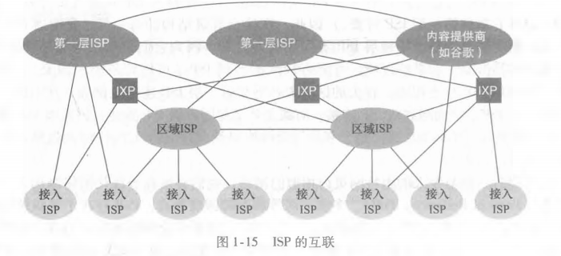

# 计算机网络-自顶向下法

## 0 资源

-   Web: http://www.pearsonhighered.com/cs-resources/
    -   交互式学习材料
    -   附加的技术材料
    -   编程作业
    -   Wireshark 实验
-   http://gaia.cs.umass.edu/kurose_ross/interactive
    -   交互式练习

## 1 计算机网络和因特网

### 1.1 因特网定义

#### 1.1.1 具体构成

-   主机Host/端系统End-System
-   通信链路 communication link 
-   分组交换机 packet switch
    -   路由器 router
    -   链路层交换机 link-layer switch
-    因特网服务提供商 ISP-Internet Service Provider
    -   住宅器ISP
    -   公司ISP
    -   大学ISP
    -   商业区ISP
    -   移动设备ISP
-   协议 Protocal
    -   TCP Transmission Control Protocol 传输控制协议
    -   IP Internet Protocol 网际协议
        -   IP协议: 路由器和端系统之间发送接受的分组格式
-   RFC 请求评论 Request For Comment
    -   RFC 文档定义了许多协议, 由IETF 因特网工程任务组管理

#### 1.1.2 服务描述

-   因特网应用
    -   电子邮件
    -   web
    -   移动设备App
    -   流媒体
    -   社交网络
    -   视频会议
    -   ...
    -   分布式应用程序 distributed application
-   套接字接口 socket interface
    -   端系统通过因特网基础设施与其他端系统交付数据的方式
    -   如同邮政系统发信的规则

#### 1.1.3 协议

-   协议（protocol）定义了在两个或多个通信实体之间交换的报文的格式和顺序，以及报文发送和/或接收一条报文或其他事件所采取的动作

### 1.2 网络边缘

-   端系统/主机 Host
    -   服务器 server
    -   客户端 client
-   接入网
    -   边缘路由器
        -   端系统到任何远程端系统的第一台路由器
    -   方式
        -   以太网
        -   Wifi
        -   DSL
        -   拨号
        -   卫星
        -   ...
        -   4G 5G

### 1.3 网络核心

-   分组交换

    -   从报文到分组交换机
        -   报文 message
        -   分组 package
        -   分组交换机 package switch 
    -   存储转发传输
    -   排队时延和分组丢失
        -   输出缓存/输出队列
    -   转发表和路由选择协议
        -   用来确定各级IP地址
        -   www.traceroute.org

-   电路交换

    -   端到端的网络连接，专网专用
    -   电路交换网络的复用
        -   频分复用 FDM
        -   时分复用 TDM

-   网络的网络

    

    

### 1.4 分组交换网的时延, 丢包, 吞吐量

-   分组网络的时延、丢包、吞吐量
    -   时延
        -   处理时延
        -   排队时延
        -   传输时延
        -   传播时延
        -   排队时延
        -   端到端时延
    -   吞吐量
        -   瞬时吞吐量
        -   平均吞吐量

### 1.5 协议层次和服务模型

-   协议分层
    -   分层
    -   服务模型
    -   五层因特网协议栈
        -   应用层
        -   运输层
            -   TCP
                -   注重连接
            -   UDP
                -   无连接
        -   网络层
            -   IP
        -   链路层
        -   物理层
    -   七层ISO OSI 协议模型
        -   应用层
        -   表示层
        -   会话层
        -   运输层
        -   网络层
        -   链路层
        -   物理层

### 1.6 面对攻击的网络

### 1.7 计算机网络/因特网历史

## 2 应用层

## 3 运输层

## 4 网络层: 数据平面

## 5 网络层: 控制平面

## 6 链路层和局域网

## 7 无线网络和移动网络

## 8 计算机网络安全

## 9 多媒体网络