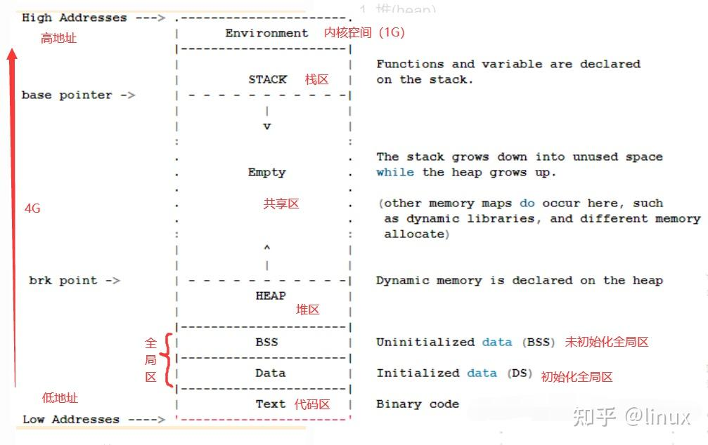

# CPP Note

## 常用库

-   `#include<iostream>`

    -   基础IO库
    -   std::cout, std::endl
    -   std::cin 

-   `#include <cstring>`

    -   strlen()
        -   获取 char[] 的长度
    -   strcpy()
        -   拷贝 char[]
    -   strcat()
        -   拼接 char[]

-   `#include<string>`

    


## 基础

### 变量 常量

-   变量
    -   初始化需要赋值
-   常量 
    -   #define 宏常量
    -   const

### 基础数据类型

| **数据类型**        | **占用空间**                                    | **有效数字范围** |
| ------------------- | ----------------------------------------------- | ---------------- |
| short(短整型)       | 2字节                                           | (-2^15 ~ 2^15-1) |
| int(整型)           | 4字节                                           | (-2^31 ~ 2^31-1) |
| long(长整形)        | Windows为4字节，Linux为4字节(32位)，8字节(64位) | (-2^31 ~ 2^31-1) |
| long long(长长整形) | 8字节                                           | (-2^63 ~ 2^63-1) |
| float               | 4字节                                           | 7位有效数字      |
| double              | 8字节                                           | 15～16位有效数字 |
| char                | 1字节                                           | 0-255            |
| bool                | 1字节                                           | 0/1              |


### 右值/左值

C++的表达式要不然是右值(rvalue), 要不然是左值(lvalue). 这两个名词是从 C 语言继承过来的, 原本是为了帮助记忆: 左值可以位于赋值语句的左侧, 右值则不能.

当一个对象被用做右值的时候, 用的是对象的值(内容); 当对象被用做左值的时候, 用的是对象的身份(在内存中的位置).


### 数据输入输出

-   标准输入 std::cin

    ```cpp
    	//整型输入
    	int a = 0;
    	cout << "请输入整型变量：" << endl;
    	cin >> a;
    	cout << a << endl;
    
    	//浮点型输入
    	double d = 0;
    	cout << "请输入浮点型变量：" << endl;
    	cin >> d;
    	cout << d << endl;
    
    	//字符型输入
    	char ch = 0;
    	cout << "请输入字符型变量：" << endl;
    	cin >> ch;
    	cout << ch << endl;
    
    	//字符串型输入
    	string str;
    	cout << "请输入字符串型变量：" << endl;
    	cin >> str;
    	cout << str << endl;
    
    	//布尔类型输入
    	bool flag = true;
    	cout << "请输入布尔型变量：" << endl;
    	cin >> flag;
    	cout << flag << endl;
    	system("pause");
    ```

-   标准输出 std::cout 


### 运算符

#### 算术运算符

| **运算符** | **术语**   | **示例**    | **结果**  |
| ---------- | ---------- | ----------- | --------- |
| +          | 正号       | +3          | 3         |
| -          | 负号       | -3          | -3        |
| +          | 加         | 10 + 5      | 15        |
| -          | 减         | 10 - 5      | 5         |
| *          | 乘         | 10 * 5      | 50        |
| /          | 除         | 10 / 5      | 2         |
| %          | 取模(取余) | 10 % 3      | 1         |
| ++         | 前置递增   | a=2; b=++a; | a=3; b=3; |
| ++         | 后置递增   | a=2; b=a++; | a=3; b=2; |
| --         | 前置递减   | a=2; b=--a; | a=1; b=1; |
| --         | 后置递减   | a=2; b=a--; | a=1; b=2; |

#### 赋值运算符

| **运算符** | **术语** | **示例**   | **结果**  |
| ---------- | -------- | ---------- | --------- |
| =          | 赋值     | a=2; b=3;  | a=2; b=3; |
| +=         | 加等于   | a=0; a+=2; | a=2;      |
| -=         | 减等于   | a=5; a-=3; | a=2;      |
| *=         | 乘等于   | a=2; a*=2; | a=4;      |
| /=         | 除等于   | a=4; a/=2; | a=2;      |
| %=         | 模等于   | a=3; a%2;  | a=1;      |

#### 比较运算符

| **运算符** | **术语** | **示例** | **结果** |
| ---------- | -------- | -------- | -------- |
| ==         | 相等于   | 4 == 3   | 0        |
| !=         | 不等于   | 4 != 3   | 1        |
| <          | 小于     | 4 < 3    | 0        |
| \>         | 大于     | 4 > 3    | 1        |
| <=         | 小于等于 | 4 <= 3   | 0        |
| \>=        | 大于等于 | 4 >= 1   | 1        |

#### 逻辑运算符

| **运算符** | **术语** | **示例** | **结果**                                                 |
| ---------- | -------- | -------- | -------------------------------------------------------- |
| !          | 非       | !a       | 如果a为假，则!a为真；  如果a为真，则!a为假。             |
| &&         | 与       | a && b   | 如果a和b都为真，则结果为真，否则为假。                   |
| \|\|       | 或       | a \|\| b | 如果a和b有一个为真，则结果为真，二者都为假时，结果为假。 |

#### 位运算符

| **运算符** | **术语**   | 描述                                                         |
| ---------- | ---------- | ------------------------------------------------------------ |
| &          | 与运算符   | 将两个数的对应位进行逻辑与运算。 当两个位都为 1 时,结果位为 1,否则为 0。 常用于检查、设置或清除数字的特定位。 |
| \|         | 或运算符   | 将两个数的对应位进行逻辑或运算。 当两个位中有一个或两个为 1 时,结果位为 1,否则为 0。 常用于设置数字的特定位。 |
| ^          | 异或运算符 | 将两个数的对应位进行逻辑异或运算。 当两个位不同时,结果位为 1,否则为 0。 常用于翻转数字的特定位。 |
| <<         | 左移运算符 | 将一个数的二进制位向左移动指定的位数。 左移 n 位相当于乘以 2 的 n 次方。 常用于乘以 2 的整数次幂。 |
| >>         | 右移运算符 | 将一个数的二进制位向右移动指定的位数。 右移 n 位相当于除以 2 的 n 次方。 常用于除以 2 的整数次幂。 |
| ~          | 取反运算符 | 对一个数的二进制位逐位取反。 将 0 变为 1,将 1 变为 0。 常用于求一个数的补码。 |

```cpp
int x = 0b1010; // 二进制 10
int y = 0b1100; // 二进制 12

// 与运算符
std::cout << "x & y = " << (x & y) << std::endl; // 输出 8 (二进制 1000)
// 或运算符
std::cout << "x | y = " << (x | y) << std::endl; // 输出 14 (二进制 1110)
// 异或运算符
std::cout << "x ^ y = " << (x ^ y) << std::endl; // 输出 6 (二进制 0110)
// 取反运算符
std::cout << "~x = " << (~x) << std::endl;      // 输出 -11 (二进制 11110101)
// 左移运算符
std::cout << "x << 1 = " << (x << 1) << std::endl; // 输出 20 (二进制 10100)
// 右移运算符
std::cout << "x >> 1 = " << (x >> 1) << std::endl; // 输出 5 (二进制 101)
```


#### sizeof 运算符

- 普通变量sizeof
  - 对char或者类型为char的表达式执行sizeof运算, 结果得 1.
  - 对引用类型执行sizeof运算得到被引用对象所占空间的大小.
  - 对指针执行sizeof运算得到指针本身所占空间的大小.
  - 对解引用指针执行sizeof运算得到指针指向的对象所占空间的大小.
  - 对数组执行sizeof运算得到整个数组所占空间的大小, 等价于对数组中所有元素各
  - 行一次sizeof运算并将所得结果求和.
  - 对string对象或vector对象执行sizeof运算只返回该类型固定部分的大小.

- 类 sizeof

  - 对于普通的成员变量(非静态成员变量)而言，`sizeof` 会计算它们的大小并累加到整个类对象的大小中。
  - 对于静态成员变量，它们不属于类的对象实例,而是属于整个类本身。因此 `sizeof` 不会包括静态成员变量的大小。
  - 对于成员函数(包括静态成员函数)，它们不占用类对象的内存空间,所以 `sizeof` 也不会包括它们的大小。
  - 对于虚函数和虚函数表,它们确实占用类对象的内存空间,所以 `sizeof` 会把它们的大小也算进去。

  ```cpp
  class A {};
  class B { B(); ~B() {} };
  class C { C(); virtual ~C() {} };
  class D { D(); ~D() {} int d; };
  class E { E(); ~E() {} static int e; };
  int main(int argc, char* argv[]) {
      std::cout << sizeof(A) << std::endl; // 输出结果为1
      std::cout << sizeof(B) << std::endl; // 输出结果为1
      std::cout << sizeof(C) << std::endl; // 输出结果为8,实例中有一个指向虚函数表的指针
      std::cout << sizeof(D) << std::endl; // 输出结果为4,int占4个字节
      std::cout << sizeof(E) << std::endl; // 输出结果为1,static不算
      return 0;
  }
  ```

  


### 程序流程语句

-   基本程序结构

    * 顺序结构：程序按顺序执行，不发生跳转

    * 选择结构：依据条件是否满足，有选择的执行相应功能

        * if else

        * switch

            ```cpp
            switch (score)
            {
                case 10:
                case 9:
                    cout << "经典" << endl;
                    break;
                case 8:
                    cout << "非常好" << endl;
                    break;
                case 7:
                case 6:
                    cout << "一般" << endl;
                    break;
                default:
                    cout << "烂片" << endl;
                    break;
            }
            ```

        * 三目运算符

            ```cpp
            (a > b ? a : b) = 100;
            ```

    * 循环结构：依据条件是否满足，循环多次执行某段代码

        * while

            ```cpp
            int num = 0;
            while (num < 10)
            {
                cout << "num = " << num << endl;
                num++;
            }
            ```

        * do while

            ```cpp
            do
            {
                cout << num << endl;
                num++;
            
            } while (num < 10);
            ```

        * for

            ```c++
            for (int i = 0; i < 10; i++)
            {
                cout << i << endl;
            }
            ```

        * break

        * continue


### 数组

#### 普通数组

-   概念
    -   数组中的每个==数据元素都是相同的数据类型
    -   数组是由**连续的内存位置**组成的
    -   一维数组名
        -   可以统计整个数组在内存中的长度
        -   可以获取数组在内存中的首地址

##### 一维数组

-   一维数组初始化

```cpp
// 定义方式1
// 数据类型 数组名[元素个数];
int score[10];
// 利用下标赋值
score[0] = 100;
score[1] = 99;
score[2] = 85;
// 利用下标输出
cout << score[0] << endl;
cout << score[1] << endl;
cout << score[2] << endl;

// 定义方式2
// 数据类型 数组名[元素个数] =  {值1，值2 ，值3 ...};
// 如果{}内不足10个数据，剩余数据用0补全
int score2[10] = { 100, 90,80,70,60,50,40,30,20,10 }

// 定义方式3
// 数据类型 数组名[] =  {值1，值2 ，值3 ...};
int score3[] = { 100,90,80,70,60,50,40,30,20,10 };
```

-   一维数组名

```cpp
// 数组名用途1：获取整个数组占用内存空间大小
int arr[10] = { 1,2,3,4,5,6,7,8,9,10 };
cout << "整个数组所占内存空间为： " << sizeof(arr) << endl;
cout << "每个元素所占内存空间为： " << sizeof(arr[0]) << endl;
cout << "数组的元素个数为： " << sizeof(arr) / sizeof(arr[0]) << endl;

// 数组名用途2：可以通过数组名获取到数组首地址
cout << "数组首地址为： " << (int)arr << endl;
cout << "数组中第一个元素地址为： " << (int)&arr[0] << endl;
cout << "数组中第二个元素地址为： " << (int)&arr[1] << endl;

// arr = 100; 错误，数组名是常量，因此不可以赋值
```

##### 二维数组

-   二维数组初始化

    -   ` 数据类型  数组名[ 行数 ][ 列数 ]; `

    -   `数据类型  数组名[ 行数 ][ 列数 ] = { {数据1，数据2 } ，{数据3，数据4 } };`

    -   `数据类型  数组名[ 行数 ][ 列数 ] = { 数据1，数据2，数据3，数据4};`

    -   ` 数据类型  数组名[  ][ 列数 ] = { 数据1，数据2，数据3，数据4};`

        ```cpp
        	//方式1  
        	//数组类型 数组名 [行数][列数]
        	int arr[2][3];
        	arr[0][0] = 1;
        	arr[0][1] = 2;
        	arr[0][2] = 3;
        	arr[1][0] = 4;
        	arr[1][1] = 5;
        	arr[1][2] = 6;
        
        	for (int i = 0; i < 2; i++)
        	{
        		for (int j = 0; j < 3; j++)
        		{
        			cout << arr[i][j] << " ";
        		}
        		cout << endl;
        	}
        
        	//方式2 
        	//数据类型 数组名[行数][列数] = { {数据1，数据2 } ，{数据3，数据4 } };
        	int arr2[2][3] =
        	{
        		{1,2,3},
        		{4,5,6}
        	};
        
        	//方式3
        	//数据类型 数组名[行数][列数] = { 数据1，数据2 ,数据3，数据4  };
        	int arr3[2][3] = { 1,2,3,4,5,6 }; 
        
        	//方式4 
        	//数据类型 数组名[][列数] = { 数据1，数据2 ,数据3，数据4  };
        	int arr4[][3] = { 1,2,3,4,5,6 };
        ```

-   二维数组名

    -   查看二维数组所占内存空间

    -   获取二维数组首地址

        ```cpp
        //二维数组数组名
        int arr[2][3] =
        {
            {1,2,3},
            {4,5,6}
        };
        
        // 大小
        cout << "二维数组大小： " << sizeof(arr) << endl;
        cout << "二维数组一行大小： " << sizeof(arr[0]) << endl;
        cout << "二维数组元素大小： " << sizeof(arr[0][0]) << endl;
        cout << "二维数组行数： " << sizeof(arr) / sizeof(arr[0]) << endl;
        cout << "二维数组列数： " << sizeof(arr[0]) / sizeof(arr[0][0]) << endl;
        
        //地址
        cout << "二维数组首地址：" << arr << endl;
        cout << "二维数组第一行地址：" << arr[0] << endl;
        cout << "二维数组第二行地址：" << arr[1] << endl;
        cout << "二维数组第一个元素地址：" << &arr[0][0] << endl;
        cout << "二维数组第二个元素地址：" << &arr[0][1] << endl;
        ```

        

#### 字符串数组 char[]

-   初始化字符串

    -   char[] 初始化的字符串，末尾自带 `'\0'`，
        -   导致长度比实际字符数量+1
        -   `char[]` 数组最后一个元素通常是结尾空字符 `'\0'`,表示字符串的结束。
        -   这个空字符在字符串处理中很重要,需要确保数组大小能容纳下整个字符串(包括 `'\0'`)。
        -   如果需要修改 \0
            -   不建议随意修改 `'\0'` 的位置,因为它会导致字符串处理函数的行为不确定
            -   需要在字符串中添加额外的数据
            -   需要从字符串中删除部分内容

    ```cpp
    char str1[] = "Hello, World!";  // 数组大小为 14 (包括结尾的 '\0' 和中间的空格)
    char str2[6] = "Apple";         // 数组大小为 6 包括结尾的 '\0'
    char ch = 'A';                  // 单个字符
    ```

-   获取字符串长度

    ```cpp
    #include <cstring>
    
    // 方法1：strlen
    char str[] = "Hello, World!";
    size_t length = strlen(str);  
    std::cout << length <<std::endl; // 13 不包括 \0
    
    // 方法2：遍历字符数组直到遇到空字符 '\0'
    char str[] = "Hello, World!";
    size_t length = 0;
    while (str[length] != '\0') {
        length++; 
    }
    std::cout << length <<std::endl; // 13 不包括 \0
    
    // 方法3：sizeof
    char str[] = "Hello, World!";
    size_t length = sizeof(str) / sizeof(char);
    std::cout << length <<std::endl; // 14 包括 \0
    ```

-   修改字符串长度

    -   char[] 数组的长度是固定的,不能直接修改

    -   间接修改字符串长度的方式

        ```cpp
        // std::string
        #include <string>
        std::string str = "Hello";
         // 将字符串长度扩展为 10 个字符,新增的部分用空格填充
        str.resize(10, ' ');
        
        // 动态分配内存
        char* str = new char[6]; // 分配一个长度为 6 的字符数组
        strcpy(str, "Hello"); // 将字符串复制到新分配的内存中
        // 修改字符串长度的逻辑...
        delete[] str; // 释放动态分配的内存
        
        // 通过 vector 储存字符串
        #include <vector>
        std::vector<char> str = {'H', 'e', 'l', 'l', 'o'};
        // 将字符数组长度扩展为 10 个元素,新增的部分用空格填充
        str.resize(10, ' '); 
        ```

-   访问字符

    ```cpp
    char str[] = "Hello";
    std::cout << str[0];  // 输出 'H'
    str[1] = 'a';         // 修改第 2 个字符为 'a'
    ```

-   操作字符串

    ```cpp
    // strlen()、strcpy()、strcat()
    char str1[] = "Hello";
    char str2[10];
    strcpy(str2, str1);   // 将 str1 复制到 str2
    std::cout <<strlen(str2) <<std::endl;	// 5
    strcat(str2, ", World!"); // 将 ", World!" 追加到 str2
    std::cout <<strlen(str2) <<std::endl;	// 13
    ```

-   函数参数传递char[] 字符串

    -   值传递

        -   这种方式实际上将数组名转换为指向首元素的指针,函数内部可以修改原始数组元素

        ```cpp
        void printString(char str[]) 
        {
            std::cout << str << std::endl;
        }
        
        char myString[] = "Hello, World!";
        printString(myString);
        ```

    -   指针传递:

        -   这种方式直接传递数组首元素的地址,函数内部可以通过指针修改数组元素,并且会影响原始数组。

        ```cpp
        void printString(char* str) 
        {
            std::cout << str << std::endl;
        }
        
        char myString[] = "Hello, World!";
        printString(myString);
        ```

    -   引用传递

        -   使用引用语法,函数内部可以访问和修改原始数组元素,并且不需要担心数组大小。但需要在函数参数中指定数组大小

        ```cpp
        void printString(char (&str)[14]) 
        {
            std::cout << str << std::endl;
        }
        
        char myString[] = "Hello, World!";
        printString(myString);
        ```

    -   传递数组大小

        -   调用时显式地传递数组大小,函数内部可以根据大小访问数组元素。这种方式更加灵活,但需要额外维护数组大小信息。

        ```cpp
        void printString(char* str, size_t size) 
        {
            std::cout << str << std::endl;
        }
        
        char myString[] = "Hello, World!";
        printString(myString, std::size(myString));
        ```

    -   传递时，函数内的数组改变不影响原始数组的方法

        -   使用 std::string
        -   函数内拷贝一份新的数组


### 函数

#### 基本函数

-   函数声明
    -   函数的**声明可以多次**，但是函数的**定义只能有一次**

-   函数定义

    ```cpp
    返回值类型 函数名 (参数列表)
    {
        函数体语句
    	return表达式
    }
    ```

    -   常见的函数样式有4种

        -   无参无返
        -   有参无返
        -   无参有返
        -   有参有返

#### 函数值传递

-   形参，实参
    -   函数定义里小括号内称为形参，函数调用时传入的参数称为实参
-   函数调用时实参将数值传入给形参
    -   值传递时，如果形参发生改变，并不会影响实参
    -   如果传递的是地址，则改变地址对应的数据，就会影响函数外的原始数据，除非copy数据到新地址
-   传参方式
    -   值传递
    -   指针传递
    -   引用传递
    -   const 修饰传参

#### lambda 函数 C++ 11 引入

-   优点

    -   提高代码可读性和简洁性:
    -   提高代码可读性和简洁性:
    -   代码组织和模块化:
    -   性能优化

-   语法

    ```cpp
    // Capture clause: 用于指定 lambda 函数可以访问的外部变量。可以通过值 [=] 或引用 [&] 的方式捕获变量。
    // Parameters: 函数的参数列表,可以为空。
    // Return type: 函数的返回类型,可以省略让编译器自动推导。
    // Function body: 函数体,可以包含任意合法的 C++ 语句。
    [capture clause](parameters) -> return_type { function_body };
    ```

    ```cpp
    std::vector<int> numbers = {1, 2, 3, 4, 5};
    
    // 使用 lambda 函数对 numbers 向量进行排序
    std::sort(numbers.begin(), numbers.end(), 
        [](int a, int b) 
        {
            return a > b;
        }
    );
    
    // 使用 lambda 函数遍历输出 numbers 向量
    std::for_each(numbers.begin(), numbers.end(), 
        [](int num) 
        {
            std::cout << num << " ";
        }
    );
    
    // 值捕获的,
    // lambda1 内部使用的是一个副本
    int x = 10;
    auto lambda1 = [x](int y) { return x + y; };
    
    // 引用捕获,
    // lambda2 内部使用的是原始变量
    int x = 10;
    auto lambda2 = [&x](int y) { x++; return x + y; };
    
    // 混合捕获
    int x = 10, y = 20;
    auto lambda3 = [x, &y](int z) { y += z; return x + y; };
    
    // 按值隐式捕获
    int x = 10, y = 20;
    auto lambda4 = [=](int z) { return x + y + z; };
    
    // 静态变量捕获
    static int x = 10;
    auto lambda5 = [](int y) { return x + y; };
    
    // 捕获this指针
    class MyClass {
    public:
        void doSomething() 
        {
            // 这里 this 指针被捕获,可以访问类成员 value_
            auto lambda6 = [this](int x) { return x * value_; };   
        }
    private:
        int value_ = 5;
    };
    ```


#### 函数默认参数

```cpp
// 1. 如果某个位置参数有默认值，那么从这个位置往后，从左向右，必须都要有默认值
int func(int a, int b = 10, int c = 10) 
{
	return a + b + c;
}

// 2. 如果函数声明有默认值，函数实现的时候就不能有默认参数
int func2(int a = 10, int b = 10);
int func2(int a, int b) 
{
	return a + b;
}

int main() {
	cout << "ret = " << func(20, 20) << endl;
	cout << "ret = " << func(100) << endl;
	return 0;
}
```


#### 函数占位参数

```cpp
// 函数占位参数 ，占位参数也可以有默认参数
void func(int a, int) 
{
	cout << "this is func" << endl;
}

// 占位参数必须填补
func(10,10); 
```


#### 函数重载

-   同一个作用域下

-   函数名称相同

-   函数参数**类型不同**  或者 **个数不同** 或者 **顺序不同**

-   **作用：**函数名可以相同，提高复用性

-   **注意:**  函数的返回值不可以作为函数重载的条件！没法知道调用时需要返回的是什么

    ```cpp
    //函数重载需要函数都在同一个作用域下
    void func()
    {
    	cout << "func 的调用！" << endl;
    }
    void func(int a)
    {
    	cout << "func (int a) 的调用！" << endl;
    }
    void func(double a)
    {
    	cout << "func (double a)的调用！" << endl;
    }
    void func(int a ,double b)
    {
    	cout << "func (int a ,double b) 的调用！" << endl;
    }
    void func(double a ,int b)
    {
    	cout << "func (double a ,int b)的调用！" << endl;
    }
    
    // 引用作为重载条件
    void func(int &a)
    {
    	cout << "func (int &a) 调用 " << endl;
    }
    void func(const int &a)
    {
    	cout << "func (const int &a) 调用 " << endl;
    }
    int a = 10;
    func(a); //调用无const
    func(10);//调用有const
    
    
    // 函数重载碰到函数默认参数
    void func2(int a, int b = 10)
    {
    	cout << "func2(int a, int b = 10) 调用" << endl;
    }
    void func2(int a)
    {
    	cout << "func2(int a) 调用" << endl;
    }
    // func2(10); //碰到默认参数产生歧义，需要避免
    ```


#### inline 内联函数

- 将函数指定为内联函数(`inlin`e), 通常就是将它在每个调用点上"内联地"展开.

- 内联机制用于优化规模较小(Google C++ Style 建议 10 行以下)、流程直接、频繁调用的函数.
- 类声明中定义的函数, 除了虚函数的其他函数都会自动隐式地当成内联函数.
- 编译器对inline函数的处理步骤
  - 将inline函数体复制到inline函数调用点处;
  - 为所用inline函数中的局部变量分配内存空间;
  - 将inline函数的的输入参数和返回值映射到调用方法的局部变量空间中;
  - 如果inline函数有多个返回点, 将其转变为inline函数代码块末尾的分支(使用 GOTO).

- 优点:

  1. 内联函数同宏函数一样将在被调用处进行代码展开, 省去了参数压栈、栈帧开辟与回收, 结果返回等, 从而提高程序运行速度.
  2. 内联函数相比宏函数来说, 在代码展开时, 会做安全检查或自动类型转换(同普通函数), 而宏定义则不会.
  3. 在类中声明同时定义的成员函数, 自动转化为内联函数, 因此内联函数可以访问类的成员变量, 宏定义则不能.
  4. 内联函数在运行时可调试, 而宏定义不可以.

  缺点:

  1. 代码膨胀. 内联是以代码膨胀(复制)为代价, 消除函数调用带来的开销. 如果执行函数体内代码的时间, 相比于函数调用的开销较大, 那么效率的收获会很少. 另一方面, 每一处内联函数的调用都要复制代码, 将使程序的总代码量增大, 消耗更多的内存空间.
  2. inline函数无法随着函数库升级而升级. inline函数的改变需要重新编译, 不像non-inline可以直接链接.
  3. 是否内联, 程序员不可控. 内联函数只是对编译器的建议, 是否对函数内联, 决定权在于编译器.


#### 函数指针

函数指针指向的是函数而非对象. 和其他指针一样, 函数指针指向某种特定类型. 函数的类型由它的返回类新和形参共同决定, 与函数名无关.

C 在编译时, 每一个函数都有一个入口地址, 该入口地址就是函数指针所指向的地址.

有了指向函数的指针变量后,可用该指针变量调用函数,就如同用指针变量可引用其他类型变量一样

用途: 调用函数和做函数的参数, 比如回调函数.


### 指针 *

#### 指针概念

-   **指针的作用：** 可以通过指针间接访问内存

    -   内存编号是从0开始记录的，一般用十六进制数字表示
    -   可以利用指针变量保存地址
    -   普通变量存放的是数据,指针变量存放的是地址

-   `&` 取地址符，获取内存地址，

    ```cpp
    int a = 10; // 定义整型变量a
    int * p;
    p = &a; // 指针指向变量a的地址
    cout << &a << endl; // 打印数据a的地址
    ```

-   `*` 解引用符，指向的内存空间，获取内存上的数据

    ```cpp
    cout << p << endl;  // 打印指针变量p
    cout << "*p = " << *p << endl; // 通过*操作指针变量指向的内存，解引用
    ```

-   指针内存大小

    -   32位系统下是4个字节
    -   64位系统下是8个字节

    ```cpp
    int a = 10;
    int * p;
    p = &a; //指针指向数据a的地址
    cout << *p << endl; //* 解引用 10
    cout << sizeof(p) << endl; // 8
    cout << sizeof(char *) << endl; // 8
    cout << sizeof(float *) << endl; // 8
    cout << sizeof(double *) << endl; // 8
    ```

-   空指针和野指针

    -   **空指针**：指针变量指向内存中编号为0的空间

        ```cpp
        //指针变量p指向内存地址编号为0的空间
        int * p = NULL;
        
        //访问空指针报错 
        //内存编号0 ~255为系统占用内存，不允许用户访问
        cout << *p << endl;
        ```

    -   **野指针**：指针变量指向非法的内存空间

        ```cpp
        	//指针变量p指向内存地址编号为0x1100的空间
        	int * p = (int *)0x1100;
        
        	//访问野指针报错 
        	cout << *p << endl;
        ```

-   const 修饰指针

    -   看const右侧紧跟着的是指针还是常量, 是指针就是常量指针，是常量就是指针常量

        -   没有右侧就看左侧

    -   const 修饰常量，指向常量的指针，称为指针常量

        ```cpp
        // 指向常量的指针，不能通过 p 修改所指向的值
        const int * p = &a; 
        p = &b; //正确
        // *p1 = 100;  报错
        ```

    -   const 修饰指针，指针为常量，称为常量指针

        ```cpp
        // const修饰的是指针，指针指向不可以改，指针指向的值可以更改
        int * const p2 = &a;
        // p2 = &b; //错误
        *p2 = 100; //正确
        ```

    -   const即修饰指针，又修饰常量

        ```cpp
        // const既修饰指针又修饰常量
        const int * const p3 = &a;
        // p3 = &b; //错误
        // *p3 = 100; //错误
        ```

#### 指针运算

```cpp
int arr[] = {1, 2, 3, 4, 5};
int* p = arr;

// 指针加减
p++;
std::cout << *p <<" ";
p--;
std::cout << *p <<" ";
std::cout << *(p + 2) << " "; // 输出 3
std::cout << *(p + 4) << " "; // 输出 5

// 指针比较
int* q = p + 3;
if (p < q) {
    std::cout << "p 在 q 前面" << std::endl;
}

```

#### 智能指针 C++11

-   为什么需要智能指针
    -   **自动内存管理**:
        -   手动管理动态分配的内存非常容易出错,容易造成内存泄漏或者非法访问。
        -   智能指针提供了自动内存管理的功能,能够在对象生命周期结束时自动释放内存,避免了这些问题。
    -   **异常安全性**:
        -   当函数中抛出异常时,手动管理内存释放会变得十分复杂。
        -   智能指针能够确保在异常发生时,动态分配的内存也能得到正确的释放,提高代码的异常安全性。
    -   **代码清晰度和可维护性**:
        -   手动管理内存会使代码变得冗长和复杂,降低代码的可读性和可维护性。
        -   使用智能指针可以大大简化内存管理的代码,提高代码的整体质量。
    -   **线程安全**:
        -   在多线程环境下,手动管理内存会引入竞争条件和死锁等问题。
        -   智能指针提供了线程安全的内存管理机制,能够在多线程环境下正确地管理内存。
    -   **减少内存泄漏**:
        -   手动管理内存容易造成内存泄漏,即动态分配的内存无法被释放。
        -   智能指针通过引用计数或者其他机制,能够确保动态分配的内存在不再被使用时得到正确的释放,从而避免内存泄漏。

-   **unique_ptr**：独占式指针，同一时刻只能有一个指针指向同一个对象

    ```cpp
    std::unique_ptr<int> p = std::make_unique<int>(42);
    ```

    -   **复制、赋值**：unique_ptr代表的是专属所有权，不支持复制和赋值

        -   unique_ptr不能被另一个unique_ptr拷贝
        -   不允许 unique_ptr = unique_ptr

    -   **资源消耗**：unique_ptr 在默认情况下和裸指针的大小是一样的

        

-   **shared_ptr**：共享式指针，同一时刻可以有多个指针指向同一个对象

    ```cpp
    std::shared_ptr<int> p = std::make_shared<int>(42);
    ```

    -   **赋值**：
        -   shared_ptr 代表的是共享所有权，shared_ptr 是支持复制的和赋值以及移动的
        -   shared_ptr = shared_ptr：
            -   对于左边的指针，它会将自己的引用计数减一，然后检测一下是不是减到了0，如果是，那么delete所管理的对象
            -   然后将右边的引用计数和管理对象赋值给左边，此时两边指向同一个对象，共享同一个引用计数，然后引用计数++
    -   **资源消耗**：shared_ptr 的内存占用是裸指针的两倍
        -   维护一个引用计数
    -   **释放**
        -   在一个shared_ptr析构时，或者被赋值时，强引用计数会减1。减到0就delete资源
    -   **线程安全**
        -   不是线程安全
        -   引用计数的增减是原子操作没问题，但是shared_pytr的读写本身不只包括引用计数操作，还包括资源所有权的操作，这两个操作合起来不是原子的
        -   如果要求线程安全必须加锁

-   **weak_ptr**：

    ```cpp
    std::shared_ptr<int> sp = std::make_shared<int>(42);
    std::weak_ptr<int> wp = sp;
    ```

    -   用来解决shared_ptr相互引用导致的死锁问题
        -   死锁必要条件
            -   **互斥条件**：资源必须是互斥的,即一次只能被一个线程/进程使用。
            -   **持有并等待**：一个线程/进程持有至少一个资源,同时又在等待另一个线程/进程释放的资源。
            -   **不可抢占**：资源只能由持有它的线程/进程释放,不能强制性地从一个线程/进程中夺取。
            -   **循环等待**：存在一种线程/进程的循环等待关系,比如 A 等 B 的资源,B 又等 C 的资源,C 又等 A 的资源。
        -   死锁解决方法
            -   **合理的资源申请顺序**：确保所有线程/进程以相同的顺序申请资源。
            -   **使用超时机制**：设置资源申请的超时时间,超时则放弃申请。
            -   **及时释放资源**：使用 `try_lock()` 等函数尝试获取资源,失败时立即放弃。
            -   **使用死锁检测和解决算法**：操作系统可以检测死锁的发生,并采取措施如抢占资源或者终止线程来解决。
            -   **避免同时申请多个资源**：可以将多个资源合并为一个资源进行申请。
            -   **使用读写锁**：读操作可以并发执行,写操作互斥。
    -   弱引用智能指针,不会增加引用计数
    -   主要用于打破 `shared_ptr` 之间的循环引用,避免内存泄漏
    -   可以通过 `lock()` 方法将 `weak_ptr` 转换为 `shared_ptr`


### 引用 &

-   **作用： **给变量起别名

-   **语法：** `数据类型 &别名 = 原名`

-   注意

    -   引用必须初始化
    -   引用在初始化后，不可以改变

-   引用做函数参数

    -   **作用：**函数传参时，可以利用引用的技术让形参修饰实参

    -   **优点：**可以简化指针修改实参

    -   通过引用参数产生的效果同按地址传递是一样的。引用的语法更清楚简单

        ```cpp
        // 1. 值传递
        void mySwap01(int a, int b) {
        	int temp = a;
        	a = b;
        	b = temp;
        }
        
        // 2. 地址传递
        void mySwap02(int* a, int* b) {
        	int temp = *a;
        	*a = *b;
        	*b = temp;
        }
        
        // 3. 引用传递
        void mySwap03(int& a, int& b) {
        	int temp = a;
        	a = b;
        	b = temp;
        }
        ```

        

-   引用做函数返回值

    -   注意：**不要返回局部变量引用**

    -   用法：函数调用作为左值

        ```cpp
        //返回局部变量引用
        int& test01() {
        	int a = 10; //局部变量
        	return a;
        }
        
        //返回静态变量引用
        int& test02() {
        	static int a = 20;
        	return a;
        }
        
        int main() {
          // 不能返回局部变量的引用
          //   int& ref = test01();
          //   cout << "ref = " << ref << endl;
          //   cout << "ref = " << ref << endl;
        
          // 如果函数做左值，那么必须返回引用
          int& ref2 = test02();
          cout << "ref2 = " << ref2 << endl;
            
           // 修改了函数内部的静态变量
          test02() = 1000;
          cout << "ref2 = " << ref2 << endl;
        	return 0;
        }
        ```

-   引用本质

    -   引用的本质在c++内部实现是一个指针常量.

        ```cpp
        //发现是引用，转换为 int* const ref = &a;
        void func(int& ref){
        	ref = 100; // ref是引用，转换为*ref = 100
        }
        
        int main(){
        	int a = 10;
            
            //自动转换为 int* const ref = &a; 指针常量是指针指向不可改，也说明为什么引用不可更改
        	int& ref = a; 
        	ref = 20; //内部发现ref是引用，自动帮我们转换为: *ref = 20;
        	cout << "a:" << a << endl;
        	cout << "ref:" << ref << endl;
        	func(a);
        	return 0;
        }
        ```

-   常量引用 const &

    -   常量引用主要用来修饰形参，防止误操作

    -   函数形参列表中，可以加const修饰形参，防止形参改变实参

        ```cpp
        // 引用使用的场景，通常用来修饰形参
        void showValue(const int& v) {
        	//v += 10;	// 修改失败
        	cout << v << endl;
        }
        ```

        

    

    


### 内存模型

#### 内存四个区域



- 运行前

    - **代码区**：存放函数体的二进制代码，由操作系统进行管理的
        - 代码区是**共享**的，共享的目的是对于频繁被执行的程序，只需要在内存中有一份代码即可
        - 代码区是**只读**的，使其只读的原因是防止程序意外地修改了它的指令
    - **全局区**：存放全局变量和静态变量以及常量
        - 该区域的数据在程序结束后由操作系统释放
        - BBS段 **全局区**
        - 数据段 **常量存储区**

- 运行后

    - **栈区**：由编译器自动分配释放, 存放函数的参数值,局部变量等

    - **堆区**：由程序员分配和释放,若程序员不释放,程序结束时由操作系统回收

        - 在C++中主要利用new在堆区开辟内存

            - new 单个变量

                ```cpp
                int* func()
                {
                	int* a = new int(10);
                	return a;
                }
                
                int main() {
                	int *p = func();
                	cout << *p << endl;
                	//利用delete释放堆区数据
                	delete p;
                	//cout << *p << endl; //报错，释放的空间不可访问
                	return 0;
                }
                ```

            -   new 数组

                ```cpp
                //堆区开辟数组
                int main() {
                	int* arr = new int[10];
                	for (int i = 0; i < 10; i++)
                	{
                		arr[i] = i + 100;
                	}
                    
                	//释放数组 delete 后加 []
                	delete[] arr;
                	return 0;
                }
                ```

            -   可以通过智能指针避免忘记delete


#### 动态内存、静态内存

-   **静态内存(static memory)**:
    -   静态内存是在编译时就被分配好的内存空间。
    -   它包括:
        -   全局变量
        -   静态局部变量
        -   字符串字面量
    -   静态内存的生命周期贯穿整个程序的运行,直到程序结束。
    -   静态内存的大小在编译时就确定了,不能在运行时动态改变。
-   **动态内存(dynamic memory)**:
    -   动态内存是在程序运行时动态分配和释放的内存空间。
    -   它包括:
        -   使用 `new` 和 `delete` 运算符动态分配和释放的内存
        -   使用标准库容器(如 `std::vector`、`std::string` 等)动态申请和释放的内存
    -   动态内存的大小可以在运行时动态改变。
    -   动态内存的生命周期由程序员手动管理,容易出现内存泄漏等问题。
-   静态内存和动态内存的主要区别
    -   **分配时机**:静态内存在编译时分配,动态内存在运行时分配。
    -   **生命周期**:静态内存的生命周期贯穿整个程序,动态内存需要手动管理。
    -   **大小**:静态内存大小在编译时确定,动态内存大小可以在运行时改变。
    -   **灵活性**:动态内存更加灵活,可以根据需求动态调整,而静态内存受限于编译时的定义。

#### 堆与栈

-   **栈(stack)**:

    -   栈是一种先进后出(LIFO)的内存分配结构。

    -   栈用于存储函数调用时的局部变量和返回地址等。

    -   栈的内存分配和释放都是由编译器自动完成的,效率很高。

    -   栈的大小在编译时就已经确定,不能动态改变。

    -   栈上的内存访问速度很快,但是**栈的大小是有限的**。

    -   栈溢出的例子

        ```cpp
        #include <iostream>
        
        void recursiveFunction(int n) {
            // 定义一个非常大的局部变量数组
            char largeArray[1000000];  // 1MB
        
            if (n == 0) {
                return;
            }
        
            // 递归调用函数
            recursiveFunction(n - 1);
        
            // 使用largeArray
            std::cout << "Element at index 0: " << largeArray[0] << std::endl;
        }
        
        int main() {
            recursiveFunction(1000);  // 调用1000次 导致segmentation fault (core dumped)
            return 0;
        }
        ```

    -   避免栈溢出

        1.  尽量减小`largeArray`的大小,使其能够完全容纳在栈上。
        2.  将`largeArray`改为动态分配的堆内存,使用`new[]`和`delete[]`来管理它的生命周期。
        3.  限制递归的深度,避免调用太多次`recursiveFunction`。
        4.  在编译或链接时,增大程序的栈空间大小限制。

-   **堆(heap)**:

    -   堆是一种动态的内存分配结构。

    -   堆用于存储动态分配的内存,如使用 `new` 和 `malloc` 分配的内存。

        ```cpp
        #include <iostream>
        
        void recursiveFunction(int n) {
            // 动态分配 1MB 大小的堆内存
            char* largeArray = new char[1000000];
        
            if (n == 0) {
                // 释放堆内存
                delete[] largeArray;
                return;
            }
        
            // 递归调用函数
            recursiveFunction(n - 1);
        
            // 使用 largeArray
            std::cout << "Element at index 0: " << largeArray[0] << std::endl;
        
            // 释放堆内存
            delete[] largeArray;
        }
        
        int main() {
            recursiveFunction(1000);  // 调用 1000 次
            return 0;
        }
        ```

    -   **堆的内存分配和释放由程序员手动管理,需要小心谨慎以避免内存泄漏等问题。**

    -   **堆的大小可以在运行时动态改变,没有栈的大小限制。**

    -   **堆的内存访问速度相对较慢,但可以动态分配任意大小的内存。**

    -   STL（Standard Template Library）中的元素通常是存储在堆上的。

        -   在 C++ 标准库中,STL 容器如 `std::vector`、`std::list`、`std::map` 等,其内部实现都是利用动态内存分配在堆上来存储元素的。


#### new & delete

```cpp
string *sp = new string("a value); // 分配并初始化一个string对象
string *arr = new string[10];      // 分配10个默认初始化的string对象
                        
delete sp;  // 销毁*sp, 然后释放sp指向的内存空间
delete [] arr; // 销毁数组中的元素, 然后释放对应的内存空间
```


#### free vs delete

- 在C++中,free()和delete/delete[]函数都用于释放动态分配的内存,但它们有一些区别:

  - 内存分配方式:
    - free()函数用于释放由malloc()、calloc()或realloc()动态分配的内存。
    - delete和delete[]用于释放new和new[]动态分配的内存。

  - 执行的操作:
    - free()仅仅释放内存,不会调用对象的析构函数。
    - delete会先调用对象的析构函数,然后再释放内存。
    - delete[]会先调用每个数组元素的析构函数,然后再释放内存。

  - 适用范围:
    - free()可用于释放任何malloc()、calloc()或realloc()分配的内存。
    - delete只能用于释放single-object new分配的内存。
    - delete[]只能用于释放array-object new[]分配的内存。

  - 错误使用:
    - 使用free()释放new分配的内存会导致未定义行为。
    - 使用delete[]释放single-object new分配的内存会导致未定义行为。


### 结构体

-   定义与使用

    ```cpp
    // 结构体定义
    struct student
    {
    	//成员列表
    	string name;  //姓名
    	int age;      //年龄
    	int score;    //分数
    }stu3; // 结构体变量创建方式3 
    
    // 结构体变量创建方式1
    struct student stu1; //struct 关键字可以省略
    
    // 结构体变量创建方式2
    struct student stu2 = { "李四",19,60 };
    
    // 结构体使用
    stu1.name = "张三";
    stu1.age = 18;
    stu1.score = 100;
    ```

-   结构体数组

    ```cpp
    //结构体数组
    struct student arr[3]=
    {
        {"张三",18,80 },
        {"李四",19,60 },
        {"王五",20,70 }
    };
    ```

-   结构体指针

    ```cpp
    struct student stu = { "张三",18,100, };
    struct student * p = &stu;
    p->score = 80; //指针通过 -> 操作符可以访问成员
    ```

-   结构体嵌套结构体

    ```cpp
    //学生结构体定义
    struct student
    {
    	//成员列表
    	string name;  //姓名
    	int age;      //年龄
    	int score;    //分数
    };
    
    //教师结构体定义
    struct teacher
    {
        //成员列表
    	int id; //职工编号
    	string name;  //教师姓名
    	int age;   //教师年龄
    	struct student stu; //子结构体 学生
    };
    ```

-   结构体传参

    ```cpp
    //学生结构体定义
    struct student
    {
    	//成员列表
    	string name;  //姓名
    	int age;      //年龄
    	int score;    //分数
    };
    
    //值传递
    void printStudent(student stu )
    {
    	stu.age = 28;
    	cout << "子函数中 姓名：" << stu.name << " 年龄： " << stu.age  << " 分数：" << stu.score << endl;
    }
    
    //地址传递
    void printStudent2(student *stu)
    {
    	stu->age = 28;
    	cout << "子函数中 姓名：" << stu->name << " 年龄： " << stu->age  << " 分数：" << stu->score << endl;
    }
    ```

-   结构体 const

    ```cpp
    // const使用场景
    void printStudent(const student *stu) //加const防止函数体中的误操作
    {
    	//stu->age = 100; //操作失败，因为加了const修饰
    	cout << "姓名：" << stu->name << " 年龄：" << stu->age << " 分数：" << stu->score << endl;
    }
    ```

-   结构体与类

    -   **默认访问修饰符**:
        -   在结构体中,成员变量和成员函数的默认访问修饰符是`public`。
        -   在类中,成员变量和成员函数的默认访问修饰符是`private`。
    -   **使用目的**:
        -   结构体通常用于简单地组织相关的数据,更多地表示一个"数据结构"。
        -   类则更侧重于数据和行为的封装,是面向对象编程的基础。
    -   **继承**:
        -   结构体和类都支持继承,但结构体更多地用于简单的数据聚合,继承没有类那么重要。
        -   类的继承机制更加复杂和强大,是面向对象编程的核心特性之一。
    -   **设计哲学**:
        -   结构体更加偏向于"数据"的组织,关注"什么"。
        -   类更加侧重于"行为"的封装,关注"怎么做"。


### 类与对象

#### 概念

-   三大特性：封装、继承、多态
-   万事万物都皆为对象，对象上有其属性和行为


#### 封装

-   封装的意义：

    * 将属性和行为作为一个整体，表现生活中的事物
    * 将属性和行为加以权限控制
        * public        公共权限 
            * 类内可以访问  类外可以访问
            * 可以被继承
        * protected 保护权限
            * 类内可以访问  类外不可以访问
            * 可以被继承
        * private      私有权限
            * 类内可以访问  类外不可以访问
            * 不能被继承
            * 优点
                * 将所有成员属性设置为私有，可以自己控制读写权限
                * 对于写权限，我们可以检测数据的有效性
        * protected vs private
            * **访问范围**:
                -   `private` 成员只能在类的内部访问,不能被派生类或其他类访问。
                -   `protected` 成员可以被类的内部和派生类访问,但不能被其他类访问。
            * **继承**:
                -   派生类可以访问基类中的 `protected` 成员,但不能访问 `private` 成员。
                -   派生类中的成员函数可以访问基类中的 `protected` 成员,但不能访问 `private` 成员。
            * **数据封装**:
                -   `private` 成员提供了更强的数据封装,确保数据的安全性和完整性。
                -   `protected` 成员在某种程度上放松了封装,允许派生类访问和操作这些成员。
            * **设计目的**:
                -   `private` 成员通常用于实现类的内部逻辑,对外部隐藏实现细节。
                -   `protected` 成员通常用于在继承体系中共享和扩展基类的功能。


#### 继承

##### 基本概念

-   继承的好处：可以减少重复的代码

    class A : public B; 

    A 类称为子类 或 派生类

    B 类称为父类 或 基类

-   **派生类中的成员，包含两大部分**：

    一类是从基类继承过来的，一类是自己增加的成员。

    从基类继承过过来的表现其共性，而新增的成员体现了其个性。

##### **继承方式一共有三种**

* 公共继承

    * 继承到的成员保持原来的权限

    ```cpp
    class Base
    {
    public: 
    	int m_A;
    protected:
    	int m_B;
    private:
        // 父类中私有成员也是被子类继承下去了，只是由编译器给隐藏后访问不到
    	int m_C;  //私有成员只是被隐藏了，但是还是会继承下去
    };
    
    //公共继承
    class Son1 :public Base
    {
    public:
    	void func()
    	{
    		m_A; //类内可访问 public权限
    		m_B; //类内可访问 protected权限
    		//m_C; //不可访问
    	}
    };
    
    Son1 s1;
    s1.m_A; //类外只能访问到public权限
    s1.m_B; //类外不可访问
    s1.m_C; //类外不可访问
    ```

* 保护继承

    * 继承到的public成员变成protected

    ```cpp
    class Son2:protected Base
    {
    public:
    	void func()
    	{
    		m_A; //类内可访问 protected权限
    		m_B; //类内可访问 protected权限
    		//m_C; //不可访问
    	}
    };
    
    Son2 s;
    //s.m_A; //类外不可访问
    //s.m_B; //类外不可访问
    //s.m_C; //类外不可访问
    ```

* 私有继承

    * 继承到的public 和 protected 成员变成 private

    ```cpp
    class Son3:private Base
    {
    public:
    	void func()
    	{
    		m_A; //类内可访问 private权限
    		m_B; //类内可访问 private权限
    		//m_C; //不可访问
    	}
    };
    
    // Son3是私有继承，所以继承Son3的属性在GrandSon3中都无法访问到
    Son3 s;
    // s.m_A;
    // s.m_B;
    // s.m_C;
    
    class GrandSon3 :public Son3
    {
    public:
    	void func()
    	{
    		//Son3是私有继承，所以继承Son3的属性在GrandSon3中都无法访问到
    		//m_A;
    		//m_B;
    		//m_C;
    	}
    };
    ```

##### 继承中的构造析构函数

-   继承中 先调用父类构造函数，再调用子类构造函数，析构顺序与构造相反

##### 继承中的同名成员

* 访问子类同名成员   直接访问即可

* 访问父类同名成员   需要加作用域

* 静态成员和非静态成员出现同名，处理方式一致

    ```cpp
    cout << "Son下的m_A = " << s.m_A << endl;
    cout << "Base下的m_A = " << s.Base::m_A << endl;
    ```

##### 多继承语法

-   C++允许**一个类继承多个类**


-   语法：` class 子类 ：继承方式 父类1 ， 继承方式 父类2...`


-   多继承可能会引发父类中有同名成员出现，需要加作用域区分
-   C++实际开发中不建议用多继承

##### 菱形继承

-   **菱形继承概念：**

    -   两个派生类继承同一个基类

-   又有某个类同时继承者两个派生类

-   这种继承被称为菱形继承，或者钻石继承

-   **菱形继承带来的主要问题是子类继承两份相同的数据，导致资源浪费以及毫无意义**

    -   导致二义性，不指定作用域无法通过编译

-   利用虚继承可以解决菱形继承问题

    ```cpp
    class Animal
    {
    public:
    	int m_Age;
    };
    
    //继承前加virtual关键字后，变为虚继承
    //此时公共的父类Animal称为虚基类
    class Sheep : virtual public Animal {};
    class Tuo   : virtual public Animal {};
    class SheepTuo : public Sheep, public Tuo {};
    
    SheepTuo st;
    st.Sheep::m_Age = 100;
    st.Tuo::m_Age = 200;
    
    cout << "st.Sheep::m_Age = " << st.Sheep::m_Age << endl; // 200
    cout << "st.Tuo::m_Age = " <<  st.Tuo::m_Age << endl; // 200
    cout << "st.m_Age = " << st.m_Age << endl; // 200，如果没有加虚继承，这里无法编译
    ```


​        


#### 多态

##### 多态概念

-   多态实现分为两类

    * 静态多态: **函数重载(overload)** 和 **运算符重载**属于静态多态，复用函数名 参数列表不一致
    * 动态多态: 派生类和虚函数实现运行时多态，基于重写 override
-   静态多态和动态多态区别：

    * 静态多态的函数地址早绑定  -  编译阶段确定函数地址
    * 动态多态的函数地址晚绑定  -  运行阶段确定函数地址
-   多态满足条件

    * 有继承关系
    * 子类重写父类中的虚函数
-   多态使用条件

    * 父类指针或引用指向子类对象
-   重写：函数返回值类型  函数名 参数列表 **完全一致称为重写** override

##### 虚函数

-   父类中有 virtual, 父类指针指向子类时，调用的是子类的实现
    父类中无 virtual, 父类指针指向子类时，调用的是父类的实现

-   例：

```cpp
class Animal
{
public:
	//Speak函数就是虚函数
	//函数前面加上virtual关键字，变成虚函数，那么编译器在编译的时候就不能确定函数调用了。
    // 有 virtual, 父类指针指向子类时，调用的是子类的实现
    // 无 virtual, 父类指针指向子类时，调用的是父类的实现
	virtual void speak()
	{
		cout << "动物在说话" << endl;
	}
};

class Cat :public Animal
{
public:
	void speak()
	{
		cout << "小猫在说话" << endl;
	}
};

class Dog :public Animal
{
public:

	void speak()
	{
		cout << "小狗在说话" << endl;
	}
};

//我们希望传入什么对象，那么就调用什么对象的函数
//如果函数地址在编译阶段就能确定，那么静态联编
//如果函数地址在运行阶段才能确定，就是动态联编
void DoSpeak(Animal & animal)
{
	animal.speak(); 
}

//多态满足条件： 
//1、有继承关系
//2、子类重写父类中的虚函数
//多态使用：
//父类指针或引用指向子类对象
void test01()
{
	Cat cat;
	DoSpeak(cat);	// 小猫在说话

	Dog dog;
	DoSpeak(dog); // 小狗在说话
}
```

```cpp
//普通实现
class Calculator {
public:
	int getResult(string oper)
	{
		if (oper == "+") {
			return m_Num1 + m_Num2;
		}
		else if (oper == "-") {
			return m_Num1 - m_Num2;
		}
		else if (oper == "*") {
			return m_Num1 * m_Num2;
		}
		//如果要提供新的运算，需要修改源码
	}
public:
	int m_Num1;
	int m_Num2;
};

void test01()
{
	//普通实现测试
	Calculator c;
	c.m_Num1 = 10;
	c.m_Num2 = 10;
	cout << c.m_Num1 << " + " << c.m_Num2 << " = " << c.getResult("+") << endl;

	cout << c.m_Num1 << " - " << c.m_Num2 << " = " << c.getResult("-") << endl;

	cout << c.m_Num1 << " * " << c.m_Num2 << " = " << c.getResult("*") << endl;
}


//多态实现
//抽象计算器类
//多态优点：代码组织结构清晰，可读性强，利于前期和后期的扩展以及维护
class AbstractCalculator
{
public :

	virtual int getResult()
	{
		return 0;
	}

	int m_Num1;
	int m_Num2;
};

//加法计算器
class AddCalculator :public AbstractCalculator
{
public:
	int getResult()
	{
		return m_Num1 + m_Num2;
	}
};

//减法计算器
class SubCalculator :public AbstractCalculator
{
public:
	int getResult()
	{
		return m_Num1 - m_Num2;
	}
};

//乘法计算器
class MulCalculator :public AbstractCalculator
{
public:
	int getResult()
	{
		return m_Num1 * m_Num2;
	}
};


void test02()
{
	//创建加法计算器
	AbstractCalculator *abc = new AddCalculator;
	abc->m_Num1 = 10;
	abc->m_Num2 = 10;
	cout << abc->m_Num1 << " + " << abc->m_Num2 << " = " << abc->getResult() << endl;
	delete abc;  //用完了记得销毁

	//创建减法计算器
	abc = new SubCalculator;
	abc->m_Num1 = 10;
	abc->m_Num2 = 10;
	cout << abc->m_Num1 << " - " << abc->m_Num2 << " = " << abc->getResult() << endl;
	delete abc;  

	//创建乘法计算器
	abc = new MulCalculator;
	abc->m_Num1 = 10;
	abc->m_Num2 = 10;
	cout << abc->m_Num1 << " * " << abc->m_Num2 << " = " << abc->getResult() << endl;
	delete abc;
}

int main() {

	//test01();

	test02();

	system("pause");

	return 0;
}
```

##### 纯虚函数和抽象类

-   在多态中，通常父类中虚函数的实现是毫无意义的，主要都是调用子类重写的内容

-   因此可以将虚函数改为**纯虚函数**

-   纯虚函数语法：`virtual 返回值类型 函数名 （参数列表）= 0 ;`

-   当类中有了纯虚函数，这个类也称为抽象类

-   **抽象类特点**：

    * 无法实例化对象
    * 子类必须重写抽象类中的纯虚函数，否则也属于抽象类

    ```cpp
    class Base
    {
    public:
    	//纯虚函数
    	//类中只要有一个纯虚函数就称为抽象类
    	//抽象类无法实例化对象
    	//子类必须重写父类中的纯虚函数，否则也属于抽象类
    	virtual void func() = 0;
    };
    
    class Son :public Base
    {
    public:
    	virtual void func() 
    	{
    		cout << "func调用" << endl;
    	};
    };
    ```

    ```cpp
    //抽象制作饮品
    class AbstractDrinking {
    public:
    	//烧水
    	virtual void Boil() = 0;
    	//冲泡
    	virtual void Brew() = 0;
    	//倒入杯中
    	virtual void PourInCup() = 0;
    	//加入辅料
    	virtual void PutSomething() = 0;
    	//规定流程
    	void MakeDrink() {
    		Boil();
    		Brew();
    		PourInCup();
    		PutSomething();
    	}
    };
    
    //制作咖啡
    class Coffee : public AbstractDrinking {
    public:
    	//烧水
    	virtual void Boil() {
    		cout << "煮农夫山泉!" << endl;
    	}
    	//冲泡
    	virtual void Brew() {
    		cout << "冲泡咖啡!" << endl;
    	}
    	//倒入杯中
    	virtual void PourInCup() {
    		cout << "将咖啡倒入杯中!" << endl;
    	}
    	//加入辅料
    	virtual void PutSomething() {
    		cout << "加入牛奶!" << endl;
    	}
    };
    
    //制作茶水
    class Tea : public AbstractDrinking {
    public:
    	//烧水
    	virtual void Boil() {
    		cout << "煮自来水!" << endl;
    	}
    	//冲泡
    	virtual void Brew() {
    		cout << "冲泡茶叶!" << endl;
    	}
    	//倒入杯中
    	virtual void PourInCup() {
    		cout << "将茶水倒入杯中!" << endl;
    	}
    	//加入辅料
    	virtual void PutSomething() {
    		cout << "加入枸杞!" << endl;
    	}
    };
    
    //业务函数
    void DoWork(AbstractDrinking* drink) {
    	drink->MakeDrink();
    	delete drink;
    }
    
    void test01() {
    	DoWork(new Coffee);
    	cout << "--------------" << endl;
    	DoWork(new Tea);
    }
    
    ```

-   子类中重写父类虚函数时,可以选择性地添加 `virtual` 关键字。具体来说:
    1.  **不加 `virtual`**:
        -   这是最常见的做法。子类重写父类虚函数时不需要再加 `virtual` 关键字。
        -   编译器会自动将子类中的这个函数识别为虚函数。
    2.  **添加 `virtual`**:
        -   虽然不是必须的,但在子类中重写虚函数时加上 `virtual` 也是可以的。
        -   这样做不会改变函数的行为,只是让代码更加明确地表示这是一个虚函数。
        -   有些开发者会选择加上 `virtual` 关键字,以提高代码的可读性和可维护性。


##### 虚析构和纯虚析构

-   多态使用时，如果子类中有属性开辟到堆区，那么父类指针在释放时无法调用到子类的析构代码


-   解决方式：将父类中的析构函数改为**虚析构**或者**纯虚析构**
-   虚析构和纯虚析构共性：

    * 可以解决父类指针释放子类对象
    * 都需要有具体的函数实现

-   虚析构和纯虚析构区别：

    * 如果是纯虚析构，该类属于抽象类，无法实例化对象
    * 纯虚析构也需要在抽象类中被实现，不然无法通过编译
        * 为了防止子类没有重写纯虚析构
        * 子类最好重写纯虚析构，因为父类可能无法完整释放所有资源

```cpp
class Animal {
public:

	Animal()
	{
		cout << "Animal 构造函数调用！" << endl;
	}
	virtual void Speak() = 0;

	//析构函数加上virtual关键字，变成虚析构函数
	//virtual ~Animal()
	//{
	//	cout << "Animal虚析构函数调用！" << endl;
	//}
    
    // 纯虚析构
	virtual ~Animal() = 0;
};

// 纯虚析构的实现
// 如果基类的析构函数是纯虚函数,而没有被实现,那么在删除派生类对象时就会出现编译错误。
Animal::~Animal()
{
	cout << "Animal 纯虚析构函数调用！" << endl;
}

//和包含普通纯虚函数的类一样，包含了纯虚析构函数的类也是一个抽象类。不能够被实例化。
class Cat : public Animal {
public:
	Cat(string name)
	{
		cout << "Cat构造函数调用！" << endl;
		m_Name = new string(name);
	}
	virtual void Speak()
	{
		cout << *m_Name <<  "小猫在说话!" << endl;
	}
	~Cat()
	{
		cout << "Cat析构函数调用!" << endl;
		if (this->m_Name != NULL) {
			delete m_Name;
			m_Name = NULL;
		}
	}

public:
	string *m_Name;
};

void test01()
{
	Animal *animal = new Cat("Tom"); // Animal 构造函数调用！ Cat构造函数调用！
	animal->Speak(); // Tom小猫在说话!

	//通过父类指针去释放，会导致子类对象可能清理不干净，造成内存泄漏
	//怎么解决？给基类增加一个虚析构函数
	//虚析构函数就是用来解决通过父类指针释放子类对象
	delete animal; // Cat析构函数调用! Animal 纯虚析构函数调用！
}

int main() {

	test01();

	system("pause");

	return 0;
}
```


#### 类与对象

##### 对象的构造

-   构造函数 `类名(){}`特点

    -   主要作用在于创建对象时为对象的成员属性赋值，构造函数由编译器自动调用，无须手动调用。
    -   构造函数，没有返回值也不写void
    -   函数名称与类名相同
    -   构造函数可以有参数，因此可以发生重载

-   构造参数分类

    -   按参数分为： 有参构造和无参构造
    -   按类型分为： 普通构造和拷贝构造

-   构造参数调用

    -   括号法

    -   显示法

    -   隐式转换法

        ```cpp
        class Person {
        public:
        	//无参（默认）构造函数
        	Person() {
        		cout << "无参构造函数!" << endl;
        	}
        	//有参构造函数
        	Person(int a) {
        		age = a;
        		cout << "有参构造函数!" << endl;
        	}
        	//拷贝构造函数
        	Person(const Person& p) {
        		age = p.age;
        		cout << "拷贝构造函数!" << endl;
        	}
        	//析构函数
        	~Person() {
        		cout << "析构函数!" << endl;
        	}
        public:
        	int age;
        };
        
        // 调用无参构造函数
        Person p; 
        
        // 调用有参的构造函数 括号法
        Person p1(10);
        
        // 调用有参的构造函数 显式法
        Person p2 = Person(10); 
        Person p3 = Person(p2);
        
        //调用有参的构造函数 隐式转换法
        Person p4 = 10; // Person p4 = Person(10); 
        Person p5 = p4; // Person p5 = Person(p4); 
        ```

-   拷贝构造函数调用时机

    -   使用一个已经创建完毕的对象来初始化一个新对象

        ```cpp
        Person man(100); //p对象已经创建完毕
        Person newman(man); //调用拷贝构造函数
        Person newman2 = man; //拷贝构造
        
        //Person newman3;
        //newman3 = man; //不是调用拷贝构造函数，赋值操作
        ```

    -   值传递的方式给函数参数传值

        ```cpp
        // 值传递的方式给函数参数传值
        // 相当于Person p1 = p;
        void doWork(Person p1) {}
        void test02() {
        	Person p; //无参构造函数
        	doWork(p);
        }
        ```

    -   以值方式返回局部对象

        ```cpp
        // 以值方式返回局部对象
        Person doWork2()
        {
        	Person p1;
        	cout << (int *)&p1 << endl;
        	return p1;
        }
        ```

-   构造函数调用规则

    -   默认情况下，c++编译器至少给一个类添加3个函数

        -   1．默认构造函数(无参，函数体为空)

        -   2．默认析构函数(无参，函数体为空)

        -   3．默认拷贝构造函数，对属性进行值拷贝

    -   构造函数调用规则如下：

        * 如果用户定义有参构造函数，c++不在提供默认无参构造，但是会提供默认拷贝构造
    
    - ​    * 如果用户定义拷贝构造函数，c++不会再提供其他构造函数


##### 深拷贝与浅拷贝

-   浅拷贝：简单的赋值拷贝操作

-   深拷贝：在堆区重新申请空间，进行拷贝操作

-   总结: 
    -   多重释放
        -   当数据成员中有指针时, 如果采用简单的浅拷贝, 则两类中的两个指针将指向同一个地址, 当对象快结束时, 会调用两次析构函数, 而导致指针悬挂现象, 所以此时必须采用深拷贝.

    -   数据成员中有指针时, 必须要用深拷贝


  ```cpp
  // 拷贝构造函数  
  Person(const Person& p) {
      //如果不利用深拷贝在堆区创建新内存，会导致浅拷贝带来的重复释放堆区问题
      m_age = p.m_age;
      m_height = new int(*p.m_height);
  }
  
  // 析构函数
  ~Person() {
      cout << "析构函数!" << endl;
      if (m_height != NULL)
      {
          delete m_height;
      }
  }
  ```

##### 初始化列表

```cpp
class Person {
public:

	// 传统方式初始化
	//Person(int a, int b, int c) {
	//	m_A = a;
	//	m_B = b;
	//	m_C = c;
	//}

	// 初始化列表方式初始化
	Person(int a, int b, int c) :m_A(a), m_B(b), m_C(c) {}
	void PrintPerson() {
		cout << "mA:" << m_A << endl;
		cout << "mB:" << m_B << endl;
		cout << "mC:" << m_C << endl;
	}
private:
	int m_A;
	int m_B;
	int m_C;
};
```

##### 析构函数  `~类名(){}`

-   主要作用在于对象**销毁前**系统自动调用，执行一些清理工作。
-   析构函数，没有返回值也不写void
-   函数名称与类名相同,在名称前加上符号  ~
-   析构函数不可以有参数，因此不可以发生重载
-   程序在对象销毁前会自动调用析构，无须手动调用,而且只会调用一次

##### 类的成员

-   对象成员

    -   C++类中的成员可以是另一个类的对象，我们称该成员为 对象成员
    -   当类中成员是其他类对象时，我们称该成员为 对象成员
    -   构造的顺序是 ：先调用对象成员的构造，再调用本类构造
    -   析构顺序与构造相反

-   静态成员

    -   静态成员就是在成员变量和成员函数前加上关键字static，称为静态成员

        -   不用实例化对象也可以调用
        -   非静态成员变量占对象空间，静态成员变量不占对象空间
        -   静态成员函数也不占对象空间，所有函数共享一个函数实例

    -   静态成员分为：

        *  静态成员变量

            *  所有对象共享同一份数据

            *  在编译阶段分配内存

            *  **类内声明，类外初始化**

                ```cpp
                class Person
                {
                public:
                	static int m_A; //静态成员变量
                private:
                	static int m_B; //静态成员变量也是有访问权限的
                };
                int Person::m_A = 10;
                int Person::m_B = 10;
                
                //1、通过对象访问
                Person p1;
                p1.m_A = 100;
                cout << "p1.m_A = " << p1.m_A << endl;
                
                //2、通过类名访问
                cout << "m_A = " << Person::m_A << endl;
                ```

        *  静态成员函数

            *  所有对象共享同一个函数

            *  静态成员函数只能访问静态成员变量

                ```cpp
                class Person
                {
                public:
                	static void func()
                	{
                		m_A = 100;
                		//m_B = 100; //错误，不可以访问非静态成员变量
                	}
                
                	static int m_A; //静态成员变量
                	int m_B; //  普通成员变量
                };
                int Person::m_A = 10;
                
                //1、通过对象访问
                Person p1;
                p1.func();
                
                //2、通过类名访问
                Person::func();
                ```

##### this 指针

-   this指针指向被调用的成员函数所属的对象
-   当形参和成员变量同名时，可用this指针来区分
-   在类的非静态成员函数中返回对象本身，可使用return *this


##### 常函数与常对象

-   常函数：
    -   const 修饰成员函数
    -   成员函数**后**加const后我们称为这个函数为**常函数**
    -   常函数内不可以修改成员属性
    -   成员属性声明时加关键字mutable后，在常函数中依然可以修改
-   常对象
    -   声明对象前加const称该对象为常对象
    -   常对象只能调用常函数


#### 友元 friend

- 在程序里，有些私有属性 也想让类外特殊的一些函数或者类进行访问，就需要用到友元的技术

  -   意思就是让外部的函数或类能访问到当前类的私有成员

- 友元的三种实现

  * 全局函数做友元

      ```c++
      class Building
      {
      	//告诉编译器 goodGay全局函数 是 Building类的好朋友，可以访问类中的私有内容
      	friend void goodGay(Building * building);
       }
      
      // 类外部的全局函数
      void goodGay(Building * building){}
      ```

  * 类做友元

      ```cpp
      class Building
      {
      	//告诉编译器 goodGay类是Building类的好朋友，可以访问到Building类中私有内容
      	friend class goodGay;
      }
      ```

  * 成员函数做友元

      ```cpp
      class Building
      {
      	//告诉编译器  goodGay类中的visit成员函数 是Building好朋友，可以访问私有内容
      	friend void goodGay::visit();
      }
      ```

      

#### 运算符重载

-   运算符重载概念：对已有的运算符重新进行定义，赋予其另一种功能，以适应不同的数据类型
    -   总结1：对于内置的数据类型的表达式的的运算符是不可能改变的
    -   总结2：不要滥用运算符重载

-   加号运算符重载 +

    ```cpp
    	//成员函数实现 + 号运算符重载
    	Person operator+(const Person& p) {
    		Person temp;
    		temp.m_A = this->m_A + p.m_A;
    		temp.m_B = this->m_B + p.m_B;
    		return temp;
    	}
    ```

-   左移运算符重载 <<

    -   总结：重载左移运算符配合友元可以实现输出自定义数据类型

    ```cpp
    class Person {
    	friend ostream& operator<<(ostream& out, Person& p);
        
        //成员函数 实现不了  p << cout 不是我们想要的效果
    	//void operator<<(Person& p){
    	//}
    }
    
    //全局函数实现左移重载
    //ostream对象只能有一个
    ostream& operator<<(ostream& out, Person& p) {
    	out << "a:" << p.m_A << " b:" << p.m_B;
    	return out;
    }
    ```

-   递增运算符重载 ++

    -   前置递增返回引用，后置递增返回值

    ```cpp
    //前置++
    MyInteger& operator++() {
        //先++
        m_Num++;
        //再返回
        return *this;
    }
    
    //后置++
    MyInteger operator++(int) {
        //先返回
        MyInteger temp = *this; //记录当前本身的值，然后让本身的值加1，但是返回的是以前的值，达到先返回后++；
        m_Num++;
        return temp;
    }
    ```

-   赋值运算符重载 =

    -   默认构造函数(无参，函数体为空)

    -   默认析构函数(无参，函数体为空)

    -   默认拷贝构造函数，对属性进行值拷贝

    -   赋值运算符 operator=, 对属性进行值拷贝

        -   如果类中有属性指向堆区，做赋值操作时也会出现深浅拷贝问题

        ```cpp
        //重载赋值运算符 
        Person& operator=(Person &p)
        {
            if (m_Age != NULL)
            {
                delete m_Age;
                m_Age = NULL;
            }
            
            //编译器提供的代码是浅拷贝
            //m_Age = p.m_Age;
        
            //提供深拷贝 解决浅拷贝的问题
            m_Age = new int(*p.m_Age);
        
            //返回自身
            return *this;
        }
        ```

-   关系运算符重载 ==, >, <, != 

    ```cpp
    bool operator==(Person & p)
    {
        if (this->m_Name == p.m_Name && this->m_Age == p.m_Age)
        {
       		return true;
        }
        else
        {
        	return false;
        }
    }
    
    bool operator!=(Person & p)
    {
        if (this->m_Name == p.m_Name && this->m_Age == p.m_Age)
        {
        	return false;	
        }
        else
        {
        	return true;
        }
    }
    ```

-   函数调用运算符重载 ()

    * 由于重载后使用的方式非常像函数的调用，因此称为仿函数

    * 仿函数没有固定写法，非常灵活

        ```cpp
        class MyPrint
        {
        public:
        	void operator()(string text)
        	{
        		cout << text << endl;
        	}
        };
        ```

        


## 系统

### 进程、线程、协程

-   **进程**:
    -   进程是操作系统中最基本的资源分配单元。
    -   进程是一个独立的执行单元,拥有自己的地址空间、内存和其他系统资源。
    -   进程之间是相互独立的,彼此之间无法直接共享内存。
    -   进程切换需要操作系统内核的参与,开销较大。
-   **线程**:
    -   线程是进程中的一个执行单元,是程序执行的最小单位。
    -   线程共享所在进程的地址空间和系统资源,可以直接访问和修改共享数据。
    -   线程切换由操作系统内核调度,开销较小。
    -   线程并发执行可以提高程序的并行性和响应性。
-   **协程**:
    -   协程是一种用户态的轻量级并发执行机制。
    -   协程由程序员自己控制,不需要操作系统内核的参与。
    -   协程切换由程序员自己控制,开销非常小。
    -   协程适合于I/O密集型任务,可以提高程序的吞吐量。
    -   协程依赖于语言提供的原生支持或第三方库实现,在 C++ 中可以使用 `std::coroutine` 或第三方库如 `boost.coroutine`。
    -   协程的堵塞
        - 长时间运行的协程:
          - 如果一个协程执行了一个长时间运行的任务,比如一个耗时的计算或者I/O操作,它就无法主动让出执行权,从而导致其他协程无法得到执行机会,造成整个程序的堵塞。
        - 协程之间的互相等待:
          - 如果多个协程之间存在互相等待的情况,比如协程A等待协程B的结果,协程B又等待协程A的结果,就会形成死锁,导致程序无法继续执行。
        - 协程的资源争用:
          - 如果多个协程需要访问同一个共享资源,而又没有合理的资源管理机制,就会出现资源争用的问题,从而引发堵塞。


### 进程间通信

1. **管道(Pipe)**：管道是一种半双工的通信方式,数据只能单向流动。数据写入一端,可以从另一端读取。管道分为匿名管道和命名管道。
   - 管道的通信是通过文件系统实现的。具体来说:
     1. 当一个进程向管道写入数据时,内核会将该数据存储在内存缓冲区中。
     2. 当另一个进程从管道读取数据时,内核会从缓冲区中取出数据并返回给读取进程。
     3. 内核负责管理管道的缓冲区,包括数据的存储、同步读写等。
   - 管道有以下特点:
     1. **单向性**：数据只能单向流动,从一端写入,从另一端读取。
     2. **匿名性**：管道是匿名的,没有名称，只存在于内存中。
     3. **无关性**：管道不关心参与通信的是谁，只负责数据传输。
     4. **同步性**：如果读取进程尝试从空管道读取数据,会被阻塞; 如果写入进程尝试向满管道写入数据,也会被阻塞。
   - 具体的工作流程如下:
     1. 创建管道：
        - 可以使用 `pipe()` 系统调用在内核中创建一个匿名管道。
        - 创建后,内核会返回两个文件描述符,一个用于读取,一个用于写入。
     2. 获取文件描述符：
        - 在创建管道的进程中,可以直接使用返回的文件描述符进行读写操作。
        - 如果需要让另一个进程访问管道,可以使用 `dup()` 或 `fork()` 系统调用来复制文件描述符。
     3. 进程间传递文件描述符：
        - 父进程可以通过 `fork()` 系统调用创建子进程,并将管道的文件描述符传递给子进程。
        - 进程也可以使用 `exec()` 系统调用启动另一个进程,并通过环境变量或命令行参数传递文件描述符。
     4. 进程间通信：
        - 拥有管道文件描述符的进程可以直接使用 `read()` 和 `write()` 系统调用进行数据读写。
        - 如果读取进程尝试从空管道读取数据,会被阻塞; 如果写入进程尝试向满管道写入数据,也会被阻塞。

2. **消息队列**：消息队列允许进程间通过消息的传递进行通信。生产者进程向队列中添加消息,消费者进程从队列中读取和删除消息。
   - 消息队列是一种常用的异步通信机制,它允许消息的发送者和接收者之间解耦,从而提高系统的可扩展性和容错性。

3. **信号量**：信号量是一个计数器,可以用来控制多个进程对共享资源的访问。进程可以对信号量进行 P (down) 和 V (up) 操作来申请和释放资源。
4. **共享内存**：多个进程可以映射同一块物理内存,从而共享数据。这种方式通信效率很高,但需要进程间同步访问。
5. **套接字(Socket)**：套接字是一种更加通用的进程间通信机制,可以用于同一主机上的进程间通信,也可用于不同主机上进程的网络通信。
6. **文件**：进程可以通过读写共享的文件来交换信息。这种方式简单,但通信效率相对较低。
7. **消息总线**：消息总线是一种基于发布-订阅模式的进程间通信机制,进程可以向总线上发布消息,其他订阅的进程可以接收感兴趣的消息。


#### 管道通信

管道(Pipe)是一种常见的进程间通信(IPC)机制,它提供了一种简单而高效的数据交换方式。管道分为两种类型:

1. 匿名管道(Anonymous Pipe)
2. 命名管道(Named Pipe)

匿名管道:

- 匿名管道是一种半双工通信(单向数据流)的 IPC 机制。
- 它由一个进程创建,另一个进程连接到该管道进行读写操作。
- 匿名管道的生命周期与创建它的进程相关联,当创建进程终止时,管道也会被自动关闭。
- 匿名管道只能在有共同祖先关系的进程之间使用。

命名管道:

- 命名管道是一种全双工通信的 IPC 机制。
- 它有一个唯一的名称,可以被任意进程访问。
- 命名管道的生命周期独立于创建它的进程,即使创建进程终止,管道仍然存在。
- 命名管道可以被不相关的进程使用。

管道的工作原理:

1. 一个进程向管道写入数据。
2. 另一个进程从管道中读取数据。
3. 管道内部使用缓冲区来存储数据,缓冲区大小是有限的。

管道的优点:

1. 简单易用:管道的编程接口简单,易于实现。
2. 轻量级:管道是一种轻量级的 IPC 机制,开销较小。
3. 灵活性:管道支持一对多、多对一的通信模式。

管道的缺点:

1. 单向通信:匿名管道是单向通信,需要使用两个管道来实现双向通信。
2. 可靠性差:管道不提供任何可靠性保证,数据可能会丢失。
3. 缓冲区限制:管道缓冲区大小有限,可能会导致写入阻塞。


- CPP GPT 例子

  - 这个示例演示了一个简单的管道通信过程:
    1. 父进程创建一个管道。
    2. 父进程fork()创建一个子进程。
    3. 子进程关闭管道的写端,从管道中读取数据并打印出来。
    4. 父进程关闭管道的读端,向管道写入数据。
    5. 父进程等待子进程结束。
  -  C++ 中,fork() 是一个用于创建新进程的系统调用。下面是关于 fork() 的一些重要概念和使用方法:
    1. **功能**:fork() 会创建一个新的子进程,该子进程是父进程的副本。新创建的子进程会继承父进程的大部分属性,如内存空间、打开的文件等。
    2. **返回值**:fork() 函数有三种可能的返回值:
       - 在父进程中,fork() 返回新创建子进程的进程 ID。
       - 在子进程中,fork() 返回 0。
       - 如果出现错误,fork() 返回 -1。
    3. **内存空间**:父进程和子进程拥有各自独立的内存空间,对一个进程做出的修改不会影响另一个进程。
    4. **资源共享**:子进程会继承父进程的大部分资源,如打开的文件、信号处理器等。但对这些资源的修改不会相互影响。
    5. **进程 ID**:父进程和子进程都有各自独立的进程 ID (PID)。子进程的 PID 是由操作系统分配的新 ID,而父进程的 PID 保持不变。

  ```cpp
  #include <iostream>
  #include <unistd.h>
  #include <sys/types.h>
  #include <sys/wait.h>
  #include <string>
  
  int main() {
      int pipefd[2];
      pid_t pid;
      char buffer[1024];
  
      // 创建管道
      if (pipe(pipefd) == -1) {
          std::cerr << "Failed to create pipe" << std::endl;
          return 1;
      }
  
      // 创建子进程
      pid = fork();
      if (pid == -1) {
          std::cerr << "Failed to create child process" << std::endl;
          return 1;
      }
  
      if (pid == 0) { // 子进程
          // 关闭写端
          close(pipefd[1]);
  
          // 从管道读取数据
          ssize_t bytes_read = read(pipefd[0], buffer, sizeof(buffer)-1);
          if (bytes_read == -1) {
              std::cerr << "Failed to read from pipe" << std::endl;
              return 1;
          }
  
          buffer[bytes_read] = '\0'; // 添加null终止符
          std::cout << "Child process received: " << buffer << std::endl;
  
          // 关闭读端
          close(pipefd[0]);
      } else { // 父进程
          // 关闭读端
          close(pipefd[0]);
  
          // 向管道写入数据
          std::string message = "Hello from parent process!";
          if (write(pipefd[1], message.c_str(), message.length()) == -1) {
              std::cerr << "Failed to write to pipe" << std::endl;
              return 1;
          }
  
          // 关闭写端
          close(pipefd[1]);
  
          // 等待子进程结束
          int status;
          waitpid(pid, &status, 0);
      }
  
      return 0;
  }
  ```

  


#### 共享内存

共享内存的工作原理如下:

1. 一个进程创建一块共享内存区域。
2. 其他进程可以将这块共享内存映射到自己的地址空间中。
3. 多个进程可以同时访问和修改这块共享内存区域。
4. 通过共享内存,进程可以高效地交换数据,避免了通过管道或套接字等其他 IPC 机制进行数据拷贝的开销。

共享内存的优点包括:

1. 高性能:共享内存不需要数据拷贝,因此效率很高。
2. 灵活性:共享内存可以在多个进程之间自由访问和修改数据。
3. 易于使用:共享内存的编程接口相对简单,易于开发和维护。

共享内存的缺点包括:

1. 同步问题:多个进程同时访问共享内存可能会产生竞争条件,需要使用互斥锁或信号量等机制进行同步。
2. 复杂性:共享内存涉及进程间的资源管理和访问控制,比较复杂。
3. 安全性:共享内存可能会引入安全隐患,需要谨慎管理。


- CPP GPT例子

  - 这个示例演示了如何使用共享内存在父子进程之间进行数据交换:
    1. 父进程创建一个共享内存段。
    2. 父进程 fork() 创建一个子进程。
    3. 子进程将一条消息写入共享内存,然后打印出来。
    4. 父进程等待子进程结束,然后读取共享内存中的数据并打印出来。
    5. 父进程分离并删除共享内存段。

  ```cpp
  #include <iostream>
  #include <sys/types.h>
  #include <sys/ipc.h>
  #include <sys/shm.h>
  #include <unistd.h>
  #include <cstring>
  
  const int SHARED_MEMORY_SIZE = 1024;
  
  int main() {
      key_t key = ftok(".", 'a'); // 生成一个唯一的键值
      int shmid = shmget(key, SHARED_MEMORY_SIZE, IPC_CREAT | 0666); // 创建共享内存段
      if (shmid == -1) {
          std::cerr << "Failed to create shared memory" << std::endl;
          return 1;
      }
  
      void *shared_memory = shmat(shmid, NULL, 0); // 将共享内存映射到进程地址空间
      if (shared_memory == (void *)-1) {
          std::cerr << "Failed to attach shared memory" << std::endl;
          return 1;
      }
  
      pid_t pid = fork(); // 创建子进程
  
      if (pid == 0) { // 子进程
          // 写入数据到共享内存
          std::string message = "Hello from child process!";
          std::strncpy(static_cast<char *>(shared_memory), message.c_str(), SHARED_MEMORY_SIZE - 1);
          static_cast<char *>(shared_memory)[SHARED_MEMORY_SIZE - 1] = '\0'; // 确保字符串以null终止
          std::cout << "Child process wrote: " << static_cast<char *>(shared_memory) << std::endl;
      } else if (pid > 0) { // 父进程
          // 等待子进程结束
          int status;
          waitpid(pid, &status, 0);
  
          // 读取共享内存中的数据
          std::cout << "Parent process read: " << static_cast<char *>(shared_memory) << std::endl;
      } else {
          std::cerr << "Failed to create child process" << std::endl;
          return 1;
      }
  
      // 分离共享内存
      shmdt(shared_memory);
  
      // 删除共享内存段
      shmctl(shmid, IPC_RMID, NULL);
  
      return 0;
  }
  ```


### 资源竞争

资源竞争问题:

- 在多线程程序中,多个线程可能会同时访问和修改某个共享资源。
- 如果没有适当的同步机制,就会出现race condition(竞态条件),导致数据不一致或其他错误。
- 资源竞争问题在多线程编程中非常常见,需要特别注意。

解决方案:

1. 互斥锁(Mutex)
   - 使用互斥锁来保护共享资源,确保在任一时刻只有一个线程能够访问该资源。
   - 线程在访问共享资源前需要先获取互斥锁,访问结束后释放锁。
2. 信号量(Semaphore)
   - 信号量用于控制对共享资源的并发访问数量。
   - 可以设置信号量的初始值为资源的可用数量,线程在访问资源前需要先获取信号量。
3. 条件变量(Condition Variable)
   - 条件变量用于线程之间的通信和同步。
   - 线程可以在条件变量上等待,直到满足特定条件时被唤醒。
4. 读写锁(RWLock)
   - 读写锁可以更细粒度地控制对共享资源的访问。
   - 允许多个线程同时读取资源,但只允许一个线程写入资源。
5. 无锁编程技术
   - 利用原子操作、CAS(Compare-and-Swap)等无锁机制来实现线程安全的数据结构。
   - 避免使用锁带来的开销和死锁风险。


### 锁与死锁

- 锁(Lock):

  - 锁是一种同步原语,用于保护共享资源的访问,防止多个进程/线程同时访问共享资源。

  - 锁可以处于两种状态:locked或unlocked。

  - 获取锁的进程/线程拥有独占访问共享资源的权限。其他进程/线程如果想访问该资源,需要先获取锁。

  - 常见的锁类型有互斥锁(Mutex)、读写锁(ReadWriteLock)等。

  - 获取锁时,如果锁已被其他进程/线程占用,当前进程/线程会被挂起等待,直到锁被释放


-   死锁必要条件
    -   **互斥条件**：资源必须是互斥的,即一次只能被一个线程/进程使用。
    -   **持有并等待**：一个线程/进程持有至少一个资源,同时又在等待另一个线程/进程释放的资源。
    -   **不可抢占**：资源只能由持有它的线程/进程释放,不能强制性地从一个线程/进程中夺取。
    -   **循环等待**：存在一种线程/进程的循环等待关系,比如 A 等 B 的资源,B 又等 C 的资源,C 又等 A 的资源。
-   死锁解决方法
    -   **合理的资源申请顺序**：确保所有线程/进程以相同的顺序申请资源。
    -   **使用超时机制**：设置资源申请的超时时间,超时则放弃申请。
    -   **及时释放资源**：使用 `try_lock()` 等函数尝试获取资源,失败时立即放弃。
    -   **使用死锁检测和解决算法**：操作系统可以检测死锁的发生,并采取措施如抢占资源或者终止线程来解决。
    -   **避免同时申请多个资源**：可以将多个资源合并为一个资源进行申请。
    -   **使用读写锁**：读操作可以并发执行,写操作互斥。


### 互斥锁

互斥锁是一种用于控制共享资源访问的同步机制,它可以确保同一时间只有一个线程可以访问该资源。让我来为您详细介绍一下互斥锁的工作原理和使用方法:

互斥锁的工作原理:

1. 互斥锁初始化为解锁状态。
2. 当一个线程需要访问共享资源时,它会尝试获取互斥锁。
3. 如果互斥锁处于解锁状态,线程会成功获取锁并进行资源访问。
4. 如果互斥锁已被其他线程获取,当前线程会被阻塞,直到互斥锁被释放。
5. 当线程完成资源访问后,会释放互斥锁,允许其他线程获取。


互斥锁的使用方法:

- 在需要互斥访问的代码段前后加锁和解锁操作。

- 常见的互斥锁使用模式如下:

  ```cpp
  std::mutex mtx;
  
  // 加锁
  mtx.lock();
  // 访问共享资源的临界区
  mtx.unlock();
  ```

  

- 为了避免忘记解锁而导致死锁,可以使用 `std::lock_guard` 或 `std::unique_lock` 来自动管理互斥锁的生命周期:

  ```cpp
  std::mutex mtx;
  {
      std::lock_guard<std::mutex> lock(mtx);
      // 访问共享资源的临界区
  }
  ```

- 互斥锁的注意事项:

  - 避免过度使用互斥锁,这可能会降低程序的并发性能。

  - 谨慎选择互斥锁的粒度,过细可能导致性能下降,过粗可能导致死锁。

  - 小心死锁问题,确保每个线程以相同的顺序获取所有需要的锁。

  - 不要在持有互斥锁的情况下调用可能阻塞的函数。


## 网络

### HTTP

#### 概念

HTTP (Hypertext Transfer Protocol) 是一种应用层协议,用于在客户端(通常是Web浏览器)和Web服务器之间传输数据。以下是 HTTP 的基本工作原理:

1. **请求-响应模型**:
   - 客户端(通常是Web浏览器)发送一个 HTTP 请求到服务器。
   - 服务器接收并处理请求,然后返回一个 HTTP 响应给客户端。
2. **请求消息格式**:
   - 请求行: 包含请求方法(GET、POST、PUT、DELETE等)、请求 URL 和 HTTP 版本。
   - 请求头: 包含有关客户端请求的各种信息,如浏览器类型、接受的数据类型等。
   - 请求体: 对于 POST、PUT 等方法,请求体可以包含客户端要发送到服务器的数据。
3. **响应消息格式**:
   - 状态行: 包含 HTTP 版本、状态码和状态描述。
   - 响应头: 包含服务器返回的各种信息,如内容类型、内容长度、缓存控制等。
   - 响应体: 包含服务器返回给客户端的实际数据,如 HTML 页面、JSON 数据、图片等。
4. **状态码**:
   - 状态码用于指示请求的执行结果,主要分为以下几类:
     - 1xx (信息性状态码): 请求已被接受,需要继续处理。
     - 2xx (成功状态码): 请求已成功被服务器接收、理解和处理。
     - 3xx (重定向状态码): 要完成请求需要进一步操作。
     - 4xx (客户端错误状态码): 客户端似乎有问题。
     - 5xx (服务器错误状态码): 服务器在处理请求时发生错误。
5. **连接管理**:
   - HTTP 默认使用 TCP 作为传输层协议。
   - HTTP 1.0 中每个 HTTP 请求/响应都需要建立一个新的 TCP 连接。
   - HTTP 1.1 引入了持久连接(也称为连接重用),允许在一个 TCP 连接上发送多个 HTTP 请求/响应。


#### http socket 通信

- python

  - server

    ```python
    import socket
    
    # 创建 socket 对象
    server_socket = socket.socket(socket.AF_INET, socket.SOCK_STREAM)
    
    # 获取本地主机名
    host = socket.gethostname()
    
    # 设置端口号
    port = 12345
    
    # 绑定端口
    server_socket.bind((host, port))
    
    # 监听请求
    server_socket.listen(5)
    
    print(f'Server listening on {host}:{port}')
    
    while True:
        # 等待客户端连接
        client_socket, addr = server_socket.accept()
        print(f'Got connection from {addr}')
    
        # 接收客户端请求
        request = client_socket.recv(1024).decode()
        print(f'Received request:\n{request}')
    
        # 构建 HTTP 响应
        response = b'HTTP/1.1 200 OK\r\nContent-Type: text/html\r\n\r\n<h1>Hello, World!</h1>'
    
        # 发送响应
        client_socket.sendall(response)
    
        # 关闭客户端连接
        client_socket.close()
    ```

  - client

    ```python
    import socket
    
    # 创建 socket 对象
    client_socket = socket.socket(socket.AF_INET, socket.SOCK_STREAM)
    
    # 获取服务器地址
    host = socket.gethostname()
    port = 12345
    
    # 连接服务器
    client_socket.connect((host, port))
    
    # 发送 HTTP 请求
    request = 'GET / HTTP/1.1\r\nHost: localhost\r\n\r\n'
    client_socket.sendall(request.encode())
    
    # 接收响应
    response = client_socket.recv(4096)
    print(response.decode())
    
    # 关闭客户端连接
    client_socket.close()
    ```

  - 介绍

    1. 服务端创建一个 socket 对象,绑定到本地主机的 12345 端口上并开始监听请求。
    2. 当客户端连接时,服务端接收请求,解析 HTTP 请求头,并构建一个简单的 HTTP 响应。
    3. 服务端将响应发送回客户端,然后关闭客户端连接。
    4. 客户端创建一个 socket 连接到服务器,发送一个简单的 HTTP GET 请求,并打印服务器返回的响应。


### TCP/UDP

#### 概念

TCP 更适合可靠性要求高的应用,如 Web 浏览、文件传输等。而 UDP 更适合实时性要求高,可靠性要求相对较低的应用,如视频会议、在线游戏等。

1. **连接方式**:
   - TCP 是面向连接的协议,在传输数据前需要先建立连接,并维护连接状态。
     - 三次握手
   - UDP 是无连接的协议,每次数据传输都是独立的,不需要建立连接。
     - UDP 没有建立连接的过程
     - UDP 是一种无连接的协议,不需要通过握手过程来建立连接。它只需要将数据包发送到目的地址即可,不需要等待对方的响应或建立任何状态信息。
2. **可靠性**:
   - TCP 提供了严格的可靠性保证,数据传输过程中会进行错误检查和重传机制,确保数据完整性。
   - UDP 不提供任何可靠性保证,数据包可能会丢失、重复或乱序。
3. **头部开销**:
   - TCP 头部较大,包含连接管理、数据校验等信息,开销较大。
   - UDP 头部相对较小,仅包含必要的传输信息,开销较小。
4. **时延**:
   - TCP 由于需要建立连接、重传机制等,时延相对较高。
   - UDP 由于无连接、无重传机制,时延较低,更适合实时性要求高的应用。
5. **流量控制**:
   - TCP 具有流量控制和拥塞控制机制,可以自动调节发送速率。
   - UDP 没有流量控制机制,发送速率由应用层决定。


#### TCP 三次握手

TCP (Transmission Control Protocol) 的三次握手过程是建立可靠的端到端连接的关键步骤。以下是 TCP 三次握手的详细过程:

1. **第一次握手 (SYN)**:
   - 客户端发送一个 SYN (Synchronize Sequence Numbers) 报文段,设置 Sequence Number 为 x。此报文段表示客户端请求建立连接。
   - 客户端进入 SYN_SENT 状态,等待服务器的响应。
2. **第二次握手 (SYN-ACK)**:
   - 服务器收到客户端的 SYN 报文段后,如果同意连接,则发送一个 SYN-ACK 报文段。
   - SYN-ACK 报文段包含确认号 (ACK) x+1,表示已经收到了来自客户端的 SYN 报文段。同时也包含自己的 Sequence Number y。
   - 服务器进入 SYN_RCVD 状态,等待客户端的最终确认。
3. **第三次握手 (ACK)**:
   - 客户端收到服务器的 SYN-ACK 报文段后,检查确认号是否正确。如果正确,则发送一个确认报文段 (ACK),确认号为 y+1。
   - 客户端和服务器均进入 ESTABLISHED 状态,TCP 连接建立完成。


- 三次握手的意义

  1. 建立可靠的双向数据传输通道。

  1. 同步双方的初始序列号。

  1. 双方确认对方的准备就绪状态。


#### ROS 中的TCP UDP

ROS 中使用了 TCP 和 UDP 两种不同的传输协议:

1. **TCPROS (TCP/IP ROS)**:
   - ROS 中默认使用 TCPROS 进行节点间的通信。
   - TCPROS 采用 TCP/IP 协议,提供可靠的数据传输。
   - 适用于需要保证数据完整性和顺序性的场景,如话题、服务、动作等。
2. **UDPROS (UDP ROS)**:
   - UDPROS 采用 UDP 协议进行快速的数据传输。
   - 适用于对实时性要求较高,但对可靠性要求不高的场景,如传感器数据、图像流等。


## 设计模式

常见的设计模式有以下几种:

1. **单例模式(Singleton Pattern)**
   - 确保一个类只有一个实例,并提供一个全局访问点。
2. **工厂模式(Factory Pattern)**
   - 定义一个用于创建对象的接口,让子类决定实例化哪一个类。
3. **观察者模式(Observer Pattern)**
   - 定义对象间的一种一对多的依赖关系,当一个对象的状态发生改变时,所有依赖于它的对象都得到通知。
4. **适配器模式(Adapter Pattern)**
   - 将一个类的接口转换成客户希望的另外一个接口,使得原本由于接口不兼容而不能一起工作的那些类可以一起工作。
5. **装饰模式(Decorator Pattern)**
   - 动态地给一个对象添加一些额外的职责,就增加功能来说,装饰模式比生成子类更为灵活。
6. **代理模式(Proxy Pattern)**
   - 为其他对象提供一种代理以控制对这个对象的访问。
7. **策略模式(Strategy Pattern)**
   - 定义一系列的算法,把它们一个个封装起来,并且使它们可相互替换。
8. **模板方法模式(Template Method Pattern)**
   - 定义一个操作中的算法的骨架,而将一些步骤延迟到子类中。
9. **建造者模式(Builder Pattern)**
   - 将一个复杂对象的构建与它的表示分离,使得同样的构建过程可以创建不同的表示。


### 单例模式

单例模式是一种常用的设计模式,主要用于确保一个类在整个程序中只有一个实例,并提供一个全局访问点。

单例模式的实现:

1. 私有化构造函数,防止外部直接创建实例
2. 提供一个静态的全局访问点(getInstance方法)
3. 懒加载(在第一次调用getInstance方法时创建实例)
4. 线程安全的实现(使用同步机制避免多线程环境下的竞态条件)


- CPP GPT

  - 使用静态局部变量(Meyers' Singleton)

    ```cpp
    class Singleton {
    public:
        static Singleton& getInstance() {
            static Singleton instance;
            return instance;
        }
    
        // 其他成员函数...
    
    private:
        Singleton() {} // 私有构造函数
        Singleton(const Singleton&) = delete; // 禁用拷贝构造函数
        Singleton& operator=(const Singleton&) = delete; // 禁用赋值操作符
    };
    ```

  - 使用双检查锁(Double-Checked Locking)：

    ```cpp
    class Singleton {
    public:
        static Singleton* getInstance() {
            if (instance == nullptr) {
                std::lock_guard<std::mutex> lock(mtx);
                if (instance == nullptr) {
                    instance = new Singleton();
                }
            }
            return instance;
        }
    
        // 其他成员函数...
    
    private:
        Singleton() {} // 私有构造函数
        Singleton(const Singleton&) = delete; // 禁用拷贝构造函数
        Singleton& operator=(const Singleton&) = delete; // 禁用赋值操作符
    
        static Singleton* instance;
        static std::mutex mtx;
    };
    
    Singleton* Singleton::instance = nullptr;
    std::mutex Singleton::mtx;
    ```

  - 使用C++11的std::call_once:

    ```CPP
    class Singleton {
    public:
        static Singleton& getInstance() {
            std::call_once(flag, [] { instance = new Singleton(); });
            return *instance;
        }
    
        // 其他成员函数...
    
    private:
        Singleton() {} // 私有构造函数
        Singleton(const Singleton&) = delete; // 禁用拷贝构造函数
        Singleton& operator=(const Singleton&) = delete; // 禁用赋值操作符
    
        static Singleton* instance;
        static std::once_flag flag;
    };
    
    Singleton* Singleton::instance = nullptr;
    std::once_flag Singleton::flag;
    ```

    这种方式利用了C++11引入的std::call_once来确保线程安全,代码简洁明了。

    无论采用哪种方式,单例模式的关键在于:

    1. 私有化构造函数,防止外部直接创建实例
    2. 提供一个静态的全局访问点
    3. 确保线程安全的实现


## 技巧

### 智能指针相关

-   [现代 C++：一文读懂智能指针](https://zhuanlan.zhihu.com/p/150555165)
-   [c++是否应避免使用普通指针，而使用智能指针（包括shared，unique，weak）？](https://www.zhihu.com/question/319277442/answer/1517987598)
-   [C++用new和不使用new创建对象的区别](https://zhuanlan.zhihu.com/p/362641323)
-   [创建对象之new关键字](https://blog.csdn.net/weixin_40539125/article/details/83715393)
-   [谈谈 shared_ptr 的那些坑](https://zhuanlan.zhihu.com/p/366579316)


### Assert

- **C/C++** 中的 **`assert`** 是一个**宏**，用于在运行时检查一个条件是否为真，如果条件不满足，则运行时将终止程序的执行并输出一条错误信息。

- 通常在程序编写的测试与调试阶段使用 **`assert`** 来追踪程序执行中的错误，并在最终发布程序时关闭 **`assert`** 检查，以提升程序的运行效率。

- **语法：**

  ```
  assert(condition);
  ```

- 断言需要引用头文件，<assert.h>

  - 断言,作用是指出代码报错的位置/方便查找原因

- 使用断言捕捉不应该发生的非法情况。不要混淆非法情况与错误情况之间的区别，后者是必然存在的并且是一定要作出处理的。

- 使用断言对函数的参数进行确认。

- 在编写函数时，要进行反复的考查，并且自问："我打算做哪些假定？"一旦确定了的假定，就要使用断言对假定进行检查。

- 一般教科书都鼓励程序员们进行防错性的程序设计，但要记住这种编程风格会隐瞒错误。当进行防错性编程时，如果"不可能发生"的事情的确发生了，则要使用断言进行报警。

- assert 只有在 Debug 版本中才有效，如果编译为 Release 版本则被忽略。 


### debug 的方式

- print

- core dump / segmentation fault怎么办

  - 当程序发生非法访问内存(如数组越界、空指针访问等)时,操作系统会生成core dump文件。

  - 可以使用调试器如`gdb`打开core dump文件,查看程序崩溃时的调用栈和寄存器状态,找出问题所在。

  - 通过分析core dump文件可以快速定位程序崩溃的原因。

    1. **开启core dump功能**:

       - 默认情况下,Linux系统通常会禁用core dump的生成。可以使用以下命令开启:

         ```
         ulimit -c unlimited
         ```

       - 这样在程序崩溃时,系统就会生成core dump文件。

    2. **定位core dump文件**:

       - core dump文件通常会生成在当前工作目录下,文件名格式为 `core` 或 `core.PID`。
       - 也可以通过修改 `/etc/security/limits.conf` 配置文件,指定core dump文件的存放路径。

    3. **使用gdb分析core dump文件**:

       - 打开 `gdb` 调试器,并指定要分析的可执行文件和core dump文件:

         ```
         gdb /path/to/executable /path/to/core
         ```

       - 进入 `gdb` 后,可以使用以下常用命令:

         - `bt` 查看调用栈
         - `frame N` 切换到第N个栈帧
         - `info registers` 查看寄存器状态
         - `print variable` 打印变量值
         - `list` 查看源码

    4. **分析core dump文件**:

       - 通过查看调用栈,可以了解程序执行的流程和出错时的上下文。
       - 检查寄存器状态,可以发现异常发生时的CPU状态。
       - 打印关键变量的值,有助于定位程序崩溃的原因。
       - 配合源码查看,可以更好地理解程序的执行逻辑。

    5. **其他技巧**:

       - 可以使用 `addr2line` 工具将core dump文件中的地址转换为源代码行号和函数名。
       - 如果程序使用第三方库,也可以分析第三方库的core dump文件,以确定问题出在哪里。
       - 如果程序使用多线程,可以使用 `thread apply all bt` 命令查看所有线程的调用栈。

    总之,core dump文件包含了程序崩溃时的关键信息,通过使用 `gdb` 等调试工具分析core dump,可以有效地定位和修复程序中的bug。掌握core dump分析技能对于C/C++程序的调试非常重要。

- 如何打断点

  -   使用调试器如`gdb`、`Visual Studio`等在代码中设置断点,程序执行到断点时暂停运行。
  -   可以通过查看变量值、单步执行等方式来调试程序。
  -   断点调试可以方便地查看程序执行流程和变量状态。

- 如何看栈调用


### 编译

- **静态链接**：

  - 代码从其所在的[静态链接库](https://www.zhihu.com/search?q=静态链接库&search_source=Entity&hybrid_search_source=Entity&hybrid_search_extra={"sourceType"%3A"article"%2C"sourceId"%3A"669939217"})中拷贝到最终的可执行程序中，在该程序被执行时，这些代码会被装入到该进程的虚拟地址空间中。

  - 把目标程序运行时需要调用的函数代码直接链接到了生成的可执行文件中，程序在运行的时候不需要其他额外的库文件，且就算你去静态库把程序执行需要的库删掉也不会影响程序的运行，因为所需要的所有东西已经被链接到了链接阶段生成的可执行文件中。

  - Windows下以.lib为后缀，Linux下以.a为后缀。
  - 而动态链接是程序在运行的时候寻找动态库的函数符号（重定位），即**DLL不必被包含在最终的exe文件中**；
  - 动态链接由操作系统在程序运行时完成链接；
  - 动态链接库中还可以再包含其他的动态或静态链接库。
  - 动态链接运行速度慢、不可独立运行

- **动态链接**：

  - 代码被放到[动态链接库](https://www.zhihu.com/search?q=动态链接库&search_source=Entity&hybrid_search_source=Entity&hybrid_search_extra={"sourceType"%3A"article"%2C"sourceId"%3A"669939217"})或共享对象的某个目标文件中，链接程序只是在最终的可执行程序中记录了共享对象的名字等一些信息。在程序执行时，动态链接库的全部内容会被映射到运行时相应进行的虚拟地址的空间。

  - 动态 “动” 在了程序在执行阶段需要去寻找相应的函数代码，即在程序运行时才会将程序安装模块链接在一起

  - 具体来说，动态链接就是把调⽤的函数所在⽂件模块（DLL ）和[调⽤函数](https://www.zhihu.com/search?q=调⽤函数&search_source=Entity&hybrid_search_source=Entity&hybrid_search_extra={"sourceType"%3A"article"%2C"sourceId"%3A"669939217"})在⽂件中的位置等信息链接进目标程序，程序运⾏的时候再从 DLL 中寻找相应函数代码，因此需要相应 DLL ⽂件的⽀持 。（Windows）

  - 包含函数重定位信息的文件，在Windows下以.dll为后缀，Linux下以.so为后缀。
  - 静态链接是 将各个模块的obj和库链接成**一个完整的可执行程序**；
  - 静态链接由称为“链接器”的工具完成；
  - 静态链接库中不能再包含其他的动态链接库或者静态库；
  - 静态链接运行速度快（因为执行过程中不用重定位），可独立运行


### NULL 与 nullptr

`NULL`和`nullptr`都是用于表示空指针的特殊值,但它们在C++中有一些不同:

1. **定义**
   - `NULL`是一个宏定义,通常被定义为`0`。它是C++中用于表示空指针的传统方式。
   - `nullptr`是C++11引入的一个新的字面值,专门用于表示空指针。它的类型是`std::nullptr_t`。
2. **类型安全**
   - `NULL`是一个整型字面值,可以隐式转换为任何指针类型。这可能会导致一些类型安全问题。
   - `nullptr`是一个独立的字面值,它不会被隐式地转换为整型。这使得它更加类型安全。
3. **适用范围**
   - `NULL`在C和C++中都可以使用,是一个通用的空指针表示方式。
   - `nullptr`是C++11引入的新特性,只能在C++11及以上版本的代码中使用。
4. **可读性**
   - `NULL`作为一个数字常量,可读性较差,很难区分它是否表示空指针。
   - `nullptr`作为一个专门的空指针字面值,在代码中更加清晰易读。

总的来说,在C++11及以上版本中,使用`nullptr`比使用`NULL`更加推荐。`nullptr`更加类型安全,表达更加清晰,有利于编写更加健壮和可维护的代码。但如果需要兼容旧版本的C/C++代码,仍然可以使用`NULL`。

