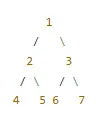
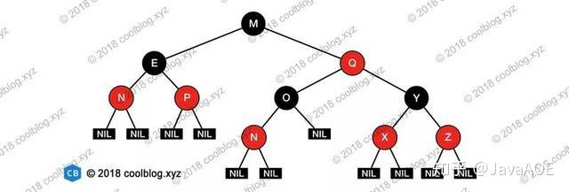

## CPP 算法与数据结构

- 常见数据结构
  - **数组 (Array)**:
    - 连续的内存空间存储一组相同类型的元素。
    - 支持根据下标快速访问元素,时间复杂度为O(1)。
    - 插入和删除元素的时间复杂度为O(n),需要移动其他元素。
    - 适用于需要快速访问元素的场景,如矩阵计算、图像处理等。
  - **链表 (Linked List)**:
    - 每个节点包含数据和指向下一个节点的指针。
    - 插入和删除元素的时间复杂度为O(1),但访问指定位置元素需要O(n)时间。
    - 适用于频繁插入/删除操作,或者链表长度不确定的场景,如实现栈、队列等。
  - **栈 (Stack)**:
    - 先进后出(LIFO)的数据结构。
    - 支持push、pop、peek等基本操作,时间复杂度为O(1)。
    - 适用于函数调用、表达式求值、撤销/重做等场景。
  - **队列 (Queue)**:
    - 先进先出(FIFO)的数据结构。
    - 支持enqueue、dequeue等基本操作,时间复杂度为O(1)。
    - 适用于任务调度、消息传递、缓存管理等场景。
  - **哈希表 (Hash Table)**:
    - 使用哈希函数将键值对映射到数组中的特定位置。
    - 支持快速的插入、删除和查找操作,平均时间复杂度为O(1)。
    - 适用于需要快速查找的场景,如缓存、字典、计数器等。
  - **二叉树 (Binary Tree)**:
    - 每个节点最多有两个子节点的树状数据结构。
    - 支持插入、删除、查找等操作,时间复杂度为O(log n)。
    - 适用于需要高效查找的场景,如搜索、排序、表达式求值等。
  - **图 (Graph)**:
    - 由节点(顶点)和边组成的网状数据结构。
    - 支持广度优先搜索(BFS)、深度优先搜索(DFS)等图算法。
    - 适用于表示社交网络、路由规划、地图导航等复杂关系。


### 排序

#### 冒泡排序 (大的放最后面)

- 冒泡排序，从前往后比较相邻元素，不断地将大的元素往后挪动, 完整扫描一次能确保**最后的元素是最大的**，下次扫描长度减一
- 稳定排序
- 平均时间复杂度O(n^2)
- 空间复杂度1, 只需一个额外空间
- 适合情况: 
  - 适用于数据量小或者已经部分排过序的情况

```cpp
/*
冒泡排序，从前往后比较相邻元素，完整扫描一次能确保最后的元素是最大的，下次扫描长度减一
数据长度n，总扫描次数n-1次，每次扫描比较 n-1-i次，i为当前扫描的序号
最坏情况和平均情况下需比较n(n-1)/2次，时间复杂度O(n^2),
最好情况比较n-1次，时间复杂度O(n)
比较后才决定是否互换，所以为稳定排序
只需一个额外空间，空间复杂度最佳
适用于数据量小或者已经部分排过序的情况
缺点：无论数据是否已排序完成，都会执行n(n-1)/2操作，所以在内层循环中加入一个flag帮助判断是否已经提前完成排序
*/
template<typename T, int N>
void sort_bubble(T (&data)[N])
{
     // 扫描次数，n-1次
    for(int i = 0; i < N-1; i++)           
    {
        // 用来判断提前结束排序的flag
        int flag = 0;

        // 每次扫描从头开始
        // 每次扫描的长度 n-1-i
        // 每次从头扫描, 直到已经排序好的最大值的区域
        for(int j = 0; j < N-1-i; j++)      
        {
             // 比较， 交换
            if(data[j] > data[j+1])        
            {
                T tmp;
                tmp = data[j];
                data[j] = data[j+1];
                data[j+1] = tmp;
                // flag > 0 说明有交换, ==0说明无交换,已完成排序
                flag++;
            }
        }

        // 判断是否已完成排序
        if(flag == 0)                       
        {
            break;
        }
        cout << "after " << i << ". bubble_sort: \n";
        print_data(data);   
    }

    cout << "=========" << endl;
}
```


#### 选择排序 (小的放最前面)

- 每次扫描把当前元素与后面所有元素对比，相当于把当前元素插入到后面所有元素中的合适位置,一次扫描中,交换后的元素继续与后续的元素比较
  - 相当于把当前元素之后的所有元素中最小的放前面

- 不是稳定排序
- 时间复杂度 O(n^2)
- 空间复杂度 1
- 适合情况: 
  - 适合数据量小或者部分数据已经排序的情况

```cpp
/*
选择排序
每次扫描把当前元素与后面所有元素对比，相当于把当前元素插入到后面所有元素中的合适位置,下次扫描从下一个开始
扫描N-1次，每次扫描比较N-1-i次，i为当前扫描序号
最好，平均，最坏情况都需比较n(n-1)/2次，时间复杂度O(n^2)
空间复杂度为1
排序每次扫描最大值或者最小值与最前方未排序的的键值交换，顺序有可能被改变，所以不是稳定排序
适合数据量小或者部分数据已经排序的情况
*/
template <typename T, int N>
void sort_select(T (&data)[N])
{
    // 扫描从0开始
    // 扫描 N-1次
    for(int i=0; i<N-1; i++)    
    {
         // 将 i 与后面的所有元素对比
        for(int j=i+1; j<N; j++)   
        {
            // 交换, 大的放后面
            // 交换后仍然继续这次扫描, 相当于把小的放到最前面
            if(data[i] > data[j])
            {
                T tmp;
                tmp = data[i];
                data[i] = data[j];
                data[j] = tmp;
            }
        }
        cout << "after " << i << ".select_sort: \n";
        print_data(data);
    }
    cout << "=========" << endl;

}

```


#### 插入排序 (先排序两个, 再插入后面的)

- 先将两个元素排序，再将后续元素一一插入到合适的位置
- 稳定排序
- 平均时间复杂度O(n^2)
- 空间复杂度O(1)
- 适合情况: 
  - 适用于大部分数据已经排序，或者在已排序的数据库中添加新数据
    插入排序会**造成大量搬移，建议使用链表储存**

```cpp
/*
插入排序
先将两个元素排序，再将后续元素一一插入到合适的位置
最坏以及平均情况需比较n(n-1)/2 时间复杂度O(n^2)
最好情况比较n次，时间复杂度O(n)
插入排序是稳定排序
只需一个额外空间，空间复杂度最佳
适用于大部分数据已经排序，或者在已排序的数据库中添加新数据
插入排序会造成大量搬移，建议使用链表
*/
template<typename T, int N>
void sort_insert(T (&data)[N])
{
    // 扫描 N-1次，从第二个元素开始扫描
    for(int i = 1; i < N; i++)              
    {
        // 将当前要插入的元素放入暂存区
        T tmp;
        tmp = data[i];                      
        
        // 已排序的区域从后往前挨个与暂存区的元素比较大小,如果大就后移
        // 相当于将暂存区插入到已排序的区域中
        // 这一步操作会造成大量搬移，建议使用链表
        int j = i - 1;                      // 前一个元素的位置
        while( j >= 0 && tmp < data[j])     
        {
            data[j+1] = data[j];            
            j--;                            
        }
        // 插入当前元素
        data[j+1] = tmp;                    

        cout << "after " << i << ".insert_sort: \n";
        print_data(data);
    }
}
```


#### 希尔排序 (将插入排序分成多次, 利用jump分隔区间)

- 原理是将数据区分成特定间隔的小区块，以插入排序法排完区块内的内容后，再减少间隔的距离
- 不是稳定排序
- 时间复杂度O(n^(3/2))
- 空间复杂度最佳
- 适合情况: 
  - 适用于大部分数据已经排序
  - 用以减少插入排序法中的数据搬移次数
  - 相当于将插入排序分成多次,

```cpp
/*
希尔排序法
用以减少插入排序法中的数据搬移次数
原理是将数据区分成特定间隔的小区块，以插入排序法排完区块内的内容后，再减少间隔的距离
首先将所有数据N分成Y份，用质数来划分，习惯选2，则获得N/2 = Y 份数据，每个区块中元素的间隔为Y
对区块内的内容排序后放回原位，接着缩小间隔再除以2，再用插入排序，重复该步骤

希尔排序法的分析
任何情况时间复杂度为 O(n^(3/2))
稳定排序
只需一个额外空间，空间复杂度最佳
适用于大部分数据都已排序的情况
*/
template<typename T, int N>
void sort_shell(T (&data)[N])
{
    int i;      //扫描次数
    int j;      //用j来定位比较的元素
    int k=1;    //计数
    T tmp;      //暂存
    int jmp;    //设置间距位移量

    jmp = N / 2;    // 初始化间距位移量    
    while(jmp != 0)
    {
        for(i = jmp; i < N; i++)
        {
            // 插入排序，间距为jmp
            tmp = data[i];  // 当前要插入的元素
            j = i - jmp;    // 前一个间隔距离的元素

            while(tmp < data[j] && j >= 0)  // 当前一个间隔距离的元素存在且比现在的元素大时
            {
                data[j+jmp] = data[j];      // 将前一个间隔距离的元素移到现在的距离
                j = j - jmp;                // 去看看更加前一个的间隔距离的元素
            }
            data[jmp+j] = tmp;              // 将现在的元素放在最前一个比现在元素小的位置上
        }

        jmp = jmp/2;    // 缩小间隔距离
        cout << "after " << k++ << ".shell_sort: \n";
        print_data(data);
    }
}
```


#### 快速排序 (找中间值, 左右分)

- 又称分割交换排序法，目前公认最佳的排序法，使用分而治之的方法
  在数据中找一个虚拟值，按照此虚拟值将所有数据分为两部分，
  小于中间值的放左边，大于中间值的放右边，重复此过程处理两边的数据，直到排序结束。

- 不是稳定排序法
- 时间复杂度为O(nlog_2(n))
- 空间复杂度为O(n)
- 特点
  - 快排对于重复数据不太擅长，查找i j时不能用<= 或者 >= 


```cpp
/*
快速排序
又称分割交换排序法，目前公认最佳的排序法，使用分而治之的方法
在数据中找一个虚拟值，按照此虚拟值将所有数据分为两部分，
小于中间值的放左边，大于中间值的放右边，重复此过程处理两边的数据，直到排序结束。

步骤：
假设有n个数据1 - n, 值为K1 - Kn

1 先假设K的值为第一个键值
2 从左到右找出Ki, 使得Ki > K
3 从右到左找出Kj, 使得Kj < K
4 如果 i<j, 那么Ki 与 Kj 互换，并回到步骤2
5 如果 i>=j, 那么K 与 Kj 互换，并以j为基准点分割成左右两部分，  (此时Kj 右边都比K 大，Kj左边都比K小)
  然后针对左右两边执行步骤1-5，直到左边键值等于右边键值 (使用)

分析：
最好以及平均情况下，时间复杂度为O(nlog_2(n))
最坏情况下，时间复杂度为O(n^2),每次挑中的中间值不是最大就是最小
快排不是稳定排序法
最坏情况下，空间复杂度为O(n),最好情况下，空间复杂度为O(log_2(n))
快排是平均运行时间最短的排序法。

快排对于重复数据不太擅长，查找i j时不能用<= 或者 >= 
尝试三相切割
*/

// 快速排序函数
void quicksort(vector<int>& arr, int left, int right) {
    // 检查左右边界索引
    if (left >= right) return;
	if (((left + right) / 2) > (arr.size() - 1))
    {
        return;
    }
    
    // 计算间隔值
    int pivot = arr[(left + right) / 2];
   
    // 同时进行左右索引的迭代, 直到两者相遇
    int i = left, j = right;
    while (i <= j) {
        // 左索引值小于间隔值, 左索引增加
        while (arr[i] < pivot) i++;
        // 右索引值大于间隔值, 右索引减少
        while (arr[j] > pivot) j--;
        
        // 当出现交换条件时, 并且两者还未相遇后离开, 交换两者
        if (i <= j) {
            swap(arr[i], arr[j]);
            // 交换后继续更新索引
            i++;
            j--;
        }
    }

    // 继续重复执行左右两边
    quicksort(arr, left, j);
    quicksort(arr, i, right);
}
```


#### 归并排序 (合并两个数组)

- 合并排序，归并排, 针对已排序好的两个或两个以上数据组，通过合并方式组合成大的排序好的数列
- 步骤：
  - N个长度为1的键值成对合并成N/2长度为2的键值组
  - N/2 长度为2的键值组成对合并成N/4长度为4的键值组
  - 将键值组不断合并，直到合并成长度为N的简直组

- 稳定排序法
- 平均时间复杂度O(nlog_2(n))
- 空间复杂度O(n)


```cpp
/*
合并排序，归并排
针对已排序好的两个或两个以上数据组，通过合并方式组合成大的排序好的数列
步骤：
1 N个长度为1的键值成对合并成N/2长度为2的键值组
2 N/2 长度为2的键值组成对合并成N/4长度为4的键值组
3 将键值组不断合并，直到合并成长度为N的简直组

分析：
最好，最坏，平均时间复杂度O(nlog_2(n))
空间复杂度O(n)，需要一个同样大小为N的额外空间
归并排是稳定排序法
*/
template<typename T, int N, int M>
void sort_merge(T (&data1)[N], T (&data2)[M], T (&data_merge)[N+M])
{
    int i = 0;  // data1 index
    int j = 0;  // data2 index
    int k = 0;  // data_merge index

    // 同时更新data1 data2的索引
    while(i < N && j < M)
    {
        // data1 更小
        // 将data1 加入data_merge
        // 更新 data1 index
        if(data1[i] <= data2[j])
        {
            data_merge[k] = data1[i];
            i++;    
        }
        // data2 更小
        // 将data2 加入data_merge
        // 更新 data2 index
        else
        {
            data_merge[k] = data2[j];
            j++;    
        }
        
        // 更新 data_merge 的索引
        k++;
    }

    // 继续将剩下的 data1 加入 data_merge
    while(i < N)
    {
        data_merge[k] = data1[i];
        k++;
        i++;
    }
    
    // 继续将剩下的data2 加入 data_merge
    while(j < N)
    {
        data_merge[k] = data2[j];
        k++;
        j++;
    }
}
```


#### 基数排序 (按照位数排序)

- 按照位数一层一层排序,先个位,再十位 再百位
- 稳定排序
- 时间复杂度O(nlog_p^(k), k为原始数据最大值
- 空间复杂度为O(n*p), n为原始数据个数，p是数据字符数(位数), **需要很大的额外空间存放列表数据**


```cpp
/*
基数排序 分配模式排序方式
分为 MSD(Most Significant Digit First), LSD(Least Significant Digit First)
MSD: 从最左位开始比较
LSD: 从最右边开始比较
分析：
所有情况下时间复杂度O(nlog_p^(k), k为原始数据最大值)
基数排序是稳定排序
基数排序需要很大的额外空间存放列表数据，空间复杂度为O(n*p), 
n为原始数据个数，p是数据字符数，若n很大，p固定或很小，则基数排序效率很高

*/
template<int N>
void sort_radix(int (&data)[N])
{
    // n为基数，从个位开始排序
    for(int n = 1; n <= 100; n=n*10)
    {
        // 暂存数组 [0-9][数据总个数]， 所有内容为0
        int tmp[10][100] = {0};

        // 对比所有数据
        for(int i=0; i<N; i++)
        {
            // m 为n位数的值，比如 36 个位数 36/1%10 = 6, 十位数 36/10%10 = 3
            int m = (data[i]/n)%10;
            tmp[m][i] = data[i];
        }

        int k=0;
        for(int i=0; i<10; i++)
        {
            for(int j=0; j<N; j++)
            {
                if(tmp[i][j] != 0)
                {
                    data[k] = tmp[i][j];
                    k++;
                }
            }
        }

        cout << "after " << n << " radix_sort: " << endl;
        print_data(data);
    }
}
```


#### 堆积树

堆积树是一种特殊的二叉树数据结构,它具有以下特性:

1. 堆积树是一棵完全二叉树。
2. 堆积树中的每一个节点的值都必须大于等于(或小于等于)其左右子节点的值。这就是所谓的"堆性质"。

根据满足堆性质的方式不同,堆积树可以分为两种类型:

1. 最大堆(Max Heap):每一个节点的值都大于等于其左右子节点的值。根节点的值最大。
2. 最小堆(Min Heap):每一个节点的值都小于等于其左右子节点的值。根节点的值最小。

堆积树有以下几种常见的操作:

1. 插入(Insert)：向堆中插入一个新的元素。
2. 删除(Delete)：从堆中删除指定的元素。
3. 构建(Build)：根据给定的一组元素,构建一个堆积树。
4. 调整(Heapify)：将一个二叉树调整为堆积树。
5. 取出最值(ExtractMax/ExtractMin)：从最大堆/最小堆中取出当前的最大/最小值。


```cpp
/**
 *  堆积树排序 heap sort
 *  一种特殊的二叉树排序，分为最大堆积树与最小堆积树
 *  所有情况下 时间复杂度为 O(nlog_2(n))
 *  堆积排序法不是稳定排序法
 *  只需要一个额外的空间，空间复杂度为O(1)
 */

/**
这个 C++ 实现包括了最大堆的基本操作:
insert(int value): 向堆中插入一个新元素。
extractMax(): 从堆中取出当前最大值。
print(): 打印出当前堆的元素。
在私有成员函数中, heapifyUp() 和 heapifyDown() 负责维护堆的性质。parent(), leftChild() 和 rightChild() 是一些辅助函数,用于计算节点的父节点和子节点的索引。

**/

#include <iostream>
#include <vector>

class MaxHeap {
public:
    MaxHeap() {}

    void insert(int value) {
        heap.push_back(value);
        heapifyUp(heap.size() - 1);
    }

    int extractMax() {
        if (heap.empty()) return -1;

        int maxVal = heap[0];
        heap[0] = heap.back();
        heap.pop_back();
        heapifyDown(0);
        return maxVal;
    }

    void print() {
        for (int num : heap) {
            std::cout << num << " ";
        }
        std::cout << std::endl;
    }

private:
    std::vector<int> heap;

    int parent(int i) {
        return (i - 1) / 2;
    }

    int leftChild(int i) {
        return 2 * i + 1;
    }

    int rightChild(int i) {
        return 2 * i + 2;
    }

    void heapifyUp(int i) {
        while (i != 0 && heap[parent(i)] < heap[i]) {
            std::swap(heap[i], heap[parent(i)]);
            i = parent(i);
        }
    }

    void heapifyDown(int i) {
        int largest = i;
        int left = leftChild(i);
        int right = rightChild(i);

        if (left < heap.size() && heap[left] > heap[largest])
            largest = left;
        if (right < heap.size() && heap[right] > heap[largest])
            largest = right;

        if (largest != i) {
            std::swap(heap[i], heap[largest]);
            heapifyDown(largest);
        }
    }
};

int main() {
    MaxHeap heap;
    heap.insert(10);
    heap.insert(20);
    heap.insert(15);
    heap.insert(12);
    heap.insert(18);

    std::cout << "Heap: ";
    heap.print();

    std::cout << "Extracting maximum: " << heap.extractMax() << std::endl;
    std::cout << "Heap after extraction: ";
    heap.print();

    return 0;
}
```


### 链表

- 链表的优点
  1. 动态内存分配:
     - 链表可以动态地分配和释放内存空间,这使得链表长度可以根据需要灵活变化。相比固定大小的数组,链表更加灵活。
  2. 插入和删除效率高:
     - 在链表中插入或删除元素,只需要修改相邻节点的指针,时间复杂度为O(1)。这在某些场景下比数组更加高效。
  3. 不需要预先知道大小:
     - 使用链表时,不需要预先知道需要存储的数据量大小。链表可以根据需要动态扩展。
  4. 实现简单:
     - 相比某些复杂的数据结构,链表的基本实现逻辑较为简单明了。这使得链表在教学和初级程序员中广泛使用。
  5. 节省内存空间:
     - 对于只需要存储少量数据的场景,链表可以避免数组中的内存浪费。
  6. 支持递归操作:
     - 链表的结构天生适合递归操作,这使得一些基于链表的算法实现更加简洁。
  7. 无需连续内存空间:
     - 链表中的节点可以散布在内存的不同位置,不需要像数组那样占用连续的内存空间。这在某些情况下更加灵活。

- 链表的缺点
  1. 内存碎片化:
     - 链表中的节点是动态分配的,它们在内存中是零散分布的。这会导致内存碎片化,造成内存利用率降低。
  2. 访问效率低:
     - 要访问链表中的某个元素,需要从头部开始逐个遍历链表,直到找到目标元素。这种线性搜索的时间复杂度为O(n),效率较低。随机访问效率较差。
  3. 空间开销大:
     - 每个链表节点除了存储数据,还需要存储指向下一个节点的指针。这会增加额外的空间开销,相比于数组,链表的空间利用率较低。
  4. 不支持索引访问:
     - 数组可以通过索引直接访问任意元素,而链表只能通过遍历才能找到目标元素。这使得链表不适合需要随机访问的场景。
  5. 难以调试:
     - 由于链表节点是动态分配的,很难直观地查看和理解链表的结构。这会给调试和问题查找带来一定困难。
  6. 增删效率一般:
     - 在链表中插入或删除元素时,需要修改相邻节点的指针,时间复杂度为O(1)。但如果要在链表的中间位置插入或删除,则需要先遍历到目标位置,时间复杂度为O(n)。


#### 普通链表 LinkList OOP

普通链表(Singly Linked List)是最基础的链表结构,每个节点只包含一个指向下一个节点的指针。它具有以下特点:

1. 单向遍历:
   - 只能从头节点开始顺序遍历到尾节点。
   - 无法直接从尾节点向头节点遍历。
2. 删除操作较为简单:
   - 删除某个节点时,只需要修改前一个节点的 next 指针即可。
3. 插入操作灵活:
   - 可以在任意位置插入新节点,只需要修改相邻节点的 next 指针即可。
4. 空间开销较小:
   - 每个节点只需要存储一个 next 指针,因此空间开销较小。


- 链表节点

  ```cpp
  //链表结点
  typedef struct LINKNODE{
      void* data; // 指向任意类型的数据
      struct LINKNODE* next;
  }LinkNode;
  
  // 打印函数指针
  typedef void(*PRINTLINKNODE)(void*);
  ```

- 类结构

  ```cpp
  class LinkList {
  private:
      LinkNode *head;	// 头节点
      int size; // 
  public:
      // 初始化使用无参数构造器代替！
      LinkList();
  
      // 释放链表内存由析构函数代替！
      ~LinkList();
  
      // 指定位置插入
      void insert_linkList(int pos, void* data);
  
      // 删除指定位置的值
      void remove_linkList_pos(int pos);
  
      // 获得链表的长度
      int get_size() const;
  
      // 查找元素值位置
      int find_linkList(void* data);
  
      // 返回第一个结点
      void *get_front();
  
      // 打印
      void print_linkList(PRINTLINKNODE print);
  };
  ```

- 构造与析构

  ```cpp
  /**
   * @brief Construct a new Link List:: Link List object
   *
   */
  LinkList::LinkList(){
      head = new LinkNode;
      size = 0;
      // 头结点不保存数据信息
      head->data = nullptr;
      head->next = nullptr;
  }
  
  /**
   * @brief Destroy the Link List:: Link List object
   * 释放链表内存由析构函数代替
   * 从头结点开始依次释放后续结点的内存
   */
  LinkList::~LinkList() {
      if (head == nullptr){
          return;
      }
      auto *pCurrent = head;
      while (pCurrent != nullptr){
          // 缓存下一个结点指针
          auto *pNext = pCurrent->next;
          
          // 删除当前结点的内存
          delete pCurrent;
          
          // 前往下个结点
          pCurrent = pNext;
      }
      size = 0;
      std::cout << "delete LinkList!" << std::endl;
  }
  ```

- 指定位置插入

  ```cpp
  /**
   * @brief 指定位置插入
   *
   * @param pos
   * @param data
   */
  void LinkList::insert_linkList(int pos, void* data){
      if (head == nullptr){
          return;
      }
      if (data == nullptr){
          return;
      }
      // 友好处理，pos越界
      if (pos < 0 ||pos > size){
          pos = size;
      }
      // 创建新结点
      auto * newNode = new LinkNode;
      newNode->data = data;
      newNode->next = nullptr;
  
      // 找结点
      // 辅助指针变量
      auto *pCurrent = head;
      for (int i = 0; i < pos; ++i) {
          pCurrent = pCurrent->next;
      }
      // 新结点入链表
      newNode->next = pCurrent->next;
      pCurrent->next = newNode;
      
      // 更新size
      size++;
  }
  ```

- 删除指定位置的值

  ```cpp
  /**
   * @brief 删除指定位置的值
   *
   * @param pos
   */
  void LinkList::remove_linkList_pos(int pos){
      // check head
      if (head == nullptr){
          return;
      }
      
      // check pos
      if (pos < 0 || pos >= size){
          return;
      }
      
      // find pos node
      auto *pCurrent = head;
      for (int i = 0; i < pos; ++i) {
          pCurrent = pCurrent->next;
      }
      
      // 越过删除的结点
      auto *pDel = pCurrent->next;
      pCurrent->next = pDel->next;
      
      // 删除结点内存
      delete pDel;
      size --;
  }
  ```

- 获得链表长度

  ```cpp
  /**
   * @brief 获得链表的长度
   *
   * @return int
   */
  int LinkList::get_size() const{
      return size;
  }
  ```

- 查找元素位置

  ```cpp
  /**
   * @brief 查找元素值位置
   * 遍历找到对应位置
   * @param data
   * @return int
   */
  int LinkList::find_linkList(void* data){
      if (head == nullptr){
          return -1;
      }
      if (data == nullptr){
          return -1;
      }
  
      auto *pCurrent = head->next;
      int i = 0;
      while (pCurrent != nullptr){
          if (pCurrent->data == data){
              return i;
          }
          pCurrent = pCurrent->next;
          i++;
      }
      return -1;
  }
  ```

- 打印

  ```cpp
  // 打印
  void print_LinkList(LinkList* list, PRINTLINKNODE print)
  {
      // check args
      if(list == NULL)
      {
          return;
      }
  
      // 遍历
      LinkNode* pCurrent = list->head->next;
      while(pCurrent != NULL)
      {
          print(pCurrent->data);
          pCurrent = pCurrent->next;
      }
  
  }
  ```

- 释放链表内存

  ```cpp
  // 释放链表内存
  void freeSpace_LinkList(LinkList* list)
  {
      // check args
      if(list == NULL)
      {
          return;
      }
  
      // 遍历
      LinkNode* pCurrent = list->head;
      while(pCurrent != NULL)
      { 
          // 缓存下一个节点
          LinkNode* pNext = pCurrent->next;
          delete pCurrent;
          pCurrent = pNext;
      }
  
      // 释放链表内存
      list->size = 0;
      delete list;
  }
  ```

- 返回第一个结点

  ```cpp
  /**
   * @brief 返回第一个结点的数据
   *
   * @return void*
   */
  void *LinkList::get_front(){
      return head -> next ->data;
  }
  ```

- 打印

  ```cpp
  /**
   * @brief 打印
   *
   * @param print
   */
  void LinkList::print_linkList(PRINTLINKNODE print){
      if (head == nullptr){
          return;
      }
      auto *pCurrent = head->next;
      while (pCurrent != nullptr){
          print(pCurrent->data);
          pCurrent = pCurrent ->next;
      }
  
  }
  ```


#### 循环链表 LinkListCircle

- 循环链表是一种特殊的单向链表,其最后一个节点的 next 指针指向链表的头节点,形成一个闭环。循环链表有以下特点:

  1. 没有开始和结束:
     - 在循环链表中,没有明确的头节点和尾节点,最后一个节点的 next 指针指向链表的第一个节点。
  2. 遍历方式灵活:
     - 可以从任意节点开始遍历整个链表,直到回到起始点。
     - 可以顺时针或逆时针遍历链表。
  3. 应用场景:
     - 循环事件调度
     - 处理循环队列
     - 约瑟夫环问题

  常见的操作包括:

  1. 创建循环链表
     - 尾部与头指针链接
  2. 插入节点
  3. 删除节点
  4. 遍历链表
     - 通过判断是否等于头指针来结束遍历

- C++ GPT

  ```c++
  struct Node {
      int data;
      Node* next;
  };
  
  // 创建循环链表
  Node* createCircularLinkedList(int n) {
      if (n <= 0) return nullptr;
      Node* head = new Node{0, nullptr};
      Node* curr = head;
      for (int i = 1; i < n; i++) {
          curr->next = new Node{i, nullptr};
          curr = curr->next;
      }
      // 尾部与头指针链接
      curr->next = head;
      return head;
  }
  
  // 遍历循环链表
  // 通过判断是否等于头指针来结束遍历
  void traverseCircularLinkedList(Node* head) {
      if (!head) return;
      Node* curr = head;
      do {
          std::cout << curr->data << " ";
          curr = curr->next;
      } while (curr != head);
      std::cout << std::endl;
  }
  
  int main() {
      Node* head = createCircularLinkedList(5);
      traverseCircularLinkedList(head);
      // Output: 0 1 2 3 4
      return 0;
  }
  ```


#### 双向链表 LinkListDouble

- 双向链表(double-linked list)是一种特殊的链表结构,每个节点都包含两个指针:一个指向前一个节点,一个指向后一个节点。与单向链表相比,双向链表具有以下特点:
  1. 双向遍历:
     - 可以从头节点向尾节点遍历,也可以从尾节点向头节点遍历。
  2. 删除操作更方便:
     - 删除某个节点时,不仅需要找到该节点,还需要修改前一个节点的 next 指针和后一个节点的 prev 指针。
  3. 插入操作更灵活:
     - 可以在任意位置插入新节点,只需要修改相邻节点的指针即可。
  4. 空间开销增加:
     - 相比单向链表,每个节点需要存储一个额外的 prev 指针,因此空间开销会增加。

- C++ GPT

  ```cpp
  struct Node {
      int data;
      Node* prev;	// 前向指针
      Node* next;	// 后向指针
  };
  
  // 创建双向链表
  Node* createDoublyLinkedList(int n) {
      // check n
      if (n <= 0) return nullptr;
      
      // head
      Node* head = new Node{0, nullptr, nullptr};
      
      // tail
      Node* tail = head;
      
      // insert node between head and tail
      for (int i = 1; i < n; i++) {
          // 这里指明了该结点前向和后向的指针
          tail->next = new Node{i, tail, nullptr};
          tail = tail->next;
      }
      return head;
  }
  
  // 遍历双向链表
  void traverseDoublyLinkedList(Node* head) {
      Node* curr = head;
      
      // 前向
      std::cout << "Forward: ";
      while (curr) {
          std::cout << curr->data << " ";
          curr = curr->next;
      }
      std::cout << std::endl;
  
  	// 后向
      std::cout << "Backward: ";
      // 先到达尾部
      curr = head;
      while (curr->next) {
          curr = curr->next;
      }
      // 从尾部往头部走
      while (curr) {
          std::cout << curr->data << " ";
          curr = curr->prev;
      }
      std::cout << std::endl;
  }
  
  int main() {
      Node* head = createDoublyLinkedList(5);
      traverseDoublyLinkedList(head);
      // Output:
      // Forward: 0 1 2 3 4
      // Backward: 4 3 2 1 0
      return 0;
  }
  ```

  


#### 链式队列 LinkQueue OOP

链式队列(Linked Queue)是使用链表实现的队列数据结构。它具有以下特点:

1. 动态内存分配:
   - 链表可以根据需要动态地分配和释放内存,不需要预先确定队列的大小。
2. 插入和删除操作灵活:
   - 在队列的尾部插入新元素,在队列的头部删除元素,时间复杂度都是 O(1)。
3. 链表实现简单:
   - 只需要维护两个指针,一个指向队列的头部(front)，一个指向队列的尾部(rear)


- CPP OOP

  - 类定义

    ```cpp
    /*
    这里使用了企业链表的思路, 分离了链表与数据
    */
    
    // 链式队列的结点
    typedef struct LINKNODE{
        struct LINKNODE* next;
    }LinkNode;
    
    class LinkQueue {
    private:
        LinkNode head{};
        int size;
    public:
        // 初始化方法使用无参数构造器代替
        LinkQueue();
    
        // 销毁队列使用析构函数代替
        ~LinkQueue();
    
        // 入队
        void push_linkQueue(LinkNode* data);
    
        // 返回队头元素
        void* front_linkQueue() const;
    
        // 出队
        void pop_linkQueue();
    
        // 返回队尾元素
        void* back_linkQueue();
    
        // 返回大小
        int get_size() const;
    
        // 清空队列
        void clear_linkQueue();
    };
    ```

  - 实现

    ```cpp
    // 初始化方法使用无参数构造器代替
    LinkQueue::LinkQueue(){
        head.next = nullptr;
        size = 0;
    }
    
    // 销毁队列使用析构函数代替
    LinkQueue::~LinkQueue(){
        // 结点中没有使用new创建的元素，无需处理
        std::cout << "free LinkQueue!" << std::endl;
    }
    
    // 入队
    void LinkQueue::push_linkQueue(LinkNode* data){
        if (data == nullptr){
            return;
        }
        
        // check size == 0
        if (size == 0){
            head.next = data;
            size ++;
            return;
        }
        
        // 元素放到队尾
        LinkNode *pCurrent = &head;
        for (int i = 0; i < size; ++i) {
            pCurrent = pCurrent->next;
        }
        pCurrent ->next = data;
        data->next = nullptr;
        size++;
    }
    
    // 返回队头元素
    void* LinkQueue::front_linkQueue() const{
        if (size == 0){
            return nullptr;
        }
        return head.next;
    }
    
    // 出队
    void LinkQueue::pop_linkQueue(){
        if (size == 0){
            return;
        }
        LinkNode *pNext = head.next;
        head.next = pNext->next;
        size --;
    }
    
    // 返回队尾元素
    void* LinkQueue::back_linkQueue(){
        if (size == 0){
            return nullptr;
        }
        
        // 遍历到队尾
        LinkNode *pCurrent = &head;
        for (int i = 0; i < size; ++i) {
            pCurrent = pCurrent->next;
        }
        return pCurrent;
    }
    
    // 返回大小
    int LinkQueue::get_size() const{
        return size;
    }
    
    // 清空队列
    void LinkQueue::clear_linkQueue(){
        if (size == 0){
            return;
        }
        head.next = nullptr;
        size = 0;
    }
    ```

  - 测试

    ```cpp
    #include <iostream>
    #include "LinkQueue.h"
    #include <cstring>
    
    typedef struct PERSON{
        LinkNode node;
        char name[64];
        int age;
    }Person;
    
    int main() {
        // 创建队列
        LinkQueue queue;
    
        // 创建数据
        Person p1, p2, p3, p4, p5;
        strcpy(p1.name, "aaa");
        strcpy(p2.name, "bbb");
        strcpy(p3.name, "ccc");
        strcpy(p4.name, "ddd");
        strcpy(p5.name, "eee");
        p1.age = 10;
        p2.age = 20;
        p3.age = 30;
        p4.age = 40;
        p5.age = 50;
    
        // 数据入队列
        queue.push_linkQueue((LinkNode*)&p1);
        queue.push_linkQueue((LinkNode*)&p2);
        queue.push_linkQueue((LinkNode*)&p3);
        queue.push_linkQueue((LinkNode*)&p4);
        queue.push_linkQueue((LinkNode*)&p5);
    
        // 输出队尾元素
        auto backPerson = (Person*)queue.back_linkQueue();
        std::cout << "Name:" << backPerson->name << " Age:" << backPerson->age << std::endl;
    
        // 输出
        while (queue.get_size() > 0){
            // 取队头元素
            auto p = (Person*)queue.front_linkQueue();
            std::cout << "Name:" << p->name << " Age:" << p->age << std::endl;
            // 从队头弹出元素
            queue.pop_linkQueue();
        }
        // 自动调用析构函数
    
        return 0;
    }
    
    ```


#### 链式栈 LinkStack OOP

链式栈是一种使用链表实现的栈数据结构。在链式栈中,每个节点都包含数据元素和指向下一个节点的指针。新元素被添加到链表的头部,成为栈顶元素。当需要删除元素时,也是从链表头部删除。

链式栈的主要特点包括:

1. 动态内存分配: 链式栈可以根据需要动态地分配和释放内存空间,不需要事先确定栈的大小。
2. 灵活的扩展性: 链式栈可以无限地扩展,不受固定容量的限制。
3. 高效的插入和删除: 在链式栈中,在栈顶插入和删除元素的时间复杂度都是O(1)。
4. 节点指针的维护: 链式栈需要额外的空间来存储每个节点的指针信息。


- CPP OOP

  - 类定义

    ```cpp
    // 链式栈的结点
    typedef struct LINKNODE{
        struct LINKNODE* next;
    }LinkNode;
    
    // 链式栈
    // 头部作为栈顶，可直接插入或删除，无需遍历
    class LinkStack {
    private:
        LinkNode head{};
        int size;
    public:
        // 初始化方法使用无参数构造器代替！
        LinkStack();
    
        // 销毁栈使用析构函数代替！
        ~LinkStack();
    
        // 入栈
        void push_linkStack(LinkNode* data);
    
        // 出栈
        void pop_linkStack();
    
        // 返回栈顶元素
        LinkNode* top_linkStack() const;
    
        // 返回栈元素个数
        int get_size()const;
    
        // 清空栈
        void clear_linkStack();
    };
    ```

  - 实现

    ```cpp
    #include <iostream>
    #include "LinkStack.h"
    
    // 初始化方法使用无参数构造器代替！
    LinkStack::LinkStack(){
        head.next = nullptr;
        size = 0;
    }
    
    LinkStack::~LinkStack() {
        // 结点中没有使用new创建的元素，无需处理
        std::cout << "free LinkStack!" << std::endl;
    }
    
    // 入栈
    void LinkStack::push_linkStack(LinkNode* data){
        if (data == nullptr){
            return;
        }
        
        // 加入到头部
        data ->next = head.next;
        head.next = data;
        size ++;
    }
    
    // 出栈
    void LinkStack::pop_linkStack(){
        if (size == 0){
            return;
        }
    
        // 第一个有效结点
        LinkNode *pNext = head.next;
        head.next = pNext->next;
        size --;
    
    }
    
    // 返回栈顶元素
    LinkNode* LinkStack::top_linkStack() const{
        if (size == 0){
            return nullptr;
        }
        return head.next;
    }
    
    // 返回栈元素个数
    int LinkStack::get_size()const{
        return size;
    }
    
    // 清空栈
    void LinkStack::clear_linkStack(){
        if (size == 0){
            return;
        }
        head.next = nullptr;
        size = 0;
    }
    
    ```

  - 测试

    ```cpp
    #include <iostream>
    #include "LinkStack.h"
    #include <cstring>
    
    typedef struct PERSON{
        LinkNode node;
        char name[64];
        int age;
    }Person;
    
    int main() {
        // 创建栈
        LinkStack stack;
    
        // 创建数据
        Person p1, p2, p3, p4, p5;
        strcpy(p1.name, "aaa");
        strcpy(p2.name, "bbb");
        strcpy(p3.name, "ccc");
        strcpy(p4.name, "ddd");
        strcpy(p5.name, "eee");
    
        p1.age = 10;
        p2.age = 20;
        p3.age = 30;
        p4.age = 40;
        p5.age = 50;
    
        // 入栈
        stack.push_linkStack((LinkNode*)&p1);
        stack.push_linkStack((LinkNode*)&p2);
        stack.push_linkStack((LinkNode*)&p3);
        stack.push_linkStack((LinkNode*)&p4);
        stack.push_linkStack((LinkNode*)&p5);
    
        while (stack.get_size() > 0){
            // 取出栈顶元素
            auto *p = (Person *)stack.top_linkStack();
            std::cout << "Name:" << p->name << " Age:" << p->age << std::endl;
            // 弹出栈顶元素
            stack.pop_linkStack();
        }
    
        // 自动析构，销毁stack
    
        return 0;
    }
    
    ```

    

  

#### 反转链表 reverse LinkList

- 反转链表是一种常见的链表操作,它可以将一个单链表的顺序反转过来。这个操作在一些常见的算法和数据结构问题中都会用到,比如回文链表的判断、链表的逆序输出等。

- CPP GPT

  ```cpp
  // 链表节点的定义
  struct ListNode {
      int val;
      ListNode* next;
      
      // 构造器
      ListNode(int x) : val(x), next(NULL) {}
  };
  
  // 反转链表的函数
  ListNode* reverseList(ListNode* head) {
      
      // 需要两个指针
      ListNode* prev = NULL;	// 前指针
      ListNode* curr = head;	 // 现指针
      
      // 遍历到原始链表的尾部
      while (curr != NULL) {
          // 取出下一节点
          ListNode* next_node = curr->next;
          
          // 当前节点指向前一个节点
          curr->next = prev;
          
          // 更新前指针
          prev = curr;
          
          // 更新现指针
          curr = next_node;
      }
      
      return prev;
  }
  
  // 测试代码
  int main() {
      // 创建一个链表: 1 -> 2 -> 3 -> 4 -> 5
      ListNode* head = new ListNode(1);
      head->next = new ListNode(2);
      head->next->next = new ListNode(3);
      head->next->next->next = new ListNode(4);
      head->next->next->next->next = new ListNode(5);
      
      // 反转链表
      ListNode* new_head = reverseList(head);
      
      // 输出反转后的链表
      ListNode* curr = new_head;
      while (curr != NULL) {
          std::cout << curr->val << " ";
          curr = curr->next;
      }
      
      return 0;
  }
  ```
  
  


### 动态数组

动态数组的含义是指可以在运行时动态调整大小的数组数据结构。这与固定大小的传统数组不同,动态数组能够根据需要自动扩展或缩减其容量。

动态数组的主要特点包括:

1. 动态分配内存:
   - 动态数组在创建时不需要预先指定固定的大小。
   - 当需要存储更多元素时,动态数组可以自动分配更多的内存空间。
   - 当不再需要某些元素时,动态数组可以自动释放相应的内存空间。
2. 灵活的大小调整:
   - 动态数组的大小可以在程序运行时根据需求动态增加或减少。
   - 这种灵活性使得动态数组非常适合处理未知大小或变化的数据集。
3. 简化编程:
   - 使用动态数组可以大大简化数组管理的复杂性。
   - 程序员不需要手动分配和释放内存,也不需要担心数组大小是否足够。

在 C++ 标准库中,`std::vector` 就是一种常用的动态数组实现。它提供了一系列方法,如 `push_back()`、`resize()`、`erase()` 等,用于高效地操作动态数组。


- CPP OOP实现

  - 类定义

    ```cpp
    #include <iostream>
    #include <string>
    #include <cstdlib>
    
    class DynamicArray {
    private:
        int *pAddr;
        int size;		// 大小
        int capacity;	// 容量
    
    public:
        DynamicArray();
        ~DynamicArray();
        void push_back_array(int value);
        void remove_array_pos(int pos);
        void remove_array_val(int value);
        void clear_array();
        int find_array(int value);
        void print_array();
        int get_capacity() const;
        int get_size() const;
        int at_array(int pos);
        bool at_array(int pos, int& value);
    
    };
    ```

  - 实现

    ```cpp
    #include "DynamicArray.h"
    
    // 构造
    DynamicArray::DynamicArray(){
        pAddr = nullptr;
        size = 0;
        capacity = 20;
        
        // 开辟内存
        pAddr = new int[capacity];
    }
    
    // 销毁array使用析构函数代替
    DynamicArray::~DynamicArray() {
        delete[] pAddr;
        std::cout << "free array!" << std::endl;
    }
    
    // 添加新元素到尾部
    void DynamicArray::push_back_array(int value){
        // 检查地址初始化
        if (pAddr == nullptr){
            return;
        }
        
        // 检查容量 开辟新地址
        if (size == capacity){
            // 开辟两倍内存
            int *newAddr = new int[2*capacity];
            memcpy(newAddr, pAddr, capacity*sizeof(int));
            
            // 更新地址
            delete [] pAddr;
            pAddr = newAddr;
            
           	// 更新容量
            capacity = capacity * 2;
        }
        
        // 加入新元素到末尾
        pAddr[size] = value;
        
        // 更新元素数量
        size ++;
    }
    
    // 删除对应地址的元素
    void DynamicArray::remove_array_pos(int pos){
        // check pAddr
        if (pAddr == nullptr){
            return;
        }
        
        // check pos range
        if (pos < 0 || pos >= size){
            return;
        }
        
        // 将该地址后面的元素往前移动一位
        for (int i = pos; i < size - 1; ++i) {
            pAddr[i] = pAddr[i+1];
        }
        
        // 减少元素数量
        size --;
    }
    
    // 删除对应值的元素
    void DynamicArray::remove_array_val(int value){
        // check pAddr
        if (pAddr == nullptr){
            return;
        }
        
        // 找到对应地址
        int pos = find_array(value);
        
        // 删除对应地址的元素
        remove_array_pos(pos);
    }
    
    // 简单将大小设置为0即可, 之后的新数据直接覆盖
    void DynamicArray::clear_array() {
        size = 0;
    }
    
    // 找到对应值的地址
    int DynamicArray::find_array(int value){
        // check pAddr
        if (pAddr == nullptr){
            return -1;
        }
        
        // 找到第一个对应值的地址
        int pos = -1;
        for (int i = 0; i < size; ++i) {
            if (pAddr[i] == value){
                pos = i;
                break;
            }
        }
        return pos;
    }
    
    // 打印
    void DynamicArray::print_array(){
        if (pAddr == nullptr){
            return;
        }
        for (int i = 0; i < size; ++i) {
            std::cout << pAddr[i] << " ";
        }
        std::cout << std::endl;
    }
    
    // 获取容量
    int DynamicArray::get_capacity() const{
        return capacity;
    }
    
    // 获取大小
    int DynamicArray::get_size() const{
        return size;
    }
    
    // 根据地址获取值
    // 通过引用获取值, 返回值表示是否成功
    bool DynamicArray::at_array(int pos, int& value){   
        // check pAddr pos
        if (pAddr == nullptr || pos >= size || pos >= capacity || pos < 0){
            return false;
        }
        
        value = pAddr[pos];
        return true;
    }
    ```

    


### 树

#### 二叉树 BiTree

##### 二叉树介绍

二叉树是一种树形数据结构,它的每个节点最多有两个子节点,分别称为左子节点和右子节点。二叉树具有以下特点:

1. 每个节点最多有两个子节点。
2. 左子树和右子树都是二叉树。
3. 左子树和右子树的次序不能颠倒。


##### 二叉树遍历

- 前序遍历(根左右)
  - 访问根节点
  - 递归地遍历左子树
  - 递归地遍历右子树
  - [1, 2, 4, 5, 3, 6, 7]
- 中序遍历(左根右)
  - 递归地遍历左子树
  - 访问根节点
  - 递归地遍历右子树
  - [4, 2, 5, 1, 6, 3, 7]
- 后序遍历(左右根)
  - 递归地遍历左子树
  - 递归地遍历右子树
  - 访问根节点
  - [4, 5, 2, 6, 7, 3, 1]



##### 二叉树 CPP 实现

- 定义

  ```cpp
  // 二叉树节点
  typedef struct BINARYNODE
  {
      char ch;
      struct BINARYNODE* lchild;
      struct BINARYNODE* rchild;
  }BinaryNode;
  
  // 递归先序遍历
  void Recursion_preorder(BinaryNode* root);
  
  // 递归中序遍历
  void Recursion_inorder(BinaryNode* root);
  
  // 递归后序遍历
  void Recursion_postorder(BinaryNode* root);
  
  // 获取叶子节点数目，即没有子节点的节点
  void getLeafNum(BinaryNode* root, int &num);
  
  // 获取二叉树高度
  void getTreeHeight(BinaryNode* root, int &height);
  
  // 拷贝二叉树
  BinaryNode* CopyBinaryTree(BinaryNode* root);
  
  // 释放二叉树
  void FreeSpaceBinaryTree(BinaryNode* root);
  ```

- 实现

  ```cpp 
  #include "BinaryTree.h"
  
  // 释放二叉树
  void FreeSpaceBinaryTree(BinaryNode* root)
  {
      // check NULL
      if (root == NULL)
      {
          return;
      }
  
      // 后序遍历释放二叉树
      FreeSpaceBinaryTree(root->lchild);
      FreeSpaceBinaryTree(root->rchild);
      printf("free %c\n", root->ch);
      free(root);
  }
  
  // 拷贝二叉树
  BinaryNode* CopyBinaryTree(BinaryNode* root)
  {
      // check NULL
      if (root == NULL)
      {
          return NULL;
      }
  
      // 先序便利拷贝
      BinaryNode* tree_node = (BinaryNode*) malloc(sizeof(BinaryNode));
      tree_node->ch = root->ch;
      tree_node->lchild = CopyBinaryTree(root->lchild);
      tree_node->rchild = CopyBinaryTree(root->rchild);
  
      return tree_node;
  }
  
  // 递归先序遍历
  void Recursion_preorder(BinaryNode* root)
  {
      // check NULL to exit recursion
      if (root == NULL)
      {
          return;
      }
  
      // 先序遍历 根左右
      printf("%c", root->ch);     // root
      Recursion_preorder(root->lchild);    // left child
      Recursion_preorder(root->rchild);    // right child
  }
  
  // 递归中序遍历
  void Recursion_inorder(BinaryNode* root)
  {
      // check NULL to exit recursion
      if (root == NULL)
      {
          return;
      }
  
      // 中序遍历 左根右
      Recursion_inorder(root->lchild);       // left child
      printf("%c", root->ch);                 // root
      Recursion_inorder(root->rchild);       // right child
  }
  
  // 递归后序遍历
  void Recursion_postorder(BinaryNode* root)
  {
      // check NULL to exit recursion
      if (root == NULL)
      {
          return;
      }
  
      // 后序遍历 左右根
      Recursion_postorder(root->lchild);    // left child
      Recursion_postorder(root->rchild);    // right child
      printf("%c", root->ch);     // root
  }
  
  // 获取叶子节点数目，即没有子节点的节点
  void getLeafNum(BinaryNode* root, int &num)
  {
      // check root null
      if (root == NULL) 
      {
          return;
      }
  
      // 如果当前节点没有子节点
      if (root->lchild == NULL &&
          root->rchild == NULL)
      {
          num++;
      }
      
      // 如果当前节点有子节点，看子节点是否是叶子
      getLeafNum(root->lchild, num);
      getLeafNum(root->rchild, num);
  }
  
  // 获取二叉树高度
  void getTreeHeight(BinaryNode* root, int &height)
  {
      // check root null
      if (root == NULL) 
      {
          return;
      }
  
      // 当前高度+1
      height++;
  
      // 检查左子树
      int l_height = 0;
      getTreeHeight(root->lchild, l_height);
  
      // 检查右子树高度
      int r_height = 0;
      getTreeHeight(root->rchild, r_height);
  
      // 比较左右子树高度, 大的加到总高度中
      if (l_height > r_height)
      {
          height += l_height;
      }
      else
      {
          height += r_height;
      }
  }
  ```
  
  


##### 二叉树CPP OOP实现

- 类定义

  ```cpp
  // 二叉树 叶节点
  typedef struct BINARYNODE{
      char ch;
      struct BINARYNODE * lchild;
      struct BINARYNODE * rchild;
  }BinaryNode;
  
  // 二叉树栈节点
  typedef struct BITREESTACKNODE{
      BinaryNode *root;
      bool flag;
  }BiTreeStackNode;
  
  // 二叉树类
  class BinaryTree {
  private:
      // 根节点
      BinaryNode *root;
  
  public:
      BinaryTree();
      ~BinaryTree();
  
      // 创建 无参
      void createBinaryTree();
  
      // 创建 有参
      void createBinaryTree(char* nodeSeq, size_t num);
  
      // 先序遍历递归实现
      void recursion();
  
      // 先序遍历非递归实现，借助STL中的stack实现
      void nonRecursion();
      
      // 计算叶子结点数目
      void calculateLeafNum();
  
      // 计算二叉树的高度，对应视频无法观看，自己实现
      void calculateTreeHeight();
  
      // 序列化
      std::string serializeTree();
  
      // 反序列化
      void deserializeTree(const std::string &treeSeq);
  
      // 重载赋值运算符，实现拷贝
      BinaryTree& operator=(const BinaryTree &tree);
  
  private: // 静态方法
      // 静态 // 先序遍历递归实现
      static void _recursion(BinaryNode* currentRoot);
      
      // 静态 清空
      static void _freeBinaryTree(BinaryNode* currentRoot);
      
      // 静态 计算叶子结点数目
      static void _calculateLeafNum(BinaryNode* currentRoot, int& num);
      static void _calculateTreeHeight(BinaryNode* currentRoot, int& height);
  
      // 静态 拷贝 方式1, 繁琐
      static void _copyBinaryTree(BinaryNode* currentRoot, BinaryNode** copyRoot);
  
      // 静态 拷贝 方式2 简洁
      static BinaryNode* _copyBinaryTree(BinaryNode* currentRoot);
  
      // 静态 创建
      static BinaryNode* _createBinaryTree(const char* nodeSeq, size_t num, int &pos);
      
      // 静态 序列化
      static std::string _serializeTree(BinaryNode* currentRoot);
      
      // 静态 反序列化
      static BinaryNode* _deserializeTree(const std::string &treeSeq, int &pos);
  };
  
  ```

- 实现

  ```cpp
  #include <iostream>
  #include "BinaryTree.h"
  #include <stack>
  
  // 构造二叉树
  BinaryTree::BinaryTree() {
      root = nullptr;
  }
  
  // 析构二叉树
  BinaryTree::~BinaryTree() {
      std::cout << "\n-------------------" << std::endl;
      std::cout << "free BinaryTree: ";
      
      // 调用静态方法
      _freeBinaryTree(root);
  }
  
  // 创建 无参
  void BinaryTree::createBinaryTree() {
      // 创建结点
      // 这里必须使用new, 否则构造完成后各node会自动销毁！
      // 使用new之后，虽不会被自动销毁，但是必须手动在析构函数中释放内存！
      auto *node1 = new BinaryNode{'A', nullptr, nullptr};
      auto *node2 = new BinaryNode{'B', nullptr, nullptr};
      auto *node3 = new BinaryNode{'C', nullptr, nullptr};
      auto *node4 = new BinaryNode{'D', nullptr, nullptr};
      auto *node5 = new BinaryNode{'E', nullptr, nullptr};
      auto *node6 = new BinaryNode{'F', nullptr, nullptr};
      auto *node7 = new BinaryNode{'G', nullptr, nullptr};
      auto *node8 = new BinaryNode{'H', nullptr, nullptr};
  
      // 建立结点关系
      node1->lchild = node2;
      node1->rchild = node6;
      node2->rchild = node3;
      node3->lchild = node4;
      node3->rchild = node5;
      node6->rchild = node7;
      node7->lchild = node8;
  
      root = node1;
  }
  
  // 创建 有参
  void BinaryTree::createBinaryTree(char *nodeSeq, size_t num) {
      // check nodeSeq
      if (nodeSeq == nullptr){
          return;
      }
      
      // check root
      if (root != nullptr){
          _freeBinaryTree(root);
      }
      
      // 调用静态方法构造
      int pos = 0;
      root = _createBinaryTree(nodeSeq, num, pos);
  }
  
  // 先序遍历递归实现
  void BinaryTree::recursion() {
      if (root == nullptr){
          return;
      }
      
      // 调用静态方法 先序遍历递归
      _recursion(root);
  }
  
  // 计算叶子结点数目
  void BinaryTree::calculateLeafNum() {
      if (root == nullptr){
          return;
      }
      int num = 0;
      
      // 调用静态方法 计算叶子结点数目
      _calculateLeafNum(root, num);
      std::cout << "叶子结点的数目:" << num << std::endl;
  }
  
  // 计算二叉树的高度
  void BinaryTree::calculateTreeHeight() {
      if (root == nullptr){
          return;
      }
      int height = 0;
      
      // 调用静态方法  计算高度
      _calculateTreeHeight(root, height);
      std::cout << "树的高度:" << height << std::endl;
  }
  
  // 先序遍历非递归实现，借助STL中的stack实现
  void BinaryTree::nonRecursion() {
      if (root == nullptr){
          return;
      }
  
      // 创建 stack 用来储存结果
      std::stack<BiTreeStackNode> stk;
      
     // 创建二叉树栈节点
      BiTreeStackNode biTreeStackNode{root, false};
      stk.push(biTreeStackNode);
      
      while (!stk.empty()){
          
          BiTreeStackNode& node = stk.top();
          // 必须重新复制一个与node一样的结点，
          // 否则node一直指向stack栈顶，出现结果异常！
          BiTreeStackNode rootNode{node.root, node.flag};
          stk.pop();
          
          if (rootNode.root == nullptr){
              continue;
          }
          
          if (rootNode.flag){
              std::cout << rootNode.root->ch << " ";
              continue;
          }
          rootNode.flag = true;
  
          // 通过控制入栈的顺序，可以分别实现前序、中序、后序遍历！
          // 当前结点的右结点入栈
          BiTreeStackNode rnode{rootNode.root->rchild, false};
          stk.push(rnode);
          // 当前结点的左结点入栈
          BiTreeStackNode lnode{rootNode.root->lchild, false};
          stk.push(lnode);
          // 当前结点入栈
          stk.push(rootNode);
      }
  }
  
  // 序列化
  std::string BinaryTree::serializeTree(){
      return _serializeTree(root);
  }
  
  // 反序列化
  void BinaryTree::deserializeTree(const std::string &treeSeq){
      if (treeSeq.empty()){
          return;
      }
      if (root != nullptr){
          _freeBinaryTree(root);
      }
      int pos = 0;
      root = _deserializeTree(treeSeq, pos);
  }
  
  // 重载赋值运算符，实现拷贝
  BinaryTree & BinaryTree::operator=(const BinaryTree& tree){
      if (tree.root == nullptr){
          return *this;
      }
      // 检查是否自我赋值！
      if (this == &tree){
          return *this;
      }
  //    BinaryNode *root_;
  //    _copyBinaryTree(tree.root, &root_);
      this->root = _copyBinaryTree(tree.root);
      return *this;
  }
  
  void BinaryTree::_recursion(BinaryNode *currentRoot) {
      if (currentRoot == nullptr){
          return;
      }
  
      // 访问根结点
      std::cout << currentRoot->ch << " ";
  
      // 遍历左子树
      _recursion(currentRoot->lchild);
  
      // 遍历右子树
      _recursion(currentRoot->rchild);
  }
  
  // 静态 清空
  void BinaryTree::_freeBinaryTree(BinaryNode *currentRoot) {
      // 后序遍历销毁各结点
  
      if (currentRoot == nullptr){
          return;
      }
      // 释放左子树
      _freeBinaryTree(currentRoot->lchild);
      // 释放右子树
      _freeBinaryTree(currentRoot->rchild);
      std::cout << currentRoot->ch << " ";
      // 释放当前结点
      delete currentRoot;
  }
  
  void BinaryTree::_calculateLeafNum(BinaryNode *currentRoot, int &num) {
      if (currentRoot == nullptr){
          return;
      }
      if (currentRoot->lchild == nullptr && currentRoot->rchild == nullptr){
          num ++;
      }
      // 左子树叶子结点数目
      _calculateLeafNum(currentRoot->lchild, num);
  
      // 右子树叶子结点数目
      _calculateLeafNum(currentRoot->rchild, num);
  
  }
  
  void BinaryTree::_calculateTreeHeight(BinaryNode *currentRoot, int &height) {
      if (currentRoot == nullptr){
          return;
      }
      int lh = 0, rh = 0;
      _calculateTreeHeight(currentRoot->lchild,lh);
      _calculateTreeHeight(currentRoot->rchild, rh);
      height = 1 + ((lh>rh)?lh:rh);
  }
  
  void BinaryTree::_copyBinaryTree(BinaryNode* currentRoot, BinaryNode** copyRoot){
      if (currentRoot == nullptr){
          return;
      }
      *copyRoot = new BinaryNode{currentRoot->ch, nullptr, nullptr};
      _copyBinaryTree(currentRoot->lchild, &((*copyRoot)->lchild));
      _copyBinaryTree(currentRoot->rchild, &((*copyRoot)->rchild));
  }
  
  BinaryNode* BinaryTree::_copyBinaryTree(BinaryNode* currentRoot){
      if (currentRoot == nullptr){
          return nullptr;
      }
      // 拷贝左子树
      BinaryNode *lchild = _copyBinaryTree(currentRoot->lchild);
  
      // 拷贝右子树
      BinaryNode *rchild = _copyBinaryTree(currentRoot->rchild);
  
      // 创建结点
      auto *newNode = new BinaryNode{currentRoot->ch, lchild, rchild};
      return newNode;
  }
  
  // 静态 创建
  BinaryNode* BinaryTree::_createBinaryTree(const char* nodeSeq, size_t num, int &pos){
      if (nodeSeq == nullptr){
          return nullptr;
      }
      if (pos >= num){
          return nullptr;
      }
      if (nodeSeq[pos] == '#'){
          pos++;
          return nullptr;
      }
      auto pNode = new BinaryNode{nodeSeq[pos], nullptr, nullptr};
      pos++;
      pNode->lchild =  _createBinaryTree(nodeSeq, num, pos);
      pNode->rchild = _createBinaryTree(nodeSeq, num, pos);
      return pNode;
  }
  
  std::string BinaryTree::_serializeTree(BinaryNode* currentRoot){
      if (currentRoot == nullptr){
          return "#";
      }
  
      std::string treeString;
      treeString = treeString + currentRoot->ch;
      treeString += _serializeTree(currentRoot->lchild);
      treeString += _serializeTree(currentRoot->rchild);
  
      return treeString;
  }
  
  BinaryNode* BinaryTree::_deserializeTree(const std::string &treeSeq, int &pos) {
      if (treeSeq.empty()){
          return nullptr;
      }
      if (pos >= treeSeq.size()){
          return nullptr;
      }
      char ch = treeSeq.at(pos);
      if (ch == '#'){
          pos ++;
          return nullptr;
      }
      auto *node = new BinaryNode{ch, nullptr, nullptr};
      pos ++;
      node->lchild = _deserializeTree(treeSeq, pos);
      node->rchild = _deserializeTree(treeSeq, pos);
      return node;
  }
  ```

  


#### 红黑树 RBTree

红黑树是一种特殊的自平衡二叉搜索树(BST)。它具有以下特点:

1. 每个节点要么是红色,要么是黑色。

2. 根节点和叶子节点(NIL节点)都是黑色。

3. 如果一个节点是红色,那么它的两个子节点都是黑色。（从每个叶子到根的所有路径上不能有两个连续的红色节点。）

4. 对于每个节点,从该节点到其所有后代叶子节点的简单路径上,均包含相同数量的黑色节点。保证任意节点到其每个叶子节点路径最长不会超过最短路径的2倍。

   

- 普通的二叉查找树在极端情况下可退化成链表，此时的增删查效率都会比较低下。

- 红黑树具有良好的效率，它可在 O(logN) 时间内完成查找、增加、删除等操作。因此，红黑树在业界应用很广泛，比如 Java 中的 TreeMap，JDK 1.8 中的 HashMap、C++ STL 中的 map 均是基于红黑树结构实现的。

- 操作

  - 查找

  - 插入

  - 删除

  - 旋转操作

    - 旋转操作分为左旋和右旋，左旋是将某个节点旋转为其右孩子的左孩子，而右旋是节点旋转为其左孩子的右孩子。

    

- CPP GPT

  ```cpp
  #include <iostream>
  
  // 红黑树节点的颜色
  enum class Color { RED, BLACK };
  
  // 红黑树节点定义
  struct Node {
      int data;
      Color color;
      Node* left;
      Node* right;
      Node* parent;
  
      // 构造器
      Node(int value) : data(value), color(Color::RED), left(nullptr), right(nullptr), parent(nullptr) {}
  };
  
  // 红黑树类
  class RBTree {
  private:
      Node* root;
  
      // 左旋
      void leftRotate(Node* x) {
          Node* y = x->right;
          x->right = y->left;
          if (y->left != nullptr)
              y->left->parent = x;
          y->parent = x->parent;
          if (x->parent == nullptr)
              root = y;
          else if (x == x->parent->left)
              x->parent->left = y;
          else
              x->parent->right = y;
          y->left = x;
          x->parent = y;
      }
  
      // 右旋
      void rightRotate(Node* x) {
          Node* y = x->left;
          x->left = y->right;
          if (y->right != nullptr)
              y->right->parent = x;
          y->parent = x->parent;
          if (x->parent == nullptr)
              root = y;
          else if (x == x->parent->right)
              x->parent->right = y;
          else
              x->parent->left = y;
          y->right = x;
          x->parent = y;
      }
  
      // 插入修复
      void insertFixup(Node* z) {
          while (z->parent != nullptr && z->parent->color == Color::RED) {
              if (z->parent == z->parent->parent->left) {
                  Node* y = z->parent->parent->right;
                  if (y != nullptr && y->color == Color::RED) {
                      z->parent->color = Color::BLACK;
                      y->color = Color::BLACK;
                      z->parent->parent->color = Color::RED;
                      z = z->parent->parent;
                  } else {
                      if (z == z->parent->right) {
                          z = z->parent;
                          leftRotate(z);
                      }
                      z->parent->color = Color::BLACK;
                      z->parent->parent->color = Color::RED;
                      rightRotate(z->parent->parent);
                  }
              } else {
                  Node* y = z->parent->parent->left;
                  if (y != nullptr && y->color == Color::RED) {
                      z->parent->color = Color::BLACK;
                      y->color = Color::BLACK;
                      z->parent->parent->color = Color::RED;
                      z = z->parent->parent;
                  } else {
                      if (z == z->parent->left) {
                          z = z->parent;
                          rightRotate(z);
                      }
                      z->parent->color = Color::BLACK;
                      z->parent->parent->color = Color::RED;
                      leftRotate(z->parent->parent);
                  }
              }
          }
          root->color = Color::BLACK;
      }
  
      // 插入新节点
      void insert(int value) {
          Node* z = new Node(value);
          Node* y = nullptr;
          Node* x = root;
          while (x != nullptr) {
              y = x;
              if (z->data < x->data)
                  x = x->left;
              else
                  x = x->right;
          }
          z->parent = y;
          if (y == nullptr)
              root = z;
          else if (z->data < y->data)
              y->left = z;
          else
              y->right = z;
          insertFixup(z);
      }
  
  public:
      RBTree() : root(nullptr) {}
  
      void insert(int value) {
          insert(value);
      }
  
      // 其他红黑树操作...
  };
  
  int main() {
      RBTree tree;
      tree.insert(10);
      tree.insert(20);
      tree.insert(30);
      tree.insert(40);
      tree.insert(50);
      tree.insert(25);
      // 其他操作...
      return 0;
  }
  ```


### 图

#### 广度搜索

这个示例代码实现了广度优先搜索(BFS)算法,具体包括:

1. 定义图节点的数据结构,包括节点数据和邻居关系。
2. 实现 `bfs()` 函数,该函数接受一个起始节点,并执行广度优先搜索遍历。
3. 在 `bfs()` 函数中,使用一个队列来存储待访问的节点,并使用一个访问标记数组来记录每个节点是否已被访问。
4. 遍历过程中,弹出队列头部的节点,打印其数据,然后将该节点的未访问邻居节点加入队列。
5. 在 `main()` 函数中,创建了一个简单的图节点结构,并从节点1开始执行广度优先搜索

```cpp
#include <iostream>
#include <queue>
#include <vector>
#include <unordered_set>

using namespace std;

// 图节点定义
struct Node
{
    int data;                 // 数据
    vector<Node *> neighbors; // 邻居节点
};

// 广度优先搜索函数
void bfs(Node *start)
{
    // 创建一个队列, 用来储存目前需要访问的节点
    // 利用队列的特性实现广度优先
    // 队列先进先出, 所以会先打印第一层所有邻居节点, 再打印第二层的
    queue<Node *> q;

    // 创建一个set,用来储存已访问的节点
    unordered_set<int> visited;

    // 访问初始节点
    q.push(start);
    visited.insert(start->data);

    // 当q不为空时
    while (!q.empty())
    {
        // 打印当前节点
        Node *current = q.front();
        cout << current->data << " ";

        // 弹出当前节点
        q.pop();

        // 将当前节点的所有邻居压入队列
        for (Node *neighbor : current->neighbors)
        {
            // 检查该邻居是否被访问过
            if (visited.find(neighbor->data) == visited.end())
            {
                visited.insert(neighbor->data);
                q.push(neighbor);
            }
        }
    }
}

int main()
{
    // 创建图节点
    Node *n1 = new Node{1};
    Node *n2 = new Node{2};
    Node *n3 = new Node{3};
    Node *n4 = new Node{4};
    Node *n5 = new Node{5};

    // 添加邻居关系
    n1->neighbors = {n2, n3, n4};
    n2->neighbors = {n1, n4, n5};
    n3->neighbors = {n1, n4, n5};
    n4->neighbors = {n1, n2, n3, n5};
    n5->neighbors = {n2, n3, n4};

    // 从节点1开始进行广度优先搜索
    bfs(n1);

    return 0;
}
```


#### 深度搜索

这个示例代码实现了深度优先搜索(DFS)算法,具体包括:

1. 定义图节点的数据结构,包括节点数据和邻居关系。
2. 实现 `dfs()` 函数,该函数接受一个起始节点,并执行深度优先搜索遍历。
3. 在 `dfs()` 函数中,使用一个栈来存储待访问的节点,并使用一个访问标记数组来记录每个节点是否已被访问。
4. 遍历过程中,弹出栈顶的节点,打印其数据,然后将该节点的未访问邻居节点压入栈。
5. 在 `main()` 函数中,创建了一个简单的图节点结构,并从节点1开始执行深度优先搜索。


```cpp
#include <iostream>
#include <stack>
#include <vector>
#include <unordered_set>

using namespace std;

// 图节点定义
struct Node {
    int data;
    vector<Node*> neighbors;
};

// 深度优先搜索函数
void dfs(Node* start) {
    // 栈用来储存需要访问的节点
    // 由于栈先进后出的特点, 会在打印第一个邻居之后, 
    // 马上打印下一层的邻居, 直到最深的邻居,
    // 随后再重新打印第一层的第二个邻居节点
    stack<Node*> s;
    
    // set用来储存访问过的节点
	std::unordered_set<int> visited;

    // 将初始节点加入到栈
    s.push(start);
    visited.insert(start->data);

    while (!s.empty()) {
        // 取出栈顶的元素
        Node* current = s.top();
        s.pop();

        // 打印当前元素
        cout << current->data << " ";

        // 遍历当前的邻居节点
        for (Node* neighbor : current->neighbors) {
            // 检查是否访问过
            if (visited.find(neighbor->data) == visited.end()) {
                // 将当前邻居节点加入已访问
                visited.insert(neighbor->data);
                
                // 将当前邻居节点入栈
                s.push(neighbor);
            }
        }
    }
}

int main() {
    // 创建图节点
    Node* n1 = new Node{1};
    Node* n2 = new Node{2};
    Node* n3 = new Node{3};
    Node* n4 = new Node{4};
    Node* n5 = new Node{5};

    // 添加邻居关系
    n1->neighbors = {n2, n3, n4};
    n2->neighbors = {n1, n4, n5};
    n3->neighbors = {n1, n4, n5};
    n4->neighbors = {n1, n2, n3, n5};
    n5->neighbors = {n2, n3, n4};

    // 从节点1开始进行深度优先搜索
    dfs(n1);

    return 0;
}
```


#### Dijkstra/A*


#### RRT系列


### 哈希表

`std::unordered_map`。

- 哈希表是一种基于哈希函数的关联容器数据结构。它通过将键值映射到数组中的某个位置来实现快速的数据存储和查找。

- 优点是能够提供 O(1) 的平均时间复杂度进行键值查找、插入和删除操作。这使得哈希表在需要快速访问数据的场景中非常有用,如实现缓存、字典等。

`std::unordered_map` 提供了以下一些常用方法:

- `[]` 运算符：访问/插入键值对
- `find()`：查找键是否存在
- `insert()`：插入新的键值对
- `erase()`：删除指定的键值对
- `begin()/end()`：获取哈希表的迭代器

- CPP GPT

  ```cpp
  #include <iostream>
  #include <unordered_map>
  
  int main() {
      // 创建一个哈希表
      std::unordered_map<std::string, int> phoneBook;
  
      // 插入数据到哈希表
      phoneBook["Alice"] = 12345678;
      phoneBook["Bob"] = 87654321;
      phoneBook["Charlie"] = 45678901;
  
      // 查找数据
      std::cout << "Alice's phone number: " << phoneBook["Alice"] << std::endl;
      std::cout << "Bob's phone number: " << phoneBook["Bob"] << std::endl;
  
      // 检查是否存在某个键
      if (phoneBook.find("David") == phoneBook.end()) {
          std::cout << "David's phone number not found" << std::endl;
      }
  
      // 遍历哈希表
      std::cout << "Phone book contents:" << std::endl;
      for (const auto& pair : phoneBook) {
          std::cout << pair.first << ": " << pair.second << std::endl;
      }
  
      // 删除数据
      phoneBook.erase("Bob");
  
      return 0;
  }
  ```

  

- C++ 实现

  - 这个 C++ 实现的哈希表使用了一个动态大小的 `std::vector` 来存储桶(bucket),每个桶是一个 `std::list` 用于处理哈希冲突。

    - 哈希冲突
      - 当两个不同的键产生相同的哈希值时就会发生哈希冲突。常见的解决方案包括:
        1. **链式哈希表**: 在发生冲突时,将冲突的键值对存储在同一个位置的链表中。这样可以有效解决冲突,但需要额外的内存空间来存储链表。
        2. **开放寻址法**: 当发生冲突时,通过一定的探测策略在哈希表中寻找下一个可用位置存储键值对。常见的探测策略包括线性探测、二次探测和双重哈希。
        3. **完全哈希函数**: 设计一个完全哈希函数,即在给定输入范围内,哈希函数可以产生互不相同的哈希值。但实现这种哈希函数并不容易,需要对输入范围有深入的了解。
        4. **动态哈希表**: 当负载因子过高时,适当扩展哈希表的大小,重新计算并映射所有键值对。这可以降低冲突的概率,但需要额外的计算和内存开销。

    主要方法:

    1. `hash(const std::string& key)`: 使用一个简单的哈希函数(31 倍散列)计算键的哈希值,并对桶的数量取模得到索引。
    2. `insert(const std::string& key, const std::string& value)`: 根据键的哈希值找到对应的桶,如果键已存在则更新值,否则添加新的键值对。
    3. `get(const std::string& key)`: 根据键的哈希值找到对应的桶,遍历桶中的键值对并返回匹配的值。
    4. `remove(const std::string& key)`: 根据键的哈希值找到对应的桶,遍历并删除匹配的键值对。

    ```cpp
    #include <vector>
    #include <list>
    #include <string>
    
    class HashTable {
    public:
        HashTable(int size = 10) : table_size(size) {
            table.resize(table_size);
        }
    
        // insert(const std::string& key, const std::string& value):
        // 根据键的哈希值找到对应的桶,如果键已存在则更新值,否则添加新的键值对。
        void insert(const std::string& key, const std::string& value) {
            // 获取哈希值
            int index = hash(key);
            
            // 找到哈希表中对应的桶
            // 注意: 这里桶内可能有多个键值对(哈希冲突)
            for (const auto& pair : table[index]) {
                // 找到桶内的键
                if (pair.first == key) {
                    pair.second = value;
                    return;
                }
            }
            
            // 如果没有对应的键值对, 就添加新的键值对到这个桶中
            table[index].emplace_back(key, value);
        }
    
        // get(const std::string& key): 
        // 根据键的哈希值找到对应的桶,遍历桶中的键值对并返回匹配的值。
        std::string get(const std::string& key) {
            // 获取哈希值
            int index = hash(key);
            
            // 在对应的桶中找键值对
            for (const auto& pair : table[index]) {
                if (pair.first == key) {
                    return pair.second;
                }
            }
            throw std::out_of_range("Key not found");
        }
    
        // remove(const std::string& key): 
        // 根据键的哈希值找到对应的桶,遍历并删除匹配的键值对。
        void remove(const std::string& key) {
            // 获取哈希值
            int index = hash(key);
            
            // 遍历对应桶中的键值对
            for (auto it = table[index].begin(); it != table[index].end(); ++it) {
                // 删除对应的键值对
                if (it->first == key) {
                    table[index].erase(it);
                    return;
                }
            }
            throw std::out_of_range("Key not found");
        }
    
    private:
        // hash(const std::string& key): 
        // 使用一个简单的哈希函数(31 倍散列)计算键的哈希值,
        // 并对桶的数量取模得到索引。
        int hash(const std::string& key) {
            size_t hash_value = 0;
            
            // 计算哈希值
            for (char c : key) {
                // 对桶的数量取模得到索引。
                // 避免超过哈希表的尺寸
                hash_value = (hash_value * 31 + c) % table_size;
            }
            return static_cast<int>(hash_value);
        }
    
        // 使用了一个动态大小的 std::vector 来存储桶(bucket),
        // 每个桶是一个 std::list 用于处理哈希冲突。
        std::vector<std::list<std::pair<std::string, std::string>>> table;
        // 哈希表大小
        int table_size;
    };
    ```

    


