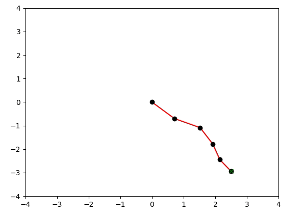
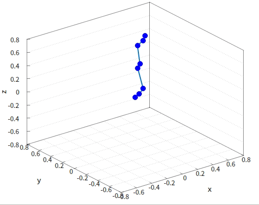
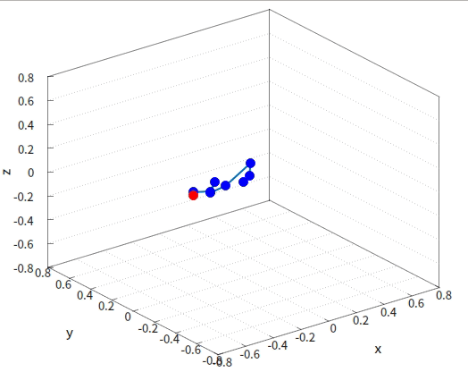
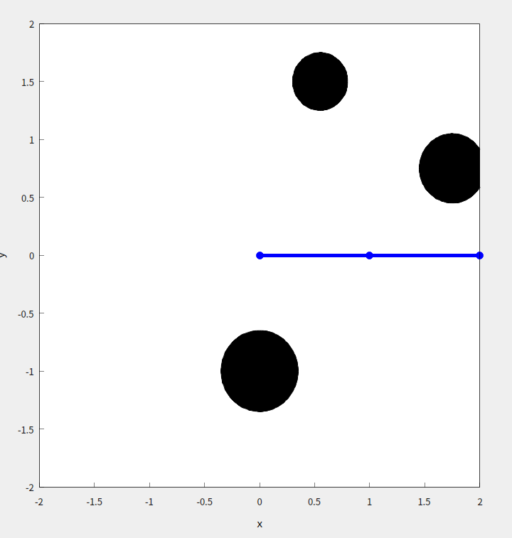
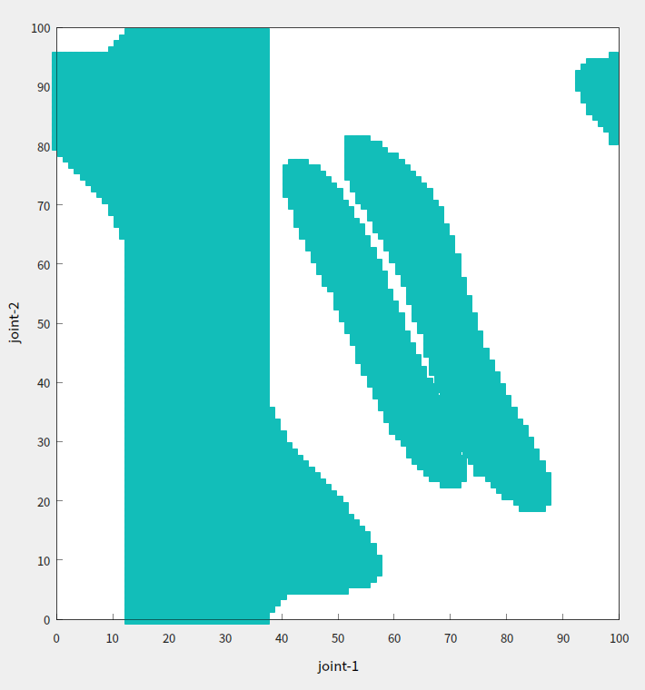
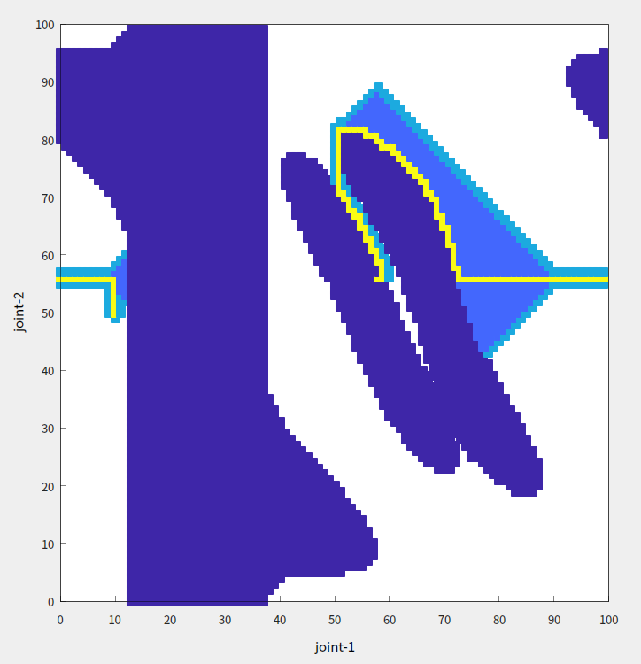

# ArmNavigation Demo Intro

## Demo01: TwoJointArmToPointControl

- Run:

  ```shell
  # build
  mkdir build & cd build
  cmake ..
  make -j8
  
  # run
  cd build/modules/ArmNavigation/TwoJointArmToPointControl
  ./two_joint_arm_to_point_control
  ```

- Brief:

  - This demo shows a 2D-Planar arm with two rotation joints which moves towards 7 different target positions using .

  - Forward kinematics:
    $$
    \boldsymbol{x}_\mathrm{E} = f_\mathrm{forward}(\boldsymbol{q})
    \\
    \left[
    \begin{array}{l}
    x_\mathrm{E} \\
    y_\mathrm{E} 
    \end{array}
    \right] 
    =
    \left[
    \begin{array}{l}
    l_1 \cos(q_1) + l_2\cos(q_1 + q_2) 
    \\
    l_1 \sin(q_1) + l_2\sin(q_1 + q_2) 
    \end{array}
    \right]
    $$

  - Analytical inverse kinematics:
    $$
    \boldsymbol{q} = f_{\mathrm{inverse}}(\boldsymbol{x}_\mathrm{E})
    
    \\ \\
    
    q_2 = \arccos{\left(
    \frac{x_\mathrm{E}^2 +y_\mathrm{E}^2   - l_1^2 - l_2^2}{2l_1l_2} 
    \right)}
    
    \\ \\
    
    q_1 = \arctan{\left(y_\mathrm{E}, x_\mathrm{E}\right)} - 
    \arctan{\left(l_2\sin(q_2), l_1 + l_2\cos{(q_2)}\right)}
    $$
    
  - P-controller to update the motion of the robotic arm.
  
  - Feel free to try different parameters like link_length and goal_position in `./two_joint_arm_to_point_control.cpp`
  
- GIF:

  


## Demo02: NJointArmToPointControl

- Run:

  ```shell
  # build
  mkdir build & cd build
  cmake ..
  make -j8
  
  # run
  cd build/modules/ArmNavigation/NJointArmToPointControl
  ./n_joint_arm_to_point_control
  ```

- Brief:

  - This demo shows a N-Link 2D-Planar arm robot which moves towards 11 different target positions.

  - Forward kinematic for  N-Link 2D-Planar arm robot:
    $$
    \boldsymbol{x}_\mathrm{E} = f_\mathrm{forward}(\boldsymbol{q})
    \\
    \left[
    \begin{array}{l}
    x_\mathrm{E} \\
    y_\mathrm{E} 
    \end{array}
    \right] 
    =
    \left[
    \begin{array}{l}
    l_1 \cos(q_1) + l_2\cos(q_1 + q_2) +\cdots + l_3\cos(q_1 + q_2 + \cdots + q_n)
    \\
    l_1 \sin(q_1) + l_2\sin(q_1 + q_2) +\cdots +  l_3\sin(q_1 + q_2 + \cdots + q_n)
    \end{array}
    \right]
    $$

  - Inverse kinematic with pseude inverse jacobian matrix for redundant robot:
    $$
    \left.\boldsymbol{J}(\boldsymbol{q})=\frac{\partial\boldsymbol{f}(\boldsymbol{q})}{\partial\boldsymbol{q}}=\left(\begin{array}{ccc}\frac{\partial f_1}{\partial q_1}&\cdots&\frac{\partial f_1}{\partial q_n}\\\vdots&\ddots&\vdots\\\frac{\partial f_m}{\partial q_1}&\cdots&\frac{\partial f_m}{\partial q_n}\end{array}\right.\right)\in\mathbf{R}^{m\times n}
    
    \\ \\
    
    \boldsymbol{J}(\boldsymbol{q}) =
    \left[
    \begin{array}{c|c|c|c}
    -l_1 \sin(q_1) - l_2\sin(q_1 + q_2) -\cdots - l_3\sin(\sum_{i=1}^nq_i) 
    &
    - l_2\sin(q_1 + q_2) -\cdots - l_3\sin(\sum_{i=1}^nq_i) 
    &
    \cdots
    &
    - l_3\sin(\sum_{i=1}^nq_i) 
    
    \\ \hline
    
    l_1 \cos(q_1) + l_2\cos(q_1 + q_2) +\cdots +  l_3\cos(\sum_{i=1}^nq_i)
    &
     l_2\cos(q_1 + q_2) +\cdots +  l_3\cos(\sum_{i=1}^nq_i)
     &
     \cdots
    &
     l_3\cos(\sum_{i=1}^nq_i)
    
    \end{array}
    \right]
    
    \\ \\
    
    \boldsymbol{J}_\mathrm{pinv} =( \boldsymbol{J}^{\mathrm{T}}\boldsymbol{J})^{-1}\boldsymbol{J}^{\mathrm{T}}
    
    \\ \\
    
    \Delta\boldsymbol{q} = \boldsymbol{J}_\mathrm{pinv}\Delta\boldsymbol{x}_\mathrm{E}
    $$

  - P-controller to update the motion of the robotic arm

  - Feel free to try different link configurations and target positions in `n_joint_arm_to_point_control.cpp`

- GIF:

  


## Demo03: NLinkArm3d

- Run:

  ```shell
  # build
  mkdir build & cd build
  cmake ..
  make -j8
  
  # run random_forward_kinematics_3d
  cd build/modules/ArmNavigation/NLinkArm3d
  ./random_forward_kinematics_3d
  
  # run random_inverse_kinematics_3d
  cd build/modules/ArmNavigation/NLinkArm3d
  ./random_inverse_kinematics_3d
  ```

- Brief:

  - This demo shows a N-link arm in 3d space.

  - Forward kinematic using SDH-notation:

    ```c++
    // create dh params for arm
    // theta for active joints, rotation at z axis
    // alpha, rotation at x axis
    // a, trans along x
    // d, trans along z
    std::vector<Eigen::Vector4d> dh_params_list = {
        {0.0,        -M_PI / 2.0, 0.1, 0.0},
        {M_PI / 2.0, M_PI / 2.0,  0.1, 0.0},
        {0.0,        -M_PI / 2.0, 0.0, 0.4},
        {0.0,        M_PI / 2.0,  0.1, 0.0},
        {0.0,        -M_PI / 2.0, 0.0, 0.3},
        {0.0,        M_PI / 2.0,  0.1, 0.0},
        {0.0,        0.0,         0.1, 0.0},
    };
    ```

  - Inverse kinematic using geometric jacobian matrix, and convert to analytic jacobian matrix with Euler-angle ZYZ。
    $$
    \begin{align}
    \boldsymbol{J}_\mathrm{G} &= 
    \begin{bmatrix}
    \boldsymbol{E} & \boldsymbol{0} \\
    \boldsymbol{0} & \boldsymbol{\Omega}
    \end{bmatrix} 
    \cdot
    \boldsymbol{J}_\mathrm{A}
    
    \\ \\
    \boldsymbol{J}_\mathrm{A} &= 
    \begin{bmatrix}
    \boldsymbol{E} & \boldsymbol{0} \\
    \boldsymbol{0} & \boldsymbol{\Omega}^{-1}
    \end{bmatrix} 
    \cdot
    \boldsymbol{J}_\mathrm{G}
    
    
    \end{align}
    $$

    $$
    \begin{aligned}
    \boldsymbol{q}_{i+1}& =\boldsymbol{q}_i+\Delta\boldsymbol{q}_i \\
    &=\boldsymbol{q}_i+\boldsymbol{J}^{-1}(\boldsymbol{q}_i) \Delta\boldsymbol{x}_{\mathrm{E}, i} \\
    &=\boldsymbol{q}_{i}+\boldsymbol{J}^{-1}(\boldsymbol{q}_{i}) (\boldsymbol{x}_{\mathrm{E}, i+1}-\boldsymbol{x}_{\mathrm{E}, i}),
    \end{aligned}
    $$

    

  - Feel free to modify the DH table.

- GIF:

  - random_forward_kinematics_3d:

    

  - random_inverse_kinematics_3d

    

  


## Demo04: ArmObstacleNavigation

- Run:

  ```shell
  # build
  mkdir build & cd build
  cmake ..
  make -j8
  
  # run
  cd build/modules/ArmNavigation/ArmObstacleNavigation
  ./arm_obstacle_navigation
  ```

- Brief:

  - This demo shows a 2-Link Arm which moves towards target pose by avoiding obstacles using A-star algorithm.

    

  - Occupancy Grid Map in 2-Link Arm joint space (colored area means obstacle): 

    

  - Occupancy Grid Map with found path (yellow area):

    


- GIF: Arm moves towards to target pose with avoiding the obstacles.

  

## Demo05: RRTStarSevenJointArmControl

- Run:

  ```shell
  # build
  mkdir build & cd build
  cmake ..
  make -j8
  
  # run
  cd build/modules/ArmNavigation/RRTStarSevenJointArmControl
  ./rrt_star_seven_joint_arm_control
  ```

  

- Brief:

  - This demo shows a 7-Link Arm in 3D space which moves towards target pose by avoiding obstacles using RRT-Star algorithm.

  - SDH-Parameter

    ```c++
    // create dh params for arm
    // theta for active joints, rotation at z axis
    // alpha, rotation at x axis
    // a, trans along x
    // d, trans along z
    std::vector<Eigen::Vector4d> dh_params_list = {
        {0., M_PI / 2.,  0.,      .333  },
        {0., -M_PI / 2., 0.,      0.    },
        {0., M_PI / 2.,  0.0825,  0.3160},
        {0., -M_PI / 2., -0.0825, 0.    },
        {0., M_PI / 2.,  0.,      0.3840},
        {0., M_PI / 2.,  0.088,   0.    },
        {0., 0.,         0.,      0.107 }
    };
    ```

  - Obstacles:

    ```c++
    // create obstacle_list {x, y, z, radius}
    std::vector<std::vector<double>> obstacle_list = {
        {-.3, -.3, .7, .1 },
        {.0,  -.3, .7, .1 },
        {.2,  -.1, .3, .15},
    };
    ```

  - RRT-Star details see [Rapidly exploring random tree](https://en.wikipedia.org/wiki/Rapidly_exploring_random_tree#cite_note-incremental-8)

- GIF:

  