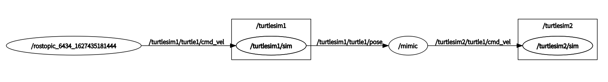
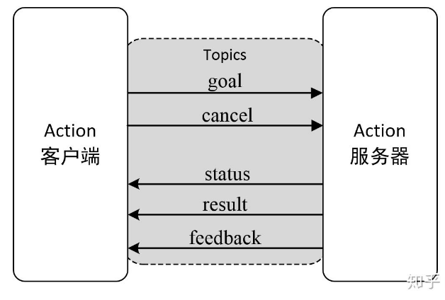
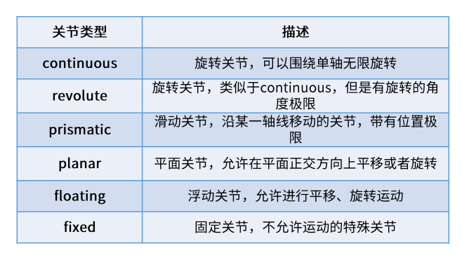
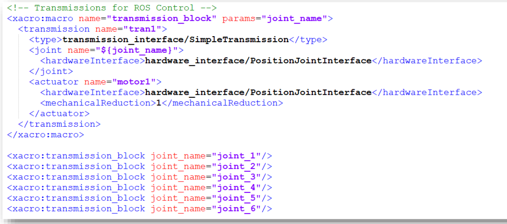
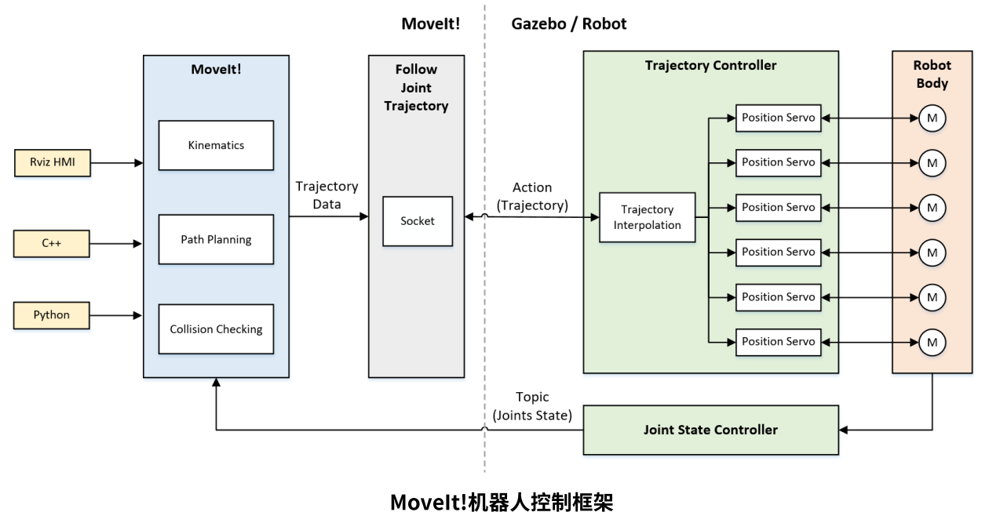

# ROS Note


## ROS 官方教程 笔记

### 1. Install and Configure

```shell
$ mkdir -p ~/catkin_ws/src
$ cd ~/catkin_ws/
$ catkin_make
```

for python3 user in ROS melodic and earlier

```shell
$ catkin_make -DPYTHON_EXECUTABLE=/usr/bin/python3
```

Additionally, if you look in your current directory you should now have a 'build' and 'devel' folder. Inside the 'devel' folder you can see that there are now several setup.*sh files. Sourcing any of these files will overlay this workspace on top of your environment. To make sure your workspace is properly overlayed by the setup script, make sure `ROS_PACKAGE_PATH` environment variable includes the directory you're in.

```shell
$ source devel/setup.bash
$ echo $ROS_PACKAGE_PATH
/home/youruser/catkin_ws/src:/opt/ros/kinetic/share
```

##### ROS with Miniconda + python 3.7

在python3环境下，直接使用tf会报错，使用如下流程来安装rospy以及相关支持。

```shell
# conda env 以及基础的py包
conda create -n ros_env python=3.7
conda activate ros_env
conda install scipy
conda install matplotlib
conda install -c anaconda make
pip install empy
pip install pyyaml


##### 安装ros相关包 non-catkin package
cd ~/miniconda3/envs/ros_demo/
mkdir pycode && cd pycode
 
# 安装rospkg
git clone https://github.com/ros-infrastructure/rospkg.git
cd rospkg/
python setup.py install
 
# 安装sip
cd ..
# 下载地址 https://riverbankcomputing.com/software/sip/download
cd sip-4.19.3
python configure.py 
make
sudo make install


###### catkin package
cd ~/miniconda3/envs/ros_demo/
mkdir -p catkin_ws/src && cd catkin_ws/src
 
# 下载tf与tf2
git clone -b indigo-devel https://github.com/ros/geometry.git
git clone -b indigo-devel https://github.com/ros/geometry2.git
 
 
# 下载/安装orocos
### (option1) 下载tf所需orocos_kinematics_dynamics，直接下载kinetic对应的1.3.1版本
https://github.com/orocos/orocos_kinematics_dynamics/releases/tag/1.3.1
 
### (option2)
sudo apt install ros-kinetic-oro*
 
 
# 下载cv2
git clone -b kinetic https://github.com/ros-perception/vision_opencv.git


########## 注释 geometry2/test_tf2/CmakeLists.txt中的内容

if(NOT CATKIN_ENABLE_TESTING)
  return()
endif()

######### catkin_make

cd ~/miniconda3/envs/ros_demo/catkin_ws
catkin_make_isolated --cmake-args \
-DCMAKE_BUILD_TYPE=Release \
-DPYTHON_EXECUTABLE=~/miniconda3/envs/ros_demo/bin/python \
-DPYTHON_INCLUDE_DIR=~/miniconda3/envs/ros_demo/include/python3.7m \
-DPYTHON_LIBRARY=~/miniconda3/envs/ros_demo/lib/libpython3.7m.so
source devel_isolated/setup.bash


###### 在.bashrc中添加以下内容
source ~/App/miniconda3/envs/ros/catkin_ws/devel_isolated/setup.bash		# 或者 setup.zsh


######### 测试

Python 3.7.8 | packaged by conda-forge | (default, Jul 23 2020, 03:54:19) 
[GCC 7.5.0] on linux
Type "help", "copyright", "credits" or "license" for more information.
>>> import rospy
>>> rospy
<module 'rospy' from '/opt/ros/kinetic/lib/python2.7/dist-packages/rospy/__init__.py'>
>>> import tf
>>> tf
<module 'tf' from '/home/f/miniconda3/envs/ros_demo/catkin_ws/devel_isolated/tf/lib/python3/dist-packages/tf/__init__.py'>
>>>


###### 如何在Ros环境下使用Python3的包
# 将#！env/usr/bin python 改为#！env/usr/bin python3


```


### 2. ROS Filesystem

install ros-tutorials package, Replace '<distro>' (including the '<>') with the name of your ROS distribution (e.g. indigo, kinetic, lunar etc.)

```shell
$ sudo apt-get install ros-<distro>-ros-tutorials
```

##### rospack find

```shell
$ rospack find [package_name]

$ rospack find roscpp
YOUR_INSTALL_PATH/share/roscpp
```

##### roscd

```shell
$ roscd <package-or-stack>[/subdir]

$ roscd roscpp
$ pwd
YOUR_INSTALL_PATH/share/roscpp

$ roscd roscpp/cmake
$ pwd
YOUR_INSTALL_PATH/share/roscpp/cmake

$ roscd log

```

Note that [roscd](http://wiki.ros.org/roscd), like other ROS tools, will *only* find ROS packages that are within the directories listed in your [ROS_PACKAGE_PATH](http://wiki.ros.org/ROS/EnvironmentVariables#ROS_PACKAGE_PATH). To see what is in your [ROS_PACKAGE_PATH](http://wiki.ros.org/ROS/EnvironmentVariables#ROS_PACKAGE_PATH), type:

```shell
$ echo $ROS_PACKAGE_PATH
/opt/ros/kinetic/base/install/share

```

##### rosls

```shell
$ rosls <package-or-stack>[/subdir]
$ rosls roscpp_tutorials
cmake launch package.xml  srv

```


### 3. Create a ROS Package

ROS package folder structure

```shell
my_package/
 	CMakeLists.txt
 	package.xml
```

```shell
workspace_folder/        -- WORKSPACE
  src/                   -- SOURCE SPACE
    CMakeLists.txt       -- 'Toplevel' CMake file, provided by catkin
    package_1/
      CMakeLists.txt     -- CMakeLists.txt file for package_1
      package.xml        -- Package manifest for package_1
    ...
    package_n/
      CMakeLists.txt     -- CMakeLists.txt file for package_n
      package.xml        -- Package manifest for package_n
```

workflow for creating ros package

```shell
# You should have created this in the Creating a Workspace Tutorial
$ cd ~/catkin_ws/src

# This is an example, do not try to run this
# catkin_create_pkg <package_name> [depend1] [depend2] [depend3]
$ catkin_create_pkg beginner_tutorials std_msgs rospy roscpp

# catkin_make, build the whole package
$ cd ~/catkin_ws
$ catkin_make

# source package
$ source catkin_ws/devel/setup.zsh		# or setup.bash

# check dependencies
rospack depends1 beginner_tutorials			# 1. order dependencies
rospack depends beginner_tutorials			 #  all dependencies

```


### 4. Build a ROS Package

```shell
$ cd ~/catkin_ws/
$ ls src
	beginner_tutorials/  CMakeLists.txt@  

$ catkin_make
```

 

### 5. ROS Node

quick overview of graph concepts

-   [Nodes](http://wiki.ros.org/Nodes): A node is an executable that uses ROS to communicate with other nodes.
-   [Messages](http://wiki.ros.org/Messages): ROS data type used when subscribing or publishing to a topic.
-   [Topics](http://wiki.ros.org/Topics): Nodes can *publish* messages to a topic as well as *subscribe* to a topic to receive messages.
-   [Master](http://wiki.ros.org/Master): Name service for ROS (i.e. helps nodes find each other)
-   [rosout](http://wiki.ros.org/rosout): ROS equivalent of stdout/stderr
-   [roscore](http://wiki.ros.org/roscore): Master + rosout + parameter server (parameter server will be introduced later)

```shell
# start roscore
$ roscore

# list all ros nodes
$ rosnode list
	/rosout

# check rosnode info
$ rosnode info /rosout
	
# run rosnode
$ rosrun [package_name] [node_name]
$ rosrun turtlesim turtlesim_node
$ rosnode list
	/rosout
	/turtlesim
	
# rename rosnode 
$ rosrun turtlesim turtlesim_node __name:=my_turtle
$ rosnode list
	/my_turtle
	/rosout

# ping rosnode
$ rosnode ping my_turtle
	rosnode: node is [/my_turtle]
	pinging /my_turtle with a timeout of 3.0s
	xmlrpc reply from http://aqy:42235/     time=1.152992ms
	xmlrpc reply from http://aqy:42235/     time=1.120090ms
	...

	
```


### 6. ROS Topics

##### ROS topic usage

```shell
$ rostopic -h
Commands:
	rostopic bw	display bandwidth used by topic
	rostopic delay	display delay of topic from timestamp in header
	rostopic echo	print messages to screen
	rostopic find	find topics by type
	rostopic hz	display publishing rate of topic    
	rostopic info	print information about active topic
	rostopic list	list active topics
	rostopic pub	publish data to topic
	rostopic type	print topic or field type
```

Example:

```shell
$ roscore
$ rosrun turtlesim turtlesim_node
$ rosrun turtlesim turtle_teleop_key		  # keyboard remote node				
```

##### rostopic echo

```shell
$ rostopic echo /turtle1/cmd_vel
linear: 
  x: 2.0
  y: 0.0
  z: 0.0
angular: 
  x: 0.0
  y: 0.0
  z: 0.0
---

# rqt_graph, show topic, publisher, subcriber
$ rosrun rqt_graph rqt_graph		
```


##### rostopic list

```shell
$ rostopic list -h
    Usage: rostopic list [/topic]
    Options:
          -h, --help            show this help message and exit
          -b BAGFILE, --bag=BAGFILE 		  list topics in .bag file
          -v, --verbose         								list full details about each topic
          -p                    										  list only publishers
          -s                   											   list only subscribers
```

```shell
$ rostopic list -v
    Published topics:
     * /turtle1/color_sensor [turtlesim/Color] 1 publisher
     * /turtle1/cmd_vel [geometry_msgs/Twist] 1 publisher
     * /rosout [rosgraph_msgs/Log] 3 publishers
     * /rosout_agg [rosgraph_msgs/Log] 1 publisher
     * /turtle1/pose [turtlesim/Pose] 1 publisher

    Subscribed topics:
     * /turtle1/cmd_vel [geometry_msgs/Twist] 1 subscriber
     * /rosout [rosgraph_msgs/Log] 1 subscriber
     * /statistics [rosgraph_msgs/TopicStatistics] 1 subscriber

```

##### rostopic type

```shell
$ rostopic type /turtle1/cmd_vel
    geometry_msgs/Twist

$ rostopic type /turtle1/cmd_vel | rosmsg show
    geometry_msgs/Vector3 linear
      float64 x
      float64 y
      float64 z
    geometry_msgs/Vector3 angular
      float64 x
      float64 y
      float64 z

```

##### rostopic info

```shell
$ rostopic info /turtle1/cmd_vel
    Type: geometry_msgs/Twist

    Publishers: 
     * /teleop_turtle (http://shan-ubuntu:36047/)

    Subscribers: 
     * /turtlesim (http://shan-ubuntu:33797/)
```

##### rostopic pub

```shell
# rostopic pub [topic] [msg_type] [args]
$ rostopic pub -1 /turtle1/cmd_vel geometry_msgs/Twist -- '[2.0, 0.0, 0.0]' '[0.0, 0.0, 1.8]'

# a steady stream of commands at 1 Hz to keep moving
$ rostopic pub /turtle1/cmd_vel geometry_msgs/Twist -r 1 -- '[2.0, 0.0, 0.0]' '[0.0, 0.0, -1.8]'

$ rosrun rqt_graph rqt_graph		# show node graph
$ rostopic echo /turtle1/pose		 # echo topic message
```


##### rostopic hz

```shell
$ rostopic hz /turtle1/pose

# rate of 60 Hz
        average rate: 62.500
            min: 0.015s max: 0.017s std dev: 0.00044s window: 811
        average rate: 62.499
            min: 0.015s max: 0.017s std dev: 0.00044s window: 874
        average rate: 62.501
            min: 0.015s max: 0.017s std dev: 0.00044s window: 936
        average rate: 62.498
            min: 0.015s max: 0.017s std dev: 0.00044s window: 999
        average rate: 62.502
            min: 0.015s max: 0.017s std dev: 0.00044s window: 1062

```

##### rqt_plot

```shell
$ rosrun rqt_plot rqt_plot
```


### 7. ROS Service Params

#### ROS Service usage

```shell
$ rosservice list          	 # print information about active services
$ rosservice call         	# call the service with the provided args
$ rosservice type         # print service type
$ rosservice find          # find services by service type
$ rosservice uri          	 # print service ROSRPC uri
```

##### rosservice list

```shell
$ rosservice list
		/clear
        /kill
        /reset
        /rosout/get_loggers
        /rosout/set_logger_level
        /spawn
        /teleop_turtle/get_loggers
        /teleop_turtle/set_logger_level
        /turtle1/set_pen
        /turtle1/teleport_absolute
        /turtle1/teleport_relative
        /turtlesim/get_loggers
        /turtlesim/set_logger_level
```

##### roservice type

```shell
# rosservice type [service]
$ rosservice type /clear
		std_srvs/Empty

```

##### rosservice call

```shell
# rosservice call [service] [args]
$ rosservice call /clear			# clear the background of the turtlesim_node

```

##### rosservice type

```shell
$ rosservice type /spawn | rossrv show
        float32 x
        float32 y
        float32 theta
        string name
        ---
        string name
```

##### rosservice call

```shell
$ rosservice call /spawn 2 2 0.2 ""		# spawn a new turtle 
```


#### rosparam 

```shell
$ rosparam set            # set parameter
$ rosparam get            # get parameter
$ rosparam load         # load parameters from file
$ rosparam dump     # dump parameters to file
$ rosparam delete     # delete parameter
$ rosparam list          	# list parameter names
```

##### rosparam list

```shell
$ rosparam list
		/rosdistro
        /roslaunch/uris/host_nxt__43407
        /rosversion
        /run_id
        /turtlesim/background_b
        /turtlesim/background_g
        /turtlesim/background_r
```

##### rosparam set

```shell
# rosparam set [param_name]
$ rosparam set /turtlesim/background_r 150		# change background color

# call the clear service for the parameter change to take effect
$ rosservice call /clear
```

##### rosparam get

```shell
$ rosparam get /turtlesim/background_g 
		86


# show all param from param server
$ rosparam get /
        rosdistro: 'melodic

          '
        roslaunch:
          uris: {host_shan_ubuntu__45705: 'http://shan-ubuntu:45705/'}
        rosversion: '1.14.11

          '
        run_id: 610a30ea-eeb1-11eb-ba72-70c94e48a4d0
        turtlesim: {background_b: 255, background_g: 86, background_r: 150}

```

##### rosparam dump

```shell
# rosparam dump [file_name] [namespace]
# write all the parameters to the file params.yaml
$ rosparam dump params.yaml

```

##### rosparam load

```shell
# rosparam load [file_name] [namespace]
$ rosparam load params.yaml copy_turtle
$ rosparam get /copy_turtle/turtlesim/background_b
		255
```


### 8. rqt_console and roslaunch

#### rqt_consle

```shell
$ rosrun rqt_console rqt_console
$ rosrun rqt_logger_level rqt_logger_level

#  let's run our turtle into the wall and see what is displayed in our rqt_console
$ rostopic pub /turtle1/cmd_vel geometry_msgs/Twist -r 1 -- '{linear: {x: 2.0, y: 0.0, z: 0.0}, angular: {x: 0.0,y: 0.0,z: 0.0}}'

```

logger levels

```
Fatal
Error
Warn
Info
Debug
```


#### roslaunch

`roslaunch` starts nodes as defined in a launch file

```shell
$ roslaunch [package] [filename.launch]

# example
$ cd ~/catkin_ws
$ source devel/setup.bash
$ roscd beginner_tutorials
$ mkdir launch
$ cd launch
$ vi turtlemimic.launch

# 使用roslaunch 启动turtlesim，mimic，将一个乌龟的位置传递给另一个乌龟
$ roslaunch beginner_tutorials turtlemimic.launch
$ rostopic pub /turtlesim1/turtle1/cmd_vel geometry_msgs/Twist -r 1 -- '[2.0, 0.0, 0.0]' '[0.0, 0.0, -1.8]'

```

```xml
<launch>

  <group ns="turtlesim1">
    <node pkg="turtlesim" name="sim" type="turtlesim_node"/>
  </group>

  <group ns="turtlesim2">
    <node pkg="turtlesim" name="sim" type="turtlesim_node"/>
  </group>

  <node pkg="turtlesim" name="mimic" type="mimic">
    <remap from="input" to="turtlesim1/turtle1"/>
    <remap from="output" to="turtlesim2/turtle1"/>
  </node>

</launch>
```





### 9. rosed

`rosed` is part of the [rosbash](http://wiki.ros.org/rosbash) suite. It allows you to directly edit a file within a package by using the package name rather than having to type the entire path to the package.

```shell
# $ rosed [package_name] [filename]
$ rosed roscpp Logger.msg
```


### 10. MSG and SRV

msg files are stored in the `msg` directory of a package, and srv files are stored in the `srv` directory.

- [msg](http://wiki.ros.org/msg): msg files are simple text files that describe the fields of a ROS message. They are used to generate source code for messages in different languages.

  - ```
    -   int8, int16, int32, int64 (plus uint*)
    -   float32, float64
    -   string
    -   time, duration
    -   other msg files
    -   variable-length array[] and fixed-length array[C]
    -   Header, the header contains a timestamp and coordinate frame information that are commonly used in ROS
    ```

  - msg/Num.msg

    ```
      Header header
      string child_frame_id
      geometry_msgs/PoseWithCovariance pose
      geometry_msgs/TwistWithCovariance twist
    ```

  - package.xml

    ```xml
      <build_depend>message_generation</build_depend>
      <exec_depend>message_runtime</exec_depend>
    ```

  - CMakeLists.txt

    ```cmake
    find_package(catkin REQUIRED COMPONENTS
       roscpp
       rospy
       std_msgs
       message_generation
    )
    
    catkin_package(
      ...
      CATKIN_DEPENDS message_runtime ...
      ...)
      
      add_message_files(
      FILES
      Num.msg
    )
    
    generate_messages(
      DEPENDENCIES
      std_msgs
    )
    ```

  - rosmsg

    ```shell
    rosmsg is a command-line tool for displaying information about ROS Message types.
    
    Commands:
    	rosmsg show	Show message description
    	rosmsg info	Alias for rosmsg show
    	rosmsg list	List all messages
    	rosmsg md5	Display message md5sum
    	rosmsg package	List messages in a package
    	rosmsg packages	List packages that contain messages
    
    
    # $ rosmsg show [message type]
    $ rosmsg show beginner_tutorials/Num
    		int64 num
            string first_name
            string last_name
            uint8 age
            uint32 score
    
    # if you forget the package name
    $ rosmsg show Num		
            [beginner_tutorials/Num]:
            int64 num
            string first_name
            string last_name
            uint8 age
            uint32 score
    ```

    


- [srv](http://wiki.ros.org/srv): an srv file describes a service. It is composed of two parts: a request and a response. The two parts are separated by a '---' line. Here is an example of a srv file:

  ```
  # request
  int64 A
  int64 B
  ---
  # response
  int64 Sum
  ```

  - create a srv

    ```shell
    $ roscd beginner_tutorials
    $ mkdir srv
    
    # Instead of creating a new srv definition by hand, 
    # we will copy an existing one from another package
    # $ roscp [package_name] [file_to_copy_path] [copy_path]
    $ roscp rospy_tutorials AddTwoInts.srv srv/AddTwoInts.srv
    
    ```

  - package.xml

    ```xml
      <build_depend>message_generation</build_depend>
      <exec_depend>message_runtime</exec_depend>
    ```

  - CMakeLists.txt

    ```CMAKE
    # Do not just add this line to your CMakeLists.txt, modify the existing line
    find_package(catkin REQUIRED COMPONENTS
      roscpp
      rospy
      std_msgs
      message_generation
    )
    
    add_service_files(
      FILES
      AddTwoInts.srv
    )
    ```

  - rossrv

    ```shell
    rossrv is a command-line tool for displaying information about ROS Service types.
    
    Commands:
    	rossrv show	Show service description
    	rossrv info	Alias for rossrv show
    	rossrv list	List all services
    	rossrv md5	Display service md5sum
    	rossrv package	List services in a package
    	rossrv packages	List packages that contain services
    
    
    
    $ rossrv show <service type>
    $ rossrv show beginner_tutorials/AddTwoInts
            int64 a
            int64 b
            ---
            int64 sum
            
    $ rossrv show AddTwoInts
            [beginner_tutorials/AddTwoInts]:
            int64 a
            int64 b
            ---
            int64 sum
    
            [rospy_tutorials/AddTwoInts]:
            int64 a
            int64 b
            ---
            int64 sum
    ```

    

    

### 11. rosbag

The list of published topics are the only message types that could potentially be recorded in the data log file, as only published messages are recorded. 

##### rosbag record

```shell
# run turtlesim to record its bagfile
$ roscore
$ rosrun turtlesim turtlesim_node

# rosbag record
$ mkdir ~/bagfiles
$ cd ~/bagfiles
$ rosbag record -a

# run some topic to record
$ rosrun turtlesim turtle_teleop_key 
```

#####  rosbag info

```
$ rosbag info <your bagfile>

path:        2021-07-29-13-16-46.bag
version:     2.0
duration:    40.1s
start:       Jul 29 2021 13:16:46.20 (1627535806.20)
end:         Jul 29 2021 13:17:26.34 (1627535846.34)
size:        372.2 KB
messages:    5189
compression: none [1/1 chunks]
types:       geometry_msgs/Twist [9f195f881246fdfa2798d1d3eebca84a]
             rosgraph_msgs/Log   [acffd30cd6b6de30f120938c17c593fb]
             turtlesim/Color     [353891e354491c51aabe32df673fb446]
             turtlesim/Pose      [863b248d5016ca62ea2e895ae5265cf9]
topics:      /rosout                    4 msgs    : rosgraph_msgs/Log   (2 connections)
             /turtle1/cmd_vel         193 msgs    : geometry_msgs/Twist
             /turtle1/color_sensor   2496 msgs    : turtlesim/Color    
             /turtle1/pose           2496 msgs    : turtlesim/Pose

```

##### rosbag play 

```
$ rosbag play <your bagfile>

[ INFO] [1418271315.162885976]: Opening 2014-12-10-20-08-34.bag
Waiting 0.2 seconds after advertising topics... done.
Hit space to toggle paused, or 's' to step.
```

```shell
$ rosbag play -s 20 <bagfile> 		# 从第20s开始
$ rosbag play -r 2 <bagfile>		 # 两倍的重放速度	
```

##### rosbag record -O subset

```shell
# run turtlesim
$ roscore
$ rosrun turtlesim turtlesim_node
$ rosrun turtlesim turtle_teleop_key

# record subset rosbag
rosbag record -O subset /turtle1/cmd_vel /turtle1/pose

# check info
$ rosbag info subset.bag
        path:        subset.bag
        version:     2.0
        duration:    22.4s
        start:       Jul 29 2021 13:41:43.77 (1627537303.77)
        end:         Jul 29 2021 13:42:06.15 (1627537326.15)
        size:        52.2 MB
        messages:    516109
        compression: none [62/62 chunks]
        types:       geometry_msgs/Twist [9f195f881246fdfa2798d1d3eebca84a]
                     turtlesim/Pose      [863b248d5016ca62ea2e895ae5265cf9]
        topics:      /turtle1/cmd_vel   514710 msgs    : geometry_msgs/Twist
                     /turtle1/pose        1399 msgs    : turtlesim/Pose

```

##### read from bagfile

-   rosbag play --topics

```shell
# check rosbag info
$ time rosbag info demo.bag  
# OR (if you know part of the topic names of interest before-hand):
$ time rosbag info mybag.bag | grep -E "(topic1|topic2|topic3)"
```

```shell
$ roscore

$ rostopic echo /obs1/gps/fix | tee topic1.yaml
WARNING: topic [/obs1/gps/fix] does not appear to be published yet

$ rostopic echo /diagnostics_agg | tee topic2.yaml
WARNING: topic [/diagnostics_agg] does not appear to be published yet


# $ time rosbag play --immediate demo.bag --topics /topic1 /topic2 /topic3 /topicN
$ time rosbag play --immediate demo.bag --topics /obs1/gps/fix /diagnostics_agg

```


### 12. ROS action

ROS中有一个名为**actionlib**的功能包，实现了action的通信机制。那什么是action呢？

**action是一种类似于Service的问答通信机制，不同之处在于action带有连续反馈，可以不断反馈任务进度，也可以在任务过程中中止运行。**



Client向Server端发布任务目标以及在必要的时候取消任务，Server会向Client发布当前状态、实时反馈和任务执行的最终结果。

（1）goal：发布任务目标；
（2）cancel：请求取消任务；
（3）status：通知Client当前的状态；
（4）feedback：周期反馈任务运行的监控数据；
（5）result：向Client发送任务的执行结果，只发布一次。


## MoveIt! DeepBlue 教程笔记

### CH1 - CH2

ROS 安装与基础省略, 详见ROS官方教程.


### CH3 URDF

#### 机器人组成

-   执行机构
-   驱动系统
-   传感系统
-   控制系统


#### URDF 

- 介绍

  - XML格式的描述机器人的模型文件

  - `<link>`

    -   刚体部分的外观和物理属性
    -   连杆尺寸, 颜色, 形状, 惯性矩阵, 碰撞参数等

  - `<joint>`

    - 两个 Link 之间的关系, 六种类型

    - 位置或速度的限制

    - 机器人关节的运动学和动力学属性

      

  - `<robot>`

    -   机器人模型最顶层标签

- 缺点

  -   冗长重复
  -   参数修改麻烦
  -   没有参数计算功能
  -   改进方案
      -   xacro
      -   三维模型导出URDF


#### XACRO

- 功能

  - 宏定义

  - 文件包含

  - 可编程: 常量, 变量, 数学计算, 条件语句

    

#### 实践

- URDF/XACRO 可视化

  ```bash
  # 启动marm模型可视化launch文件, 可视化对应的机器人urdf/xacro模型
  roslaunch marm_description view_marm.launch 
  ```

- solidworks 导出 urdf

  -   安装 sw2urdfSetup.exe
  -   直接拖入 UR3.STEP 模型文件
  -   配置基准轴
  -   配置 sw2urdf link joint

  ```bash
  # 启动ur3模型可视化launch文件
  roslaunch ur3 display.launch
  ```

  

### CH4 MoveIt! 初识

#### MoveIt!简介

- 集成化开发平台

  -   运动规划
  -   操作控制
  -   3D感知
  -   运动学
  -   控制与导航

- 与传统机械臂编程控制的比较

  - 传统机械臂编程

    

  - MoveIt!运动规划

    

- 三大核心功能

  -   运动学: KDL, Trac-IK, IKFast...
  -   路径规划: OMPL, CHOMP, SBPL...
  -   碰撞检测: FCL, PCD...


-   用户接口
    -   C++: move_group_interface 提供的API
    -   Python: moveit_commander 提供的API
    -   GUI: MoveIt! 的 rviz 插件
-   ROS参数服务器
    -   URDF: robot_description 参数, 机器人URDF模型描述信息
    -   SRDF: robot_description_semantic 参数, 机器人模型配置信息
    -   config: 其他配置信息, 关节限位, 运动学插件, 运动规划插件等


-   MoveIt 使用方法
    -   组装: 机器人URDF模型
    -   配置: MoveIt! Setup Assistant 配置工具
    -   驱动: 机器人控制器插件 (controller)
    -   控制: MoveIt! 控制机器人运动
        -   算法仿真
        -   物理仿真
        -   连接真实机器人


#### MoveIt! 可视化配置

- 启动 Setup Assistant

  ```
  rosrun moveit_setup_assistant moveit_setup_assistant
  ```

- start 选择模型 .xacro 文件

- self-collisions 设置自碰撞检测

  -   这里会检测和显示不需要自碰撞检测的 link pair, 包括:
      -   永远不会碰撞
      -   相邻的关节对
      -   一直处于碰撞
  -   FCL: Flexible Collision Library 碰撞检测库

- virtual joints 设置虚拟关节

- planning groups 配置规划组

  -   Kinematics 
      -   配置运动学求解器
  -   OMPL Planning
      -   OMPL:  The Open Motion Planning Library, 基于采样方法的开源机器人运动规划库
          -   PRM、RRT、EST、SBL、KPIECE、SyCLOP...
      -   OMPL 下有两大类规划算法
          -   Geometric planners: 考虑系统几何约束和运动学约束
          -   Control-based planners: 差分约束?
      -   不包含任何碰撞检测或可视化内容, 只设计运动规划
  -   Kinematic chain

- Robot Poses 预定义的机械臂位姿

- End Effector 配置终端效应器

- Passive Joints 配置被动关节

- ROS Control 配置控制器

  -   建议在文件中配置

- Simulation 配置仿真环境如Gazebo

  -   建议在文件中配置

- Autoher Information 作者信息

- Configuration Files 设置配置文件

- 3D Perception 传感器的配置

- Configuration Files

  -   生成 MoveIt! 配置文件包, `*_moveit_config` 

- 启动 moveit demo

  ```bash
  roslaunch probot_anno_moveit_config demo.launch
  ```

  

### CH5 MoveIt! 仿真环境

#### ROS  中的控制器插件简介

-   ros_control
    -   ROS 提供的机器人控制中间件
    -   一系列控制器接口, 传动装置接口, 硬件接口, 控制器工具箱等
    -   控制流程
        -   控制器管理器
            -   通用接口, 管理控制器
        -   控制器
            -   读取硬件状态, 发布控制命令
        -   硬件资源
            -   上下层之间的硬件资源接口
        -   硬件抽象
            -   直接与硬件交流, write/read 完成硬件操作
        -   真实机器人
            -   执行接受的命令

-   控制器
    -   joint_state_controller
    -   joint_effort_controller
    -   joint_position_controller
    -   joint_velocity_controller


#### 完善机器人模型与Gazebo配置

- link 添加惯性参数和碰撞属性: /probot_description/urdf/probot_anno.xacro

  

- joint 添加传动装置: /probot_description/urdf/probot_anno.xacro

  

- gazebo 控制器插件: /probot_description/urdf/probot_anno.xacro

  

- gazebo 加载机器人模型: /probot_gazebo/launch/probot_anno/probot_anno_gazebo_world

  

- 启动 Gazebo 仿真环境

  ```bash
  roslaunch probot_gazebo probot_anno_gazebo_world.launch
  ```

  

#### MoveIt! + Gazebo

##### MoveIt! + Gazebo/Robot 机器人控制框架

-   MoveIt
    -   MoveIt! API
        -   RVIZ
        -   C++
        -   Python
    -   MoveIt! 运动学+路径规划+碰撞检测 -> 轨迹数据
        -   3 main function
            -   Kinematics
            -   Path Planning
            -   Collision Checking
        -   output: trajectory data
        -   sub: joints state
    -   Follow Joint Trajectory 连接 Gazebo/Robot 的中间层
        -   Socket to Gazebo/Robot
        -   Action (Trajectort excution)
-   Gazebo/Robot
    -   Joint trajectory controller 路径插值等
        -   trajectory interpolation
    -   Joint state controller 反馈关节信息
        -   pub topics: joints state
    -   Robot body 机械臂本体执行移动命令
        -   execute move commands
        -   joint feedback




##### MoveIt! + Gazebo 仿真框架

- **Joint trajectory controller**

  - 关节轨迹控制器

    -   线性样条, C0 连续, 位置连续
    -   三次样条, C1 连续, 位置速度连续
    -   五次样条, C2 连续, 位置速度加速度连续

  - 关节轨迹控制器参数配置: src/probot_gazebo/config/probot_anno_trajectory_control.yaml

    

  - 关节轨迹控制器启动配置: src/probot_gazebo/launch/probot_anno/probot_anno_trajectory_controller.launch

    

- **Joint state controller**

  - 关节状态控制器参数配置: src/probot_gazebo/config/probot_anno_gazebo_joint_states.yaml

    

  - 关节状态控制器启动配置: src/probot_gazebo/launch/probot_anno/probot_anno_gazebo_states.launch

    

- **Follow joint trajectory controller**

  - 跟随关节轨迹控制器参数配置

    

  - 跟随关节轨迹控制器启动配置

    


- 启动 MoveIt! + Gazebo: src/probot_gazebo/launch/probot_anno/probot_anno_bringup_moveit.launch

  - 配置

    

  - 启动

    ```bash
    # 启动 MoveIt! + Gazebo
    roslaunch probot_gazebo probot_anno_bringup_moveit.launch
    
    # 输出 follow_joint_trajectory/goal
    rostopic echo /probot_anno/arm_joint_controller/follow_joint_trajectory/goal
    ```

    


### CH6 MoveIt! 运动控制

#### MoveIt! API 编程接口

-   MoveIt 一般使用方法

    -   连接控制需要的规划组, 设置运动规划参数, 允许误差, 速度, 加速度等

    -   设置目标位姿
        -   关节运动, 关节目标, 正运动
        -   关节运动, 笛卡尔目标, 逆运动
        -   笛卡尔空间, 笛卡尔目标, 逆运动

    -   设置运动约束

    -   使用MoveIt! 规划到达目标的轨迹
        -   关节空间逆运动规划
        -   笛卡尔空间路径逆运动规划

    -   修改轨迹参数

    -   执行轨迹运动


#### 关节空间运动

- 关节运动, 关节目标, 正运动学

  -   创建规划组控制对象
  -   设置运动规划参数, 允许误差, 速度, 加速度等
  -   设置关节空间运动的目标关节角度
  -   执行关节正运动

  ```bash
  # launch moveit + gazebo
  roslaunch probot_gazebo probot_anno_bringup_moveit.launch
  
  # forward kinematic demo, joint move with joint target
  rosrun probot_demo moveit_fk_demo
  ```

- 关节运动, 笛卡尔目标, 逆运动学

  -   创建规划组的控制对象
  -   设置运动规划参数, 允许误差, 速度, 加速度等
  -   获取终端 link 名称
  -   设置目标位姿
      -   参考坐标系
      -   起始位姿
      -   终止位姿
  -   执行关节逆运动

  ```bash
  # launch moveit + gazebo
  roslaunch probot_gazebo probot_anno_bringup_moveit.launch
  
  # run inverse kinematic demo, joint move with cartesian target
  rosrun probot_demo moveit_ik_demo
  ```


#### 笛卡尔空间运动

-   创建规划组的控制对象
-   设置运动规划参数, 允许误差, 速度, 加速度等
-   获取终端 link 名称
-   设置目标位姿
    -   参考坐标系
    -   起始位姿
    -   路径规划 + 轨迹规划
        -   设置路点列表
        -   对路点列表进行路径规划
        -   检查路点覆盖率, 重新尝试规划
        -   对路径规划结果进行轨迹规划
-   执行笛卡尔空间轨迹规划结果

```bash
# launch moveit + gazebo
roslaunch probot_gazebo probot_anno_bringup_moveit.launch

# run cartesian path planning demo, cartesion move with cartesion path
rosrun probot_demo moveit_cartesian_demo
```


#### 自主避障运动

- 规划场景模块的结构

  -   用户接口
      -   C++
      -   Python
      -   RVIZ
  -   规划场景监听器
      -   机器人状态监听器
          -   机器人关节状态 /joint_states
      -   场景监听器
      -   外界环境监听器

  

- 附着物体避障例程

  -   增加场景障碍物
  -   增加手臂附着物
  -   关节单点运动 自动避障
  -   笛卡尔单点运动 自动避障
  -   笛卡尔路径 自动避障

  ```bash
  # 启动 moveit + gazebo
  roslaunch probot_gazebo probot_anno_bringup_moveit.launch
  
  # 启动避障demo
  rosrun probot_demo moveit_avoid_obstacle_demo     
  ```


### CH7 MoveIt! 轨迹规划进阶

#### 圆弧轨迹规划

-   根据圆弧公式计算路点, 可以根据圆心角度采样
-   根据路点进行笛卡尔路径规划

```bash
# 启动 moveit + gazebo
roslaunch probot_gazebo probot_anno_bringup_moveit.launch

# 圆弧轨迹demo 
rosrun probot_demo moveit_circle_demo             
```


#### 轨迹重定义

-   重新规划轨迹的速度

```bash
# 启动 moveit + gazebo
roslaunch probot_gazebo probot_anno_bringup_moveit.launch

# 轨迹重定义demo 
rosrun probot_demo moveit_revise_trajectory_demo  
```


#### 多轨迹连续运动

-   连接两个轨迹, 并重新规划轨迹的速度加速度, 使运行平滑

```bash
# 启动 moveit + gazebo
roslaunch probot_gazebo probot_anno_bringup_moveit.launch

# 多轨迹连接demo 
rosrun probot_demo moveit_continue_trajectory_demo
```


#### 更换运动学插件

- KDL (Kinematics and Dynamics Library)

  -   数值解
  -   优点: 可求解封闭情况下的逆运动学
  -   缺点: 速度慢, 有时找不到解
  -   MoveIt! 默认运动学插件

- TRACK-IK

  - 数值解

  - 求解效率比KDL更高, 更多解的可能

  - 求解结果不稳定

  - 配置使用方法

    ```bash
    # 安装
    sudo apt-get install ros-melodic-trac-ik-kinematics-plugin
    
    # 配置
    gedit probot_anno_moveit_config/config/kinematics.yaml
    # TRACK-IK
    kinematics_solver: trac_ik_kinematics_plugin/TRAC_IKKinematicsPlugin
    kinematics_solver_search_resolution: 0.005
    kinematics_solver_timeout: 0.005
    
    # 测试
    roslaunch probot_anno_moveit_config demo.launch
    ```

- IKFAST

  - 解析解

  - 成功率高, 求解稳定, 速度快, 可以求解任意复杂运动链的运动学方程

  - 存在多解的选择问题

  - 安装

    - 尝试手动安装 IKFAST

      ```bash
      ### 安装依赖程序
      sudo apt-get install cmake g++ git ipython minizip python-dev python-h5py python-numpy python-scipy qt4-dev-tools
      
      ### 安装依赖库
      sudo apt-get install libassimp-dev libavcodec-dev libavformat-dev libavformat-dev libboost-all-dev libboost-date-time-dev libbullet-dev libfaac-dev libglew-dev libgsm1-dev liblapack-dev liblog4cxx-dev libmpfr-dev libode-dev libogg-dev libpcrecpp0v5 libpcre3-dev libqhull-dev libqt4-dev libsoqt-dev-common libsoqt4-dev libswscale-dev libswscale-dev libvorbis-dev libx264-dev libxml2-dev libxvidcore-dev
      
      ### 安装OpenSceneGraph-3.4
      sudo apt-get install libcairo2-dev libjasper-dev libpoppler-glib-dev libsdl2-dev libtiff5-dev libxrandr-dev
      git clone https://github.com/openscenegraph/OpenSceneGraph.git --branch OpenSceneGraph-3.4
      cd OpenSceneGraph
      mkdir build; cd build
      cmake .. -DDESIRED_QT_VERSION=4
      make -j$(nproc)
      sudo make install
      
      ### 安装sympy
      pip install --upgrade --user sympy==0.7.1
      
      ### 删除mpmath
      sudo apt remove python-mpmath
      
      ### 安装IKFast功能包
      sudo apt-get install ros-melodic-moveit-kinematics
      
      ### 安装 collada-urdf
      sudo apt-get install ros-melodic-collada-urdf
      
      ### 安装OpenRave
      sudo apt install git # probably already installed
      sudo apt install libboost-filesystem-dev libboost-system-dev libboost-python-dev libboost-thread-dev libboost-iostreams-dev libboost-numpy-dev
      sudo apt install libqt4-dev qt4-dev-tools libxml2-dev libode-dev
      sudo apt install libsoqt4-dev libcoin80-dev
      sudo apt install liblapack-dev
      sudo apt install libcollada-dom2.4-dp-dev  # Open .zae files, avoid cmake 3.19 error on 18.04 Bionic
      cd  # go home
      mkdir -p repos; cd repos  # create $HOME/repos if it doesn't exist; then, enter it
      git clone --branch master https://github.com/rdiankov/openrave.git
      cd openrave; mkdir build; cd build
      cmake .. -DOPT_VIDEORECORDING=OFF -DOPT_PYTHON=OFF
      make -j8
      sudo make install; cd  # install and go home
      # 验证是否安装成功, 启动openrave
      openrave
      
      ### 转换机器人描述文件 xacro -> urdf -> dae
      cd probot_description/urdf
      export MYROBOT_NAME="probot_anno"
      rosrun xacro xacro --inorder -o "$MYROBOT_NAME".urdf "$MYROBOT_NAME".xacro    
      rosrun collada_urdf urdf_to_collada "$MYROBOT_NAME".urdf "$MYROBOT_NAME".dae
      export IKFAST_PRECISION="5"
      cp "$MYROBOT_NAME".dae "$MYROBOT_NAME".backup.dae
      rosrun moveit_kinematics round_collada_numbers.py "$MYROBOT_NAME".dae "$MYROBOT_NAME".dae "$IKFAST_PRECISION"
      
      ### 查看生成的模型
      openrave "$MYROBOT_NAME".dae
      
      ### 该方法把python编译选项关闭了, 导致部分python脚本无法使用, 开启python编译后, 编译报错, boost问题
      ```

    

    - 尝试通过docker直接生成IKFAST的cpp文件

      ```bash
      ### 手动安装docker
      # 安装apt依赖包
      $ sudo apt-get install \
          apt-transport-https \
          ca-certificates \
          curl \
          gnupg-agent \
          software-properties-common
      # 添加docker官方密钥
      $ curl -fsSL https://mirrors.ustc.edu.cn/docker-ce/linux/ubuntu/gpg | sudo apt-key add -
      # 验证密钥
      $ sudo apt-key fingerprint 0EBFCD88
      pub   rsa4096 2017-02-22 [SCEA]
            9DC8 5822 9FC7 DD38 854A  E2D8 8D81 803C 0EBF CD88
      uid           [ unknown] Docker Release (CE deb) <docker@docker.com>
      sub   rsa4096 2017-02-22 [S]
      # 设置稳定版仓库
      $ sudo add-apt-repository \
         "deb [arch=amd64] https://mirrors.ustc.edu.cn/docker-ce/linux/ubuntu/ \
        $(lsb_release -cs) \
        stable"
      # 安装 Docker Engine-Community
      $ sudo apt-get install docker-ce docker-ce-cli containerd.io
      # 测试docker是否安装成功
      $ sudo docker run hello-world
      Unable to find image 'hello-world:latest' locally
      latest: Pulling from library/hello-world
      1b930d010525: Pull complete                                  
      Digest: sha256:c3b4ada4687bbaa170745b3e4dd8ac3f194ca95b2d0518b417fb47e5879d9b5f
      Status: Downloaded newer image for hello-world:latest
      Hello from Docker!
      This message shows that your installation appears to be working correctly.
      # 启动docker服务
      $ sudo service docker start
      # 设置user权限
      $ sudo usermod -a -G docker $USER
      # log off/on to activate permission change
      
      # docker pull ros-openrave, 
      # 或者使用 auto_create_ikfast_moveit_plugin.sh 中的官方docker image
      $ docker pull personalrobotics/ros-openrave
      
      ### export
      export MYROBOT_NAME="probot_anno"
      export PLANNING_GROUP="manipulator"
      export BASE_LINK="base_link"
      export EEF_LINK="link_6"
      
      ### 通过 auto_create_ikfast_moveit_plugin.sh 生成 ikfast plugin cpp file
      # 需要修改auto_create_ikfast_moveit_plugin.sh 中 sympy 的安装方式
      # RUN git config --global http.sslverify false
      # RUN pip install git+https://gitee.com/mirrors/sympy.git@sympy-0.7.1
      rosrun moveit_kinematics auto_create_ikfast_moveit_plugin.sh --iktype Transform6D "$MYROBOT_NAME.urdf" "$PLANNING_GROUP" "$BASE_LINK" "$EEF_LINK"
      
      ### 这一步产生问题: symbolic boolean expression has no truth value, 未检索到有效的解决方案
      
      ```

    - 尝试按照openrave-installation安装

      - 编译安装阶段没有出错

      - 所有的python脚本都没有安装成功

      - 更新openrave 到最新版之后 py安装成功, 但运行出现问题

        ```
        pyANN_int.so: undefined symbol: _ZTIN8OpenRAVE17OpenRAVEExceptionE
        ```

      - 尝试不同的commit, 都有这个问题, 暂时搁置IK-FAST的尝试

 


### CH8 ROS 中的视觉应用

#### ROS 图像接口

- 相机驱动

- 相机消息

  

#### 摄像头内参标定

-   camera_calibration


#### ROS + OpenCV 物体识别

-   cv_bridge


### CH9 物体抓取应用

#### 视觉抓取中的关键技术

-   手眼标定
    -   相机内参
    -   手眼外参
-   物体识别与定位
    -   find_object_2d
        -   不止是2D, 3D 物体似乎也可以
        -   object_recognition
            -   点云物体匹配
-   抓取姿态分析
    -   agile_grasp
        -   可以关注一下这个工作
    -   graspit
        -   比较老
    -   moveit_simple_grasps
        -   比较简单的抓取姿态生成器
-   运动规划
    -   轨迹规划, 运动学, 动力学, 避障


#### 手眼标定

-   easy_handeye 有一个可视化标定界面


#### 机械臂视觉抓取案例

-   probot_description/
    -   urdf描述文件中添加了gripper和camera的部分
-   probot_anno_with_gripper_moveit_config/
    -   通过 moveit_setup_assistant 查看相关设置, 主要是增加了gripper的相关配置
-   probot_gazebo/
    -   gazebo config 中 添加了 gripper 与 相机的相关配置 
    -   launch 中添加了gripper gazebo 的启动方式
-   probot_grasping/
    -   抓取任务功能包, 


### CH10 ROS-Industrial

#### ROS-I 框架


### CH11 ROS 机械臂控制系统

PROBOT Anno 控制系统


## Aubo Note

### 梳理 moveit -> aubo_driver 的数据链路

- moveit 作为 action client 发送指令 aubo_i5H_controller/follow_joint_trajectory

  -   13个点
  -   顺序有问题，第一关节顺序不对
  -   moveit 是通过关节名称对关节数据进行的排序！！

- joint_trajecotry_action 作为 action server 接受指令 aubo_i5H_controller/follow_joint_trajectory

- joint_trajecotry_action 作为 publisher 发布 /joint_path_command

  -   13个点，数据与 aubo_i5H_controller/follow_joint_trajectory 一致

- aubo_robot_simulator 作为 subscriber 订阅 /joint_path_command

- aubo_robot_simulator 作为 publisher 发布 moveItController_cmd

  -   将13个点进行插值，同时这里前三个关节位置进行了调换(顺序问题是从aubo_i5H_controller/follow_joint_trajectory开始的，moveit 按照关节名称的顺序进行排序，这里反而是正确的)

- aubo_driver 作为 subscriber 订阅 moveItController_cmd

  -   方案1：这里我们可以尝试直接发布 ，绕过中间的aubo_robot_simulator
      -   接受的实际是aubo_robot_simulator已经规划完成的路径，时间切片非常小，可以先尝试发布moveit的原始规划路径
  -   方案2：aubo_driver 中实现一个action，用于调用aubo 的 moveJ 或moveL
  -   方案3：自己实现替代 aubo_robot_simulator 的路径规划插值功能，发布 moveItController_cmd

- joint_trajecotry_action.cpp

  - ```c++
    // 初始化 action server
    controller_name = "aubo_i5H_controller/follow_joint_trajectory";
    action_server_(
        node_,
        controller_name,
        boost::bind(&JointTrajectoryAction::goalCB, this, _1),
        boost::bind(&JointTrajectoryAction::cancelCB, this, _1),
        false),
    
    // 发布 /joint_path_command
    pub_trajectory_command_ = node_.advertise<trajectory_msgs::JointTrajectory>("joint_path_command", 100);
    
    // in JointTrajectoryAction::goalCB
    pub_trajectory_command_.publish(current_traj_);
    
    ```

- aubo_robot_simulator.py

  - ```python
    # 订阅 /joint_path_command
    self.joint_path_sub = rospy.Subscriber('joint_path_command', JointTrajectory, self.trajectory_callback)
    
    # 初始化动作控制对象
    self.motion_ctrl = MotionControllerSimulator(num_joints, update_rate=motion_update_rate)
    
    # 获取路径点
    self.motion_ctrl.add_motion_waypoint(point)
    ```

  - ```python
    # 运动线程
    self.motion_thread = threading.Thread(target=self._motion_worker)
    
    # 移动下一点
    self._move_to(intermediate_goal_point, update_duration.to_sec())
    self.joint_state_publisher()
    
    # 实际发送下一点的位置
    # 发送 /moveItController_cmd
    self.moveit_joint_state_pub = rospy.Publisher('moveItController_cmd', JointTrajectoryPoint, queue_size=2000)
    self.moveit_joint_state_pub.publish(joint_point_msg)
    
    ```

- aubo_driver

  - ```c++
    // 订阅 /moveItController_cmd
    moveit_controller_subs_ = nh_.subscribe("moveItController_cmd", 2000, &AuboDriver::moveItPosCallback, *this*);
    
    // in moveItPosCallback
    // add points to buf_queue_
    buf_queue_.push(ps);
    
    // in updateControlStatus
    setRobotJointsByMoveIt();
    
    // in setRobotJointsByMoveIt()
    ret = robot_send_service_.robotServiceSetRobotPosData2Canbus(jointAngle);
    ```


## ROS 多线程笔记

### SpinOnce 和 Asyncspinner

1. **`ros::spinOnce()`**:

   - `ros::spinOnce()` 是一个用于处理一次性事件的函数。

   - 当你调用 `ros::spinOnce()` 时,它会检查是否有新的话题消息到达、服务请求等,并相应地调用相关的回调函数。

   - 与 `ros::spin()` 不同的是, `ros::spinOnce()` 只会处理一次事件,然后立即返回,不会进入无限循环。

   - 这使得 `ros::spinOnce()` 非常适合于需要定期检查事件的情况,比如在一个控制循环中。

   - 示例代码:

     ```
     ros::Rate loop_rate(10); // 10 Hz
     while (ros::ok()) {
         // 执行其他任务
         ros::spinOnce(); // 处理一次性事件
         loop_rate.sleep();
     }
     ```

2. **`ros::AsyncSpinner`**:

   - `ros::AsyncSpinner` 是用于在单独的线程中运行 ROS 主循环的类。

   - 与 `ros::spin()` 不同的是, `ros::AsyncSpinner` 不会阻塞当前线程,而是在独立的线程中运行主循环。

   - 这使得程序可以在主循环运行的同时执行其他任务,提高程序的并行性和响应性。

   - 示例代码

     ```
     ros::AsyncSpinner spinner(4); // 使用4个线程
     spinner.start();
     // 在这里执行其他任务
     spinner.stop();
     ```

   - 通过指定线程数,可以控制 `ros::AsyncSpinner` 使用的线程数量,从而实现更好的并行性能。


### Topic

* pub
  * 一般在main loop中配合 ros::Rate 使用
* sub
  * spinOnce模式下，同一节点中如果存在多个subscriber callback，其中一个callback耗时会阻塞其他callback以及main loop中的其他操作。
  * AsyncSpinner模式下，同一节点中如果存在多个subscriber callback，可以通过设置多个线程来避免耗时操作的阻塞影响
    * AsyncSpinner的多线程数量只针对callback，main_thread不受影响，哪怕多个callback有耗时操作，AsyncSpinner多线程设为1，主线程也不影响
    * AsyncSpinner 多线程数量设置为0表示根据CPU核心数来选择线程数
    * AsyncSpinner的多线程数量取决于同一时间可能有多少耗时操作，尽量避免在callback中进行耗时操作
    * callback 中如果存在共享资源，则需要加Mutex锁避免资源竞争问题


### Service

* server

  * ros::spinOnce() 单线程模式
    * server收到请求后，耗时操作会阻塞主线程
    * 同一个节点，单个server，在单线程模式下同时只能响应一次，多次请求会根据顺序依次响应
    * 同一个节点，多个server，在单线程模式下同时只能有一个server作出响应，不同server接收的请求按照顺序执行


  * ros::AsyncSpinner 多线程模式
    * server收到请求后，耗时操作不会阻塞主线程
    * 同一个节点，单个server，在多线程模式下可以同时响应 
      * **这种模式有冲突隐患，可以在server端设置锁，防止同一个server同时响应多个client的请求**
      * **同一个节点内需要不间断发布状态时仍然有必要采用多线程的server模式**

    * 同一个节点，多个server，在多线程模式下可以同时响应
    * 多线程数量设置为0可以根据CPU核心数来分配线程，效率最高
    * 尽量避免server中使用耗时操作, 耗时的操作推荐使用 action server

* client

  * ROS client 没有非阻塞式的方式的方式，尽量避免client调用太耗时
  * 如果必须要使用非阻塞式的方式使用client，可以通过std::thread新建一个线程，不过要注意线程数量，防止线程数量爆炸式增长。最好一个client同时只调用一次。


### Action

* action client
  * waitForServer()
    * 是阻塞式的
    * 可以在程序初始阶段统一开始连接
    * 单线程模式下该方法不会有效果，因为主线程被阻塞，将无法得到server端的回应
      * 单线程模式指client初始化时没有将spin_thread设置为true，或者没有任何spin操作
      * action client 初始化时将spin_thread 设置为true, 或者在 action cleint 初始化之前使用Asycspinner，可以收到server连接的回应。
  * sendGoal()
    * 可以绑定callbacks (active, feedback, done), 显示 action 的各个状态
      * 同一个client连续发送时，第二次会征用第一次的callback，导致第一次的callback无法接收反馈与结果，而第二次的callback也会等server端第一次完成后才开始接收第二次的反馈与结果。
    * 也可以不绑定，通过waitForResult获取结果
  * waitForResult()
    * 是阻塞式的
    * 不阻塞使用client的方法
      * 不使用waitForResult, 通过绑定callback响应动作的反馈消息和结果消息。
* action server
  * ros::spinOnce()模式 与 ros::Asyncspinner 模式
    * 同一节点内不同server之间是多线程的
    * 同一节点内同一server是单线程的
    * 均不会阻塞主线程
    * Asyncspinner模式下，同一个server可以接收不同的请求，按顺序执行
    * spinOnce模式下，同一个server的同一时刻只能接收一个请求，这里的同一时刻取决于spinOnce的频率
  * 同一个节点内同一个server会顺序执行收到的消息

    * client端，同一个client连续发送，第二次会打断第一次的callback，因为同一个callback被第二次呼叫征用了，所以第一次的callback不会再起作用，而第二次的callback会等server端把第一次的动作执行完成之后，才会开始收到第二次的反馈
    * server端，同一server一直按照单线程顺序执行
  * 同一个节点内不同server，可以同时响应消息

    * client端，不同client同时呼叫不同server，client端会多线程响应。
    * server端不同server多线程响应。比如server1被耗时操作阻塞，server2仍能响应。


-   总结
    -   如果一个节点在不间断发布消息的同时
        -   需要作为 service server 或 action server 提供服务
            -   使用Asyncspinner开启多线程模式
            -   可以通过加mutex锁的方式避免同时重复调用同一个server
                -   不建议通过bool flag，因为仍然有概率会同时访问这个变量。
        -   需要使用有可能产生堵塞的 service client，
            -   通过临时增加一个线程，但要注意不重复调用
        -   需要使用有可能产生堵塞的 action client
            -   通过callback处理反馈信息，不使用waitForResult()


## ROS 进程间通信

- [ROS机器人操作系统底层原理及代码剖析](https://mp.weixin.qq.com/s?__biz=MzU1NjEwMTY0Mw==&mid=2247574459&idx=1&sn=aa04000ab27de3443b4957448c1f1542&chksm=fbc9dadfccbe53c9b8224e7df85504beb5868b27ca226ea7dadbea27c9b32be31856f213fbfa&scene=27)


### 序列化

- “序列化”（Serialization ）的意思是将一个对象转化为字节流。
  - 实际程序操作的对象很少是这么简单的形式，大多数时候我们面对的是包含不同数据类型（int、double、string）的复杂数据结构（比如vector、list），它们很可能在内存中是不连续存储的而是分散在各处。比如ROS的很多消息都包含向量。
- “反序列化”（Deserialization ）
- 序列化库
  - 谷歌的protobuf
  - Fast-CDR
  - python可以使用第三方的pickle模块实现。
- ROS中的序列化实现
  - roscpp_core项目下的roscpp_serialization
    - Stream
      - Stream的成员变量data_是个指针，指向序列化的字节流开始的位置，它的类型是uint8_t。
    - 输出流类OStream用来序列化一个对象
      - serialize函数
        - Serializer<T>::write(stream, t)
    - 输入流类IStream用来反序列化一个字节流
      - deserialize函数
        - Serializer<T>::read(stream, t);
    - Serializer类
      - 10种基本数据类型，分别是：uint8_t, int8_t, uint16_t, int16_t, uint32_t, int32_t, uint64_t, int64_t, float, double。
        - write和read函数都使用了memcpy函数进行数据的移动。
      - 其它类型的数据，例如bool、std::string、std::vector、ros::Time、ros::Duration、boost::array等等
        - 而是用模板特化的方式每种单独定义，这也是为什么serialization.h这个文件这么冗长
        - 对于vector、array这种多个元素的数据类型怎么办呢
          - 判断一个数据是不是固定是不是简单呢？这是在roscpp_traits文件夹中的message_traits.h完成的。
          - 固定长度简单类型的（fixed-size simple types），还是用各自特化的Serializer类中的memcpy函数实现
          - 对于固定但是类型不简单的（fixed-size non-simple types）或者既不固定也不简单的（non-fixed-size, non-simple types）或者固定但是不简单的（fixed-size, non-simple types），用for循环遍历，一个元素一个元素的单独处理。

### 消息订阅的机制

- ROS首先要解决的是通信的问题，即如何建立通信、用什么方式通信、通信的格式是什么等等一系列具体问题。

- 通信三个步骤

  - 消息的发布者和订阅者（即消息的接收方）建立连接；
  - 发布者向话题发布消息，订阅者在话题上接收消息，将消息保存在回调函数队列中；
  - 调用回调函数队列中的回调函数处理消息。

- 节点的诞生

  - ros init 初始化

    - CallbackQueuePtr 回调队列
    - network::init
      - 完成节点主机名、IP地址等的初始化
    - master init
      - master::init获取master的URI、主机号和端口号
    - this_node::init
      - 定义节点的命名空间和节点的名字
    - file_log::init
      - 初始化日志文件的路径
    - param init

  - ros::NodeHandle 节点句柄

    - NodeHandle::NodeHandle construct函数

      - ros::start()

        TopicManager::instance()->start();
        ServiceManager::instance()->start();
        ConnectionManager::instance()->start();
        PollManager::instance()->start();
        XMLRPCManager::instance()->start();

### XMLRPC

- 在ROS中，节点与节点之间的通信依靠节点管理器（master）牵线搭桥。

- master像一个中介，它介绍节点们互相认识。一旦节点们认识了以后，master就完成自己的任务了，它就不再掺和了

- master是怎么给节点牵线搭桥的呢？ROS使用了一种叫XMLRPC的方式实现这个功能。远程过程调用（Remote Procedure Call）。

  - XMLRPC的意思就是把由XML表示的数据发送给其它计算机上的程序运行。

  - XMLRPC是基于HTTP协议的，所以下面的就是个标准的HTTP报文。

    - 对应客户端一个XMLRPC请求，服务器端会执行它并返回一个响应，它也是一个HTTP报文, 它的结构和请求一样，不再解释了。所以，XMLRPC跟我们上网浏览网页的过程其实差不多。

  - ROS使用的XMLRPC介绍在这里：

    http://wiki.ros.org/xmlrpcpp

  - 节点与master对话使用的就是XMLRPC

### talker和listener为例

- talker注册
  - 启动后，它通过1234端口使用XMLRPC向master注册自己的信息，包含所发布消息的话题名。master会将talker的注册信息加入注册列表中
- listener注册
  - 通过XMLRPC向master注册自己的信息，包含需要订阅的话题名；
- master进行匹配
  - master根据listener的订阅信息从注册列表中查找，如果没有找到匹配的发布者，则等待发布者的加入，如果找到匹配的发布者信息，则通过XMLRPC向listener发送talker的地址信息。
- listener发送连接请求
  - listener接收到master发回的talker地址信息，尝试通过XMLRPC向talker发送连接请求，传输订阅的话题名、消息类型以及通信协议（TCP或者UDP）;
- talker确认连接请求
  - talker接收到listener发送的连接请求后，继续通过XMLRPC向listener确认连接信息，其中包含自身的TCP地址信息;
- listener尝试与talker建立连接
  - listener接收到确认信息后，使用TCP尝试与talker建立网络连接。
- talker向listener发布消息
  - talker开始向listener发送话题消息数据，master不再参与。
- 前五个步骤使用的通信协议都是XMLRPC，最后发布数据的过程才使用到TCP。master只在节点建立连接的过程中起作用，但是并不参与节点之间最终的数据传输。

### master是什么

- roscore只是个空壳，真正重要的只有最后一行指令，如下

  ```python
  import roslaunch
  roslaunch.main(['roscore', '--core'] + sys.argv[1:])
  ```

  - roscore调用了roslaunch.main
  - ros_comm-noetic-devel\tools\roslaunch\src\roslaunch
    - main函数首先检查日志文件夹磁盘占用情况，如果有剩余空间就继续往下运行
    - parent.py\start()函数
    - start()函数调用自己类中的_start_infrastructure()函数
    - _start_infrastructure()函数调用自己类中的_start_server()函数
    - _start_server()函数再调用server.py中的start函数。
      - 找到ROSLaunchNode类，里面的start函数又调用了父类XmlRpcNode中的start函数
    - 我们来到ros_comm-noetic-devel\tools\rosgraph\src\rosgraph路径，找到xmlrpc.py文件。找到class XmlRpcNode(object)类，再进入start(self)函数，发现它调用了自己类的run函数，run函数又调用了自己类中的_run函数，_run函数又调用了自己类中的_run_init()函数，在这里才调用了真正起作用的ThreadingXMLRPCServer类
    - 主节点会获取用户设置的ROS_MASTER_URI变量中列出的URI地址和端口号（默认为当前的本地IP和11311端口号）。


### TCP UDP

TCP 更适合可靠性要求高的应用,如 Web 浏览、文件传输等。而 UDP 更适合实时性要求高,可靠性要求相对较低的应用,如视频会议、在线游戏等。

1. **连接方式**:
   - TCP 是面向连接的协议,在传输数据前需要先建立连接,并维护连接状态。
   - UDP 是无连接的协议,每次数据传输都是独立的,不需要建立连接。
2. **可靠性**:
   - TCP 提供了严格的可靠性保证,数据传输过程中会进行错误检查和重传机制,确保数据完整性。
   - UDP 不提供任何可靠性保证,数据包可能会丢失、重复或乱序。
3. **头部开销**:
   - TCP 头部较大,包含连接管理、数据校验等信息,开销较大。
   - UDP 头部相对较小,仅包含必要的传输信息,开销较小。
4. **时延**:
   - TCP 由于需要建立连接、重传机制等,时延相对较高。
   - UDP 由于无连接、无重传机制,时延较低,更适合实时性要求高的应用。
5. **流量控制**:
   - TCP 具有流量控制和拥塞控制机制,可以自动调节发送速率。
   - UDP 没有流量控制机制,发送速率由应用层决定。


ROS 中使用了 TCP 和 UDP 两种不同的传输协议:

1. **TCPROS (TCP/IP ROS)**:
   - ROS 中默认使用 TCPROS 进行节点间的通信。
   - TCPROS 采用 TCP/IP 协议,提供可靠的数据传输。
   - 适用于需要保证数据完整性和顺序性的场景,如话题、服务、动作等。
   - 默认是TCP
2. **UDPROS (UDP ROS)**:
   1. UDPROS 采用 UDP 协议进行快速的数据传输。
   2. 适用于对实时性要求较高,但对可靠性要求不高的场景,如传感器数据、图像流等。
   3. 在节点的启动脚本中,设置环境变量 `ROS_TRANSPORT_PROTOCOL=udp`。这将使节点使用 UDPROS 进行通信。


​	

## ROS + VSCode 调试

- 准备工作

  - vscode 安装插件

    - ROS插件
    - c/c++, c++ intellisense

  - `CMakeLists.txt`中需要添加

    - ```Cmake
      # 输出编译相关信息，方便找到include文件
      set(CMAKE_EXPORT_COMPILE_COMMANDS ON) 
      
      # debug模式
      set(CMAKE_BUILD_TYPE "RelWithDebInfo")
      
      # release需要被注释，不然无法调试
      # set(CMAKE_BUILD_TYPE Release)
      ```

  - vscode `c_cpp_properties.json` 添加

    - ```json
      "compileCommands": "${workspaceFolder}/build/compile_commands.json"
      ```

  - vscode `launch.json` 添加 `GDB`， `Launch` 以及 `Attach` 模式

    - ```json
      {
          // 使用 IntelliSense 了解相关属性。 
          // 悬停以查看现有属性的描述。
          // 欲了解更多信息，请访问: https://go.microsoft.com/fwlink/?linkid=830387
          "version": "0.2.0",
          "configurations": [
              // ROS单节点GDB模式调试，需要在program中指定debug的程序
              {
                    "name": "(gdb) 启动",
                    "type": "cppdbg",
                    "request": "launch",
                    "program": "/home/shan/Documents/ros_learning/tutorial_ros_official/devel/lib/beginner_tutorials/talker",
                    "args": [],
                    "stopAtEntry": false,
                    "cwd": "${fileDirname}",
                    "environment": [],
                    "externalConsole": false,
                    "MIMode": "gdb",
                    "setupCommands": [
                        {
                            "description": "为 gdb 启用整齐打印",
                            "text": "-enable-pretty-printing",
                            "ignoreFailures": true
                        },
                        {
                            "description": "将反汇编风格设置为 Intel",
                            "text": "-gdb-set disassembly-flavor intel",
                            "ignoreFailures": true
                        }
                    ]
              },
      		
              // ROS单节点Attach模式调试，无需提前指定节点，但需要在debug时先开启节点，debug时选择正在运行的节点
              {
                "name": "ROS: Attach",
                "type": "ros",
                "request": "attach"
              }
              
              // ROS多节点launch模式调试，需要指定launch文件路径
              {
                "name": "ROS: Launch",
                "type": "ros",
                "request": "launch",
                "target": "absolute path to launch file"
              },
      
      
            ]
        }
      ```


- 单节点 attach调试

  - catkin_make编译，需要注意编译的模式是否为 `RelWithDebInfo`
  - 调试流程
    - 程序中设置断点
    - 需要先运行该 ROS 节点，包括 ROS Core
    - VSCode debug按钮选项中选择ROS: Attach模式，搜索节点名称进入attach调试模式
- 单节点 GDB调试

  - catkin_make编译，需要注意编译的模式是否为 `RelWithDebInfo`
  - 调试流程
    - 程序中设置断点
    - 需要先运行ROS Core,不需要提前运行该ROS节点
    - 在VSCode debug按钮选项中选择gdb模式，直接进入debug过程
- 多节点 launch调试

  - catkin_make编译，需要注意编译的模式是否为 `RelWithDebInfo`
  - 需要对应的launch文件
  - 调试流程
    - 程序中设置断点
    - 在VSCode debug按钮选项中选择ROS: Launch模式，开始多节点debug