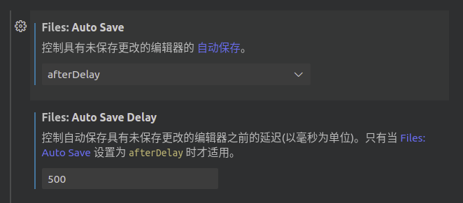
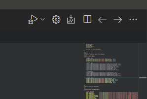
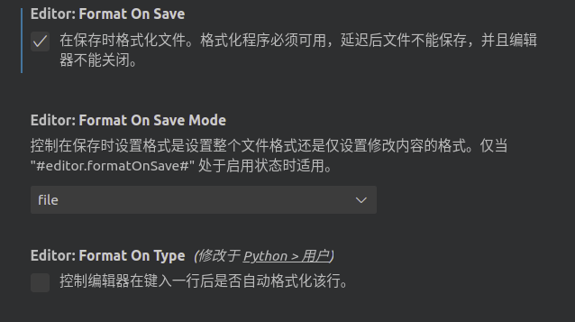
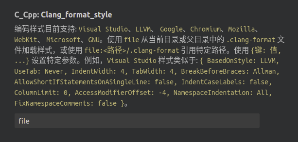
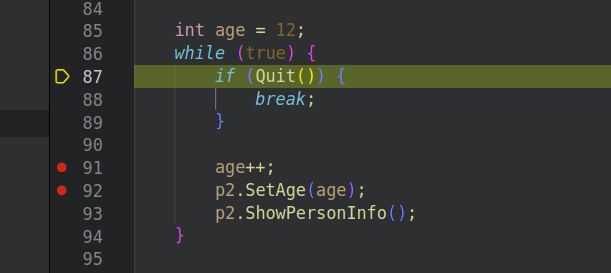
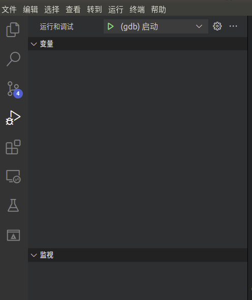
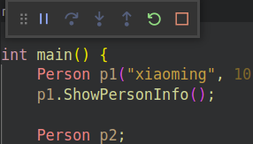
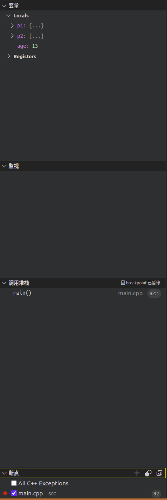

# VSCode Tricks

## VSCode 设置自动保存




## VSCode 设置 CMake 项目代码智能提示

-   项目 CMakeLists 中 加入以下内容，可以在build文件夹中自动生成 compile_commands.json

    ```cmake
    set(CMAKE_EXPORT_COMPILE_COMMANDS ON)
    ```

-   .vscode/c_cpp_properties.json 中加入以下内容，可以帮助vscode找到项目相关文件，帮助智能提示

    ```json
    "configurations": [
    {
        "compileCommands": "${workspaceFolder}/build/compile_commands.json",
    }
    ```


## VSCode 设置光标前进后退

-   类似QT Creator 的方向键，帮助前进后退

-   插件 Back & Forth

-   右上角会出现两个箭头，使光标根据历史记录前进后退

    


## VSCode CPP代码自动排版

-   项目文件夹下添加 .clang-format

-   设置中添加以下内容

    

    

-   ctrl + shift + i 快捷键自动排版

-   .clang-format 模版 （小军哥友情提供）

    ```bash
    # 语言: None, Cpp, Java, JavaScript, ObjC, Proto, TableGen, TextProto
    Language: Cpp
     
    BasedOnStyle: Google
     
    # 访问说明符(public、private等)的偏移
    AccessModifierOffset: -4
     
    # 左括号(左圆括号、左尖括号、左方括号)后的对齐:
    # Align, DontAlign, AlwaysBreak(总是在左括号后换行)
    AlignAfterOpenBracket: AlwaysBreak
     
    # 多维数组中数据的对齐方式
    AlignArrayOfStructures: Left
    
    # 连续赋值时，对齐所有等号
    AlignConsecutiveAssignments: true
     
    # 对齐连续位域字段的风格
    #AlignConsecutiveBitFields:AcrossEmptyLinesAndComments
     
    # 连续声明时，对齐所有声明的变量名
    AlignConsecutiveDeclarations: false
     
    # 对齐连续宏定义的风格
    # AlignConsecutiveMacros: true
     
    # 用于在使用反斜杠换行中对齐反斜杠的选项
    # AlignEscapedNewlines: Left
     
    # 水平对齐二元和三元表达式的操作数
    AlignOperands: true
     
    # 对齐连续的尾随的注释
    AlignTrailingComments: true
     
    # 如果函数调用或带括号的初始化列表不适合全部在一行时
    # 允许将所有参数放到下一行，即使BinPackArguments为false
    AllowAllArgumentsOnNextLine: false
     
    # 允许构造函数的初始化参数放在下一行
    # AllowAllConstructorInitializersOnNextLine: true
     
    # 允许函数声明的所有参数在放在下一行
    AllowAllParametersOfDeclarationOnNextLine: false
      
    # 允许短的块放在同一行(Always 总是将短块合并成一行，Empty 只合并空块)
    AllowShortBlocksOnASingleLine: Empty
     
    # 允许短的case标签放在同一行
    AllowShortCaseLabelsOnASingleLine: false
     
    # 允许短的enums数据放在同一行
    AllowShortEnumsOnASingleLine: false
     
    # 允许短的函数放在同一行: 
    # None, InlineOnly(定义在类中), Empty(空函数), Inline(定义在类中，空函数), All
    AllowShortFunctionsOnASingleLine: Empty
     
    # 允许短的if语句保持在同一行
    AllowShortIfStatementsOnASingleLine: Never
     
    # 允许短的lambdas语句保持在同一行
    AllowShortLambdasOnASingleLine: Empty
     
    # 允许短的循环保持在同一行
    AllowShortLoopsOnASingleLine: false
     
    # 总是在定义返回类型后换行(deprecated)
    AlwaysBreakAfterDefinitionReturnType: None
     
    # 函数声明返回类型后是否换行(None 自动，All全部，TopLevel...)
    AlwaysBreakAfterReturnType: None
     
    # 总是在多行string字面量前换行
    AlwaysBreakBeforeMultilineStrings: false
     
    # 总是在template声明后换行
    # AlwaysBreakTemplateDeclarations: No
     
    # false表示函数实参要么都在同一行，要么都各自一行
    BinPackArguments: false
     
    # false表示函数实参要么都在同一行，要么都各自一行 
    BinPackParameters: false
     
    # The BitFieldColonSpacingStyle to use for bitfields.
    # BitFieldColonSpacing: Both
     
    # 大括号换行，只有当 BreakBeforeBraces 设置为Custom时才有效
    BraceWrapping:
      # case 语句后面
      # AfterCaseLabel: true
      # class定义后面
      AfterClass: true
      # 控制语句后面
      AfterControlStatement: true
      # enum定义后面
      AfterEnum: true
      # 函数定义后面
      AfterFunction: true
      # 命名空间定义后面
      AfterNamespace: true
      # ObjC定义后面
      AfterObjCDeclaration: true
      # struct定义后面
      AfterStruct: true
      # union定义后面
      AfterUnion: true
      # extern 导出块后面
      AfterExternBlock: true
      # catch之前
      BeforeCatch: true
      # else之前
      BeforeElse: true
      #BeforeLambdaBody: true
      #BeforeWhile: true
      # 缩进大括号(整个大括号框起来的部分都缩进)
      IndentBraces: false
      # 空函数的大括号是否可以在一行
      SplitEmptyFunction: true
      # 空记录体(struct/class/union)的大括号是否可以在一行
      SplitEmptyRecord: true
      # 空名字空间的大括号是否可以在一行
      SplitEmptyNamespace: true
     
    # 在二元运算符前换行: 
    # None(在操作符后换行), NonAssignment(在非赋值的操作符前换行), All(在操作符前换行)
    BreakBeforeBinaryOperators: None
      
    # 大括号的换行规则
    BreakBeforeBraces: Allman
     
    #BreakBeforeConceptDeclarations: true
     
    # 三元运算操作符换行位置（?和: 在新行还是尾部）
    BreakBeforeTernaryOperators: true
      
    # 要使用的构造函数初始化式样式
    BreakConstructorInitializers: AfterColon
     
    # BreakInheritanceList: BeforeComma
    # BreakStringLiterals: true
     
    # 每行字符的限制，0表示没有限制
    ColumnLimit: 150
     
    # 描述具有特殊意义的注释的正则表达式，它不应该被分割为多行或以其它方式改变
    # CommentPragmas: ''
     
    # 如果为true，则连续的名称空间声明将在同一行上。
    # 如果为false，则在新行上声明每个名称空间。
    CompactNamespaces: false
     
    # 构造函数的初始化列表要么都在同一行，要么都各自一行
    ConstructorInitializerAllOnOneLineOrOnePerLine: true
     
    # 构造函数的初始化列表的缩进宽度
    ConstructorInitializerIndentWidth:  4
     
    # 延续的行的缩进宽度
    ContinuationIndentWidth: 4
     
    # 去除C++11的列表初始化的大括号{后和}前的空格
    Cpp11BracedListStyle: true
     
    # 继承最常用的指针和引用的对齐方式
    DerivePointerAlignment: false
     
    # 关闭格式化
    DisableFormat: false
     
    # 空格检查
    #EmptyLineAfterAccessModifier: Leave
    #EmptyLineBeforeAccessModifier:  Leave
     
    # 自动检测函数的调用和定义是否被格式为每行一个参数(Experimental)
    ExperimentalAutoDetectBinPacking: false
     
    # 如果为true，则clang格式会为短名称空间添加缺少的名称空间结尾注释，
    # 并修复无效的现有名称结束注释
    FixNamespaceComments: true
     
    # 缩进private、public等标签
    # IndentAccessModifiers: true
     
    # 缩进case
    # IndentCaseBlocks: false
      
    # 缩进case标签
    IndentCaseLabels: true
     
    #IndentExternBlock: AfterExternBlock
     
    # 要使用的预处理器指令缩进样式
    # IndentPPDirectives: AfterHash
     
    # 缩进宽度
    IndentWidth: 4
     
    # 函数返回类型换行时，缩进函数声明或函数定义的函数名
    IndentWrappedFunctionNames: false
     
    # 保留在块开始处的空行
    KeepEmptyLinesAtTheStartOfBlocks: true
     
    # 开始一个块的宏的正则表达式
    # MacroBlockBegin: ''
     
    # 结束一个块的宏的正则表达式
    # MacroBlockEnd: ''
     
    # 连续空行的最大数量
    MaxEmptyLinesToKeep: 10
     
    # 命名空间的缩进: None, Inner(缩进嵌套的命名空间中的内容), All
    NamespaceIndentation: All
     
    # 使用ObjC块时缩进宽度
    ObjCBlockIndentWidth: 4
     
    # 在ObjC的@property后添加一个空格
    ObjCSpaceAfterProperty: false
     
    # 在ObjC的protocol列表前添加一个空格
    ObjCSpaceBeforeProtocolList: true
    
    # 构造函数(Constructor)初始化列表的"堆积占行(Bin-Pack)"方式。
    PackConstructorInitializers: CurrentLine
     
    # 在call(后对函数调用换行的penalty
    PenaltyBreakBeforeFirstCallParameter: 2
     
    # 在一个注释中引入换行的penalty
    PenaltyBreakComment: 300
     
    # 第一次在<<前换行的penalty
    PenaltyBreakFirstLessLess:  120
     
    # 在一个字符串字面量中引入换行的penalty
    PenaltyBreakString: 1000
     
    # 对于每个在行字符数限制之外的字符的penalty
    PenaltyExcessCharacter: 1000000
     
    # 对每一个空格缩进字符的penalty(相对于前导的非空格列计算)
    # PenaltyIndentedWhitespace: 0 
     
    # 将函数的返回类型放到它自己的行的penalty
    PenaltyReturnTypeOnItsOwnLine: 1000000
     
    # 指针和引用的对齐: Left, Right, Middle
    PointerAlignment: Left
     
    # 允许重新排版注释
    ReflowComments: true
     
    # 允许排序#include
    SortIncludes: true
     
    # 允许排序 using 声明顺序
    SortUsingDeclarations: false
     
    # 在C风格类型转换后添加空格
    SpaceAfterCStyleCast: false
     
    # 在逻辑非操作符(!)之后插入一个空格
    # SpaceAfterLogicalNot: false
     
    # 在 template 关键字后插入一个空格
    SpaceAfterTemplateKeyword: false
     
    # 定义在什么情况下在指针限定符之前或之后放置空格
    # SpaceAroundPointerQualifiers: Before
     
    # 在赋值运算符之前添加空格
    SpaceBeforeAssignmentOperators: true
     
    # 左圆括号之前添加一个空格: Never, ControlStatements, Always
    SpaceBeforeParens: ControlStatements
     
    # 空格将在基于范围的for循环冒号之前被删除
    # SpaceBeforeRangeBasedForLoopColon: true
     
    # [ 前是否添加空格（数组名和[之间，Lambdas不会受到影响）
    # 连续多个 [ 只考虑第一个（嵌套数组，多维数组）
    # SpaceBeforeSquareBrackets: false
     
    # 在空的圆括号中添加空格
    SpaceInEmptyParentheses: false
     
    # 在尾随的评论前添加的空格数(只适用于//)
    SpacesBeforeTrailingComments: 3
     
    # 在尖括号的<后和>前添加空格
    SpacesInAngles: false
     
    # 在容器(ObjC和JavaScript的数组和字典等)字面量中添加空格
    SpacesInContainerLiterals:  false
     
    # 在C风格类型转换的括号中添加空格
    SpacesInCStyleCastParentheses: false
     
    # 如果为true，将在If/for/switch/while条件括号前后插入空格。
    # SpacesInConditionalStatement: true
     
    # 在圆括号的(后和)前添加空格
    SpacesInParentheses: false
     
    # 在方括号的[后和]前添加空格，lamda表达式和未指明大小的数组的声明不受影响
    SpacesInSquareBrackets: false
     
    # 标准: Cpp03, Cpp11, Auto
    Standard: Cpp11
     
    # tab宽度
    TabWidth: 4
    
    ```

    


## VSCode 调试 CMake 项目

1.  CMakeLists.txt 添加以下内容

    ```cmake
    # debug模式
    set(CMAKE_BUILD_TYPE "RelWithDebInfo")
    
    # release需要被注释，不然无法调试
    # set(CMAKE_BUILD_TYPE Release)
    ```

2.  .vscode 下面添加 launch.json，包含以下内容

    ```json
    {
        // 使用 IntelliSense 了解相关属性。 
        // 悬停以查看现有属性的描述。
        // 欲了解更多信息，请访问: https://go.microsoft.com/fwlink/?linkid=830387
        "version": "0.2.0",
        "configurations": [
            {
                "name": "(gdb) 启动",
                "type": "cppdbg",
                "request": "launch",
                
                // 这一行指示了需要debug的可执行程序
                "program": "${workspaceFolder}/bin/${fileBasenameNoExtension}",
                "args": [],
                "stopAtEntry": false,
                "cwd": "${fileDirname}",
                "environment": [],
                "externalConsole": false,
                "MIMode": "gdb",
                "setupCommands": [
                    {
                        "description": "为 gdb 启用整齐打印",
                        "text": "-enable-pretty-printing",
                        "ignoreFailures": true
                    },
                    {
                        "description": "将反汇编风格设置为 Intel",
                        "text": "-gdb-set disassembly-flavor intel",
                        "ignoreFailures": true
                    }
                ]
            }
        ]
    }
    ```

3.  编译项目后，在代码中添加断点

    

4.  点击Vsode 调试按钮

    

5.  调试控制条

    

6.  显示变量堆栈等信息

    


## VSCode 调试 ROS 节点

- 准备工作

    - vscode 安装插件

        - ROS插件
        - c/c++, c++ intellisense

    - `CMakeLists.txt`中需要添加

        - ```Cmake
            # 输出编译相关信息，方便找到include文件
            set(CMAKE_EXPORT_COMPILE_COMMANDS ON) 
            
            # debug模式
            set(CMAKE_BUILD_TYPE "RelWithDebInfo")
            
            # release需要被注释，不然无法调试
            # set(CMAKE_BUILD_TYPE Release)
            ```

    - vscode `c_cpp_properties.json` 添加

        - ```json
            "compileCommands": "${workspaceFolder}/build/compile_commands.json"
            ```

    - vscode `launch.json` 添加 `GDB`， `Launch` 以及 `Attach` 模式

        - ```json
            {
                // 使用 IntelliSense 了解相关属性。 
                // 悬停以查看现有属性的描述。
                // 欲了解更多信息，请访问: https://go.microsoft.com/fwlink/?linkid=830387
                "version": "0.2.0",
                "configurations": [
                    // ROS单节点GDB模式调试，需要在program中指定debug的程序
                    {
                          "name": "(gdb) 启动",
                          "type": "cppdbg",
                          "request": "launch",
                          "program": "/home/shan/Documents/ros_learning/tutorial_ros_official/devel/lib/beginner_tutorials/talker",
                          "args": [],
                          "stopAtEntry": false,
                          "cwd": "${fileDirname}",
                          "environment": [],
                          "externalConsole": false,
                          "MIMode": "gdb",
                          "setupCommands": [
                              {
                                  "description": "为 gdb 启用整齐打印",
                                  "text": "-enable-pretty-printing",
                                  "ignoreFailures": true
                              },
                              {
                                  "description": "将反汇编风格设置为 Intel",
                                  "text": "-gdb-set disassembly-flavor intel",
                                  "ignoreFailures": true
                              }
                          ]
                    },
            		
                    // ROS单节点Attach模式调试，无需提前指定节点，但需要在debug时先开启节点，debug时选择正在运行的节点
                    {
                      "name": "ROS: Attach",
                      "type": "ros",
                      "request": "attach"
                    }
                    
                    // ROS多节点launch模式调试，需要指定launch文件路径
                    {
                      "name": "ROS: Launch",
                      "type": "ros",
                      "request": "launch",
                      "target": "absolute path to launch file"
                    },
            
            
                  ]
              }
            ```
            ```


- 单节点 attach调试

    - catkin_make编译，需要注意编译的模式是否为 `RelWithDebInfo`
    - 调试流程
        - 程序中设置断点
        - 需要先运行该 ROS 节点，包括 ROS Core
        - VSCode debug按钮选项中选择ROS: Attach模式，搜索节点名称进入attach调试模式
- 单节点 GDB调试

    - catkin_make编译，需要注意编译的模式是否为 `RelWithDebInfo`
    - 调试流程
        - 程序中设置断点
        - 需要先运行ROS Core,不需要提前运行该ROS节点
        - 在VSCode debug按钮选项中选择gdb模式，直接进入debug过程
- 多节点 launch调试

    - catkin_make编译，需要注意编译的模式是否为 `RelWithDebInfo`
    - 需要对应的launch文件
    - 调试流程
        - 程序中设置断点
        - 在VSCode debug按钮选项中选择ROS: Launch模式，开始多节点debug
